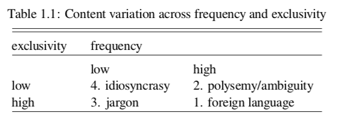
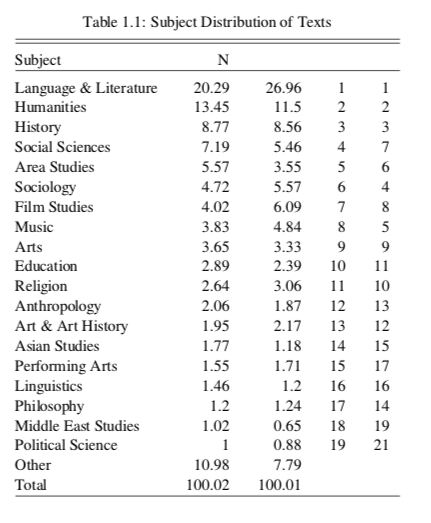
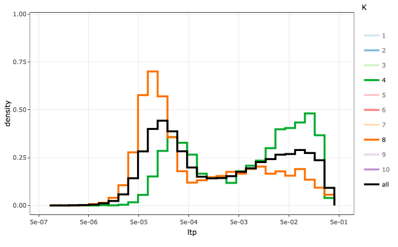
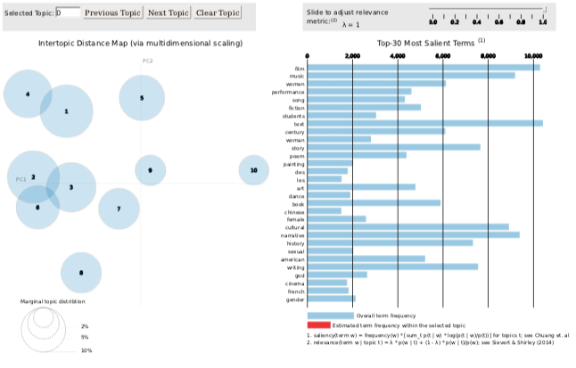
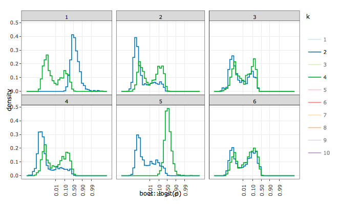

# `r tint` {#int}

#### Abstract {-}

(ref:abs-int)

#### Keywords {-}

(ref:key-int)


```{r}
library(tm)
library(stm)
library(pbapply)
library(corrplot)
library(slam)
library(igraph)
library(networkD3)
library(fpc)
d<-'?'
strspl<-function(str) {
  x<-gregexpr('[a-z][A-Z]',str)[[1]]
  if(x[1]==-1) return(str)
  x<-c(1,x+1,nchar(str)+1)
  r<-list()
  for(i in 2:length(x)) r[[i-1]]<-substr(str,x[i-1],x[i]-1)
  unlist(r)
}
blanky<-theme(axis.text.y = element_blank(),axis.ticks.y = element_blank(),panel.grid.major.y = element_blank(),panel.grid.minor.y = element_blank())
blankx<-theme(axis.text.x = element_blank(),axis.ticks.x = element_blank(),panel.grid.major.x = element_blank(),panel.grid.minor.x = element_blank())
whwh<-function(meta,ix){
  sprintf('%s\'s \"%s\"',meta[ix,auth[[1]]$last %>% nl],meta[ix,ifelse(is.na(tit),sotit,tit) %>% tolower %>% tools::toTitleCase(.)])
}
```


## What to read?

The question of what to read is simple to be sure, but in fields of scholarly consumption and production it is nonetheless fundamental. Scholarship is a creative profession where a stock of cultural knowledge forms a greater part of the infrastructure of production than in other fields. This is not to say that other occupations, especially manual ones, lack creativity. It is to say that in such fields knowledge has a limited infrastructure. Whereas the know-how of the brick layer is black boxed in her tools and technology and in the human capital she develops by experience and tacit social learning, for the scholar as bricoleur there exists in addition the distinctively overdeveloped feature of cultural archiving as a universal memory. Except perhaps in outstanding feats of primary research, contributions to scholarship are legitimate to the extent that they have used the archive correctly.

This problem of using the archive, by which we mean all libraries and other organizations that help scholars find published work, is easily expressed by the question, "what to read?" Paradoxically, the over-development of the archive promotes a functional imperative: to the extent that more and more of scholarship is memorable, mechanisms must develop to forget large swaths of intellectual history. A person who studied a random draw from the archive, even a monumental one, would no doubt qualify as an educated person. Professionally, however, they would have answered the question in a tragically wrong way. From the perspective of other scholars, there are right and wrong choices about what to read. Because it is so easy to access scholarly memory, the operative question really becomes "what not to read?"

Though Internet search and self-publishing services, especially video and image based ones, are creating archive-like infrastructure for all occupations, even manual ones, the functions are different. Contemporary Internet repositories provide knowledge as factors of production to anyone who queries them, but many do not purport to be archives in the sense that a historical record of cultural products is preserved for posterity. They are much more concerned with access to contemporaneous than to historical material, and indeed the particular configuration of the contemporary that sells the most ads ahead of search results. True historical archives of the Internet, such as the Internet Archive or Common Crawl, are not used by the public. Indeed why would they be; they expose the dizzying complexity of the history of the Internet, which, even in only its contemporaneous facet is already overwhelming. The Internet searcher tends to be satisficing, and the search companies have refined their ranking of results to meet their users' search budgets efficiently.

Thus Internet search services perform the function of complexity reduction in their own arbitrary way. They do this without the scholarly paradox of memory, which is that in the university system great pains are made to remember everything just so that the correct material may be forgotten. In the cynical view of professions, scholarship is the encryption of memory by secret sets. A lay seeker approaches the academic archive and at great cost of attention plumbs its depths for enlightenment. Tragically, the archive's complexity dooms her to check out a curriculum so hopelessly tacky that it will only certify her lay status. To be professional is to trade in status, to know what are the tasteful combinations of resources. To be a successful professional is to never have wasted time tasting forbidden fruit.

Yet the truly tragic figures are the archivists themselves who are stretched between the opposing poles of profession and education. Librarians much prefer to help undergraduates who lack taste and therefore welcome guides who will lead them through the grandeur of the archive. They gifted scholars with access to an immortal memory, and looking the horse in the mouth scholars made rules to protect themselves from the responsibilities of using most of it. Paradoxically, in taking the burden of memory off of the shoulders of scholars, thereby freeing them of the pain of legacy suffered by other artists [@Lang1988Recognition], librarians created a maze of knowledge in which clergy could trap laity. In this way a taste for scholarship is the axis sorting the field between people who profess (declare publicly) and people who educate (lead out).

So again, how do professional scholars know what (not) to read? What then are the structures that lead scholars new and old to answer the question correctly? How does one know what are the lucrative curricula that can be developed from the archive? There are several formal and informal structures that facilitate and compel scholars to make the same choices about what to read. An obvious one is the supposed normative isomorphism of graduate program syllabi, which act like maps to navigate the maze of the archive. Yet it is a common concern that the quality of syllabi are variable. Universities tend to grant great autonomy to professors in writing syllabi, who in the course of their professional travails may not be given opportunities to read what they want. In being forced to carve out time with subordinates, faculty are caught between personal indulgence and a more or less strongly felt fiduciary responsibility to set students on the correct path. If we have less than perfect faith in the strength of educational ethics among faculty, then we should expect that among graduate syllabi are many lists of what not to read. Students who trust too much in the formal curriculum may be lead astray, and even without trust, they may still be left ignorant of where to invest their labor.

In each program there then must be a hidden curriculum, a map of higher quality. The argument of this study addresses the question of where such a curriculum could possibly come from. The provisional answer is that in the informal spaces of graduate programs knowledge of *scholarly genre* is learned from extracurricular engagement with professional conferences. It is in conference programs that the tacit rules of academic genre are learnable. These genres form the first parsing of the archive for neophytes. Indeed at the most generic level graduate students, if they are confident enough to locate themselves quickly enough, develop a taste for what not to read. Genre as the foundation for a taste for scholarship serves to restrict a student's wandering to a delineable sector of the maze. If they can develop this proto-taste early enough in their careers, they will be armed with the stereotypes necessary to stop reading the wrong and start reading the right material. While this is not enough certainly to make clergy of laity, it is the first step.

### Genres

I take genre as a candidate explicans for the ability of scholars to know what to read and what to avoid from the cultural archive. A theory of genre will benefit from a review of the literature, yet to do so would catch me in the conundrum of performing the phenomenon I wish to explain. The genre structure of sociology should guide me to a definition of genre, a statement that already presumes an ontological difference and morphological relation between disciplines and genres, namely that scholarly genres are not equivalent to scholarly disciplines and that the former are located within the later. I will begin with an unstudied attempt to tease out the relation of discipline and genre before turning to a more rigorous, even empirical, treatment of genre as a term in American scholarship.

Genre is a loanword from French. The origin of the French-Latin word "genre" and the English-German word "kind" both mean membership by inheritance of innate class characteristics, archaically by presumptive blood descent within a family, race, or nation. In common English it is restricted to mean a broad category of art, especially literature and music, and some but not all other cultural fields (e.g. baseball is not a genre of sports). As a term in scholarship, genre may be an observable phenomenon, a conceptual component of a theory, or a conflation of the two. In the social sciences genre is a specialty concept as in sociology, while in the humanities it is ubiquitous especially in cultural studies. Academics define and use the term differently between and within disciplines.

```{r ttsgnr-d}
f<-'d/q/ttsgnr.RData'
if(file.exists(f)){
  load(f)
} else {
  ttsgnr<-gbng2tts.f(query = 'genre',out = 'd/q',ys = 1899,ye = 2008,cfso = T)
  ttsgnr[,ec('d,g'):=tilit::ov2chpt.f(ttsgnr$Count,drv = 2,inc.ov = F)[,.(d,g)]]
  ttsgnr[,ec('d2,g2'):=tilit::ov2chpt.f(ttsgnr$Frequency,drv = 2,inc.ov = F)[,.(d,g)]]
  save(ttsgnr,file=f)
}
rm(f)
annd<-ttsgnr[g==1,.(x=max(Year),y=Count[which.max(Year)])]
ttst<-ttsgnr[!1:2,.(d=mean(d),t=list(t.test(d))),by=g]
```

Figure \@ref(fig:ttsgnr) shows the count of mentions of the term genre in the Google Books Ngram database for English terms [@Michel2011Quantitative]. The trend exhibits the typical take-off in publishing in the second half of the twentieth century. I apply change point analysis, which detects significant differences in time series data [@Matteson2013Nonparametric; @James2019ecp], to the second difference of the trend, a measure of acceleration, to get clues as to whether the trend is a single process or whether there are inflection points. The first segment of the curve from `r ttsgnr[g==1,range(Year) %>% paste(collapse=' to ')]` indicates a period of positive acceleration or quickening of the growth trend. On average in the first period the rate of change from one year to the next increased by a modest `r ttst[1,d %>% round(1)]` occurrences a year. However, during the period from `r ttsgnr[g==2,range(Year) %>% paste(collapse=' to ')]` the rate of change, though always steep, began to decline by an average of `r ttst[2,d %>% round(1) %>% abs]` occurrences a year. Like a projectile that is simultaneously climbing and falling, `r annd$x` acts as launch point of precipitous yet unsustainable growth.

```{r ttsgnr,include=T,fig.cap='Absolute count of term "genre", 1901-2008. Segments correspond to significantly different second derivatives.'}
p1<-myth(qplot(data = ttsgnr[!1:2],x=Year,y=Count,color=g,geom = 'line')) + theme(legend.position = "none",axis.title.x = element_blank()) + ylab('Count of "genre"') + geom_label(data=annd,aes(x=x,y=y,label=x),inherit.aes = F,nudge_x = ttsgnr$Year %>% range %>% diff %>% `*`(.05),nudge_y = ttsgnr$Count %>% range %>% diff %>% `*`(-.05))
p2<-myth(qplot(data = ttsgnr[!1:2],x=Year,y=d,color=g,geom = 'line')) + theme(legend.position = "none") + ylab('2nd Deriv.')
egg::ggarrange(p1,p2, heights = c(3,1))
```

Figure \@ref(fig:ttsgnr2) shows a similar trend but using relative frequencies instead of absolute counts. Here "genre" is plotted as its share of all terms in the corpus. This trend exhibits no inflection point at `r annd$x` that is statistically significant, and visually the trend does appear the same on both sides. No other inflections points are detectable due likely to greater year over year variability in this series in the first half of the century, reducing confidence in any estimate of a change point. To interpret this difference in statistical significance between relative and absolute measures would indicate that interest in genre continued to grow even within a secular slow-down in the volume of texts that resembles the familiar S-shaped diffusion curve. Alternatively, on visual inspection of the relative curve it appears that indeed there is an inflection point, just one a decade later in `r ttsgnr[,Year[which.max(Frequency)]]`. After this point the relative frequency seems to drop rapidly, a change that would no doubt be picked up statistically after a few more years of data and one that may in fact be located a few years earlier than the peak suggests. Together these trends describe a career to the term genre that has been strong for a century and that may now be in decline.

```{r ttsgnr2,include=T,fig.cap='Relative frequency of term "genre", 1901-2008.'}
p1<-myth(qplot(data = ttsgnr[!1:2],x=Year,y=Frequency,color=g2,geom = 'line')) + theme(legend.position = "none",axis.title.x = element_blank()) + ylab('Relative frequency of "genre"')
p2<-myth(qplot(data = ttsgnr[!1:2],x=Year,y=d2,color=g2,geom = 'line')) + theme(legend.position = "none") + ylab('2nd Deriv.')
egg::ggarrange(p1,p2, heights = c(3,1))
```

```{r genre-goog-d}
f<-'d/q/genre-goog.RData'
if(file.exists(f)){
  load(f)
} else {
  gnrgoog<-fread('d/q/genreof.txt',header = F) %>% unique %>% setnames(ec('ngram,year,nw,nv')) %>% .[,max(year) %>% cat]
  gnrgoog<-gnrgoog[,.(n=sum(nw)),by=ngram] %>% setorder(-n)
  gnrgoog<-gnrgoog[!grepl('_',ngram)]
  gnrgoog[,ngram:=sub('^.+ ','',ngram)]
  gnrgoog<-gnrgoog[,.(n=sum(n)),by=ngram] %>% setorder(-n)
  gnrgoog<-gnrgoog[!grepl('[^a-z]',ngram)]
  gnrgoog<-gnrgoog[!ngram%in%tm::stopwords()]
  gnrgoog[,lemma:=tm::stemDocument(ngram)]
  voc<-gnrgoog[,.(n=sum(n)),by=.(lemma,ngram)][,.(com=ngram[which.max(n)],N=sum(n)),by=lemma]
  gnrgoog<-gnrgoog[,.(n=sum(n)),by=lemma]
  gnrgoog[voc,on='lemma',com:=com]
  save(gnrgoog,file=f)
}
rm(f)
```

Figure \@ref(fig:genre-goog) gives an indication of what things the term genre has been used to describe. It illustrates the frequency of terms appearing in the Google Books Ngram corpus as the third term in the trigrams beginning with "genre of" or "genres of" [@2012Google]. The size of the words is proportional to the total frequency of the trigram in the English corpus, which spans centuries from 1590 to 2008. The bias of the source--books--is clear in the outsized importance of "literature" and "writing" which are followed closely by "music". The next ten largest nouns are `r gnrgoog[1:17,com %>% setdiff(ec('writing,literature,music,popular,science,historical,literary')) %>% nl]`. Ranked within that series would be several adjectives as well: popular, science (fiction), historical, and literary. Each of these terms refers to a field of concrete cultural products, with the exception of "discourse" which is more abstract.

```{r genre-goog,include=T,fig.cap='Wordcloud of third term in 3gram beginning with "genre of".'}
if(latex|docx)  else gnrgoog[,suppressWarnings(wordcloud2::wordcloud2(.SD,widgetsize = NULL,size = .85,gridSize = 1,fontWeight = 'normal',rotateRatio = 0,color = viridis::viridis(max(n),direction = -1,option = 'E',end = .9)[n],shape='circle',shuffle = F,fontFamily = 'Times')),.SDcols=ec('com,n')]
```

```{r gnrgoog-tab}
f<-'d/q/gnrgoog1562998843.txt'
if(file.exists(f)){
  gootab<-fread(f)
} else {
  write.table(gnrgoog[,.(type=NA,com,n)],file = paste0('d/q/gnrgoog',Sys.time() %>% as.integer,'.txt'),quote = F,sep ='\t',na = '',row.names = F,col.names = T)
}
rm(f) 
split(gootab[,i:=.I],by='type')
```

Most items toward the top of the list are less popular (to write about) art forms like television, dance, and theater. Toward the middle of the list begin to appear adaptations of the term from the cultural to the social context. These include practical fields like medicine and journalism, political areas like law, government, and crime, and social arenas like identity and protest.

To impose a sociological gloss on the term, these varied uses of genre would make reviewing the literature on the topic difficult, were it not for the discipline structure of the academy. The uses of the term genre are themselves systematically organized by discipline, and a disciple who is adequately trained will know the correct ways to use the term in her local context. To use genre as a disciplinary convention means to first identify your location in the disciplinary field, and then to accept the limitations on scope by excluding those treatments of the term that are extradisciplinary, that is, irrelevant. Disciplinary structure reduces the true cultural complexity of the meaning of genre to a restricted form, which in turn allows humble knowledge workers to engage upon a set of shared assumptions. Such simplicity begets new complexity as disciples spin out the consequences of their local use of genre.

In the sociology of culture, genre is a form of classification enacted by people in various social contexts. In the context of industrial capitalism, genre is an economic principle helping to organize supply and demand within markets for cultural products. There actors see genres among the borders between economic, social, and cultural uses, as a market category helping them acquire or produce content, as a card in proximate games of prestige, or as something to taste, to consume and enjoy directly. Less often genre is knowledge, a component of culture separate from taste, that is a factor in the formation of ideas and skills, whether these lead in turn to economic production or not.

Genre's meaning is context specific and variable across sociological subfields, though it is amplified in empiricist fashion by economy and society approaches that reduce genre to the act of classification itself. I say empiricist because of the empirical ease with which the classification or labeling actions are observed. Especially with Internet distribution systems, it becomes trivial for corporations to observe when a consumer labels her preferences while browsing a content catalog; it is much harder to observe the ideas that consuming a particular piece of content sparks in the mind.

In cultural studies genre is used much differently and much more in accordance with its etymology. To the humanist, genre is an ontological phenomenon, which is to say, genres are differentiated from each other by combinations of discrete features of signs and signifieds. Humanists are trained to establish these ontologies through methodological readings of texts and through cultivation of theories of genre types. These methods are at the same time empirical and interpretive, because in consuming objective texts the researcher actually observes the ideas that form in her own consciousness, and they may hope that others have a resonant experience. Genres have more substance to them for humanists than they do for sociologists. For sociologists of culture, genres are how people use genre labels, while for humanists, genres are knowledge.

As we have said, the meaning of genre for a sociologist of culture is economistic, at the same time a market category and a taste configuration for consumers. The term differs for a sociologist of knowledge, and perhaps for a cultural sociologist. It is ontology as it is for the humanist, however it is not the ontology as represented to the researcher in the consumption of texts. It is the hopelessly unobservable distribution of ontologies appearing in a population of consumers attending to similar texts. The sociologist of knowledge accuses the sociologist of culture of reducing internalist concepts, thought and experience, to externalist ones, taste and preference. The sociologist of culture rejoins, show me proof, and on and on the interlocutors spin around the axis defining the boundary between their subfields.

But this description of subdisciplinary differences really is just an example of a structural theory of genre that is within scope for the sociologist of knowledge and beyond it for the sociologist of culture, due to their epistemological differences. If genres are ontological, then they deeply structure a person's experience of reality. Ontologies form basic perceptual categories, and people with different ontologies of an object experience different things even if oriented to the same objective phenomenon. A ontological theory of genre would, for example, attempt to explain differences in taste as differences in phenomenological perception, whereas a taste theory of genre treats consumption behavior as revealing preferences whose downstream consequences are then explored.

Yet for all the differing treatments of genre mentioned above, do these views really contradict, or are they in fact complementary? Does genre as distribution serve the economic sociologist's goals, or does a lack of ontological substance lead her astray? Does genre as knowledge remain hopelessly unverifiable, or are theoretical constructs necessary to achieve a correct interpretation of facts? Is everyone at the club listening to the same song hearing the same thing?

### Disciplines

To return to disciplines, answering such questions would put the researcher in an adisciplinary predicament, for it would mean eschewing the scope restrictions cherished by disciples. The challenges of a meta-disciplinary analysis are manifold and uncertain. One is as likely to grow her audience as to lose it altogether. She risks the dilettantism of a jack-of-all-trades. What's worse, she exposes herself to a dizzying scale of content to consider. If disciplines are indeed functional, then the meta-analysis that effaces disciplines risks being dysfunctional. The upside, however, is appealing. If the universe of meanings given to the term genre does contain complementary uses, a meta-analysis will allow one to consider the consequences of the now arbitrary segregation of a superior metaconcept across disciplinary boundaries. Both sides of the divide could be strengthened by a cultural exchange of their respective terms. The redundancy of parallel discovery can be avoided.

Pathologies of disciplinarity can be diagnosed and treated. Disciplines are social substructures embedded in a larger society and culture. Disciplinarity is a kind of controlled ignorance exchanged for access to secret knowledge. The wayward uses of a term like genre are always lurking at the edges of the firelight defined by a particular disciplinary camp. Discipline as rigor instructs disciples to resist flirtations with the available complexity of the term. The essential tension is very rarely between what is known and unknown; rather it is more commonly between what is known "here" versus what we are conditioned to be willfully ignorant of "there".

This definition of discipline is isomorphic with that of genre, in that disciplines are another form of categorical decision making, just at a higher level. Disciplines are supergenres that reflect the nesting of categories. What may distinguish them in a more serious way is the institutional underpinning of the category. If genres are formed by the categorical thinking of disciples, disciplines are formed by the categorical thinking of patrons, the powerful actors like university administrators, state legislators, and grantmakers who manage the economic foundation of scholarly careers, as well as the elite disciples who interface with these stakeholders. Where genre labels are inscribed onto cultural products, texts, discipline labels are inscribed onto cultural infrastructure like funding lines, buildings, and personnel themselves.

In a motivation of some of the arguments to follow, I take a metadisciplinary approach, which is to cast as wide a net as possible on the term genre. In so doing I hope to test the tacit cultural assumption that discipline-based decisions of relevance are valid, that is, that when we exclude arguments from other disciplines we remove distractions and focus on what is important. The alternative possibility is that we are wasting intellectual resources, because to exclude important work about our topic, even if it is codified in foreign terms, is to risk ignorance and redundancy. The topic is genre and how disciplinary boundaries form such that people using the same word nonetheless cannot communicate effectively. They draw on different paradigms, which is to say the term is not really the same term. What I hope to do is uncover the knowledge contexts surrounding the terms, and map these contexts in a way that enumerates the various communities of discourse and theories constituting the term.

## Method

As I have said, the first consequence of eschewing disciplinary limitations is to bloat the size of the "literature" on genre, since no uses of the term would be excluded. An empirical approach to the standard academic convention of a literature review will help reign in the scale and complexity of the task. My aim, however, remains practical rather than scientific. The methods need to be good enough to yield results that offer something new above a traditional literature review relying on library search and disciplinary wisdom about what is important. This is not because a scientific approach is undesirable, it is that it is not yet demanded of "the literature". Sociologists are not expected to take a sociological orientation toward the history of their fields. Rather the literature review serves the social purpose of taking a position in a field of cultural production. It is a listing of a roster of political support and rivalry, and an advertisement to attract a desired audience.

To take an empirical approach to the literature review would be subversive were it not the first function of disciplinary genres to render atypical draws from the archive irrelevant. Disciplinary subfields, genres, are credentialed by secret sets of references, and most comers are held at the door. This in and of itself can be subversive of even more arbitrary club rules, namely those of educational pedigree, such that anyone willing to invest in a presentation of the genre definition will be granted access to the venues, if not the invisible colleges, of the subfield. To be admitted to the arena is no guarantee of achievement within it, but it is a start. Nevertheless, the scale of the archive will always supply entropy enough to create a deterrent of flotsam and jetsam around subfields composed of projects and persons who either never cracked the code or who willfully eschewed it.

### Distant sampling

The research strategy here attempts to parry the entropic tendency of the archive by substituting human for machine limits. The methodological premise of a meta-analysis of genre is that the Gordian knot of the global cultural complexity of the archive can be cut by stratified sampling. I use a large digital archive of texts, JSTOR, to represent the whole of the academic archive. Though clearly a toy representing only a fraction of all networked scholarly produce, JSTOR is large enough to easily surpass individual cognition and compel the equivalent types of complexity reduction facing any researcher approaching the real archive via their local university library portal.

I use a simple term search of the keyword "genre" to define half of a sampling frame.^[TODO, I did not, but should take a random draw of the same size to serve as a control.] I could then take a simple random sample of texts, analyze how each uses the term genre, develop a classification scheme, and enumerate the different uses of the term. Unfortunately, a small sample in a statistical sense may be larger than a poor researcher can handle. 1,000 texts is not large statistically, but it is huge from a content analysis perspective. What's worse, 1,000 texts may still exclude, by random chance, small subcultures of the term. Stratification within a more or less global sampling frame resolves this issue by delineating those subcultures so none would be left out.

Alas, the JSTOR digital archive lacks subject labels at the article level, though it does include them for book chapters and for journals. While not foolish, inheriting a journal label to the articles included within it may be a coarse approximation if within-journal content variation exceeds between-journal variation. We can use text analytic classification methods to cluster articles directly and discover latent groups of articles, and in so doing we can have an independent standard to compare to the discipline labels given to journals. It is an open question whether such methods align with what we have discussed above as disciplinary and subdisciplinary groupings, for us whether regularities in vocabulary correspond to regularities in the meaning of the term genre. If they do not, then the study will only be a stop en route to a true census of the uses of the term genre, and the contribution will be to have interrogated the quality of the methods used, though this would be a small consolation indeed! Even so, for a new method to claim to be able to improve on conventional wisdom, I behoove myself to proceed methodically.

The choice in computational text analysis (CTA) about how to represent texts as data hinges on whether word order is preserved. The older and more tested approach is to not preserve word order. The name given to this "bag of words" format reminds one of its inelegance. A bag of words is a frequency table for each document counting up the number of times particular words are used, a representation that effectively reduces a text to its vocabulary. It is the analyst's crude operational decision to treat vocabularies as indicators of meaning, but social scientists conventionally insist on cross validation via qualitative analysis. While the ambitions of computational text analysis may start with a replacement of, for instance, the standard literature review, the conventional distrust, at least in sociology, of mathematical models of text makes CTA more of a sampling method than an analytic method. The study will culminate in a reading of texts, albeit one that is different than traditional qualitative analysis because the CTA researcher welcomes the introduction of interpretive bias from an understanding of the mathematical model before, during, or after the texts are read. In the game of "choose your influence", CTA is one choice while disciplinary wisdom is another.

There are two types of classification methods in text analysis, direct document clustering and topic modeling. Direct document clustering treats the bag of words as a vector space and calculates distance or similarity metrics between documents, which are then clustered. In a topic model, the relationship between documents is mediated by an unobserved but latently modeled representation of their content; documents are similar because they are formed from the same topics.

Whichever approach one takes, and both may be used, recall that the goal is to organize the texts into strata for the purpose of stratified sampling. We said that we wish to typify and enumerate the different uses of the term genre. By qualitative analysis, we could read every text in a simple random sample and come up with a theory of the use of genre in that text. The demerits of this approach are several [c.f. @Nelson2017Computational\:5]. It would take longer than we want even for too small a sample. We are not humanists and have not been trained in text analysis (this will hound us no matter what). Fatigue will set in, and accuracy and consistency will suffer. We may limit our set of theories to spare us the agony of complexity. It will be hard to reproduce our results. There may be path dependency with a different reading order producing different theories. On the upside, we would be more educated for it.

Instead, we will stratify the sample, and it is in the configuration of the strata that much of the work will be done. The strata impose upon our interpretation of the texts the assumption of sameness. 

### No cigar

The popular yet maligned distant reading approach taken by digital humanists [e.g. @Moretti2005Graphs] is being taken up with gusto by social scientists who are less skeptical of quantitative methods [e.g. @DiMaggio2013Exploiting]. Following Nelson [-@Nelson2017Computational] I employ a quantitative analysis of texts not to replace human reading with machine reading but to support reproducibility in traditional qualitative content analysis. While CTA makes it possible to dispense with reading altogether, knowledge, understanding, and the cultural logics of arguments--especially their ontologies--are still only obtainable by reading primary texts, closely or not. The most radical interpretive CTA method would involve deep neural net supervised machine learning, which may be able to predict how a particular human reader would classify a text without their needing to read it, though this has never been demonstrated. What I gain from CTA is guidance in answering the question of what to read, and perhaps in what order to do so.

As we know, the question of what to read is answered institutionally for scholars already by way of canon, curriculum, word of mouth, and digital reference term search services. These are their own forms of distant reading, because they each make obsolete the archaic image, true of figures like Weber, of a scholar buried in library stacks reading everything they come across (and so it has been said of Weber, forgetting nothing).^[What a scandal it would be if Weber's lionizers discovered that he had only read text indices! Surely they would bury such a fact. But the point would remain that even if a scholar were able to consume an entire corpus, the sheer scale of contemporary publication is now beyond even a genius's capacity.] These contemporary shortcuts are historically arbitrary, but what is important is first that they serve the function of reducing the overwhelming cognitive complexity of published scholarship, and second that they structure that reduction in the same way for all scholars. An arbitrary reduction needs to be consistent to act as an infrastructure for subdisciplinary scholarship, otherwise scholars would find themselves located in different literatures.

If distant reading is a criticism of close reading then it has a big hill to climb especially among humanists who are trained to deal very carefully with texts. In the social sciences a type of customary distant reading is that of ritual citations, those that have developed a meaning that may be oblique to their content or at odds with the intentions of the the original authors. A ritual citation is simply one that is cited but not read, but also one that is so often used that its socially acceptable usages are known from other secondary accounts. For all the lack of due diligence in the use of ritual citations, their socially understood meanings are better than the thoroughly perfunctory citation, those included because they were returned by a digital reference service and never read by anyone.

What are the social patterns of the traditional literature review are topics for the sociology of knowledge and science and for the information sciences. This is not the task of the current study. What we take from the traditional approach is the consequences of excluding large segments of intellectual history. What CTA makes possible for the first time is a nonarbitrary, inclusive analysis of *all* content in a digitized corpus. It will not necessarily be a good analysis, but what it will lack in quality it will make up for in coverage. A CTA approach to the literature review will at least make clear what lacuna would be left by the traditional approach. They also reduce the potential idiosyncrasy of a particular author's literature review because, unlike a personal reading, a CTA model can be communicated precisely.

Of course the cognitive limitation of how much any scholar can actually read and understand remains. There will be an exclusion mechanism no matter what, therefore a chief assumption of a CTA literature review is that corpus segmentation is both possible and that some reduced form of reading, some sampling procedure, can be said to be representative of the unread portion in each segment. These representative texts will be subjected to a close reading, but their interpretation will be generalized to unread documents. Hence I call this a "no cigar" approach to reading, as in "close but". If on the contrary to the assumption no two snowflakes are alike, then the enterprise of knowing more than we have before is fraught, and CTA becomes yet another arbitrary reducer.

What is worse, or perhaps better, is that there is reason to believe that idiosyncrasy itself is an historically variable feature of disciplines. If institutional isomorphism has proceeded to some high level in contemporary disciplines, then the assumption that reading the bellwether texts is as good as reading the entire herd may hold. If this is true, however, it raises as many questions about the process of institutionalization in cultural production as it answers about the potential to learn truer versions of intellectual history.

### Topic Models

We have referred generically to computational text analysis, and now we can discuss the topic model as our technique of choice. There are many ways of estimating a topic model (e.g. the famous Latent Dirichlet Allocation (LDA) estimator) but the model itself is simple. It is a latent variable model that decomposes a document-by-term matrix--in which every document is represented as a frequency distribution over every term appearing in the corpus--into two unobserved matrices:

- a topic-by-term matrix, and
- a document-by-topic matrix.

Topics are directly represented by they topic-by-term matrix. A topic is a probability distribution over a vocabulary. To draw on a topic means to choose vocabulary as a random draw from this distribution, where words with higher probabilities will be chosen more often. In the case of genres we might imagine a topic about film and a topic about music. Some words may be important (highly probable), to both topics, such as the word "genre", while others would be distinct, such as the words "movie" (probable for film but improbable for music) and "band" (vice versa).

Note the usual distributional bait-and-switch of categorical statistical analysis, where observed count data are operationalized as the outcomes of unobserved probabilities. The probabilities are what will be estimated, not the counts. The importance of this will be explored in the sections on estimation and diagnostics, but suffice to say that the differences between probabilities and counts encapsulate many of the difficulties applied researchers encounter when using topic models. 

Given topics as term distributions, a document can be represented not as a distribution over terms, but as a distribution over topics. The topic mediates the relationship between documents and terms. In order to generate diction for a document, all that need be understood is the ratio of topics out of which it is composed. This is sometimes explained as a generative mechanism; to ask what word will be chosen next in composing a document, one first samples from the document's own topic distribution to decide which topic the word will be drawn from, and given that topic, one then samples from the topic's word distribution to decide which word will be included in the document. A document's topic probabilities also create the expectation of how many words are attributed to each topic. A document with topic probabilities .7 from music and .3 from film would be expected to be 70 percent about music and 30 percent about film, making for a parsimonious albeit reductive description of document content.

It is important not to overinterpret a topic model. To describe a topic model as "generative" implies that it explains how documents are written. Such a generative metaphor reveals the absurdity of a topic model as a representation of writing. Not to mention the fact that punctuation tends not to be represented (though it could be), the terms chosen would be in a random order incapable of making meaningful sentences. Hence it is best to avoid the generative metaphor as an explanation of texts. If topic models touch on the generation of real, meaningful documents, it is only in a very limited sense. What the topic model really represents is how vocabularies are organized to condition an author's diction. A vocabulary can be thought of as an infrastructure of meaning more trivial than grammar or syntax and much more trivial than concepts or ideas. A topic is a simple list of words that is known or knowable across all authors in a field. Topics do not tell stories; authors tell stories in part by making diction choices that are conditioned by topics.

From a sense or meaning making perspective topics are trivial; this is because so little is known about what an author says by knowing the topic or even the term distribution of a document. What topics are useful for, however, is the segmentation or cartography of a corpus. Topics are really a global feature, perhaps a cultural feature, of a corpus of texts that is itself meaningfully selected. If indeed a field of texts is oriented to common if not always overlapping vocabularies, then topics can represent this well.

A topic model could be posited based on the domain knowledge of an expert, and this would be a form of estimation. The practical value of statistical topic modeling is that the unobserved topics can be induced, with a raft of statistical assumptions, directly from the observed document-by-term matrix to arrive at a model with the features just described. An estimated topic model will contain several other parameters filling in assumptions necessary to make it possible to identify the unobservable topic probabilities in each of the two matrices of the model. For instance, in LDA models the concentration parameter commonly called alpha makes an assumption about how many topics tend to comprise each document. Alpha values close to zero make it very likely that documents are composed of only one topic, while an alpha value greater than one increase the chance that a document will be decomposed into several topics. Alpha equal to one creates no tendency, so concentrated and diffuse mixtures are all equally likely to occur. It would behoove a researcher to make an informed decision about this parameter, yet software often sets an arbitrary default that the user may or may not be fully aware of. 

#### Choosing K

Finally, topic models require the analyst to choose the number of topics K. The approach we take to guiding this decision is not to expect one correct specification of K but rather to see it as a changing resolution. A K=2 model usefully bifurcates the sample and is not simply wrong because it is too restrictive. As K increases we expect the samples to continue to divide as new parameter spaces become available to partition the sample. While this is not strictly a hierarchical design, since each K model is fit independently, we should expect to see aspects of hierarchical topics as well as some degree of stability in the relationships among topics.

Between model cross-validation means that document and term groupings should be relatively stable as K increases. The document overlaps between, say, a three topic model and a four topic model should not be random. By graphing the document overlaps between pseudo hierarchically organized models, it should be clear which topics are the most stable and which are constituted partly by chance or by spurious association. An ensemble approach would then recommend itself; if the content of a topic is stable across different specifications of K, within limits, then we should have even more confidence in that topic.

When parameter space is limited the content with the strongest signal will come to define the topic, but the document by term vector will be contaminated with content that would be separated given more space. For sets of documents that are constituted by multiple true topics, we expect to see splitting of larger topics as the resolution increases to meet the real diversity. Hierarchy will reveal itself as topics with stronger topic signals subsume weaker ones until K reaches a point where there is enough space to separate them. On the other hand, in the classic trade-off between variance and bias, where K overshoots the true number of topics, we expect to see random splitting and possibly "dust bin" effects where spare topics allow larger topics to prune their weaker term associations. Indeed dust bins may appear even before the true K is reached. Where the term proportions explained by topics are very unequal, it may pay during estimation to treat a true smaller topic as a dust bin for a larger topic, because the optiization gains of clarifying a larger topic may be greater than the losses of confusing a smaller one.

Another interesting feature of this approach is that it shows when and how topics are able to appear given the parameter space constraints. We expect the most dominant topics, those that appear at low K and remain stable as K increases, to derive from vocabularies that are both distinctive and used often. The content with the strongest signal will be "FREX" terms, terms that are both frequent and exclusive [@Bischof2012Summarizing]. Frequent means they have high counts in the overall corpus either due to occurence across many texts or to very large counts in a few texts. Exclusivity (or monosemy, the opposite of polysemy) means that terms co-occur with an invariable set of additional terms. Exclusivity is related to the notion of anchor words that are maximally exclusive, appearing in only one topic, but likely very infrequent.The exclusivity of terms relates to the separability of topics [@Arora2018Learning], while the topic frequency of terms relates to the topic's contribution to explaining global corpus frequencies, that is, to maximizing model likelihood during estimation.

It should be possible to predict a priority for topic emergence as models increase parameter space for topics. First, we expect topic model estimators would be very tuned to picking out even a handful of texts written in a different language than the main corpus, as terms within those documents would be both frequent and exclusive. We should expect technical jargon to also send a strong signal for it's high exclusivity. Indeed, these special vocabularies are salient for both humans and machines for the same reason; they are easy to disassociate from the rest of the text. The priority, however, for the estimators will be to explain global term frequencies, so jargon will likely be behind frequent terms that appear across multiple topics, as in the case of polysemy or the more common case of simple language ambiguity. Trailing the pack and the last to emerge will be, as we have discussed, idiosyncracy.

Let us remind ourselves of what badness means, because a bad model in a statistical sense may very well be the correct model for the analytical purpose of the researcher. A human reader with an interpretive goal in mind can be quite apt at scanning text content and ignoring what she finds to be irrelevant. Some of this seeming irrelevance has to do with the syntactic structure of language, while others a reader knows by experience to be elements of style and rhetoric in their field. The interpretive goal becomes like a flashlight that darkens much more content than it illuminates.

While human readers tend to make sense of only small portions of texts, the machine is not so lucky as to have the human capacity for selective ignorance. The topic model estimator sees and makes sense of everything at once. This is sometimes at cross purposes to the researcher's hope of complexity reduction, because in interpreting the model rather than the text she will be told by the model that something is important even if she would have easily ignored the same context in the natural setting. A topic model that is both correctly specified and accurately fit on a large corpus will likely have dozens or even hundreds of topics. Such a variegated classification scheme is likely to contain some topics that a reader would consider to be redundant, for instance, because they are about the same thing yet differ for an irrelevant stylistic vocabulary. Many others will simply be irrelevant to her research agenda. The task of sorting through the topics is supposed to be easier than sorting through the original texts, yet the researcher is sure to find many inscrutable lists of FREX terms in a that can only be understood with reference to classified articles.

In the case that a correct model of vocabularly clustering is actually too complicated to be helpful, the correct research decision may be to deliberately underspecify the model. We can imagine the real topics as guests standing in a line of priority, and the model is like a wedding with a limited number of tables. The guests with the strongest relations among them sit at the first table, the next strongest at the second and so on until all of the tables are full. In their munificence the happy couple still lets the remaining guests in, and what can they do but pull up a chair at the tables where perhaps they already know one of the more honored guests. However, if an additional table, or several, were to be found, the crashers could look among themselves for close relationships, even perhaps peeling away a priority guest, to form a separate group. Prior to there being room, that group would be unrecognizably distributed among several tables. The group would not exist, but the individuals would, and they would find a seat somewhere.

Just as the arrival of wedding crashers at the tables does not alter the identity of the core group that constituted them to begin with, a model where K is set too low will serve to highlight those vocabularies that send the strongest signals, even if the tails of these topic distributions are contaminated by unidentified topics. From a frequency and exclusivity standpoint the unidentified topics are the less important ones. Smaller and less distinct groups will be occluded in an underspecified model, and whether these are substantively important is a theoretical decision.


```{r frex,include=T}
frex<-cbind(exclusivity=ec(' ,low,high'),frequency=ec('low,4. idiosyncrasy,3. jargon'),' '=ec('high,2. polysemy/ambiguity,1. foreign language'))
if(docx)  else sg(frex,tit = 'Content priority across frequency and exclusivity',new.col.align = 'lll' )
```


Indeed we may never expect idiosycracy to emerge as its own topic except in the limiting case. Presumably K can be set so high as to approach the saturation point of a topic for each document. In this event topics that would otherwise appear in common may alter to represent the uncommon parts of a document, and the topic would merely reproduce the term distribution of a particular document. Thus there is a transition from content in common to content idiosyncratic to groups of trivial size and to individual texts in the limiting case. The model is unable to ignore supposedly idiosyncratic content, and will thus find a way to classify it among topics in common, effectively distorting the term vector of those topics. There may be no objective point at which the content in common is neatly separable from the idiosyncratic content; indeed common content evolves only by idiosyncratic innovation. An ensemble approach allows us to observe how particular content moves among topics as parameter space opens up.

Finally, there may be hope that sparse model estimation techniques would ameliorate some of the considerations above. Sparse model regulation, such as those using the L1 or LASSO constraint, bias parameters downward and thus may set trivial regression coefficients nearer to zero. Such an approach may well fail to represent idiosyncracy at all, which is either a benefit or a hazard. Such a biased model would, by effacing the idiosyncratic portions, yield topics representing only the common portions of documents. This avoids what we have termed contamination at the cost of losing information that we may care about. Thus for sparse model techniques to be used responsibly document residuals would need to be calculated to help recover the unmodeled portions of the texts. The model diagnostics we explore below attempt to separate model parameters into common and idiosyncratic elements, the difference being whether the idiosyncrasy is located in the topic model or in the residuals.

#### Bias

Before documenting the data preparation below, it is important to keep in mind several sampling and modeling considerations that tend to be overlooked. First, idiosyncrasy is assumed to be unmodelable. A flaw of traditional topic models is that, at one level, all documents are generic. Originality exists only in novel admixtures of vocabularies held in common. Vocabularies that are limited to trivially small sets of works, be they idiosyncrasies of content or style, become sources of bias to topic model estimators. Because idiosyncratic vocabulary is by definition rare, it lacks both the mass of frequency and distribution across documents to be reliably picked up as a topic. Indeed, if each document were expected to contain some idiosyncrasy, then the number of topics needed to catch all of the idiosyncrasy would be equal to the number of texts in the corpus. Each document would then be a combination its own idiosyncratic topic (of which it would account for 100 percent of topic content) and a distribution over other topics held in common. The real number of topics would then be K+N where N is the number of texts and practically always much greater than K. Researchers would balk at including such a large set of extraneous topics, while estimators would both be strained by the greater parameters space and would collide with hyperparameters designed to militate against estimating topics distributed only over a single document.

The impracticality from a modeling perspective of representing idiosyncrasy coincides with the undertheorized tendency among researchers for extreme pruning of idiosyncrasy during data preparation. A more parsimonious modeling solution would be to allow a single extra topic designed to catch all idiosyncrasy. Yet this would tend to violate the assumptions behind construction of the other topics for two reasons, first because one topic would have significant distribution across all documents and second because terms within the topic would never be estimated together as they would really be a mixture of N uncorrelated subtopics.

Idiosyncrasy tends to be pruned in a desire to limit the length of the vocabulary to bring it within the bounds of computational power and the chances of a successful parameter optimization. Depending on the task, however, the researcher may not be so concerned with performance, and may leave plenty of idiosyncrasy in the sample. What then is the effect on the topic estimation of such idiosyncrasy, since the idiosyncrasy must end up somewhere?

First, there will be a tendency to muddy the content of common topics with the particular idiosyncrasies of the documents that happen to draw on them. This in part explains the long, non-zero tails of topic by term distributions, which are usually filtered out during post-estimation and interpretation of the models. We would however expect them to corrupt the error structure of the topic they contaminate, leading to suboptimal estimates of the true terms in the topic.

Second, the document proportion of the contaminated topic will be inflated in the contaminating document. After all, the idiosyncrasy of the document was represented, erroneously, in the contaminated topic. Because of the length of the term vector it is not difficult to imagine the truly pathological case wherein the probability sum of the false portion of the topic is greater than that of the true portion. In this event, a document could be categorized within a topic due more to the false content than to the true content, especially if the idiosyncrasy was placed in topics randomly. Contrary to the effect of random error in an explanatory variable in ordinary least squares linear regression, which is to bias the regression coefficient downward, in a topic model the effect will be to bias the topic probability of a document upward.

@DiMaggio2013Exploiting represent a typical albeit conservative approach to topic modeling as distant reading. Their data preparation of a newspaper corpus about U.S. arts policy in the 1980s and 1990s resulted in 54,982 unique terms and 7,598 documents [-@DiMaggio2013Exploiting\:582]. This incredible dimensionality in the term vector, which eliminated only stopwords and a few hand-picked terms and did no stemming, represents a very conservative approach to term filtering admitting to no performance based truncation. They chose a model with 12 topics. Thus in a strict interpretation of their 12-topic model, we are to believe that the extreme idiosyncrasy of news, with all of its historical specificity, is contained in a noise or junk topic rather than creating bias on the estimation of the signal topics. With such a huge term mass to classify and so few topics in which to do it, it is incredible to think that the algorithm would alight on a junk topic rather than using that spot for a signal topic. It is plausible that the noise (and so offensive a term to those reporters trying to say something new!) is distributed across signal topics rather than being safely tossed in the dust bin. To wit, their choice of a low alpha parameter of 0.1, which assumes that each document is generated from relatively few topics, makes it even less likely that the estimator would spend precious parameter space on a noise rather than on a signal topic.

@DiMaggio2013Exploiting attempt to placate statistical criticism by substituting quantitative, statistical forms of validation for qualitative cross validation of topics. This may be more treacherous than the authors admit. Their analytical approach is:

1. Fit the topic model.
1. Sort the topic by term vectors in decreasing order.
    a. Split the fat head from the skinny tail.
    a. Interpret the terms in the fat head.
1. Sort the topic by document vectors in decreasing order.
    a. Split the fat head from the skinny tail.
    a. Classify those documents in the fat head according to 2.b.
1. Interpret the documents according to 3.b.

The sorting procedures are a typical low-hanging fruit use of the model. Even though the model is a much simpler ball of string than the original full text corpus, it is still a very complicated statistical equation with, in this case, 12 \* 54,982 + 12 \* 7,598 = `r nn(12 * 54982 + 12 * 7598)` estimated parameters. Sorting the term and document vectors allows the analyst to proceed from an interpretation of the strongest signals toward the weakest, stopping when the author feels satisfied that the research question is addressed. The assumption here is that the strongest statistical signals are unbiased, that when parameters are converted to ranks, and the ranks are converted to truncated lists of words and documents, that those lists are correct.

The specter that I raised above applies to the document ranking more than to the term ranking. A formal feature of topic models is that each topic is composed of all terms in the corpus. Of course this is an artifact rather than an intention of the model, as the goal is to separate relevant from irrelevant terms in the constitution of topics. Similarly, all documents are distributions over all topics, but this is not (necessarily) the intention; again we expect an elbow in the sorted topic document vector in front of which are relevant and after which are irrelevant topics. Any concentration index, such as the Gini coefficient, calculated on the topic term and to a lesser extent the topic document vectors will show very high concentration, where most of the probability is owned by a few elements. 

We can test for some of these expectations of bias. A document's topic assignment may be considered suspect if its term distribution from that topic derives from the low and long tail of the topic, rather than from the select high probability terms normally associated with the topic's meaning.

### Qualitative Cross Validation

To be sure, topic model parameters may be biased by misspecification, and if we are being fair, by the gargantuan task we ask of them. In part because topic models, notwithstanding their decades of development, remain difficult to validate statistically, and in part because educated people scoff at the idea of machine reading, many researchers ultimately rely on qualitative interpretation to evaluate model quality. Goodness of fit means that topics pass a sniff test upon inspection. A list of words either does or does not inspire a theory of meaningful content, and this theory either is or is not confirmed upon inspection of document with a highly ranked topic probability.

The same scholars who promote qualitative cross validation (QCV) would presumably have bet on John Henry rather than the steam drill. The arguments against the machine, which excels only at recognition, is that it is a ham-fisted intruder into the delicacies of sensemaking, semantics, and interpretation. Meaning operates very differently from information namely by bringing grounding to the response to information. One example of grounding is spreading activation, that when information is presented to the mind by sensation, the mind responds by representing not only a construct of the stimulus but also a network of constructs adjacent in memory to the stimulus. Simply, humans see more than they perceive, but machines cannot.

That machines are dumb because they recognize rather than interpret is not entirely fair. In machine learning the analog to memory, be it treated as semantic grounding or anything else, is mathematical model representation, and the analog to learning is a Bayesian updating of old models with new data. A machine seeing new data with an old model can indeed see more than it perceives. At this moment in the era of computational social science, however, researchers train models for the first time on the data they wish to explain. It is theoretically possible to communicate and transport models from past to present researchers, however this is not done in practice for lack of infrastructure and more importantly because social scientists rarely study the same thing twice. Where data are ample it is possible to simulate a history of memory for the machine using hold out techniques where a model is trained on one sample of the data and applied to predict another sample. Where the goal is to maximize prediction, training and hold out samples are randomly selected. A different approach [e.g. @Nay2017Predicting] involves selecting training and hold out as a process in time. This is a closer approximation to human memory, as humans always approach the present only armed with a memory of the past. In this sense a time ordered model training process may create the same kind of errors on new data that a social institution would.

As clever as the time sorted hold out strategy is, it is unlikely to outperform a supervised approach to model validation wherein human judgements serve either as diagnostics or training materials for model fitting. Human culture is far too expansive to be modeled by a computer for no simpler reason than the data of human memory are always rapidly lost and what is retained is selected for arbitrary historical reasons. What makes the contest between John Henry and the steam drill interesting in the modern era is the social problem of cultural reproduction. Machines will outperform humans only where human history is made more accessible to machines than to humans, which may be a join function of the success of digital archiving coupled with the deterioration of human education.

In the case of topic models, some advocates for the machine go so far as to claim that the topic model actually recovers semantic context [@DiMaggio2013Exploiting\:578] or what we have called grounding. Semantic context is a more specialized notion than memory, and it refers to the human capacity for reproducing common meaning. In language viewed through a topic model a large collection of terms defines the topic while only a sample of these terms will be observed in a particular document. In this sense the topic model fills in missing information in the way that meaningful interpretation does. This notion rests on a very strong assumption, however, which is that information tacit in a particular case is explicit in a different case, indeed a quorum of different cases, and that the cases overlap enough to become included under the same topic. With big variation in document length topic models may take grounding, which is properly a community resource, arbitrarily from the longer documents within a corpus thus giving them undue influence over sensemaking. In real sociocultural interaction, a large, exogenous influx of novel term associations would not determine meaning at the margin. Real meaning has legitimacy enforced by interested actors, such that deviant term associations are negatively sanctioned. Topic models only learn from cultural expression and are ignorant of social processes that condition expression. If novel terms are associated in one text with a core of common terms found in many texts, they too will be added to the topic. This is a corruption of the grounding that would not occur in real life.

The estimation of grounding would seem to compete against the other feature of polysemy, that a term may appear in multiple topics each with a different context. How does the machine know that a particular term distribution (document) is a case of missing grounding within the same topic as another document, or is in fact a different topic with a different context? Of course the machine knows nothing other than how to maximize an objective function. Estimators are designed to start from a more or less arbitrary guess and update parameters in the direction of models that are more likely given the data. Indeed, it is the hyperparameter choices of the researcher that often decide which research approaches will win out. For example, the question of whether or not a topic model detects polysemy is operationalized as topic correlation and governed by the choice of the sigma prior, which controls the diagonalization of the correlation matrix, where a constraint toward low topic correlations prohibits detection of polysemy. The current state of software discourages an understanding of how hyperparameter tuning relates to a particular research agenda, and this opacity to the method is a strong driver toward QCV.

Cheap computing does make grid searching across hyperparameter settings possible, if not cost effective, but until this approach is usefully automated it is safe to assume that models will be misspecified in an unknown way, that the model is tuned in a particular arbitrary theoretical direction that is unknown to the researcher. Why would one believe that QCV would inoculate against the hidden bias imposed by the model? To be clear, a biased model is one that will present a vocabulary that *does not* represent the text accurately. In the conventional use of topic models, the researcher is eager to use the topic as a lens that both arranges documents into relevant subsets (a particular draw from the archive) and primes her interpretation of the documents content by a suggestive list of terms. We wish to keep two forms of QVC error in mind.

The first is classification error. Continuous document by topic probabilities are interpreted categorically according to an explicit or tacit threshold of classification. Explicitly, one could analyze the global decay of topic probabilities and attempt to find natural empirical separations at threshold values. More commonly, the tacit satisficing criterion is met as one walks down the ranked list of documents and eventually decides that they have understood the topic. The error arises in the within-class generalization where classification quality has degraded in a continuous fashion (and past the point reached by our satisficed reader) yet such errors have been effaced by the hard classification rule. In short, by understanding the bellwethers, the researcher only partially understands the corpus and indeed only further mystifies the poorly classified stragglers.

It will help to visualize the statistical situation leading to this error. In the expected case of model misspecification, usually too few topics, we should also expect an urchin shaped quality distribution where on each topic spine are bellwether documents drawn out by their strong signal to be representative of the topic. As one descends the spine of each topic we will begin finding the poorly classified documents collected on the body of the urchin. These documents are representative of no topics, that is, equally representative of all or several topics. For a misspecified model, it is possible that a collection of these stragglers would be given a home in a model with an extra spine, that is, new parameter space for an extra topic.  But without a topic to represent them, the analyst may make the mistake of a false generalization from bellwether to straggler documents. Such stragglers may even be halfway up the spine, assuring their classification but for the wrong reason: bellwether documents achieve their topic probability by virtue of words at the head of the sorted topic by term vector, whereas stragglers achieve their lesser but still above threshold topic probabilities from the meaningless long tail of the topic by term vector. This long tail, we must recall, contains terms that may have trivially small topic probabilities when considered separately, but when considered together, because the term vector is so long, their cumulative probability of the false segment of the vector may rival in classification power that of the true segment.

The second is confirmation bias. Readers tend to skim and scan documents more quickly and less carefully when they are told what they are about ahead of time. It is natural for researchers to want to examine the document by term vectors of the topics in order to understand the results of the model and apply the findings to solve research problems. These lists may be very evocative of theoretical assumptions and practical expectations about the corpus, which has not normally been read ahead of time. Theories of the meaning of the term lists are very likely to establish confirmation bias in the reading of the texts. This means that documents that have been classified by a satisficing or threshold rule will be read differently with a theory of the topic in mind than they would have otherwise. Confirmation bias means that the analyst will have a tendency to focus on content that appears to conform to the topic theory while discounting content that contradicts it. Sometimes this will be warranted; after all, a feature of the model is the ability to classify documents into multiple topics. In the pathological case, however, the meaning of the document will be distorted to fit the theory of the topic. A model that causes the reader to misread a document is certainly not helpful, and the pull of confirmation bias tends to be strong even when one is aware of it.

Fortunately we may adjust our research strategy to avoid each of these errors. First, to ameliorate the effects of misclassification, a simple concentration metric such as the Gini coefficient applied to the vector will help discriminate between documents classified strongly into only a few topics (highly concentrated probabilities) from documents that are classified weakly into all (that is none) of the topics (unconcentrated probabilities). To assess a particular topic classification it should be possible to decompose the portion of a document's text that is estimated to derive from a particular topic. That portion can then be scored according to its weighted average rank of the terms actually contained in the document, with poorly classified texts having lower scores. The utility of this quality scoring is to shine a light on the yet to be correctly classified texts, which may give an indication of when it is warranted to increase the parameter space of the model, and which may substantively reveal the less dominant (perhaps dominated) vocabularies.

Second, it is a simple enough procedure to forestall interpretation of the topic by term vectors until after a direct inspection of documents grouped by their topic classification. Indeed, this may promote a more accurate theory of the topic since terms will be interpreted within context.

## Data

```{r jtabs}
f<-'d/p/jtabs.RData'
if(file.exists(f)){
  load(f)
  attach(jtabs)
  rm(jtabs)
} else {
  jtabs<-list(
    jart=fread(input = 'd/d/jstordfr/genre/genre_journal_article_jst_get_article-1.csv')
    ,jbok=fread(input = 'd/d/jstordfr/genre/genre_book_chapter_jst_get_book-1.csv')[,discipline:=mapply(strspl,str=discipline,SIMPLIFY =F)]
    ,jauth=rbindlist(list(
      fread(input='d/d/jstordfr/genre/genre_journal_article_jst_get_authors-1.csv')[,.(auth=list(data.table(first=given_name,last=surname)[,c('first','last'):=lapply(.SD,function(x) if(!any(grepl('[a-z]',x))) tools::toTitleCase(x %>% tolower) else x)])),by='file_name']
      ,fread(input='d/d/jstordfr/genre/genre_book_chapter_jst_get_authors-1.csv')[,.(auth=list(data.table(first=given_name,last=surname)[,c('first','last'):=lapply(.SD,function(x) if(!any(grepl('[a-z]',x))) tools::toTitleCase(x %>% tolower) else x)])),by='file_name']
    ))
    ,url=rbindlist(list(jart[,.(file_name)],jbok[,.(file_name)]))[,.(file_name,url=paste0('www.jstor.org/stable/',sub('[a-z-]+-','',file_name) %>% sub('_','/',.)))]
  )
  save(jtabs,file=f)
  attach(jtabs)
  rm(jtabs)
}
rm(f)
```

```{r dfrg}
f<-'d/p/jstordfr-genre.RData'
if(file.exists(f)){
  load(f)
} else {
  if(F){ #only needs to be done once ever for a query
    library(future)
    plan(multiprocess)
    library(tm)
    library(jstor)
    #dir('d',pattern = '\\.zip$',recursive = T,full.names = T)
    zp<-'d/d/jstordfr/receipt-id-1232411-part-001.zip'
    jst_preview_zip(zp)
    import <- jst_define_import(
      article = c(jst_get_article, jst_get_authors),
      book = c(jst_get_book,jst_get_authors),
      ngram1 = jst_get_ngram
    )
    jst_import_zip(zp,out_file='genre',out_path='d/d/jstordfr/genre',import_spec=import)
  }
  system.time(dfrg<-fread("d/d/jstordfr/genre/genre_ngram1_jst_get_ngram-1.csv"))
  # get rid of 1 and 2 frequency words, must appear thrice or more in a document, also a lot of ocr errors
  setkey(dfrg,n)
  dfrg<-dfrg[!.(1:2)]
  # get rid of 1 and 2 character words, and unrealistically long terms
  dfrg[,nc:=nchar(ngram)]
  setkey(dfrg,nc)
  dfrg<-dfrg[!.(c(1:2,25:max(nc)))]
  # process, stem
  system.time(dfrg[,lemma:=ngram %>% removeWords(words = union(stopwords("en"),stopwords("SMART"))) %>% removeNumbers %>% stemDocument])
  # get rid of docs that did not actually have the term genre in them, were included because of a french abstract
  setkey(dfrg,lemma)
  genreset<-setdiff(dfrg['genr',ngram %>% removeNumbers %>% unique %>% sort],'genr')
  cul<-dfrg['genr',file_name %>% unique]
  setkey(dfrg,file_name)
  dfrg<-dfrg[cul]
  # drop empty lemma
  dfrg<-dfrg[grep('[a-z]',lemma)]
  # collapse lemma
  voc<-dfrg[,.(n=sum(n)),by=.(lemma,ngram)][,.(com=ngram[which.max(n)],N=sum(n)),by=lemma]
  dfrg<-dfrg[,.(n=sum(n)),by=.(file_name,lemma)]
  dfrg[voc,on='lemma',com:=com]
  # get rid of docs containing genre fewer than 5 times
  setkey(dfrg,lemma,n)
  dfrg['genr',n %>% table %>% prop.table %>% sort(T) %>% head]
  cul<-dfrg[CJ(lemma='genr',n=1:4),file_name %>% unique]
  setkey(dfrg,file_name)
  dfrg<-dfrg[!.(cul)]
  # get rid of lemma where all characters are the same
  cul<-voc[sapply(lemma,function(x) strsplit(x %>% as.character,split = '')[[1]] %>% unique %>% length)==1,lemma]
  setkey(voc,lemma)
  voc<-voc[!.(cul)]
  # quick get rid of short lemma
  voc[,nc:=nchar(lemma)] %>% setkey(nc)
  voc<-voc[!.(1:2)]
  voc[,table(N) %>% prop.table %>% head]
  # sparsity, minimum number of docs (6 here)
  # can be done with prepDocuments later
  # setkey(voc,N)
  # voc<-voc[!.(1:5)]
  setkey(dfrg,lemma)
  dfrg<-dfrg[voc$lemma][!is.na(file_name)]
  # dedup exact content even if metadata is different (e.g. re-issues)
  dup<-dfrg[,.(tst=list(unlist(.SD))),by=file_name,.SDcols=ec('lemma,n')] %>% {.[.$tst %>% duplicated,file_name]}
  dfrg<-dfrg[!dup,on='file_name']
  attr(dfrg,'genreset')<-genreset
  save(dfrg,file=f)
}
rm(f)
```


The JSTOR Data for Research service allows researchers to download non-consumable versions of full text in very large samples up to 25,000 documents. We will use the JSTOR Data for Research service to download a bag-of-words text corpus for topic modeling. I take the following steps to develop a corpus:

1. Search dfr.jstor.org using the query `(ta:genr* OR ab:genr*) AND la:eng` and requesting 1grams.
1. To cull documents for which genre is not an important term, exclude documents containing fewer than five variants of the term genre (1grams matching the regular expression `^genr`: `r attr(dfrg,'genreset') %>% nl`).
1. Remove 1grams appearing fewer than three times, which often includes optical character recognition errors.
1. Remove 1grams shorter than three characters and longer than 25 characters, again often OCR errors but also stopwords that will be removed anyway.^[The Freudian "id" is an unfortunate casualty of this step, as well as some footnotes, endnotes, and captions containing small text where word boundaries were not detected during OCR and a series of words was concatenated.]
1. Remove 1grams longer than three characters that are all the same letter, often OCR errors but sometimes real, as in Roman numerals.
1. Compile baseline word counts for each document assuming that at this step the documents contain only valid terms, and no OCR errors.
1. Remove SMART stopwords.
1. Remove numbers.
1. Remove punctuation, except intraword hyphens.
1. Lemmatize or stem English words.
1. Remove lemma with fewer than three characters.
1. Aggregate 1grams defined by a single lemma and, for ease of interpretation, name the sum after the most common 1gram.
1. Remove terms appearing in fewer than 20 documents.
1. Remove documents that, after the above filters, have a word count of fewer than 500 words.
1. Remove documents that are identical in content to another document even if metadata differ, i.e. reprints.

```{r genre-stm}
f<-'d/p/genre-stm.RData'
if(file.exists(f)){
  load(f)
} else {
  meta<-dfrg[,.(N=sum(n),g=n[lemma=='genr'],gp=sum(n[lemma=='genr'])/sum(n)),by=file_name]
  dfrg[,`:=`(file_name=factor(file_name),com=factor(com))]
  setkey(dfrg,file_name,com)
  stm<-dfrg[,readCorpus(simple_triplet_matrix(i=file_name %>% as.numeric,j=com %>% as.numeric,v=n,dimnames=list(d=levels(file_name),v=levels(com))),type='slam')]
  stm<-prepDocuments(stm$documents,vocab=dfrg$com %>% levels,meta=meta,lower.thresh = 20)
  # remove docs that were trimmed too deeply by above, must have 500 words remaining
  cul<-stm$meta[sapply(stm$documents,function(x) sum(x[2,]))<500,file_name]
  dfrg<-dfrg[!.(cul)]
  dfrg[,`:=`(file_name=droplevels(file_name),com=droplevels(com))]
  meta<-dfrg[,.(N=sum(n),g=n[lemma=='genr'],gp=sum(n[lemma=='genr'])/sum(n)),by=file_name]
  meta[jbok,on='file_name',`:=`(sotit=book_title,sosub=book_subtitle,so=book_id,year=pub_year,pag=as.integer(n_pages),lan=language,dis=discipline)]
  meta[jart,on='file_name',`:=`(tit=article_title,so=journal_jcode,sotit=journal_title %>% sub(' / .+','',.),year=pub_year,pag=as.integer(last_page)-as.integer(first_page)+1,lan=language)]
  meta[jauth,on='file_name',auth:=auth]
  if(file.exists('d/q/jstorm.RData')) {
    load('d/q/jstorm.RData')
    meta[jstorm,on='so==title_id',dis:=list(discipline)]
    meta[jstorm,on='so==title_id',dis:=list(discipline)]
    meta[jstorm,on='so==title_id',solong:=publication_title]
    rm(jstorm)
  }
  
  stm<-dfrg[,readCorpus(simple_triplet_matrix(i=file_name %>% as.numeric,j=com %>% as.numeric,v=n,dimnames=list(d=levels(file_name),v=levels(com))),type='slam')]
  cat('\n')
  stm<-prepDocuments(stm$documents,vocab=dfrg$com %>% levels,meta=meta,lower.thresh = 20)
  stm$meta[,n:=stm$documents %>% sapply(function(x) x[2,] %>% sum)][,idi:=1-n/N]
  stm$meta[url,on='file_name',url:=url]
  save(stm,file=f)
}
rm(f)
```

The initial query returned `r jart[,.N %>% nn]` articles from `r jart[,.N,by=journal_jcode][,.N %>% nn]` different journals, as well as `r jbok[,.N %>% nn]` book chapters from `r jbok[,.N,by=book_id][,.N %>% nn]` books. After the above processing steps, the sample was reduced to `r {nab<-stm$meta[,.N,by=file_name][,c(j=file_name %>% grepl('^jour',.) %>% sum,b=file_name %>% grepl('^book',.) %>% sum)];nab['j'] %>% nn}` articles and `r nab['b'] %>% nn` chapters, or `r nab %>% sum %>% nn` total texts.

It is fair to ask what is lost during the pre-processing of texts. Many are included in error due to JSTOR's internal translation of abstracts; where "genre" is the French translation of the English "kind" the text will be included even if the term genre does not actually appear in the English title or abstract. While I do not carefully look at the content of the excluded documents, assuming they were not texts that made important use of the term genre, I do retain some information about what components of a text were lost of those documents that were not cut. This is a measure I call idiosyncrasy, or the proportion of terms in a document eliminated during pre-processing. I call it idiosyncrasy because the pre-processing condition was that terms would be eliminated if they did not appear in at least 20 other texts. Texts that lost a large volume of words to this filter are drawing on a vocabulary that almost no other texts use. It would not be surprising if these were ethnographic or content analytic studies of non English materials.

Figure \@ref(fig:idi-hist) shows the right-skewed distribution of idiosyncrasy. The median text lost about one tenth (`r stm$meta[,(100*median(idi)) %>% round(2)]` percent) of its words, while 90 percent of texts are within two tenths, and outliers begin at about three tenths as can be seen in the boxplot. The `r stm$meta[, sum(idi>.3) %>% nn]` (`r stm$meta[,(100*mean(idi>.3)) %>% round(2)]` percent of) texts above three tenths vary across a range as wide as the rest of the distribution. The most idiosyncratic text, at `r stm$meta[,(max(idi)*100) %>% round(1)]` percent of its vocabulary lost, is `r whwh(stm$meta,stm$meta[,which.max(gp)])`.^[`r stm$meta[which.max(idi),url]`] The article, from the journal *`r stm$meta[which.max(idi),sotit]`*, is a single page introduction in English to a 12 page essay reprinted in the original Hebrew. By page count alone we would expect the idiosyncrasy to be 12/13 or `r round(12/13*100,1)` percent, which also illustrates how terms that are not in the Roman alphabet may be discarded as OCR errors even prior to the idiosyncrasy measurement.

```{r idi-hist, include=T,fig.cap='Distribution of idiosyncracy, the proportion of document vocabularly dropped during pre-processing. Pluses indicate outliers.'}
p1<-myth(ggplot(stm$meta,aes(y=idi))) + geom_boxplot(outlier.size = 3,outlier.alpha = 1,outlier.shape = '+') + coord_flip() + blanky + ylim(stm$meta$idi %>% range)
p2<-myth(ggplot(stm$meta,aes(x=idi))) + geom_histogram(binwidth=.02,color='white') + theme(axis.title.x = element_blank())+ xlim(stm$meta$idi %>% range)
egg::ggarrange(p2,p1, heights = c(3,1))
```

Figure \@ref(fig:gp-hist) shows the logarithm of the count of the term genre as a proportion of the total term count of a text. This distribution is much more highly skewed but contains fewer outliers. In the median text a genre variant accounted for about `r stm$meta[,(1000*median(gp)) %>% round]` in 1,000 terms, while at the 90th percentile the rate is `r stm$meta[,quantile(gp,p=.9)*1000] %>% round` in 1,000. `r stm$meta[,sum(gp>.1) %>% nn]` texts (`r stm$meta[,(mean(gp>.1)*100) %>% round(2)]` percent) are outliers where one in ten or more words is a genre variant. The text with the largest genre proportion, at `r stm$meta[,(max(gp)*100) %>% round(1)]` percent of its words, is `r stm$meta[which.max(gp),auth[[1]]$last %>% nl]`'s "`r stm$meta[which.max(gp),tit %>% tolower %>% tools::toTitleCase(.)]`"^[`r stm$meta[which.max(gp),url]`], a single page introduction in a special issue of *`r stm$meta[which.max(gp),sotit]`* on genres. 

```{r gp-hist, include=T,fig.cap='Distribution of $log_{10}$ of the count of the term "genre" as a proportion of all terms in a text. Pluses indicate outliers.'}
p1<-ggplot(stm$meta,aes(y=gp)) + geom_boxplot(outlier.size = 3,outlier.alpha = 1,outlier.shape = '+') + scale_y_log10(limits=range(stm$meta$gp)) + coord_flip() + theme_bw() + blanky
p2<-myth(ggplot(stm$meta,aes(x=gp))) + geom_histogram(bins=25,color='white') + scale_x_log10(limits=range(stm$meta$gp)) + theme(axis.title.x = element_blank())
egg::ggarrange(p2,p1, heights = c(3,1))
```

```{r genre-jsubj,include=T}
sbj<-stm$meta[,.(dis=unlist(dis),W=1/length(unlist(dis))),by=file_name][!is.na(dis)]
sbj<-merge(sbj[,.(W=sum(W)),by=dis][,W:=prop.table(W)*100],sbj[,.N,by=dis][,N:=prop.table(N)*100]) %>% setcolorder(ec('dis,N,W')) %>% setorder(-N)
sbj[,`:=`(rN=order(N,decreasing = T),rW=order(W,decreasing = T))]
sbj<-rbindlist(
  list(
    sbj[cumsum(N)<=90]
    ,sbj[cumsum(N)>90,.(dis='Other',N=sum(N),W=sum(W),rN=NA,rW=NA)]
    ,sbj[,.(dis='Total',N=sum(N %>% round(2)),W=sum(W %>% round(2)),rN=NA,rW=NA)]
  )
)[,.(dis,N=round(N,2),W=round(W,2),rN,rW)]
if(docx)  else sbj %>% set_colnames(ec('Subject,N Percent,W Percent,N Rank,W Rank')) %>% sg(tit='Subject Distribution of Texts',sum=F) # kable(col.names = ec('Subject,N %,W %,Rank N,Rank W'),caption = 'Subject Distribution of Texts')
```

Table \@ref(tab:genre-jsubj) enumerates the subject labels each text inherits from its parent book or journal. JSTOR categorizes the volume rather than each item of its contents, and volumes may bear multiple labels. The count (N) of discrete labels as a percentage is listed first and the table is sorted by that figure. In addition, to prevent double counting of texts bearing multiple labels, each label is given a weight (W) that is the inverse of the number of labels given to the text. The top three, `r sbj[1:3,dis %>% nl]`, are the same in each case, while `r sbj[.(4:6),on='rW',dis %>% nl]` are ranked higher by weight than by count, an indication that `r sbj[.(4),on='rN',dis]` frequently co-occurs with other labels and is therefore down-weighted. This makes sense as Social Sciences, like Humanities and Arts, is a meta subject.

"Subject" is the name given by JSTOR as a description of content, yet they also refer to "discipline", which as mentioned above is a description of conditioning social structures. This is not a mere mincing of words; the argument is that content and condition are related but not equivalent, that is, that *some* cultural formations (topics) will span social boundaries. These rankings, especially the lopsided proportion allocated to `r sbj[1,dis]`, provide expectations as to the number and content of topics, under the assumption that there is less within discipline than between discipline variation in vocabulary. Of course the goal is not to merely recover these discipline categories which are already given. Rather, the aim is to drill down to regularities of speech as indicators of a freely variable cultural dimension that is conditioned but not entirely controlled by social structure.

## Estimation

I will I use the `stm` package in R to estimate a series of topic models [@Roberts2013structural; @Roberts2018stm]. The structural topic model (STM) is a variation on the correlated topic model (CTM) that allows for direct estimation of how covariates affect topic formation. The CTM was an early modification of the initial latent Dirichilet allocation (LDA) estimator, which tended to create topics that were statistically independent of each other and which therefore made it difficult to model documents as composed of multiple topics, a feature which has become central to the usefuleness of topic models for applied research [@Blei2007correlated]. It will be helpful to understand the complexity of the CTM before complicating it further, thus for the sake of simplicity we use the `stm` package to fit CTMs without leveraging the additional feature of covariate modeling. 

To briefly explain the difference, the STM builds on the CTM by modeling the effect of document level covariates on topics in two different ways. First, covariates may affect topic prevalence. For example, including a dummy variable for the JSTOR discipline label Social Science interacted across all topic by document probabilities would provide a parameter measuring the degree to which social science texts contribute terms more or less frequently to that topic than do non social science texts. For example, a binary category between social sciences and humanities interacted with a topic about music might show that social science texts are ten percent less prevalent in the music topic than are humanities texts. Second, covariates may affect topic content. Here the terms of a document inherit the covariate assigned to their document of origin. A social science dummy interacted across all topic by term probabilities provides a parameter measuring the degree to which a term of a particular covariate origin is more or less likely to contribute to a topic. In practice, content models help construct two different term rankings for the same topic, two because estimation on the high dimensional term vector space is intractable for all but the simplest binary covariate. In the same social science versus humanities binary, the content model would show how the vocabulary of social science texts differs from the vocabulary of humanities texts when talking about the same topic, music. In a subsequent chapter we will find occasion to use these more powerful features of the STM.

Because there are so many parameters CTM models are difficult to estimate, but the core approach is the familiar maximum likelihood framework. Estimators attempt to discover the parameters for the unobserved portions of the model that are most likely given the observed portions, the document by term counts. The estimator used in the stm package is a version of expectation maximization (EM) in which some parameters of the model are set arbitrarily, for instance randomly, in order to reduce the likelihood function to something tractable that can be maximized. The outcomes to each step of this expectation (guessing) and maximization (solving) procedure are then fed into another interation. In practice each step of guessing leads to a smaller change in the parameters, and the model is said to have converged when the changes fall below a predetermined threshold.

The parameter space of topic models is far too complex to be able to write solveable likelihood equations and even for EM estimators to guess at them with consistent and accurate results, so topic models frequently include a raft of simplifying hyperparameters to reduce the dimensionality of the problem. It is not within the present scope to discuss these hyperparameters unless they are exogenous and can be set in ways that are practically meaningful for applied research problems. We have already discussed two of these, the alpha and sigma priors, which let us control the level of mixture of topics within documents and the correlation of topics respectively. We trust that others that are endogenous to model estimation lead to sensible results.

Hyperparameters aside, it is also necessary to initialize the substantive parameters of the model for the first EM step. The choice of model initialization is substantively meaningful and under the user's control in the stm package. For example, the CTM model may be initialized with the values of an LDA model where topics are uncorrelated; in this situation EM would step the topic by document probabilities toward a more correlated outcome in which certain topics appear together frequently, if this model is more likely given the data.

The initialization we will use is called spectral initialization, which is related to the concept of anchor words discussed above. A spectral model considers only the square term by term matrix where each column and row refers to the number of times a particular word co-occurs within any document with every other word in the vocabulary. A dimensionality reduction technique such as principle component analysis or matrix factorization can be used to represent each term in a number of dimensions equal to the desired number of topics. This can in turn be used to initialize the topic by term matrix of the model. Finally, the usually much simpler topic by document matrix can converge quickly using EM on the basis of the good guess supplied by the spectral model.

Because the vocabulary vector tends to be very long it is not trivial even for spectral methods to reduce the term by term matrix to the number of topics without additional assumptions. @Arora2018Learning have shown that assuming the existence of anchor words makes the decomposition fast and efficient while retaining the feature of a single determinate solution [@Roberts2016Navigating]. An anchor word is one whose probability is one for one topic and zero for all others. In the space of the solution the anchor words become the farthest corners of the multidimensional cloud of terms, and a convex hull drawn through them will contain all other terms. If the anchors are treated as singularly representing their entire topic, the position of every other term can be represented as a linear combination of the positions of all the anchors. The linear weights of the anchors then become the topic probabilities of the words, such that the closer a term is to an anchor the higher its probability from the anchor's topic and the lower the probability for all other anchors' topics. An anchor for each topic must be annointed so that its vector can be set to the assumed maximum sparsity, and the criterion for doing so is to find words with the above mentioned maximum frequency and exclusivity, words that always appear only given a particular set of other words. Even if the anchor word assumption is not strictly valid, using an anchor based spectral initialization in combination with the EM estimator may relax the assumption of sparsity (monosemy) and allow some distribution of erstwhile anchor words (polysemy) among topics.

Above we commented that sparse model techniques like L1 regularization could help clarify topics by setting more coefficients to zero. Such techniques create biased models in that they are less likely given the data, but the hope is that in the case of topic models it is the irrelevant terms of a topic or topics of a document that will be biased downward, in essence making regularization a kind of filter on the idiosyncratic portions of the corpus. Unfortunately, this desireable filter may not be the actual effect of regularization. Sparse model techniques tend to bias downward the coefficients of terms that are highly correlated with other terms that themselves have a stronger association with the outcome. By assigning the portion of variance explained that overlaps among correlated predictors to the stronger term, it resolves an intractable ambiguity in an arbitrary way. In this situation L1 regularization may, in the topic by term matrix, occlude important and relevant terms rather than prune irrelevant ones, such as idiosyncratic or suppressed topic terms. This may actually make it harder to interpret topics without helping resolve topic corruption.

In the document by topic matrix L1 regularization may be more helpful by leading to topic concentration, which creates an effect similar to setting the alpha concentration parameter of the Dirichilet distribution in LDA below one. Like a short blanket that cannot keep the head and feet warm at once, regularization may also offset the goal of modeling topic correlation introduced by the CTM. There is no statistical guide out of this morass. The impractical solution is to fit models under multiple assumptions and compare the results by QCV. For a model that is already as complicated to interpret as the topic model, this would be a steep climb for most researchers. The normal remedy is liberal use of George Box's assertion that "all [models] are wrong" [@DiMaggio2013Exploiting\:582], which may not satisfy those hoping that topic models can shed light on the more easily occluded corners of intellectual history.

Notwithstanding the deep inventory of research decisions we have mentioned, will begin with the conventional hyperparameter assumption of the number of topics K. We fit nine models in sequence from K = 2 to K = 10 in order to use the development of topics through the K space as context for the interpretation of the focal ten topic model. We set the sigma prior to zero to allow for the free estimation of document by topic correlations, which can be set as high as one to mitigate the CTM. We use spectral initialization, which we recall relies on the anchor words assumption to facilitate a determinate solution the topic by term matrix that is then updated to find a more likely within document topic mixture. In spectral initialization there is no alpha concentration parameter as in LDA, and because we do not use L1 regularization we create no preference during estimation for sparse, concentrated document by topic distributions. These choices favor a less biased and more saturated model.

```{r genre-mod}
f<-'d/p/genre-mod.RData'
if(file.exists(f)){
  load(f)
} else {
  withr::with_seed(
    12345,
    mod<-pbapply::pblapply(10:2,FUN = function(k) 
      stmbow2lda.f(stm,out.dir = 'lit',k = k,verbose = F,check.for.saved.output = F,save.to.disk = T,alpha=1,sig.pri = 0) ,cl = 3) %>% rev
  )
  save(mod,file=f)
}
rm(f)
```

To set up QCV prior to model inspection, we use the document by topic matrix of the focal ten topic model to establish a sampling frame for the creation of test comparisons. These comparisons are designed to establish the presumptive substantive validity of the head of the document by topic probabilities without consideration of pathologies arising from tail-based classification errors. In these "sniff tests", which are explained in greater detail below, I ask myself to recover model classifications of documents by inspecting selected documents without prior knowledge of topic by term content. While this is an admittedly seat-of-the-pants goodness of fit test, if I cannot make sense of topic separation then there is a more serious problem with the core deliverable of the topic model. Passing these tests is a necessary check before getting into more subtle model interpretation concerns.

```{r qcv}
if(F) withr::with_seed(
  12345,{
    ti<-1:10
    sz<-5
    sf<-ti %>% combn(2) %>% t %>% {data.table(.)[sample(1:.N)]} %>% apply(1,sample) %>% t
    rk<-mod[[9]]$doc.top.theta %>% apply(2,order,decreasing=T) %>% head((length(ti)-1)*sz) %>% apply(2,sample)
    st<-Sys.time() %>% as.integer
    wh<-list()
    for(i in 1:nrow(sf)) {
      x<-sf[i,] 
      i1<-sf[1:i,] %>% factor(levels=ti) %>% table %>% {.[x[1]]}
      i2<-sf[1:i,] %>% factor(levels=ti) %>% table %>% {.[x[2]]}
      wh[[i]]<-data.table(rk[(sz*i1-sz+1):(sz*i1),x[1]],rk[(sz*i2-sz+1):(sz*i2),x[2]]) %>% setnames(as.character(sf[i,]))
      wh[[i]] %>% unlist %>% sample %>% stm$meta[.,.(lr='',url,file_name)] %>% write.table(file = paste0('d/p/jstordfr/genre/man',sprintf('%02d',i),'-',st,'.txt'),quote = F,sep = '\t',row.names = F,col.names = T)
    }
    f<-paste0('d/p/jstordfr/genre-notes-',st,'.txt')
    if(!file.exists(f)) dir(recursive = T,pattern = paste0('man.+',st)) %>% sub('.+/','',.) %>% lapply(function(x) data.table(file=x,side=ec('l,r'),note=':')) %>% rbindlist %>% write.table(file = f,quote = F,sep = '\t',row.names = F,col.names = T,na = '')
    tiszsfstwh<-list(ti=ti,sz=sz,sf=sf,st=st,wh=wh)
    save(tiszsfstwh,file=paste0('d/p/genre-topic-tiszsfstwh-',st,'.RData'))
  }
)
load('d/p/genre-topic-tiszsfstwh-1563337035.RData')
```


## Diagnostics

Having fit nine models sequentially from K = 2 to K = 10, we alight on the final as the focal model given that we assume that at ten topics we have still underspecified K. In this section I implement the several approaches to validating topic quality mentioned above. Some diagnostics use measures calculated on the first eight models to contextualize the ninth, while others are perfomed only on the focal model. These are necessary guides to interpreting topic models as a form of analysis whose final results are almost guaranteed to be misspecified. Diagnostic procedures help to avoid mistakes in interpreting a bad model. If all models are wrong, then it behooves us to always interpret model results in the context of diagnostics. We divide the diagnostics into two sections, lower tail probabilities and topic graphs.

### Lower tail probabilities

First are diagnostics that each attempt to make sense of the problem of false, or at least unhelpful, probabilities often found in the lower tail of the document or term distributions.

- Ghost probabilities are terms that are predicted to be but are not actually in documents.
- Lower tail probabilities are terms that are beyond a substantive threshold of relevance.
- Junk threshhold refers to the problem of estimating where the relevance cutoff is.

#### Ghost probability

Ghost probabilities are terms that are expected to be but are not actually present in a document. By the logic of the topic model these occur because documents draw on only partially overlapping vocabularies; those parts of the vocabulary that do not overlap will still be assigned to the topic and will be present only in some documents. These may well include idiosyncratic terms, in which case they represent a bad fit. If they are taken as valid then they imply that if a document were to be written again, or to continue to be written, then eventually these terms would show up. Indeed we expect the proportion of ghost terms to be higher the shorter the document, even when the topic in which it is classified is well behaved. In the spreading activation theory briefly mentioned above, to the extent that topics can be thought of as a meaningful grounding that helps to control both the generation and interpretation of texts, then it is possible that the reading of a document containing only a portion of the topic will elicit or bring close to the mind terms that are not actually present. If the grounding is expected to be corrupted, for instance with the idiosyncracies of very long documents, then ghost terms are a source of bias. So ghost terms are either a feature or a bug depending on how the topic model is itself reified.

```{r ghost, include=F,fig.cap='Sum of document proportion of terms predicted to be present but are actually mssing. Pluses indicate outliers.'}
f<-'d/p/genre-ghost.RData'
if(file.exists(f)){
  load(f)
} else {
  ghst<-pbapply::pblapply(1:length(mod[[9]]$documents), function(i) {
    ix<-mod[[9]]$documents[[i]][1,]
    (mod[[9]]$doc.top.theta[i,]*mod[[9]]$top.word.phi.beta) %>% {data.table(ix=i,k=1:10,liv=.[,ix] %>% apply(1,sum),ded=.[,-ix] %>% apply(1,sum))}
  },cl = 6) %>% rbindlist
  save(ghst,file=f)
}
rm(f)
ghsta<-ghst[,.(ded=sum(ded)),by=ix][,n:=mod[[9]]$doc.length]
#ghsta %>% {
 # p1<-myth(ggplot(.,aes(y=ded))) + geom_boxplot(outlier.size = 3,outlier.alpha = 1,outlier.shape = '+') + coord_flip() + blanky + ylim(.$ded %>% range)
#p2<-myth(ggplot(.,aes(x=ded))) + geom_histogram(binwidth=.02,color='white',na.rm = T) + theme(axis.title.x = element_blank())+ xlim(.$ded %>% range)
# egg::ggarrange(p2,p1, heights = c(3,1))
#}
stm$meta[,ghst:=ghsta$ded]
```

The sum of ghost term probabilities by document ranges from only a few (`r ghsta[,min(ded)*100] %>% round` percent) to almost all (`r ghsta[,max(ded)*100] %>% round` percent) of the words predicted to be in a text. The mean and median are `r ghsta[,mean(ded)*100] %>% round` percent and the distribution is very close to being normally distributed notwithstanding its bounding between zero and one. Figure \@ref(fig:ghostN) shows that, predictably, the proportion of ghost terms is strongly associated with document length. Predicting the log-odds of the probability makes for a better fit for the smallest documents (as illustrated), but for the sake of simplicity in the bulk of documents between 100 and 1,000 words in length, the association of the untransformed probability with the $log_{10}$ of document length is linear, with a ten percent increase in length associated with a one-third (`r ghsta[between(n,100,1000),lm(ded~log10(n))]$coef[2] %>% exp %>% {1-.} %>% round(3)`) decline in the ghost probability.

In a topic model every document is predicted to be a distribution across the entire corpus. The fewer the number of words in the text, the more it will be predicted to contain words not appearing in the original. From the model perspective a small text, like any small sample, will be expected to have high variance across multiple draws. This implies that the particular instantiation of the text is arbitrary. Another way to say this is that the grounding of smaller texts is much more important than for larger texts, since there are many more blanks to be filled in. The uncertainty around small texts from a statistical perspective inverts the usual sense that a reader has that a smaller portion of text is easier, not harder, to understand, or from the writer's perspective, that brevity is the soul of wit. Of course such ease would derive from the quality of the reader's own grounding; short texts never seen before may be difficult for both human and machine alike to classify because they lack the length to disambiguate the proper grounding. In any event readers using a topic model to understand short texts should question whether the model's best guess is indeed the proper semantic context for interpretation.

```{r ghostN,include=T,fig.cap='Ghost probabilities, the sum of document proportion of terms predicted to be present but are actually missing, by document length. Ghost probabilities are on log-odds scale, and document length is on $log_{10}$ scale. The blue line is a linear fit on transformed data.',dev='png'}
f<-'d/b/genre-ghostN.RData'
if(file.exists(f)){
  load(f)
} else {
  p2<-ghsta %>% {myth(ggplot(data=.,aes(y=ded,x=n)))+geom_point(alpha=.1) + ylab('p') + xlab('n')} %>% ggExtra::ggMarginal(type='histogram',color='white')
  p1<-ghsta %>% {myth(ggplot(data=.,aes(y=ded,x=n)))+geom_point(alpha=.1) +
     # geom_smooth(method='gam',formula=y ~ s(x, bs = "cs")) +
      geom_smooth(aes(x=n,y=ded),method='lm',color='blue') +
      scale_x_continuous(trans='log10') + scale_y_continuous(trans='logit') + ylab('logit scale') + xlab('log10 scale')} %>% ggExtra::ggMarginal(type='histogram',color='white')
  p<-list(p1=p1,p2=p2)
  save(p,file=f)
}
rm(f)
# dumb: https://github.com/daattali/ggExtra/issues/89
gridExtra::grid.arrange(p$p2,p$p1)
```

```{r residual}
f<-'d/p/genre-residual.RData'
if(file.exists(f)){
  load(f)
} else {
  res<-pbapply::pblapply(1:length(mod[[9]]$documents), function(i) {
    ix<-mod[[9]]$documents[[i]][1,]
    o<-rep(0,length(mod[[9]]$vocab))
    o[ix]<-mod[[9]]$documents[[i]][2,]
    o %<>% prop.table
    o<-o-(mod[[9]]$doc.top.theta[i,]%*%mod[[9]]$top.word.phi.beta)
    sum(o^2)
  },cl = 6) %>% unlist
  save(res,file=f)
}
rm(f)
stm$meta[,res:=res]
stm$meta[,mK:=factor(mod[[9]]$doc.top.theta %>% apply(1,which.max))]
stm$meta[,p:=mapply(function(x,y) mod[[9]]$doc.top.theta[x,y],x=.I,y=mK)]
```

```{r Taddy,eval=F}
# it's a bust!
# tres.f<-function (mod,docs, tol = 0.00) 
# {
#   beta <- lapply(mod$beta$logbeta, exp)
#   theta <- mod$theta
#   index <- mod$settings$covariates$betaindex
#   K <- mod$settings$dim$K
#   n <- length(docs)
#   phat <- mod$settings$dim$V
#   #d <- n * (K - 1) + K * (phat - 1)
#   doc.resid <- function(doc, theta, beta) {
#     q <- theta %*% beta
#     m <- sum(doc[2, ])
#     Nhat <- sum(q * m > tol)
#     x <- rep(0, ncol(beta))
#     x[doc[1, ]] <- doc[2, ]
#     out <- sum((x^2 - 2 * x * q * m)/(m * q * (1 - q))) + 
#       sum(m * q/(1 - q))
# out
# }
#   result <- list()
#   pbapply::pblapply(1:n,function(i) {
#     doc.resid(docs[[i]], theta[i, ], beta[[index[i]]])
#   },cl=6) %>% unlist
#   # D <- sum(unlist(result))
#   # df <- Nhat - phat - d
#   # sig2 <- D/df
#   # rho <- suppressWarnings(pchisq(D, df = df, lower.tail = FALSE))
#   # D <- list(dispersion = sig2, pvalue = rho, df = df)
#   # return(D)
# }
# tres<-tres.f(mod[[9]]$model,mod[[9]]$documents)
```

A document's ghost probability is related to the notion of residuals that would help assess overall model goodness of fit. A document's per term residual can be calculated as the observed minus the predicted document term probability, a document's overall residual the sum of the squares of the same. These residuals differ from the ghost probabilities in that they also include the gap in prediction for the terms that do appear in the original. Either can be used for diagnostic purposes. The ghost probabilities draw attention to more absurd prediction errors, while the residuals are more statistically precise. Table \@ref(tab:Kghost) shows the results of two separate linear regressions which help to rank topics according to each of these goodness of fit measures while controlling for the powerful effect of document length, as well as the other topics. In each, the higher the ranking the more documents within a topic are affected by poor fit. The results are not consistent between the fit measures. For the ghost probabilities model, the more a document is composed from topics 8, 2, 3, 5, and 1 the more likely it is to be predicted to contain terms it does not actually contain, while documents composed from topics 4, 9 and 6 are more likely to have their terms accurately predicted. For the residuals model, only topic 1 is expected to have a poorer fit, while drawing from topics 7, 4, 9, and 8 are all expected to improve document fit. The only topics for which the direction of effect is in agreement between the models is topic 1 contributing to bad fit, topics 4 and 9 contributing to good fit, and topic 10 being neutral.

```{r Kghost,include=T}
lmdg<-lm(scale(boot::logit(ghst))~log10(n)+T1+T2+T3+T4+T5+T6+T7+T8+T9+T10,data.table(stm$meta,boot::logit(mod[[9]]$doc.top.theta)) %>% {setnames(.,names(.) %>% sub('V','T',.))})
lmdr<-lm(scale(res)~log10(n)+T1+T2+T3+T4+T5+T6+T7+T8+T9+T10,data.table(stm$meta,boot::logit(mod[[9]]$doc.top.theta)) %>% {setnames(.,names(.) %>% sub('V','T',.))})
og<-coef(lmdg)[-(1:2)] %>% order(decreasing=T)
or<-coef(lmdr)[-(1:2)] %>% order(decreasing=T)
krank<-1:10 %>% {data.table(ghst=.[og],res=.[or])}
knar=ec('First,Second,Third,Fourth,Fifth,Sixth,Seventh,Eighth,Ninth,Tenth')
sg(data.table('Rank'=knar,'A. Topic'=paste0(1:10,ifelse(coef(summary(lmdg))[-(1:2),'Pr(>|t|)']<.001,'','†'))[og],'Ghost p Coef.'=coef(lmdg)[-(1:2)] %>% sort(T)%>% format(scientific=F,digits=2),'B. Topic'=paste0(1:10,ifelse(coef(summary(lmdr))[-(1:2),'Pr(>|t|)']<.001,'','†'))[or],'Residual Coef.'=coef(lmdr)[-(1:2)] %>% sort(T)%>% format(scientific=F,digits=1)),tit='Logit of document by topic probability predicting A. logit of ghost probability or B. residual, controlling for log10 of document length',notes=c('† not significant at p < .001','Outcomes normalized to make ceofficents comparable.'))
```


<!-- ### Document residuals -->

<!-- ```{r check-residual,eval=F} -->
<!-- f<-'d/q/ckr.RData' -->
<!-- if(file.exists(f)){ -->
<!--   load(f) -->
<!-- } else { -->
<!--   ckr<-pbapply::pblapply(mod,function(x) stm::checkResiduals(x$model,x$documents)) %>% do.call(rbind,.) %>% data.table(.,k=2:10) -->
<!--   save(ckr,file=f) -->
<!-- } -->
<!-- rm(f) -->
<!-- plot(y=ckr,x=1:length(ckr)) -->

<!-- x<-pbapply::pblapply(mod[1],function(x) { -->

<!--   dtm<-x$doc.top.theta %*% x$top.word.phi.beta -->
<!--   dtm[dtm<tst]<-0 -->
<!--   dtm<-as.simple_sparse_array() -->
<!-- }) -->

<!-- ``` -->

#### Junk terms

<!--Turns out they are set small enough that they don't matter--><!--One artifact of estimating probabilities is that zero coefficients--documents that do not draw on a topic at all and the ubiquitous case of documents using only a small portion of the global vocabulary--cannot be estimated due to the use of a link function like the logarithm that are undefined at zero. Zero coefficients, which again should be very common, are instead estimated to be vanishingly small. Notwithstanding their small size, in a model with so many coefficients they can in the aggregate sum to a nontrivial portion of the probability estimate for the topic in the term dimension. For the document in the topic dimension this is not necessarily a concern as there are comparatively few topics; however we expect that long documents may indirectly have inflated topic probabilities due to the presence of many terms that would fall in this junk portion of the topic vector. On the other hand, a topic that is relatively more saddled with junk terms may appear to be less concentrated across documents than it really is.--> 

Researchers who use topic models usually have a substantive expectation that there is a transition along the sorted vectors of both document and term probabilities between true and false classifications. Unfortunately the model knows no such transition, but interpretations almost always treat the mathematical feature that all topics are distributions across all words and all documents are distributions across all topics as a methodological artifact rather than a desirable result. As we have mentioned, the satisficing behavior of descending the ranked list until the researcher feels she has learned something may not be ideal. The problem is that the ranking used by satisficers may itself be biased due to the cumultative effect of lower tail probabilites. 

A junk term is one that is common but unconcentrated or evenly classified across all topics. This is the model's way of saying that it belongs nowhere, which is to say everywhere. If such a term is truly evenly distributed across topics and documents then the biases would balance out. However we do not expect language to work this way; what is more common is that junk terms are parts of suppressed topics, which would emerge at a higher K, and that these topics are concentrated in regions of the corpus. If this is true, they will bias upward fitted topics that are correlated with the suppressed topic. If the suppressed topic stood in a hierarchical relationship to one topic this would not be a concern because in effect the child topic could be considered to be partially constitutive of the parent topic at a lower resolution of K. However in the expected case of more freely variable topics, unfitted topics will bias upward the topics with which they are correlated.

```{r}
ith<-500
gct<-1-(ith/(stm$vocab %>% length))
```

Some back of the envelope calculations can illustrate the pitfalls of junk terms. For argument's sake we can suppose a problematic junk coefficient to be a function of the length of the global vocabulary vector such that the bias it might introduce to a topic would appear in a summation of some large portion of the global vector. Substantively, a topic ought to be characterized by several dozen or perhaps a few hundred terms, and because this is a feature of language and cognition we would expect it to be invariant to the size of the global vocabulary. However, as the global vocabularly grows the effect of junk terms as a source of bias increases. In our case we retained `r stm$vocab %>% length %>% nn` terms in the global vocabularly vector. If conservatively we say that a topic is described by as many as `r ith` terms, then the unused portion of the global vector would be 1 - (`r ith` / `r stm$vocab %>% length %>% nn`) or `r round(gct*100)` percent of it.

Now we can consider how large a bias would need to be to be problematic. A bias of five percent or a proportion of 0.05 could be more than enough to for instance change a within-document topic ranking. What then is the sum of the lower tail probabilities (LTP), less than the`r round(gct*100)`th percentile, of each of the topic by term vectors in our K = 10 model? Table \@ref(tab:k10tail) shows that the lower tail of the distribution ranges from one quarter to one third of the total topic probability. These are hardly insignificant portions of the classificatory power of the topics, but in order for the junk vector to bias a particular document's topic classification it would need to contain a large number of these terms, the largest of these lower tail terms being on the order of four hundreths of a percent. In the especially problematic case it would also not contain terms in the head of the distribution.

```{r k10tail,include=T}
ktl<-data.table(mod[[9]]$top.word.phi.beta %>% t) %>% setnames(1:10 %>% as.character) %>% {suppressWarnings(melt(.,variable.name='k',value.name='p'))} %>% {.[,.(p=sort(p,T)[-(1:ith)]),by=k][,.(LTP=sum(p),'Max.'=max(p)),by=k][,lapply(.SD,format,digits=3),.SDcols=ec('LTP,Max.')][,k:=1:10]} %>% setcolorder(c(3,1,2)) %>% setorder(-LTP) 
krank[,ktl:=ktl$k]
sg(ktl,tit=sprintf('Sum of topic by term probabilities below %sth percentile.',round(gct*100)))
```

```{r k10headtail}
tht<-apply(mod[[9]]$top.word.phi.beta,1,order,decreasing=T)
f<-'d/p/genre-dht.RData'
if(file.exists(f)){
  load(f)
} else {
  dht<-pbapply::pblapply(1:length(mod[[9]]$documents), function(i) {
    wrk<-(mod[[9]]$doc.top.theta[i,]*mod[[9]]$top.word.phi.beta) %>% t 
    data.table(rbind(sapply(1:ncol(wrk),function(j) sum(wrk[,j][tht[,j]][-(1:ith)]))))
  },cl = 6)
  dht<-rbindlist(dht) %>% setnames(1:10 %>% as.character)
  save(dht,file=f)
}
rm(f)
spr<-dht %>% unlist %>% {withr::with_seed(12345,sample(.,3000))} %>% {data.table(ltp=.,c=pamk(log10(.),2)$pamobject$clustering)}
spr<-spr[,.(s=ltp %>% summary %>% list),by=c][,do.call(rbind,s)] %>% {mean(max(.[,'Min.']),min(.[,'Max.']))}
dhta<-suppressWarnings(melt(dht,variable.name = 'K',value.name='ltp')) %>%
  {rbindlist(list(copy(.)[,K:='all'],.))}
wsta<-dht %>% apply(1,sum) %>% order(decreasing=T)
wst<-wsta[1]
```

Table \@ref(tab:worstdoc) illustrates the LTP problem for a document that we expect to be poorly classified, that is, that has a large portion of its explained words deriving from a topic's lower tail. The document in question, a chapter from `r whwh(stm$meta,wst)`, is derived entirely from topic 2, which we may surmise is about religion.^[`r stm$meta[wst,url]`] Here nearly a third of the terms explained by topic two come from the lower tail. If we assume that these terms are representative of topics other than religion, then we must conclude that the topic assignment of this document is biased dramatically upward, that rather than being 100 percent about religion, it is in fact 66 percent about religion, and the remainder is unexplained. In this case the corrected estimate does not alter the topic ranking since there is no topic mixture to confuse.


```{r worstdoc,include=T}
tldt<-function(mod,ix,meta) {
  if(length(ix)>1) stop('Feed one index (one table) at a time')
mod %>% {cbind(.$doc.top.theta[ix,],.$doc.top.theta[ix,]*.$doc.length[ix],(dht[ix,] %>% t))} %>% {data.table(.,.[,2]*.[,3],.[,2]*(1-.[,3]))} %>% round(3) %>% format(scientific=F,nsmall=3,digits=1)%>% data.table(t=1:10,.) %>% setnames(ec('Topic,Topic Proportion,N Terms Explained,LTP,N from Lower Tail,N from Upper Tail')) %>% setorder(-'N Terms Explained')  %>% sg(tit=sprintf('Lower tail diagnostic for %s',whwh(meta,ix)))
}
tldt(mod[[9]],wst,stm$meta)
```

If the terms in the lower tail are on the contrary about religion, then the document may in fact be correctly classified. Figure \@ref(fig:worstterms) shows the lower tail terms from topic 2 that are actually present in the text alongside those that are expected to be but are note present. When sorted by the expected proportion, most of the terms do not appear to be highly relevant to religion, though some--like bishop, ritual, homilies, and hell--certainly are. When sorting by those terms that are actually in the text--such as Levi, eschatological, and messiah--the religious meaning is much more clear. These results suggest that the `r ith` term threshhold may be too low for this topic, that it has a very long list of relevant vocabulary. It is interesting to note that the term ranking by original document frequency is more suggestive of religious content, while the predicted frequency, of messiah for instance, actually dilutes the term ranking. This is an indication of imperfect fit, as a term like messiah was predicted to be less important to the text than it actually is.

```{r worstterms,include=T,fig.cap=sprintf('Terms from %s that are expected to derive from topic 2',whwh(stm$meta,wst))}
wrk<-(mod[[9]]$doc.top.theta[wst,]*mod[[9]]$top.word.phi.beta)
all<-wrk[,stm$documents[[wst]][1,]] %>% sum
wrk<-wrk[2,tht[-(1:ith),2]]
wrk<-mod[[9]]$documents[wst][[1]] %>% t %>% data.table %>% setnames(ec('v,f')) %>% .[.(tht[-(1:ith),2]),on='v'] %>% data.table(.,p=wrk) %>%  setorder(-f,na.last = T)
wrk[,v:=stm$vocab[v]] #[,ec('p,fp'):=lapply(.SD,round,scientific=T,digits=3),.SDcols=ec('p,fp')]
wrk[is.na(f),f:=0]
wrk[,fp:=f*p] %>% setorder(-p)
wrk[1:max(which(!!f))] %>% DT::datatable(filter = 'top',colnames = ec('Term,Frequency,Expected Topic Proportion,Expected Topic Frequency'),rownames = F) %>% DT::formatSignif(3:4,3)
```

<!-- Recall that we calculated that terms from the lower tail of topic 2 accounted for `r wrk[,sum(p)*100] %>% round(1)` percent of this text. What is troubling, however, is that the LTP of the terms that are actually in this text add up to only `r wrk[!is.na(f),sum(p)*100] %>% round(1)` percent. This means that three in ten terms responsible for this document's classification are not actually in the document. -->

While we have already inspected the summary ranking of topics in terms of a few measures of goodness of fit, it is helpful to observe the within topic distributions of LTP, which will make the level of overlap among topics more clear. First we will inspect the primary topic classification, as it is common for researchers to reduce the document by topic probability matrix to the primary classification. Then we will look at each topic considering all LTPs at once, not just that of the primary topic.

Figure \@ref(fig:worstall) plots the distribution of a document's primary topic classification, the topic with the highest document by topic probability for each document, over the document LTP ranking. In other words, every document is put in a line starting with the highest LTP and ending with the lowest LTP. The documents are then labeled with their main topic classification, and a histogram is drawn for each topic according to counts in bins of 200 along this line. This design mimics the satisficing behavior of the conventional reader during QVC. Topics clustered toward the head (left) of the line are composed of poorly fit documents, and those toward the tail (right) are composed of well fit documents. The plot shows that some topics are cleanly separated, namely topics 2, 5, 3, and 8 at the head from topics 9, 6, and 1 at the tail, with topics 7, 10, and 4 in the middle.


```{r worstall,include=T,fig.cap='Documents ranked by sum of lower tail probabilities by primary topic classification'}
p1<-mod[[9]]$doc.top.theta[wsta,] %>% apply(1,order,decreasing=T) %>% .[1,] %>% data.table(k=factor(.)) %>% .[,ix:=.I] %>% {myth(ggplot(data=.),'Paired') +
    stat_bin(aes(x=ix,color=k,stat(count)),size=1,geom='step',position='identity',binwidth=200) +
    xlim(1,NA)}
krank[,pltp:=c(2,5,3,8,7,10,4,1,6,9)] # primary ltp
plt(p1) %>% plotly::style(visible="legendonly", traces = setdiff(1:10,c(2,7,6)))
```

For a different view of the problem taking all topic LTPs into account, Figure \@ref(fig:k10headtailp) shows the document distribution by topic of the LTPs. Rather than looking at only the primary topic, here we separate each document into its ten topic components, thus each document is counted ten times, once for each of its topic LTPs. The logarithmic scale helps us see a fairly even separation, at p = `r format(spr,digits=3)`, between the portion of the corpus for which LTPs are and are not a serious consideration. Below the sag between the two modes the LTPs are vanishingly small and of no practical concern. Toward the upper mode, however, we are concerned that the LTPs may be a source of classification bias. This empirical separation visible on the log scale is lower than the p = .05 standard that we considered above to be practically problematic, which covers only the right hand tail of the upper mode.

When looking at the LTP distribution for all document by topic pairs we should expect an imbalance in favor of the upper mode, simply because for every well classified document a few topics will be concentrated in the head (low LTP) and the rest will be concentrated in the tail (high LTP). Poorly classified documents will be drawn from the tails of most topics. Here the lower mode accounts for `r round(mean(dht<spr) * 100)` percent of document by topic LTPs, so the distribution is more evenly split than we would expect with strong document classification. This can be visually confirmed by the nearly balanced shape of the black series, which shows the distribution of all 10 * 6344 LTPs.

When comparing LTP distribution among individual topics there are clear differences. Some topics have a much higher proportion of problematic upper mode LTPs than others. For example, for topic 4 `r dhta['4',on='K',round(mean(ltp>spr)*100)]` percent of documents are poorly classified, while the same for topic 8 is `r dhta['8',on='K',round(mean(ltp>spr)*100)]`. Overall, topics 3, 8, and 6 have lower than average LTPs, topics 4, 9, and 7 have higher than average LTPs, and topics 1 and 10 are close to the average. Topics 2 and 5 stand out by being more dramatically split between the two modes, with most of their documents having low LTPs but a few having some of the highest in the sample.

```{r k10headtailp,include=T,fig.cap=sprintf('Document distribution of sum of lower tail probabilities below %sth percentile by topic, $log_{10}$ scale',round(gct*100))}
p1<-{ggplot(data=dhta) +
      stat_bin(aes(x=ltp,color=K,stat(density)),geom='step',position='identity',bins=30,size=1) +
    scale_x_continuous(trans = 'log10',breaks=c(.0000005,.000005,.00005,.0005,.005,.05,.5)) +
      scale_color_manual(values=c(RColorBrewer::brewer.pal(10,'Paired'),'black')) + theme_bw()}
krank[,altp:=c(4,9,7, 10,1,5,2 ,6,8,3)] # all ltp
if(docx|latex)   else plt(p1) %>% plotly::style(visible="legendonly", traces = setdiff(1:10,c(4,8)))
```

```{r elbow1}
h<-c(1:10)
elb<-mod[[9]]$top.word.phi.beta[h,] %>% apply(1,sort,decreasing=T) %>% data.table %>% as.list
for(i in 1:length(h)) elb[[i]]<-data.table(t=elb[[i]] %>% cumsum,T=(h)[i])[,i:=.I]
elb<-rbindlist(elb)[,T:=factor(T)] %>% setkey(T)
ct<-elb[t<=2/3,.(cut=max(i)),by=T] %>% setorder(-cut)
krank[,cut:=ct$T]
withr::with_seed(12345,ct[,g:=pamk(cut,2)$pamobject$clustering])
```

Finally, the LTP distributions explored above are based on the arbitrary cutoff at an index of `r ith`, which we will recall was chosen to divide the topic by term vectors into true and false segments. To show that topics actually vary in the length of their relevant term lists, we can hold a particular LTP proportion constant and see how many terms it takes to reach that threshhold for each topic. Figure \@ref(fig:elbow1p) shows the cumulative proportion of the sorted term list for each topic up to an LTP cutoff of one third, or an upper head probability of two thirds. This cutoff is close to the maximum LTP at a constant index of `r ith`, and indeed we can confirm graphically what was said above that the topic accounting for the maximum LTP is topic 2. Topics that reach the threshold early tend to have a more concentrated term vector, that is, have fewer terms accounting for the same amount of total probability.

Topic 6 reaches the threshhold first at an index of `r ct['6',on='T',cut]`, which is a considerably shorter list than `r ith`. Topic 6 also starts with the highest curve, meaning that it can be summarized by a short list of high probability terms. Starting high does not necessarily mean a topic will finish early, as evidenced by topic 10, which starts as high as topic 6 but grows more slowly and finishes late. The reverse is also possible, as in the case of topic 10 that starts low and finishes early. Topics can therefore cross each other in the explanatory power of their term lists. Overall the topics are divided into a faster (topics `r ct[.(2),on='g',nl(T %>% rev)]`) and a slower (topics `r ct[.(1),on='g',nl(T)]`) group. 

```{r elbow1p,include=T,fig.cap='Cumulative distribution of within topic term probabilities. Dotted line at p = 2/3'}
p1<-myth(ggplot(elb[t<=2/3],aes(x=i,y=t,color=T)),'Paired') + geom_line(size=1) + theme(legend.position = c(.98,.02),legend.justification = ec('right,bottom')) + geom_hline(yintercept=2/3,linetype='dotted') + geom_point(data=elb[t<=2/3,.(mi=max(i),mt=max(t)),by=T],aes(x=mi,y=mt,color=T))
plt(p1) %>% plotly::style(visible="legendonly", traces = setdiff(1:10,c(2,5,6,10)))
```

While there is no substantive reason to prefer topics with concentrated term vectors, researchers tend to favor them because they are more cognitively tractable. It is hard for analysts to make sense of hundreds of terms; the more a topic can be adequately summarized by a short list the more easily it is to reify. These diagnostic plots help to identify the topics which may require additional attention to their lower ranked terms.

#### Zero threshhold

```{r,tst}
tst<-mod[[9]]$doc.top.theta %>% boot::logit(.) %>% as.vector %>% density %>% {y<-.$y %>% diff %>% `>`(0) %>% {which(diff(.)==1)}+2;.$x[y[.$y[y] %>% which.max]]} %>% boot::inv.logit(.)

ov<-mod[[9]]$model$beta$logbeta[[1]] %>% as.vector %>% density %>% {data.table(x=.$x,ov2chpt.f(.$y,2))} %>% setnames(ec('x,y,d,g'))
ggplot(data=ov,aes(x=x,y=y,color=g)) + geom_line()

tstw<-ov['1',on='g',max(x)]
```

Whereas junk terms are spread evenly as a function of uncertainty, terms that are more confidently placed in a few topics are just as confidently excluded from other topics. It is natural to expect a term that is known to not belong in a particular topic to be set to zero. However in order to prevent the estimation of negative probability values, the quantity estimated is a transformation of the probability that approaches but cannot meet or pass a zero limit. In the STM model this transformation is the logarithm which is infinite when transforming a probability of zero. When these estimates are exponentiated to recover their associated probability, they will be vanishingly small, and some may even be returned as zero due to machine limits on the representation of small numbers. These psuedo zero coefficients are no practical bother as they are not big enough to sum, even in large numbers, to a significant probability. A psuedo zero coefficient will be a large negative number on the logarithm scale, whereas a junk coefficient, a small but nontrivial probability, will be a smaller negative number.

Zero predictions would make the strict delineation between relevent and irrelevant terms or documents easy even if it would still be an overly inclusive standard. It will be helpful to find a natural breakpoint to establish when model predictions are no longer relevant. It turns out that an empirical threshold is obvious in the case of documents but not in the case of terms.

Figure \@ref(fig:logit-theta) plots the progression of modal separation of probabilities at growing levels of K. The modes are most visible in the log-odds of the probability. When K is less than 5 the distribution has three modes. In the upper mode are nearly perfectly classified documents, which suggests counterintuitively that at low Ks it is actually easier for the model to perfectly separate some documents. This high mode is mirrored at K=2 by a low mode of the same density, because for every document probability that is approximately one in one topic there must be a probability of approximately zero in the other topic. As K increases the imbalance grows as one implies K - 1 zeroes. But what is more stark is the vanishing of perfect classifications as K increases, to the extent that mode in the middle accounting for the bulk of the distribution is already below .5 even at K = 3. This implies that mixtures are indeed the normal outcome for document classification when the model allows it.

```{r logit-theta,include=T,fig.cap='As K increases so does separation among junk (lower mode), weak (central mode), and strong (upper mode) topic by document probabilities, logit scale'}
bk<-c(.01,.1,.5,.9,.99)
lgth<-list()
for(i in 1:length(mod)) lgth[[as.character(i+1)]]<-data.table(th=mod[[i]]$model$theta %>% as.vector,K=i+1)
lgth<-rbindlist(lgth)[,K:=factor(K)]
p2<-ggplot(data=lgth) + stat_bin(aes(x=th,color=K,stat(density)),position='identity',geom='step',bins=50) + 
  viridis::scale_color_viridis(discrete = T,end = .9) +
  scale_x_continuous(breaks = bk
                     #,labels = bk %>% format(digits=2,scientific=F,trim = T)
                     ,trans = 'logit') + theme_bw() + xlab('topic by document probability, logit scale') + theme(panel.grid.minor = element_blank())
p2
```


```{r log10-beta}
bk<-.1^(1:10)
mbt<-lapply(mod,function(x) x$model$beta$logbeta[[1]] %>% as.vector %>% {data.table(x=.)})
for(i in 1:length(mbt)) mbt[[i]][,K:=i+1]
mbt<-rbindlist(mbt)[,K:=factor(K)][,exp:=exp(x)]
```

Similarly, Figure \@ref(fig:log10-betap) shows the topic probability distribution but for terms rather than documents. Here there is no neat separation of modes between zero predictions and substantive ones. At each K there is a single mode at a very low probability of less than 1 in 10,000. In the figure the body around the mode appears to account for more of the distribution than is actually the case, as the graph is truncated at 1e-10. Not shown are the expansive left hand tails of vanishing probabilities. The portion of the distribution to the left of an arbitrary point of 1e-6 at the left base of the mode is `r mbt['2',on='K',mean(exp<1e-06)*100] %>% round(1)` percent at K = 2 and `r mbt['10',on='K',mean(exp<1e-06)*100] %>% round(1)` percent at K = 10. Similar to the balancing of ones and zeroes above, this fattening left tail implies that as K increases and more terms find a home in a particular topic (as the right tail thickens) the more those same terms are excluded from the other topics (the left tail thickes at a faster rate). It is worth noting that from the model perspective there are many terms that are not in the long left tail that contribute to document classification for a topic but whose probabilities are nonetheless so small that researchers are likely to dismiss them as unimportant. Within the model, a term with a probability of 1 in 1,000,000 would count as a substantive term belonging to the body of the distribution.

```{r log10-betap,include=T,fig.cap='As K increases, curve flattens toward more higher and more lower term probabilities, logit scale. Left tail truncated at p < 1e-10.'}
p1<-ggplot(data=mbt[exp>=.1^10]) + stat_bin(aes(x=exp,color=K,stat(density)),position='identity',geom='step',bins=100) + theme_bw() + viridis::scale_color_viridis(discrete = T,end = .9) + scale_x_continuous(breaks = bk,trans='log10') + xlab('topic by term probability, log10 scale')
p1
```

We can use the modal separation as a natural break in the log-odds of the document by topic probabilities to assist us in an enumeration of the number of documents relevant to each topic. Figure \@ref(fig:elbow2) shows the cumulative distribution of within topic document probabilities truncated at a threshold of `r format(tst,digits=4)`, the bottom of the trough between the middle and lower modes of the K = 10 distribution. Here we see each distribution rise at a certain rate and flatten off until hitting the point after which all probabilities are psuedo zero, the point approximately equal to the topic's share of corpus documents. The linear trend of the endpoints (dotted line) makes sense given that portions of documents are counted on the y and whole documents are counted on the x.

Substantively may suspect whether documents near the endpoints are indeed relevant to the topics, which implies an overcounting of relevance and a different threshold earlier in the trend perhaps nearer the elbow of each curve. It may be more useful to compare the relative landing points as well as the trajectories of the curves. The steeper the curve at the beginning, the more the topic contains strongly classified documents. Curves that grow more slowly are more likely to be in mixtures with other topics, and those that slow rapidly and come to their endpoint sooner simply represent a smaller segment of the corpus. Inspecting the first 500 documents shows four separate trajectory clusters, which do not merely reproduce the ultimate topic sizes. The low group contains topics 3 and 8. These are the smallest overall topics by document count, yet inspecting the first 50 documents in each curve reveals that topic 8 starts with stronger document classifications than most topics but declines in rank by virtue of representing fewer documents overall. The next group contains topics 7 and 10, which start with lower classification strengths than most topics but also maintain their momentum to eventually land in the middle of the distribution. Topic 7 especially has a low trajectory but does better at maintaining it, which may indicate that it is rarely a star but commonly a supporting actor in document mixtures. The third trajectory group--topics 6, 5, 2, 4, and 9 by final count--starts in a bundle of strong classification before diverging rapidly at about index 700 as they approach their endpoints. Finally on a trend of its own is topic 1, which sustains strong classifications longer than any other topic.

```{r elbow2,include=T,fig.cap='Cumulative distribution of within topic document probabilities, truncated at junk threshhold. Dashed line is linear fit to endpoints.'}
h<-c(1:10)
elb<-mod[[9]]$doc.top.theta[,h] %>% t %>% apply(1,sort,decreasing=T) %>% data.table %>% as.list
# tst<-elb %>% unlist %>% sample(1000) %>% {data.table(t=.,g=fpc::pamk(boot::logit(.),krange = 2)$pamobject$clustering)} %>% {.[,.(m=summary(t) %>% list),by=g]$m} %>% do.call(rbind,.) %>% data.table
# tst<-tst[,max(`Min.`)]
for(i in 1:length(h)) elb[[i]]<-data.table(t=elb[[i]] %>% {.[.>tst]} %>% cumsum #  %>% `/`(mod[[9]]$documents %>% length)
                                           ,T=(h)[i])[,i:=.I]
elb<-rbindlist(elb)[,T:=factor(T)] %>% setkey(T)
elbm<-elb[,.(mi=max(i),mt=max(t)),by=T]
p1<-myth(ggplot(elb,aes(x=i,y=t,color=T)),'Paired') + geom_smooth(data=elbm,aes(x=mi,y=mt),method='lm',linetype='dotted',color='gray',se=F) + geom_line(size=1) + theme(legend.position = c(.98,.02),legend.justification = ec('right,bottom')) +  geom_point(data=elbm,aes(x=mi,y=mt,color=T)) + xlab('Document index') + ylab('Cumulative sum of document probabilities')
plt(p1)
```

These document trajectories trends provide a view of topic dominance that is different than the usual ranking of topics by their total corpus term share. The corpus term share effaces differences in document size as well as the the fact that rankings change depending on where one looks along the cumulative distributions. In this model the ranking by median document probability in the first 300 ordered documents provides a better view of classification strength among the sets of documents that researchers are much more likely to focus on during QCV. Table \@ref(tab:topshare) shows that by this document share criterion topics 1, 2, and 6 are much more highly ranked.

```{r topshare,include=T}
tse<-(mod[[9]]$doc.top.theta*mod[[9]]$doc.length) %>% apply(2,sum) %>% prop.table() %>% cbind(1:10,.) %>% {.[order(.[,2],decreasing=T),]} %>% data.table %>% setnames(ec('Topic ,Corpus Share')) 
m3h<-mod[[9]]$doc.top.theta %>% apply(2,function(x) x %>% sort(T) %>% .[1:300] %>% mean) %>% {data.table(m300=.)[,Topic:=1:.N]} %>% setcolorder(2:1) %>% setorder(-m300)
krank[,m300:=m3h$Topic %>% rev]
data.table(Rank=knar,tse,m3h) %>% sg(tit='Topic Rankings by Share of Corpus Explained',dig = 4)
```

### Topic Graphs

Where above we concentrated on individual terms and documents, here we take several approaches to graphing topics directly.

- A concentration plot organizes topics according to how focused they are in particular regions of the document and term vectors.
- A QCV confusion network graphs how easily a naive reader can separate topics.
- A topic descent graph contextualizes topic emergence as K increases across models.


#### Concentration

```{r doc-gini}
gdt<-rbindlist(list(
  mod[[9]]$model$theta %>% apply(1,ineq::Gini) %>% data.table(gini=.,item='doc')
,mod[[9]]$model$beta$logbeta[[1]] %>% apply(2,function(x) x %>% exp %>% ineq::Gini(.)) %>% data.table(gini=.,item='term')
))[,item:=factor(item)]
gdtm<-gdt[,.(m=median(gini)),keyby=item]
stm$meta[,gini:=gdt['doc',on='item',gini]]
```

Though it was possible to observe concentration during a consideration of junk vectors, now we will measure concentration directly. Figure \@ref(fig:doc-ginip) shows the topic distribution of the Gini coefficient, a measure between zero and one where larger values indicate higher concentration, separately within documents and within terms. The document distribution has a more normal, the term distribution a more uniform shape. For documents, a mixture of a handful of topics is the norm at a median of `r gdtm['doc',m %>% round(3)]`. On the right of the distribution a small but not insubstantial number of documents are highly concentrated, which is to say classified in only one topic, while on the left is a longer tail of multivocal, or more likely poorly fit, documents composed of several topics. For the term distribution there is a wide range of concentrations of roughly equal size, that may reflect the right-to-left gradation from monosemy to polysemy and ultimately to topic irrelevance. The exceptions to uniformity are the discontinuous jump on the right of anchorlike terms that fall within one topic alone and the long left tail of guesswork, likely lower frequency terms that the model classified everywhere and nowhere.

```{r doc-ginip,include=T,fig.cap='Concentration of topic probabilities within A. documents and B. terms'}
p1<-myth(ggplot(data=gdt,aes(gini,stat(density)))) + geom_histogram(aes(gini,stat(density)),color='white',binwidth=.02)  + facet_wrap('item',ncol=1) + theme(legend.position = 'none')
p1
```

The concentration idea can be flipped to apply to documents within topics and terms within topics, and doing so provides useful dimensions along which to organize topics. The document within topic Gini measures whether the total document space taken up by the topic is spread evenly or not, holding constant the size of both documents and topics. The term within topic Gini on the other hand holds topic size constant but not term frequency, which is desireable in that minor documents are more worthy of equal treatment than minor terms. A high term within topic Gini represents what we noticed above that some topics more than others can be well described by a relatively short list of important terms. Figure \@ref(fig:top-gini) plots topics along each of these concentrations. It is divided into four regions split at the median of each axis.  In the green quadrant are topics that are highly concentrated in both documents and terms, in the red quadrant are topics that are relatively diffuse on each dimension, and in the yellow are topics that are concentrated in one but not the other.


```{r top-gini,include=T,fig.cap='Topic concentrations (TC) within documents by TC within terms. Diamonds proportional to term frequency explained by each topic'}
gin<-data.frame(t=mod[[9]]$top.word.phi.beta %>% apply(1,ineq::Gini),d=mod[[9]]$doc.top.theta %>% apply(2,ineq::Gini)) 
p1<-gin %>% {myth(ggplot(data=.,aes(x=d,y=t))) +
    ggplot2::annotate(geom='rect',xmin=.$d %>% median,ymin=.$t %>% median,xmax=.$d %>% range %>% max,ymax=.$t %>% range %>% max,fill='green',alpha=.1) +
    ggplot2::annotate(geom='rect',xmax=.$d %>% median,ymax=.$t %>% median,xmin=.$d %>% range %>% max,ymin=.$t %>% range %>% min,fill='yellow',alpha=.1) +
    ggplot2::annotate(geom='rect',xmax=.$d %>% median,ymin=.$t %>% median,xmin=.$d %>% range %>% min,ymax=.$t %>% range %>% max,fill='yellow',alpha=.1) +
    ggplot2::annotate(geom='rect',xmin=.$d %>% median,ymin=.$t %>% median,xmax=.$d %>% range %>% min,ymax=.$t %>% range %>% min,fill='red',alpha=.1) +
    
    xlab('TC documents (Gini)') + ylab('TC terms (Gini)') +
    geom_smooth(method='lm',linetype='dotted',color='gray',se=F) +
    geom_point(size=sapply(mod[9],function(x) apply(t(x$top.word.phi.beta) * x$term.frequency,2,sum)) %>% lintran(c(5,20)),shape=5
               ,color=rep('black',10) #%>% replace(c(1,2,3,5,6),'red')
               ,stroke=2) + scale_size_area() +
    geom_text(label=1:nrow(.))
}
p1
krank[,gini:=apply(gin,2,scale) %>% apply(1,mean) %>% order]
```

The concentrations are inversely related such that almost all topics fall in the yellow quadrants. Indeed only two topics, 6 and 7, fall in the same half of each distribution. This pattern is partially driven by size, share of corpus term frequencies, which is proportional to the area of the black diamonds. Topics composed of fewer terms have less power to fill up documents and therefore may naturally be more concentrated in documents. Topic 6 shares the desireable quality of describing a shorter list of documents and being described by a shorter list of terms. Topic 7 on the other hand is, notwithstanding being among the smaller topics, spread out among many documents while having a diffuse (though not the most diffuse) term list. A group of the smaller topics (2, 3, and 8) and one larger topic 5 are concentrated in documents and not terms, while the remaining topics 1, 4, and 10 are concentrated in terms but not documents. Topic 9 stands out as being both the most concentrated in terms and least concentrated in documents. Though it effaces the difference between the yellow quadrants, we collapse these two dimensions into one by normalizing and averaging each and assigning an overall concentration rank to each topic.

#### Blind QCV

Contrary to the conventional approach of inspecting the topic by term matrix first, I performed a blind QCV sorting test in which I tried to recover the model classification without prior knowledge of topic content. This test allows me to interpret topic content from whole texts rather than from the decomposed topic by term matrix and gives an opportunity to assess document classification quality prior to developing a bias about what topic contents mean. It is important to do this as soon after a model is fit as possible--but after one is confident that the model won't need to be refit!--so that other work requiring topic interpretation is not delayed and does not interfere with validation.

For each topic I created a list with 45 documents to supply five comparison cases for each of the other nine topics. These lists were the conventional document by topic rankings sorted in decreasing order of topic probability. For each of the 45 unordered topic pairs I removed five articles at random from the document list of each topic and combined them to create a new randomly shuffled set of ten containing documents from both topics. The validation task was simply to inspect each document and attempt to recover the topic groupings, the logic being that the better the document classification the easier the sorting. Difficulty was measured by the chi squared probability of the manual classifaction against the true classification. An additional metric of difficulty, the amount of time required to complete the task, was gathered as well but not used.

Each of the 45 sorting tasks was completed as quickly as possible, which in practice meant skimming the first page of each document. If this was enough to suggest the correct groupings the task would be finished. If the status of some documents was unclear then a closer inspection of the text would be necessary. Never was a document read closely, so topic content is still what can be gleaned from a cursory skimming of the text. Each document appeared only once within a particular topic's list to avoid the bias of knowing how a document had already been classified in a previous task. However, because a document could have appeared twice or more if it was ranked in the top 45 documents of more than one topic, some documents were seen twice. In these cases the bias would serve to confuse rather than clarify since the classification would be different between two instances of the same article.

```{r qcv-r}
man<-list()
for(i in dir(recursive=T,pattern='man.+1563337035.txt')) {
  j<-sub('.+man([0-9]+).+','\\1',i)
  man[[j]]<-fread(i)[,man:=as.integer(j)]
}
not<-fread(dir(recursive=T,pattern='note.+1563337035.txt'))[,man:=sub('man([0-9]+).+','\\1',file) %>% as.integer]
wh<-lapply(tiszsfstwh$wh,function(x) x %>% melt(measure.vars=1:2,value.name = 'file',variable.name='T') %>% .[,file_name:=stm$meta[file,file_name]] %>% .[,!'file']) 
chi<-list()
if(identical(length(man),length(wh))) for(i in 1:length(wh)){
  chi[[i]]<-wh[[i]][man[[i]],on='file_name']
}
xt<-suppressWarnings(lapply(chi,function(x) chisq.test(factor(x$lr),factor(x$T))))
xel<-lapply(xt,function(x) data.table(s=x$observed %>% colnames %>% .[1],r=x$observed %>% colnames %>% .[2],p=x$p.value)) %>% rbindlist %>% .[,ew:=p-(min(p))]
```


```{r man-con,include=T,fig.cap='Topic confusion network. Tied topics contained at least two errors in blind manual sorting test. Untied topics were perfectly separated. Colors represent a topic\'s number of imperfect tests.'}
xg<-xel[,{
  g<-graph_from_edgelist(.SD %>% as.matrix,F)
  edge_attr(g,'weight')<-ew
  g<-subgraph.edges(g,which(!!ew),delete.vertices = F)
  g %>% {
    plot(.,layout=withr::with_seed(3,layout_with_fr(.)),edge.width=5,vertex.size=30,vertex.label.font=2,vertex.label.color='white',vertex.color=degree(.) %>% factor %>% {viridis::viridis(1+length(levels(.)))[as.integer(.)]}
         ,margin=rep(-.05,4))
  g
  }
},.SDcols=ec('s,r')]
dxg<-degree(xg) %>% table %>% rev
withr::with_seed(
  12345,
  krank[,conf:=degree(xg) %>% sample %>% {.[order(.,decreasing=T)]} %>% names %>% as.integer]
)
```

Among the 45 different sorting tasks only two outcomes were observed. `r table(xel$p)[1]` tasks were performed perfectly (p = `r min(xel$p) %>% round(4)`), while in `r table(xel$p)[2]` tasks one error was made, which is to say two documents were misclassified (p = `r max(xel$p) %>% round(4)`). Figure \@ref(fig:man-con) visualizes the pairwise outcomes as a confusion network. Topics that are disconnected were sorted perfectly, while topics that are connected were confused. The graph reveals some variation in topic confusion, as `r dxg[1] %>% nn` were confused twice, `r dxg[2] %>% nn` were confused once, and the remaining `r dxg[3] %>% nn` were never confused.

It is not actually clear whether topic confusion is a function of document misclassification or my lack of familiarity with topic content. An added benefit of this procedure is that it begins to establish a theory of each topic by a direct inspection of bellwether texts, and this growing familiarity decreases the task difficulty over the course of the testing. In either event the results of this diagnostic provide an additional basis for understanding interpretive difficulties later.


#### Topic descent

All topic models are mixture models in that they treat the observed document by term frequencies as the outcome of multiple topics mixing together in different proportions within documents. Whereas the flat approach treats *documents* as mixtures, a hierarchical topic model also treats *topics* as mixtures of other topics. Here topics are mixtures of ancestor nodes in a tree network of topics. A hierarchical model could, for instance, obviate the procedure of removing common language syntax words such as articles and prepositions because it could represent these as a root node of all topics, indicating that all vocabularies appear in a partial mixture of a language's basic syntax. A flat model retaining syntax would burden the estimator with learning that syntax terms should be distributed evenly across all topics. More substantively, a hierarchical model applied to scholarship may help pick out fields that have various empirical studies that are nonetheless united by common theory terms or argumentative style words. Because substance in its detail can easily swamp framing terminology by sheer frequency, flat topic model estimators will tend to rends apart fields where novelty is a virtue and classify them by their minutia rather than by their themes.

Models and software for hierarchical models have been developed [@Teh2006Hierarchical; @Roberts2015pkg], but they are not yet in common use by social scientists. Here we use a psuedo hierarchical model in which we fit separate models at increasing levels of K, and we then do postestimation to measure the document level overlap among topics between adjacent levels of K. We refer to this as topic descent, and it shows how document classification evolves as K increases.

Because a topic descent graph represents relationships only between K-adjacent models, it is an ensemble of bimodal graphs:

$$G=\{(V_{(2,3)},E_{(2,3)}),(V_{(3,4)},E_{(3,4)}),...(V_{(K-1,K)},E_{(K-1,K)})\}$$

, where each subgraph is a vertex set composed of topics from model $k$ and its adjacent model $k + 1$ from the minimal two topic model $V_{(2,3)}$ up to one less than the maximal model $K$, here $V_{(9,10)}$.

$$V_k\in\{(T_{(k,1)},...T_{(k,n)}),(T_{(k+1,1)},...T_{(k+1,n)})\}$$
As bimodal graphs they allow edges only between topics of adjacent models, that is topic overlaps within models or between models that are two more more steps apart are not represented. For each pairwise combination of between model topics, we calculate their overlap as the sum over all documents of the joint probabilities that a term from a particular document would come from each topic simultaneously. The document by topic probabilities are represented by Greek letter theta, $\theta$.

$$E_{(k,k+1)}={\sum^n_{d=1}\theta_{k,d}*\theta_{k+1,d}}$$

This per pair per document joint probability is the expected portion of a document that would be simultaneously explained by a topic from model k and a topic from model k + 1. For example, document one has a probability of .5 from topic 1 of model k = 2 and a probability of .9 from topic 1 of model k = 3. The expected probability that the models predict the same portion of document 1 is the joint probability .5 * .9 = .45. It is the chance that the different models make the same prediction for that document. The sum of this joint probability across all documents is the total document share that the two topics can be expected to simultaneously explain if they were statistically independent. Note that this measure is willfully ignorant of the actual term overlap between the two topics and is therefore a conservative estimate. Knowing the term content may allow us to say that in fact all of the first topic is contained in the the second, in which case the overlap would be .5 rather than .45.

Figure \@ref(fig:sankey) shows the results visualized as a Sankey diagram. Each stratum contains topics from a single model, and flows between nodes are the predicted document share overlaps between topics in adjacent strata. For clarity only the largest (blue) and second largest (red) flows are visualized, though the graph layout was calculated using all edges, and the remainder can be inferred from the edgeless space of each topic. Here we will refer to topics of the final K = 10 model by number only, like topic 8, but when referring to topics of ancestor models we will apply the model prefix, e.g. topic 4 from model k = 7 will be topic 7k4. By following the main blue flow between each level it is possible to see topic lineages that extend with continuity through several K transitions. These lineages have different depths, ranging from the longest of eight generations leading to topic 2 to the shortest of one generation leading to topic 9.

Four flow patterns are evident. *One to one* (1-1) and *one to many* (1-m) flows are common at early strata where large topics either do or do not split when an additional K slot is made available. Note that each bimodal graph in the ensemble is complete in that each topic connects to each other topic in the adjacent model. The classification of a flow between *one* and *many* is a function of the concentration of flows leading into and out of a topic. *Many* refers to a set of relatively even flows, whereas *one* refers to a single dominant flow. For example, in the flows around model k = 3, the trunk of topic 3k1 splits into two boughs (1-m), whereas the trunk of topic 3k2 remains intact (1-1). *Many to one* (m-1) flows are especially interesting, as they identify topics that had previously been distributed as junk among several topics at the preceding stratum but that flow together when space is available. These flows form the first generation of a new lineage, as in topics 5k4, 7k7, and 9k9. Finally *many to many* flows describe topics that are formed from many sources but are then immediately disbanded. This is harder to observe here where most edges are not displayed, but an example is 8k4 which draws from many topics and is then split in two. The instability of such topics suggests a lack of validity.^[TODO: Find a concentration measure that corrects for small sample bias to help cluster nodes in these four categories.]

<!-- bit of a notation disaster -->

```{r snk-el}
# el<-lapply(mod,function(x) x$doc.top.theta * x$doc.length)
# for(i in 1:length(el)) dimnames(el[[i]])<-list(d=paste0('d',1:nrow(el[[i]])),t=paste0(i+1,'k',1:ncol(el[[i]])))
# th<-el %>% unlist %>% sample(1000) %>% {data.table(w=.,c=pamk(.)$pamobject$clustering)[,.(.N,m=mean(w),mn=min(w),mx=max(w)),by=c]}
# for(i in 1:length(el)) el[[i]][el[[i]]<=th$mx[which.min(th$m)]]<-0

el<-lapply(mod,function(x) x$doc.top.theta %>% melt %>% data.table %>% setnames(ec('d,t,p')))
for(i in 1:length(el)) el[[i]][,t:=paste0(i+1,'k',t)]
bel<-list()
for(i in 2:length(el)) {
  bel[[length(bel)+1]]<-merge(el[[i-1]],el[[i]],by='d',allow.cartesian = T)[,.(d,t.x,t.y,jp=p.x*p.y)]
}
bel<-rbindlist(bel)[,.(jps=sum(jp)),by=.(t.x,t.y)]
withr::with_seed(12345,th<-bel[,jps %>% {data.table(w=.,c=pamk(.,krange = 5)$pamobject$clustering)[,.(.N,m=mean(w),mn=min(w),mx=max(w)),by=c]}] %>% setorder(m))
#bel<-bel[jps>th$mx[which.min(th$m)]]
```

```{r snk-graph}
# bel<-list()
# for(i in 2:length(el)) {
  # y<-do.call(cbind,el[(i-1):i]) %>% crossprod(.)
  # y[lower.tri(y,T)]<-0
  # bel[[length(bel)+1]]<-as.simple_triplet_matrix(y) %>% {data.table(s=.$dimnames[[1]][.$i],r=.$dimnames[[2]][.$j],w=.$v)[sub('k.+','',s)!=sub('k.+','',r),.(s,r,weight=w)]}
# }
# bel<-rbindlist(bel)[,k:=tstrsplit(s,split='k',type.convert = T)[[1]]][,weight:=weight %>% prop.table %>% `*`(100),by=k][,k:=NULL]

# cull a bit, actually better to do before cross prod
# bel[,c:=pamk(weight,krange = 6:10)$pamobject$clustering]
# bel<-bel[c!=bel[,.(w=mean(weight)),by=c][,which.min(w)]][,c:=NULL]
bel %>% setnames(ec('s,r,weight'))
#bel[,k:=tstrsplit(s,split='k',type.convert = T)[[1]]][,weight:=weight %>% prop.table %>% `*`(100),by=k][,k:=NULL]
g<-graph_from_edgelist(bel[,!'weight'] %>% as.matrix)
E(g)$weight<-bel[,weight]
```

```{r snk-group}
withr::with_seed(
  12345
  ,nid<-merge(
  bel[,.(
    wp1=weight %>% prop.table %>% {sort(.,T)[1]}
    ,wp2=weight %>% prop.table %>% unique %>% {sort(.,T)[2]}
    ,wp3=weight %>% prop.table %>% unique %>% {sort(.,T)[3]}
    ),by=s]
  ,bel[,.(
    wp1=weight %>% prop.table %>% {sort(.,T)[1]}
    ,wp2=weight %>% prop.table %>% unique %>% {sort(.,T)[2]}
    ,wp3=weight %>% prop.table %>% unique %>% {sort(.,T)[3]}
    ),by=r]
  ,by.x = 's',by.y = 'r')[,k:=tstrsplit(s,split='k',type.convert = T)[[1]]][,c:=pamk(.SD,krange=3)$pamobject$clustering,.SDcols=ec('wp1.x,wp1.y,wp2.x,wp2.y,wp3.x,wp3.y')] %>% setkey(s)
)
nd3<-igraph_to_networkD3(g)
nd3$nodes$group<-nid[.(nd3$nodes$name),c]
nd3$nodes$group[is.na(nd3$nodes$group)]<-0
nd3$nodes$group<-as.character(nd3$nodes$group)

mkg<-function(x) ec(x,'\n') %>% strsplit(',') %>% do.call(rbind,.) %>% apply(2,match,nd3$nodes$name) %>% matrix(ncol=2) %>% `-`(1) %>% data.table %>% setnames(ec('source,target'))

gr<-c(
  '2k1,3k1
3k1,4k1'
,  
'2k2,3k2
3k2,4k2
4k2,5k2
5k2,6k2
6k2,7k2
7k2,8k2
8k2,9k2
9k2,10k2'
,
'3k1,4k4
4k4,5k1
5k1,6k1
6k1,7k1
7k1,8k1
8k1,9k1
9k1,10k1'
,
'3k3,4k3
4k3,5k3'
,
'4k1,5k5
5k5,6k5'
,
'6k5,7k5
7k5,8k5
8k5,9k5
9k5,10k5'
,
'5k4,6k4
6k4,7k4
7k4,8k4'
,
'6k6,7k6
7k6,8k6
8k6,9k6
9k6,10k6'
,
'7k3,8k8
8k8,9k8'
,
'5k3,6k3
6k3,7k3'
,
'8k4,9k4
9k4,10k4'
) 
gs<- gr %>% lapply(mkg)
nd3$links<-data.table(nd3$links)
nd3$links[,group:='0']

for(i in 1:length(gs)) nd3$links[gs[[i]],on=ec('source,target'),group:=as.character(i)]
nd3$nodes$group %<>% sapply(
  function(x) switch(x
                     ,'0'='0'
                     ,'1'='11' # purple, one2many
                     ,'2'='5' # dark green strong one2one
                     ,'3'='9' # orange many2one
                     ,'4'='4' # light green weak one2one
                     ,'5'='7' # red many2many
                     ))
 nd3$nodes<-data.table(nd3$nodes)
# nd3$nodes[,group:=factor(group,levels=group %>% unique %>% sort(T)) %>% {as.integer(.)-1} %>%  as.character]
if(nd3$links$group %>% unique %>% {length(.)>12}) warning(paste(nd3$links$group %>% unique %>% length,'is too many link groups'))
```

```{r sankey,include=T,fig.cap='Sankey diagram of document overlap between topic models of increasing values of K.',out.width='100%'}
nd3$links %>% setorder(-value)
nd3$links[,group:='0'][,group:=group %>% replace(1:2,c('3','6')),by=source]
nd3$links %>% setorder(value)
nd3$nodes[,group:='4']
sn<-sankeyNetwork(
  Links = nd3$links,Nodes = nd3$nodes,Source = 'source',Target = 'target',Value = 'value',NodeID = 'name',NodeGroup = 'group',LinkGroup = 'group'
  ,nodePadding = 0,sinksRight = T
  ,margin = rep(0,4) %>% as.list
  ,colourScale = c(gray(.95,0),RColorBrewer::brewer.pal(12, 'Paired')) %>% {paste0('d3.scaleOrdinal() .domain(["',paste(seq(length(.)),collapse='", "'),'"]) .range(["',paste(.,collapse='", "'),'"])',collapse='')}
  ,iterations = 5000
)
if(docx|latex) include_graphics('img/genre-sankey.png') else sn
```

```{r ldp}
#lineage depth
ldp<-data.table(k=ec(
  '1,6
  4,5
  9,1
  5,6
  7,3
  10,0
  2,8
  6,4
  8,7
  3,2'
,sp = '\n *'))[,ec('k,dep'):=tstrsplit(k,split=',',type.convert = T)][withr::with_seed(12345,sample(1:.N)),] %>% setorder(dep)
krank[,ldp:=ldp$k]
krank %<>% apply(2,function(x) x %>% as.character%>% as.integer) %>% data.table
krank<-krank[.N:1][,r:=.I]
srank<-krank %>% melt(id.var='r') %>% .[,.(r=mean(r),v=var(r) %>% round(1)),by=value] %>% setnames(ec('k,r,v')) %>% setorder(-r)
```

```{r snk-rnk}
mem<-list()
for(i in 1:length(gr)) {
  mem[[i]]<-list()
  for(j in gr[i] %>% strsplit(',|\n') %>% unlist) {
    mem[[i]][[j]]<-strsplit(j,'k')[[1]] %>% as.numeric %>% {mod[[.[1]-1]]$doc.top.theta[,.[2]]} %>% order(decreasing=T)
  }
}
rnk<-lapply(mem,lapply,function(x) data.table(d=x,r=length(x):1)) %>% lapply(rbindlist) %>% lapply(function(x) x[,.(r=sum(r)),by=d] %>% setorder(-r))
```

The assumption that the depth of a topic's lineage is an indicator of the strength of its statistical signal implies stability in both the term and document list for each stratum of the lineage. The truth is mixed. The longer the lineage the more churn one would expect in term rankings as its meaning develops toward a more refined vocabulary. Refinement here means that portions of term frequencies are regrouped when a k slot becomes available and the smaller portion is pieced out of the lineage. Figure \@ref(fig:lineage) shows the top 40 terms by probability for the topic 2 lineage. It is clear that there is a gradual reversal of two main term clusters. Early in the lineage it is driven by terms relevant to literary studies such as work, text, form, narrative, book, poem, and author. Certain of these, like literature, narrative, and history, decline gradually. Others, like text, poem and author, maintain their status. Unmistakably terms relevant to religion climb in prominence, with god appropriately rising to take the mantle of topic 2. Interpreting topic 2 in the context of its lineage suggests that in this corpus the study of religion is a subfield of literary studies. This has face validity given the importance of studying texts for both fields. It would be more difficult to perceive this relationship between literature and religion taking the conventional approach of using only the lateral topics within the k = 10 model as context.

```{r lineage,include=T,fig.asp=1,fig.cap='Top 40 term rank changes over topic 2 lineage. Blue are increasing, red decreasing, gray unchanged, and green solitary.'}
lind<-sapply(mod,function(x) x$doc.top.theta[,2] %>% order(decreasing=T) %>% head(10))
linr<-sapply(mod,function(x) x$top.word.phi.beta[2,] %>% order(decreasing=T) %>% head(40) %>% {x$vocab[.]})
linr %<>% melt %>% data.table %>% setnames(ec('rank,mod,term')) %>% setkey(mod,term)
linr<-linr[CJ(1:max(mod),term %>% unique %>% sort),]
b<-linr[,.(b=lm(-1*rank~mod) %>% coef %>% .[-1]),by=term]
linr[b,on='term',b:=b,]
w<-linr[,.(n=sum(!is.na(rank))),by=term][n>0,term %>% as.character]
setkey(linr,term)
linr<-linr[w]
linrp<-linr[linr[!is.na(rank),.(mod=range(mod)),by=term] %>% unique,on=ec('term,mod')] #%>% plotly::highlight_key(~term)
linrtl<-linr[.(1),on='mod'] #%>% plotly::highlight_key(~term)
linrtr<-linr[.(9),on='mod'] #%>% plotly::highlight_key(~term)
#linr<-plotly::highlight_key(linr,~term)
p1<-ggplot(data=linr,aes(x=mod,y=rank,group=term,color=b)) + 
  geom_line(linejoin='round') + 
  geom_point(data=linrp) +
  geom_text(data = linrtl,aes(label=term,x=mod-.5)) +
  geom_text(data = linrtr,aes(label=term,x=mod+.5)) +
  scale_y_continuous(trans='reverse')  + theme_blank() + scale_color_gradient2(guide=F,high='blue',low='red',mid=gray(.9),na.value=scales::muted('green',75,25))
plt(p1,tooltip=ec('rank,term,mod'))
```

### Summary

Above we explored ten different features of topics that may affect their substantive interpretation. We predict that documents from topics with the following features may be poorly classified, that is, their substantive content may contradict their topic driven content label. In general, topics may be considered less valid:

Term level indicators:

- **Lower tail probabilities**: <!--ktl--> The higher the topic proportion of terms below the topic by term junk threshold.
- **Term index LTP**: <!--cut--> The higher the number of terms required to reach the LTP threshold.

Document level indicators:

- **Ghost probabilities**: <!--ghst--> The higher the average document proportion of ghost terms within a topic.
- **Residuals**: <!--res--> The higher the document differences between the predicted and observed term probabilities.
- **Document Primary Class LTP**: <!--pltp--> The higher the document proportions of terms below the topic by term junk threshold by primary topic class.
- **Document Total Class LTP**: <!--altp--> The higher the document proportions of terms below the topic by term junk threshold by all topic classes.
- **Mean belwether classification strength**: <!--m300-->The lower the document probability of the first 300 documents of topic.

Topic level indicators:

- **Concentration**: <!--gini-->The lower the Gini coefficient topic term and document probabilities
- **QCV Confusion**: <!--conf-->The higher the difficulty of blind document sorting.
- **Lineage depth**: <!--ldp-->The lower the number of ancestors in the topic descent lineage.

Table \@ref(tab:sumrnk) shows the topic rankings for each of these indicators as well as a summary of all rankings. The highest quality topic is 6, which is usually in the top three ranks, its exceptions being higher residuals, a shorter lineage, and some QCV confusion. The lowest quality topic is 2, its exceptions being the deepest lineage and strong belwether classification strength. Topics 6, 9, 1, and 4 may be separated as a group of higher quality than the rest.

```{r sumrnk,include=T}
sg(data.table(Rank=knar,krank[,!'r'] %>% setcolorder(ec('ktl,cut,ghst,res,pltp,altp,m300,gini,conf,ldp')),srank[.N:1] %>% setnames(ec('Summary,Rank Mean,Rank Variance'))),tit='Summary of Diagnostic Ranks')
```


## Topic Interpretation

At long last and armored with a diagnostic assessment of the topics, it is appropriate to interpret the model content of topics. We have three exhibits to assist us in topic interpretation. First are journal topic associations. Second are notes taken above during blind QCV of belwether texts, which usually amount to gut reactions to the front matter of articles. Finally we will inspect the topic by term lists directly. We will initialize each topic interpretation by inspecting journals and belwethers, and then we will elaborate the content using the model lists, being sure to note instances of polysemy.

### Journals

A good place to begin is to ask whether we have done more than merely reproduce a categorical scheme we already had access to. If topics are entirely predicted by journals, then they may not be very valuable as guides to scholarship, though confirming this would be an argument against the importance of interdisciplinarity. Figure \@ref(fig:jourchi) shows the relationship between topics and journals when documents are assigned to their primary topic classification. Each journal is scored by the standardized $\chi^2$ residuals from a test of categorical association between a table of topics by journal document counts. The standardized residuals can be interpreted as t-scores on a normal distribution; they represent the distance between observed and predicted table frequencies in standard errors from what would be expected if the dimensions were independent. Roughly, scores with a standardized residual higher than two are worth noting, and the higher the residual the stronger the association. Rather than sort through all `r stm$meta[!grepl('book',file_name),unique(so) %>% setdiff('') %>% length %>% nn]` discrete journals for each topic, I report only the top ten highest residuals.

```{r jourchi,include=T,fig.cap='Journal Topic Associations'}
csr<-suppressWarnings(stm$meta[so!=''][!grepl('book',file_name),table(.SD),.SDcols=ec('so,mK')] %>% questionr::chisq.residuals(std = T) %>% melt %>% data.table %>% .[stm$meta,on='so',solong:=solong] %>% setorder(-value) %>% {.[,head(.SD,10),by=mK][,.(Topic=mK,Journal=sprintf("<a href='https://www.jstor.org/journal/%s' target='_blank'>%s</a>",so,solong),Residual=value)]})
DT::datatable(csr,filter = 'top',escape = F,rownames = F)
```

### Belwether texts

```{r man-sort}
mann<-fread(dir(pattern='notes-1563337035',recursive = T))[,man:=sub('man([0-9]+).+','\\1',file) %>% as.integer] 
mann<-chi %>% rbindlist %>% .[,.(lr=table(lr) %>% {names(.)[which.max(.)]}),by=.(T,man)] %>% {mann[.,on=c('man','side==lr'),T:=T]}
mann<-mann[,.(note=paste(note,collapse=' ')),by=T][,T:=T %>% as.character %>% as.integer] %>% setkey(T)
#mann[4,note %>% strsplit('[^A-Za-z]+') %>% unlist %>% table %>% sort(TRUE)]
```

Recall that the inspection of belwethers occured in the context of a shuffled list coming from two topics. Notes were taken to record the rationale that was the basis for splitting the texts into two groups. Over the course of the 45 separate tasks, themselves shuffled randomly, the rationales for each topic set in and the sorting task became easier. Below we characterize each topic based on an inspection of the journals with which they are associated and the blind QCV notes.

### Terms

```{r genr-mod-viz,include=T,fig.cap='Topic Term Explorer, K=10', out.width='100%'}
invisible(suppressWarnings(capture.output(lda2viz.f(mod[[length(mod)]],out.dir = 'ldaviz',launch = F))))
if(docx)  else if(!interactive()) knitr::include_url('https://mercury.dlab.berkeley.edu:2018',height='865px')
```

The topic by term matrix is uwieldy; Figure \@ref(fig:genr-mod-viz) provides a browser generated by the `LDAvis` package that helps display topic associations and term lists. In the left panel a multidimensional scaling technique is used to reduce the term vector two two dimensions. The area of topic bubbles is proportional to the topic's share of total corpus frequency, and shorter distances between topics indicate similarity in term content. In the right panel terms are displayed as bars with their topic frequency (red) as a share of their corpus frequency (blue). This list may be sorted by several scoring techniques that operationalize the notion of exclusivity in different ways.

First, when no topics are selected, the list is sorted by a score called saliency. Saliency is a measure of how informative a word is for guessing the topic from which it comes. Terms that are both very frequent and very exclusive rise to the top of this list, and indeed the most salient term "film" is very frequent and is an anchor term for topic 5. Recall that anchor terms are found in one and no other topics. It is rare to be frequent and an anchor; it is more common that terms are frequent but salient by virtue of being totally absent from some if not all other topics. For example, the term "text" is common and found in almost every topic, but is totally absent from topics 5 (film) and 6 (music), which makes sense if text, film, and music are simply different terms for what is a singular object orientation of each topic.  The few true anchor terms on this list are film (5), les (8), chinese (3), sexual (7), and cinema (5 again!). Anchor terms for the remaining topics are too infrequent to show up as globaly salient, but they include literacy (1), biblical (2), utopia (4), musicians (6), hamlet (9), and painter (10).

Second, when a topic is selected its terms can be ranked by a score called relevance [@Sievert2014LDAvis\:66]. Relevance is a balanced sum of the overall frequency of a term and its lift, which is its topic frequency as a proportion of its corpus frequency. The weighting parameter lambda ($\lambda$) sets the balance of the sum. When lambda is one terms are sorted in the classic order of their topic probability. When lambda is zero terms are sorted by their exclusivity to the topic regardless of how infrequent they are (practically, a setting just above zero allows anchor terms, which all have equal rank and a topic proportion of one, to be sorted by their frequency). Setting lambda to zero will put all anchor terms at the top, and empirically it turns out the anchor list is often quite long. Practically, setting lambda to 0.5 tends to nominate a handful of terms important to the focal topic as well as others, highlighting cases of polysemy, ambiguity, or true pantopical relevance.

Recall that goodness of fit during estimation makes reference only to a topic's ability to explain global corpus frequencies. While relevance and salience are interesting postestimation techniques, estimation was not designed to form topics that maximize them. Nonetheless, to the extent that anchor words are highly relevent, the use of anchor words to initialize estimation does allow these particularly relevant terms to impact model results. Though we did not describe the model method of choosing anchor terms, the ultimate choice remains apparent in the final model as an artifact. Anchor terms are identifiable as the only terms for which the fitted log of the probability is -1000, the arbitrary minimum, for the nine topics for which the term is *not* the anchor.

### Dossiers

Below we assemble the several source of topic interpretation to create a dossier on each topic, and finally establish for each a theory of topic meaning. Recall that until this point we have been reticent to describe such theories for fear of the confirmation bias they will exert on close readings of texts. These biases are inevitable and the goal is to exert some control over their formation rather than to presume we may approach texts from an unbiased vantage point. Thus we expect that in the writing of dossiers we will at this stage solidify the confirmation bias that will inform the subsequent "close, but" readings of texts. We table the problem of seriation and procede in numerical order to aid in later referencing. Each dossier was written by first completing the intial characterization from journals, then layering on belwether considerations, and finally by inspecting topic term list. For concision we present all of the results for each topic in one paragraph.

```{r prob-anc,include=F,eval=T}
# h<-5
# aw<-mod[[9]]$top.word.phi.beta %>% apply(2,ineq::Gini) %>% order(decreasing = T) %>% head(1000) %>% {data.table(w=mod[[9]]$vocab[.],k=apply(mod[[9]]$top.word.phi.beta[,.],2,which.max))} %>% .[,.(w=w %>% head(h) %>% paste(collapse=', ')),keyby=k]
# aw[,p:=mod[[9]]$top.word.phi.beta %>% apply(1,function(x) mod[[9]]$vocab[order(x,decreasing=T) %>% head(h)] %>% paste(collapse=', '))] %>% setcolorder(ec('k,p,w')) %>% setnames(ec('k,Frequent,Exclusive'))
# sg(aw,tit='Most frequent and most exclusive (anchorlike) terms')

wa<-mod[[9]]$model$beta$logbeta[[1]] %>% {which(apply(.,2,function(x) sum(x==-1000))==9)}
wa<-data.table(k=mod[[9]]$top.word.phi.beta[,wa] %>% apply(2,function(x) which(!!x)),a=mod[[9]]$vocab[wa])
rel<-plagiat:::lda2rel.f(mod[[9]],lambda.step = c(.01,.5,1))
rel<-rel[,.(Terms=paste(Term,collapse=', ')),by=.(Category,lambda)] %>% split(by='Category')
for(i in names(rel)) rel[[i]]<-rbindlist(list(
  data.table(lambda='',Terms=wa[.(sub('^T','',i) %>% as.integer),on='k',sprintf('model anchor: %s',a)])
  ,rel[[i]][,.(lambda=as.character(lambda),Terms)]
))
# word search
tsrch<-function(term='genre') {try(mod[[9]]$top.word.phi.beta[,grepl(term,mod[[9]]$vocab)] %>% round(5) %>% {cbind(1:10,.)[order(apply(.,1,sum),decreasing=T),]},silent = T)}
```

**Topic 1** refers to what I above called the "abstract" sense of genres of discourse. The leading journals are different; the first *Discourse Studies* is general while the second *Research in the Teaching of English* seems to apply the notion of discourse to the particular professional domains of education and literacy. During QCV the importance of discourse was never noticed, and it was almost entirely taken to be about teaching and pedagogy especially with respect to writing. A few articles dealt with technical writing in business rather than in education contexts. From the term lists the model anchor "remake" is not expected, and in fact we might have expected it to occur in topic 5. The bulk of the terms are related to education. Not only "discourse" but "writing", "reading", and "text" share considerable overlap with other topics, and may help place topic 1 in a central location on the topic map.

```{r t1d,include=T}
sg(rel[['T1']],tit='Topic 1 Terms')
```

**Topic 2**, which above we interpreted as religious studies, is here led by the journal *Quaderni di Studi Arabi*, which is dedicated to the culture and history of Arab civilization. While that scope may include religion we would expect it to extend far beyond it. While there are certainly more explicitly religious journals among the list, there are also journals dedicated to antiquity. This helps broaden our understanding of the topic, which is more about the history of Abrahamic civilization than about religion narrowly. We should also resist a western centric notion of religion, as we are bound to discover important religious themes in topic 3. During QCV this was often labeled as "biblical" with occasional reference to Islam or the Quran or Hellenism. Indeed the most relevant term "ibn" means "son of" in Arabic names. The model anchor "Twain" seems fairly oblique to the topic although Mark Twain may have spoke frequently of god. The term lists remind us that underlying biases in publishing, here the overrepresentaiton of Christian topics, can be reproduced with a naive focus on high frequency terms.

```{r t2d,include=T}
sg(rel[['T2']],tit='Topic 2 Terms')
```

**Topic 3** includes several pan Asian studies journals as well as journals focusing on Japan and China. Like topic 8 the signal in likely due to language and cultural content and perhaps more simply geographical terminology like state names. Unlike topic 8 they were not drawn into the sample because of a coincidental meanings of "genre" in French. During QCV a specifically historical thrust was apparent especially with reference to Chinese imperial dynasties. Interestingly Hittite civilization appeared more than once, which is geographically closer to the content of topic 2 but nonetheless categorized separately. Several references were made to the Song dynasty, which poses a true polysemy and disambiguation challenge with respect to topic 6.^[Only challenging due to the preprocessing decision to convert all terms to lower case. Had "Song" and "song" been left separate, disambiguation would not have been a problem. The model estimates that 14 percent of instances of song are from topic 3 and 82 percent are from topic 6.] The terms contain many more proper nouns, place and person names, than other topics, and raise the importance of Japanese and Korean topics that were not as apparent in the belwethers. 

```{r t3d,include=T}
sg(rel[['T3']],tit='Topic 3 Terms')
```

**Topic 4** is almost exclusively concentrated in the journal *Science Fiction Studies*, with a smattering of weaker associations across a diverse set of journals. This suggests a fairly narrow focus, not even of fiction but a subgenre of it. During QCV the topic was difficult to disentangle, though ultimately it was not confused with any other topic. It was often noted to be fiction or science fiction, but as often it included the analysis of cultures of utopianism or futurism, often applied in nonfiction settings, for instance, to study historical narratives in support of political racism and in various locations like the American west, the USSR, and postcolonial Africa. Inspecting the term lists seems to efface the prominence of science fiction in favor of a political and historical terminology, though the model choice of Asimov for an anchor is a helpful reminder of the journal origin of the topic. The mixing of fiction and nonfiction topics may be a symptom of poor fit, or there may be a real elective affinity intersecting on utopianism.

```{r t4d,include=T}
sg(rel[['T4']],tit='Topic 4 Terms')
```

**Topic 5** is very well represented among a variety of journals dedicated to film and cinema. We wonder if the quantity of journals is reflective of industry support. Mixed with film articles were several related to television and one related to video games, perhaps sharing terms in common to the description of U.S. industrial entertainment media. The horror genre appeared to be overrepresented. We may speculate that subtopics with more exclusive vocabularly, even if they are a minority of cases, may come to be more representative of a topic than one would expect. Indeed the term lists reveal "Dracula" to be the model anchor and "zombie" and "horror" to be highly relevant, whereas "noir" is the only other subgenre term showing up in the top ten lists. While it is possible that horror is actually overrepresented in film scholarship, the model behavior suggests that it merely has a more distinctive vocabulary. Topic 5 was confused once with 7, perhaps due to  the importance of storytelling to each. 

```{r t5d,include=T}
sg(rel[['T5']],tit='Topic 5 Terms')
```

**Topic 6** has several strong journals led by *Popular Music*, and interestingly *Asian Theatre Journal*. Farther down the list are discipline specific journals. The music topic was obvious and noted to be sorted with particular ease during QCV but was actually confused once with topic 2. The model anchor "jin" is probably a reference to the Jin dynasty in China, which indicates a curious segregation of the historical relevance of music in a presumably theater context from the rest of topic 3, where the model assumes that the term Jin is *never* discussed. Similarly, it is telling that the term "Indonesian" can be understood by its placement as an exclusive term in a music category to never be relevant to another topic. We might expect historical geographies to be relevant in all of their cultural dimensions, but at least with reference to the term genre there is considerable topic segregation.

```{r t6d,include=T}
sg(rel[['T6']],tit='Topic 6 Terms')
```


**Topic 7**, like 4, is concentrated in one journal, *Marvels and Tales* which is about folklore, yet the second journal *Culture, Health & Sexuality* could not seem more different. Two other journals relate to women's studies, and several other journals relate specifically to British folklore. During QCV this topic was misunderstood as two different topics, one about folklore and one about gender and sexuality often with reference to youth and family. This may help explain why topic 7 was confused twice, once with 5 and once with 10. It is possible that the importance of family and gender in folk tales, for instance Arthurian tales of chivalry, allows folklore to be merged with modern gender studies. The model anchor "Archie" likely relates to problematic gender assumptions in the comic book series. The term lists otherwise describe a topic that is unequivocally about gender and sexuality, with queer topics showing up as highly relevant. Only one hint of folklore, Gawain, is observable in the top ten lists. Farther down the list especially at lambda = 0.5 are terms specific to family relationships, "husband" for instance being an anchor word.

```{r t7d,include=T}
sg(rel[['T7']],tit='Topic 7 Terms')
```

**Topic 8** is seemingly related to French and music studies but is led by the biology journal *Crustaceana* and includes *Botanical Review*. This collection is likely united by the appearance of many French language terms, caught in the initial sample definition of the common French term "genre", which afterall is a French loanword translating to "kind" but in the native tongue referring to much more than culture. Indeed genre also has the more special meaning "genus" which explains the appearence of life science journals. These errors should be removed from the sample but they provide an instructive challenge, or perhaps an easy win, for the topic model estimator. Unfortunately removing texts by the topic score may actually eliminate substantive texts that happen to deal with French language content but are relevant to genre studies, so removal by journal is more appropriate. During QCV several articles related to orchestral music, one of which was in Italian not French, and gregorian chants appeared. It was noted that English language articles had the term genre included in a French translation of their abstracts, an in this case nuisance feature of the JSTOR search not disabled by a specific filtering by language. The term list is populated with not only French but also Spanish and Italian stopwords. Topic 8 is so different that it forms its own axis in the scaled topic map.

```{r t8d,include=T}
sg(rel[['T8']],tit='Topic 8 Terms')
```

**Topic 9** has one leading journal (*New Literary History*) like 7 and 4, but there is a clear "language and literature" trend among even the more weakly associated journals. It is interesting that the second journal *L'Esprit Créateur* is a French language journal; we may anticipate some overlap with the French language topic 8 that may suppress its prominence here. Also our limited glimpse at topic 2 to illustrate topic descent above revealed the importance of poetry, and topic 9 includes *Victorian Poetry*. If the term poem is indeed important to topic 9, then it is a caveat against interpreting a term important across multiple topics as exhibiting polysemy, since here it would clearly have the same meaning just in different substantive contexts. During QCV it was sometimes hard to sort, and sometimes treated as separate literary theory and philosophy topics. It is possible that elements of style, such as a stilted or abstract diction, cause these areas to merge. Indeed the likely derogatory model anchor "simplified" may reveal that high minded bickering is characteristic of style more than content! As with topic 7, the error of positing two topics to describe one leads to a higher confusion rate with other topics. More than any other topic the relevant terms are the names of important figures usually real and sometimes imagined. The frequent terms suggest literature, and the relevant terms suggest philosophy. Either the two fields are erroneously merged or literary theory merely draws heavily on philosophy.

```{r t9d,include=T}
sg(rel[['T9']],tit='Topic 9 Terms')
```

**Topic 10** is distributed among several journals about art, including a couple of Renaissance studies journals. During QCV this was easy to separate and was labeled painting, as in "Dutch genre painting". Topic 10 was confused twice, once with 7 and once with 9. The term lists suggest painting but also book publishing and place names specific to the British isles, whereas belwethers much more strongly evoked Belgium and the Netherlands. The confusion stems from the reader seeing two topics, the British novel on one hand and painting on the other, where in the model they are collapsed, perhaps due to the prominence of London in both art dealing and book publishing.

```{r t10d,include=T}
sg(rel[['T10']],tit='Topic 10 Terms')
```

## Topic clusters

```{r trm-cor,eval=F,include=F,fig.asp=1,fig.cap='Topic by document correlations'}
cor(mod[[9]]$top.word.phi.beta %>% t) %>% {diag(.)<-NA;.} %>% {heatmaply::heatmaply_cor(.,colors=heatmaply::cool_warm(100) %>% rev,k_col=NA,k_row=NA,symm=T,limits = abs(.) %>% max(na.rm = T) %>% {.*c(-1,1)})}
```

```{r doc-cor,eval=F,include=F,fig.cap='Topic by term correlations'}
cor(mod[[9]]$doc.top.theta) %>% {diag(.)<-NA;.} %>% {heatmaply::heatmaply_cor(.,colors=heatmaply::cool_warm(100) %>% rev,k_col=NA,k_row=NA,symm=T,limits = abs(.) %>% max(na.rm = T) %>% {.*c(-1,1)})}
```

Having posited a nominal theory of each topic by inspection of journals, belwether texts, and the topic by term matrix, we have not yet established what documents are about. Because the topic model is a mixture model we have at best understood what the potential for document composition is, not what their compositions actually are. Understanding the patterns of topic mixtures, or topic clustering, within documents is the last necessary analysis at a global level before proceeding with a stratification of the corpus for purposes of reading. Here we take two approaches to document clustering, first by hierarchical clustering of the distances between documents calculated directly from the document by topic matrix, and second by network community detection.

<!-- ### Euclidean Distance -->

Agglomerative hierarchical clustering works by first calculating the euclidean distance between points in an n-dimensional space, either as documents in a vector space of topics or as topics in a vector space of documents. The data are naturally scaled to sum to one in the document dimension; before calcuating topic distances they are rescaled to sum to one in the topic dimension, thus in each model unit size is held constant (document term length and topic share of corpus term frequency). Given these distances, clustering proceeds by assigning every point to its own cluster and then by merging pairs of clusters that are nearest each other in this space. Clusters have an ambiguous location based on the location of the individuals within them, and different methods of locating them for subsequent merges are possible. Here we use the maximum distance method, where the outer edges of two clusters define their distance, which helps to contain variations in cluster volume. Figure \@ref(fig:hotleaf) shows the document by topic matrix as a heatmap which serves as an ensemble of the two clustering models encoded in the seriation of their elements, one of the rows (documents) and another of the columns (topics). Each hierarchical clustering model is represented as a dendrogram with the height indicating the distances at which merges occur. The leaves of the trees are seriated to minimize the squared distances of the lines they draw, which results in the "least ink on the page" drawing of the tree. Within the condition of a one dimensional sequence, elements that are closer in their vector space are sequenced more closely together.

Within the grid is displayed the actual document by term matrix with probabilities coded as shading from p = 0, white, to p = 1, black. The darkest stripes represent those unmixed documents uniquely classified in a topic, and it can be noticed that everywhere to the left or right of the darkest stripes is very pale shading. Because rows sum to one, where shading in a column is gray, it must be complemented by shading in another column, hence the gray regions represent the mixed documents. The blue traces within columns plot the associated probabilities, with the dashed line indicating p = 0.5. The dendrogram on the left represents the clustering of documents and is shaded to reduce the clutter and draw the eye toward merges at higher distances. Note that the darkest stripes are associated with the lowest, earliest merges; these are the documents (the spines of the urchin) that "stepped" as far away from the pack in a single direction as possible, thereby landing very close to each other and very far from the rest.

At the higher levels of document clustering we may observe the unmixed documents being merged with mixtures in which the same topic is the dominant component, either in majority or plurality. A gray band above a dark band will be a cluster mixed in a different configuration than the gray area below a band, sometimes from the same secondary topic but in a different ratio and other times from a different topic altogether. For instance the spine of topic 4 is flanked above by texts with clusters of various mixtures in which 4 has a slight majority, including prominently topics 10, 7, and 9 but almost all other topics in separate groups save topic 3. Flanked below the spine topic 4 is mixed again with 9 and 7 but this time without taking a majority share.

The ensemble also helps to correct artifacts of the linear ordering of each dimension. For example, though topics 6 and 1 are adjacent columns, their spines are as far apart as possible in the row dimension. The merger of topic 6 into the cluster containing topics 7, 4, 9, 10, 2, and 1 is done at a relatively long distance and could be due to the space between 6 and any of the other members. In general it is better to proceed from the lowest to the highest leaves when assessing topic relatedness, the lowest in this case being 4 and 7.

```{r hotleaf,include=T,fig.asp=1.2,fig.cap='Heatmap by optimal leaf sorting of documents (rows) and topics (columns)'}
source('hm3.R')
dhm.f<-function(mat,v,grp,rL) hm3(#gplots::heatmap.2(
  mat[v$w,]
  ,col=gray(seq(1,0,length.out = 100))
  ,Rowv = v$rv   %>% dendextend::highlight_branches_col(rev(viridis::magma(100))) #%>% rect.dendrogram(k=3) #
  ,Colv = v$cv %>% {dendextend::raise.dendrogram(.,-.9*min(dendextend::get_branches_heights(.)))}
  #,dendrogram='column'
  ,key=F
  ,margins = c(3,0)
  ,lwid = c(.2,1)
  ,lhei = c(.2,1)
  ,srtCol=0,adjCol = c(0.5,1)
  ,vline=.5
  ,rowLines=rL
 # ,RowSideColors = c('darkgray','lightgray')[gtools::even(dendextend::cutree(v$rv,grp))+1]
)

f<-'d/b/genre-dend.RData'
if(file.exists(f)){
  load(f)
} else {
  withr::with_seed(12345,w<-sample(1:nrow(mod[[9]]$doc.top.theta))) # add number for subsample to speed results
  x<-mod[[9]]$doc.top.theta[w,]
  colnames(x)<-1:ncol(x)
  rownames(x)<-w  
  rd<-dist(x)
  cd<-dist((mod[[9]]$doc.length[w]*x) %>% t %>% prop.table(1))
  rv<-dendextend::seriate_dendrogram(dend=rd %>% hclust %>% as.dendrogram,x=rd,method='OLO')
  cv<-dendextend::seriate_dendrogram(dend=cd %>% hclust %>% as.dendrogram,x=cd,method='OLO')
  dgd<-list(rv=rv,cv=cv,w=w)
  save(dgd,file=f)
}
rm(f)
nC=21
p<-dhm.f(mod[[9]]$doc.top.theta,dgd,rL=nC)

```

A serial ordering is not a great fit to data that can be found in almost any mixture, however it does reflect the human limitation that one must read one thing at a time. As a seriation technique for reading the ensemble hierarchical clustering model suggests a reading order of starting on a spine to read belwether texts, then choosing clusters on the flanks to survey the combinations in which the focal topic is the majority player. One would then move to a different spine and repeat the technique. The order of spines can be taken from the height of their leaves, starting low and working up to higher mergers. This would begin the reading order with the topics that are most closely related. In this case the lowest fork contains topics 4 and 7, though in a survey around every spine the relationships to almost all other topics would be addressed.

On the high side of the topic tree the most distant merges occur with topics 8 and 3. Interestingly, whereas topic 8, French language, was highly distinct looking only at terms, when looking at documents topic 3 is the most distinct. This makes sense under the theory that it is the translated abstracts that are being pieced out by topic 8, and that the rest of the documents if they are English must be composed of other topics. Indeed the spine of topic 8 is very short and the majority of its trace is below p = 0.5 and mixing with a variety of other topics. By comparison topic 3, pan Asian culture, mixes mainly with topics 7 (gender), 9 (literature), and 6 (music). A slice of 3 mixes with 5 (film); because we presume 5 to be relevant to modern times it may show that the content is not always necessarily about distant history as was gleaned by the belwether review.

Almost every cluster has some activity away from its spine, but these tend to be minority players related to the spine of a different cluster. Given this pattern, in which not only combination but proportion matters, there may well be more strata than there are pairwise combinations of topics. Assuming a modest five texts per stratum, a lower limit of 45 topic pairs, and an upper limit of 90 to double that so that each topic may be in a minor and major position, then we would expect to read between 225 and 450 texts to be able to make a claim to have understood the remaining `r {length(stm$documents) - c(450,225)} %>% nn %>% nl %>% sub('and','to',.)`.

This seriation method would fail only in the case of truly unconcentrated clusters that are adjacent to no spine. The simplest version would be three way relationships meaning that then even more strata would be warranted.  This scenario appears to occur three times in this data set. The most important instance fills the space between the spines of 9 and 7 where a middling cluster of topic 4 is mixed in a variety of combinations. It happens again between 2 and 8 adjacent to the spine of 2 but a separate cluster, and finally again between 9 and 4 adjacent but separate from 9. Thankfully the same model allows this possible lacuna to be noticed and filled without worrying too much about the combinatorics of three way interactions.

Though it may be an arbitrary simplification, a feature of the hierarchical model is that we may choose a cutpoint to split the dendrogram into a desirable number of groups. By trial and error `r nC` groups splits the tree into a major and minor cluster for each topic, where the major component is the spine with probabilities close to one and the minor are the different mixtures in which the topic is usually dominant. The `r nC`st slot accomodates an additional disjoint minor cluster for topic 6. The boundaries of these groups are indicated by magenta lines in the figure. Next we will discuss how to use these clusters for stratified sampling.

<!-- ### Network Community Detection -->

```{r clusters,include=F,eval=F}
f<-'d/p/dclc-genre.RData'
if(file.exists(f)){
  load(f)
} else {
  dclc<-mod[[9]]$doc.top.theta %>% tcrossprod %>% graph_from_adjacency_matrix(mode='upper',diag=F,weighted=T) %>% cluster_louvain
  save(dclc,file=f)
}
rm(f)
cld<-mod[[9]]$doc.top.theta %>% data.table(.,lc=dclc$membership) %>% melt(id.vars='lc') %>% setnames(ec('lc,k,p'))
cl<-cld[,.(`%`=(mean(p) %>% `*`(100) %>% round(1))),by=.(lc,k)] %>% setorder(lc,-`%`)
#dclc$membership %>% table
cl %>% DT::datatable(.,caption = 'Average topic proportions within communities',filter = 'top')
```

```{r clusters2,include=F,eval=F,fig.cap='Topic by document probabilities within communities'}
f<-'d/b/clusters2.RData'
if(file.exists(f)){
  load(f)
} else {
  bk<-c(.01,.1,.5,.9,.99)
  p1<-plt(
    myth(ggplot(data=cld),'Paired') +
      stat_bin(aes(x=boot::logit(p),color=k,stat(density)),geom='step',position='identity',binwidth=.5) +
      facet_wrap('lc') + 
      scale_x_continuous(breaks = boot::logit(bk),labels = bk %>% format(digits=2,scientific=F,trim = T)) +
      theme(axis.text.x = element_text(angle = 90, hjust = 1))
  )
  for(i in 1:length(p1$x$data)) {
    p1$x$data[[i]]$legendgroup %<>% sub('[^0-9]+([0-9]+).*','\\1',.)
    if(grepl('\\(',p1$x$data[[i]]$name)) p1$x$data[[i]]$showlegend<-F else p1$x$data[[i]]$name %<>% sub('V','',.)
  }
  save(p1,file=f)
}
rm(f)
if(docx|latex)  else p1 %>% plotly::style(visible="legendonly", traces = setdiff(1:60,matrix(1:60,nrow=6)[,c(2,4,10)]))
```


## Reading strata

Table \@ref(tab:hottable) provides a numerical summary of Figure \@ref(fig:hotleaf) replacing documents with their clusters and tabulating the number of documents in which a topic is dominant. The rows and columns are in the same order as the figure. Treating these `r nC` clusters as sampling strata is a more manageable research design than the above mentioned 45 to 90 pairwise strata and reflect the empirical reality that three way combinations are rare and that not all pairwise combinations are important. They also narrow us to a research question that is either diagnostic or substantive depending on what the qualitative content of texts holds. The substantive question is, how does the content of a topic change when discussed in isolation versus in combination? The diagnostic question is, what happens to the content of a topic when the when its documents are not well explained by the available topic context.

The difference is that the former assumes topic validity, whereas the latter make a different assumption about topic bias than we have previously discussed. In our diagnostics we were concerned that the low but nonzero probability terms of a topic by term vector represent sources of error and bias, for instance, due to idiosyncracy. This was the body of the urchin. The problem with this kind of bias was that a generalization from the spine to body may be inappropriate because documents in the body actually represent classification errors and should not necessarily be understood to belong to the same class as their spines. Depending on the researcher's goals this body bias may not have been too damning. If the topics that are learned are internally valid, and it is easy to identify the documents that they validly explain, then at least the researcher can claim to have understood some important portion of the corpus even if there remains a substantial unexplained portion. 

Now we consider that it may also be possible that the spines are the bias inducing portions of the corpus. The logic here is that a text should never be categorized as nearly 100 percent derived from a topic, because this implies that it is 100 percent generic, that is, totally lacking in idiosyncracy. What may be more likely is that those strongly classified documents are the ones that happen to not share any overlap with the other *available* topics. Since they must be 100 percent classified, in order for them to be classified anywhere the estimator may choose to distort the term vector to make special dispensation for these wierd texts. This would imply that the texts that contain a mixture of a topic, rather than those wholly derivative of a topic, reflect the more valid portion of the term vector. If this kind of bias is indeed operative, then it poses a problem to the researcher, who will base her interpretation of a topic on the less valid portion of its texts.

Our stratification approach will allow us to adjudicate the question of validity by way of QCV. Each topic is represented by at least two strata, one mixed and one unmixed. We may compare the content of the unmixed texts to the topic portions of the mixed texts and assess whether they indeed reflect the same content. If they do, then the estimation is unbiased in at least this respect. If they are substantially different, and the unmixed documents appear less topic relevant than the mixed, then we have found a particular sort of bias due to underspecification of K.

```{r hottable,include=T}
od<-dendextend::cutree(as.hclust(dgd$rv),k=nC, use_labels_not_values = FALSE)
stm$meta[,edc:=od %>% {.[order(names(.) %>% as.integer)]}]
oden<-dgd$cv %>% order.dendrogram
odenr<-od[order.dendrogram(dgd$rv)] %>% unique %>% rev
edn<-stm$meta[,.(edn=table(mK) %>% {names(.)[which.max(.)]},edm=table(mK) %>% prop.table %>% max),by=edc] %>% setorder(edn,-edm) %>% .[,edn:=make.unique(edn)] 
fl<-edn[,grepl('\\.',edn) %>% {c(edn[!.] %>% as.numeric %>% sort,edn[.] %>% as.numeric %>%  sort)}] %>% as.character
edn[,edn:=factor(edn,levels=fl)] %>% setorder(edc)
if('edn'%in%names(stm$meta)) stm$meta[,edn:=NULL]
stm$meta[,edn:=edn[edc,edn]]
mgn<-stm$meta[,.N,keyby=.(edc,edn)][odenr]
htt<-stm$meta[,.(t=list(table(mK))),keyby=edc]$t %>% do.call(what = rbind) %>% prop.table(1) %>% {.*100} %>% round(0) %>% .[odenr,oden] %>% {data.table(.,'Total'=margin.table(.,1))} %>% {.[!.]<-NA;.} %>% data.table(Cluster=mgn$edn,.,N=mgn$N)
sg(htt,tit='Document Clusters by Percentage Primary Topic Classification')
```


```{r reading}
stm$meta[,soci:=stringr::str_extract(solong,'Soci[a-z]*')]
stm$meta[
'Proceedings of the American Mathematical Society
The Journal of the Society of Cinematologists
Dance Research: The Journal of the Society for Dance Research
Transactions of the American Mathematical Society
The Journal of the Polynesian Society
Proceedings of the Aristotelian Society
Journal of the Society of Christian Ethics
The Papers of the Bibliographical Society of America
The Bulletin of the American Society of Papyrologists
Transactions of the American Entomological Society (1890-)
Transactions of the Royal Historical Society
Rhetoric Society Quarterly
Journal of the American Oriental Society
Journal of the American Musicological Society
Dante Studies, with the Annual Report of the Dante Society
Proceedings of the Aristotelian Society, Supplementary Volumes
Journal of the Malaysian Branch of the Royal Asiatic Society
The Volume of the Walpole Society
The Thoreau Society Bulletin
Journal of the Society for Army Historical Research
Proceedings of the Cambridge Philological Society' %>% ec(sp='\n')
,on='solong',soci:=NA]
nsoc<-stm$meta[,sum(!is.na(soci))]
stm$meta[,auths:=sapply(auth,function(x) nl(x$last))]
ts<-Sys.time() %>% as.integer
if(F) stm$meta[
  !is.na(soci)
  ,{
    x<-data.table(citekey='',.SD)[,`:=`(edn=factor(edn,levels=htt$Cluster %>% rev,ordered = T),gini=round(gini,4),p=round(p,4))] %>% setorder(edn,-gini) %>% split(by='edn')
    x<-x[htt$Cluster %>% rev]
    for(i in 1:length(x)) write.table(x[[i]],file = sprintf('d/p/jstordfr/read/%02d-%s-%s.txt',i,ts,names(x)[i]),quote = F,sep = '\t',row.names = F)
  },.SDcols=ec('ix,url,mK,p,edn,gini,year,soci,solong,auths,tit')]
```

```{r sociology,include=T,fig.asp=1,fig.cap=sprintf('Topic locations of sociology texts (n = %s)',nsoc)}
stm$meta[,ix:=.I]

p<-stm$meta[!is.na(soci),{
  
  rmeta<-data.table(.SD)[
      ,tit:=ifelse(is.na(tit),so,tit) %>% tolower %>% tools::toTitleCase(.) %>% stringr::str_wrap(.,50,exdent = 5)][
        ,solong:=stringr::str_wrap(solong,50,exdent = 5)][,`Soci[a-z]*`:=soci][,edn:=factor(edn,levels=htt$Cluster %>% rev)]
  ply<-plotly::ggplotly(ggplot(data=rmeta,aes(x=edn,y=gini,tit=tit,auths=auths,year=year,jour=solong,color=`Soci[a-z]*`,ix=ix)) + geom_jitter(width=.1,height=0,alpha=.5)+theme_bw())
  
  for(i in 1:length(ply$x$data)) ply$x$data[[i]]$customdata<-rmeta[ply$x$data[[i]]$name,on='Soci[a-z]*',sprintf('https://%s',url)]

htmlwidgets::onRender(ply, "
         function(el, x) {
         el.on('plotly_click', function(d) {
         var url = d.points[0].customdata;
         //url
         window.open(url);
         });
         }
         ")
  
},.SDcols=ec('mK,p,edn,gini,solong,url,auths,tit,year,soci,ix')]
p
```


```{r,include=T,fig.cap='Reading Strata and Sampled Texts.'}
withr::with_seed(12345,{
  stm$meta[,samp:=NULL]
  stm$meta[,samp:={
    if(.N<60) warning(sprintf('Topic %s has fewer than 60 documents.',edn))
    rep(NA,.N) %>%
      replace(order(gini)[1:20],rep(ec('h,ha'),10) %>% sample) %>%
      replace(order(gini,decreasing = T)[1:20],rep(ec('l,la'),10) %>% sample) %>%
      replace(order(gini)[floor(.N/2) %>% {(.-9):(.+10)}],rep(ec('m,ma'),10) %>% sample)
  },by=edn]#[,samp:=factor(samp,levels=ec('l,la,h,ha,m,ma'))]
  # stm$meta[,samp:={
  #   if(.N<60) warning(sprintf('Topic %s has fewer than 60 documents.',mK))
  #   rep(NA,.N) %>%
  #     replace(order(p)[1:20],rep(ec('h,ha'),10) %>% sample) %>%
  #     replace(order(p,decreasing = T)[1:20],rep(ec('l,la'),10) %>% sample) %>%
  #     replace(order(p)[floor(.N/2) %>% {(.-9):(.+10)}],rep(ec('m,ma'),10) %>% sample)
  # },by=mK]#[,samp:=factor(samp,levels=ec('l,la,h,ha,m,ma'))]
  # o<-stm$meta[,.(p=median(p)),by=mK] %>% setorder(-p) %>% .[,mK %>% as.character]
  rmeta<-stm$meta[,.(
    gini,samp,edn=factor(edn,levels=htt$Cluster)
    ,tit=ifelse(is.na(tit),so,tit) %>% tolower %>% tools::toTitleCase(.) %>% stringr::str_wrap(.,50,exdent = 10)
    ,urls=paste0('https://',url))]
  p1<-ggplot(data=rmeta,aes(x=edn,y=gini,color=samp,tit=tit,urls=urls)) + geom_jitter(width=.3,height=0,size=.5) + theme_bw() + xlab('Cluster') #+ coord_polar()
})
stm$meta %>% setorder(ix)
p1<-plt(p1,tooltip=ec('gini,samp,tit')) %>% plotly::style(visible="legendonly", traces = 7)
if('plotly'%in%class(p1)) {

  rmeta<-split(rmeta, by='samp')
  for(i in 1:length(rmeta)) p1$x$data[[i]]$customdata<-rmeta[[1]][,urls]
  htmlwidgets::onRender(p1, "
         function(el, x) {
         el.on('plotly_click', function(d) {
         var url = d.points[0].customdata;
         //url
         window.open(url);
         });
         }
         ")

  
} else p1

```


## Discussion

The first point concerns the urchin. Above we posited that it is in the spines of the urchin that the essence of topics is found, and it is the body that contains the idiosyncracy. This is true for the good version of a bad model, but it is likely that topic model estimators actually find a different, worse version of a bad model. Consider the status of horror in the film topic. Horror was a subgenre of film and it was ranked very highly on the film topic, indeed horror articles were the belwethers. The reason was that the topic came to most strongly associated with the component of it with the most distinctive vocabulary. Drama, for example, which uses a less fantastic and more relateable vocabulary, is drawn down the spine where it can mingle with the topics to which it is connected. Why should the wierdest component of a topic be treated as its most essential? This is a trend that all underspecified topic models will exhibit.

It is likely a mistake, however, to interpret the topic only with respect to its wierdest component. Wierdness here is not idiosyncracy, because wierdness is something common and recognizable, whereas idiosyncracy is individual and invisible.
