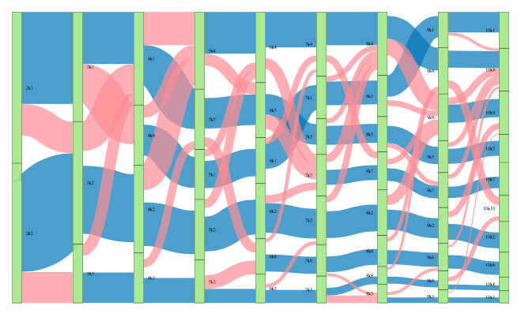
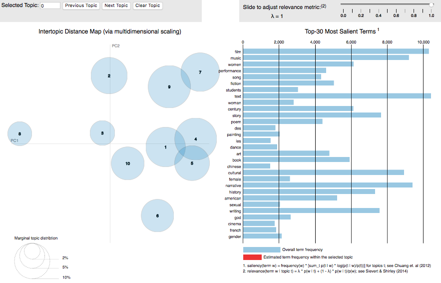

# `r tint` {#int}

#### Abstract {-}

(ref:abs-int)

#### Keywords {-}

(ref:key-int)


```{r}
library(tm)
library(stm)
library(pbapply)
library(corrplot)
library(slam)
library(igraph)
library(networkD3)
library(fpc)
d<-'?'
strspl<-function(str) {
  x<-gregexpr('[a-z][A-Z]',str)[[1]]
  if(x[1]==-1) return(str)
  x<-c(1,x+1,nchar(str)+1)
  r<-list()
  for(i in 2:length(x)) r[[i-1]]<-substr(str,x[i-1],x[i]-1)
  unlist(r)
}
blanky<-theme(axis.text.y = element_blank(),axis.ticks.y = element_blank(),panel.grid.major.y = element_blank(),panel.grid.minor.y = element_blank())
blankx<-theme(axis.text.x = element_blank(),axis.ticks.x = element_blank(),panel.grid.major.x = element_blank(),panel.grid.minor.x = element_blank())
```


## What to read?

The question of what to read is simple to be sure, but in fields of scholarly consumption and production it is nonetheless fundamental. Scholarship is a creative profession where a stock of cultural knowledge forms a greater part of the infrastructure of production than in other fields. This is not to say that other occupations, especially manual ones, lack creativity. It is to say that in such fields knowledge has a limited infrastructure. Whereas the know-how of the brick layer is black boxed in her tools and technology and in the human capital she develops by experience and tacit social learning, for the scholar as bricoleur there exists in addition the distinctively overdeveloped feature of cultural archiving as a universal memory. Except perhaps in outstanding feats of primary research, contributions to scholarship are legitimate to the extent that they have used the archive correctly.

This problem of using the archive, by which we mean all libraries and other organizations that help scholars find published work, is easily expressed by the question, "what to read?" Paradoxically, the over-development of the archive promotes a functional imperative: to the extent that more and more of scholarship is memorable, mechanisms must develop to forget large swaths of intellectual history. A person who studied a random draw from the archive, even a monumental one, would no doubt qualify as an educated person. Professionally, however, they would have answered the question in a tragically wrong way. From the perspective of other scholars, there are right and wrong choices about what to read. Because it is so easy to access scholarly memory, the operative question really becomes "what not to read?"

Though Internet search and self-publishing services, especially video and image based ones, are creating archive-like infrastructure for all occupations, even manual ones, the functions are different. Contemporary Internet repositories provide knowledge as factors of production to anyone who queries them, but many do not purport to be archives in the sense that a historical record of cultural produce is preserved for posterity. They are much more concerned with access to contemporaneous than to historical material, and indeed the particular configuration of the contemporary that sells the most ads ahead of search results. True historical archives of the Internet, such as the Internet Archive or Common Crawl, are not used by the public. Indeed why would they be; they expose the dizzying complexity of the history of the Internet, which, even in only its contemporaneous facet is already overwhelming. The Internet searcher tends to be satisficing, and the search companies have refined their ranking of results to meet their users' search budgets efficiently.

Thus Internet search services perform the function of complexity reduction in their own arbitrary way. They do this without the scholarly paradox of memory, which is that in the university system great pains are made to remember everything just so that the correct material may be forgotten. In the cynical view of professions, scholarship is the encryption of memory by secret sets. A lay seeker approaches the academic archive and at great cost of attention plumbs its depths for enlightenment. Tragically, the archive's complexity dooms her to check out a curriculum so hopelessly tacky that it will only certify her lay status. To be professional is to know what are the tasteful combinations of resources. To be a successful professional is to never have wasted time tasting the bad fruit. Librarians much prefer to help undergraduates because they lack taste. They gifted scholars with access to an immortal memory, and looking the horse in the mouth scholars made rules to protect themselves from the responsibilities of using most of it. In this way a taste for scholarship is the axis sorting the field between education and profession.

So again, how do professional scholars know what (not) to read? What then are the structures that lead scholars new and old to answer the question correctly? How does one know what are the lucrative curricula that can be developed from the archive? There are several formal and informal structures that facilitate and compel scholars to make the same choices about what to read. An obvious one is the supposed normative isomorphism of graduate program syllabi, yet it is a common concern that the quality of these are variable. Universities tend to grant great autonomy to professors in writing syllabi, who in the course of their professional travails may not be given opportunities to read what they want. In being forced to carve out time with subordinates, faculty are caught between personal indulgence and a more or less strongly felt fiduciary responsibility to set students on the correct path. If we have less than perfect faith in the strength of educational ethics among faculty, then we should expect that among graduate syllabi are many lists of what not to read. Students who trust too much in the formal curriculum may be lead astray, and even without trust, they may still be left ignorant of where to invest their labor.

In each program there then must be a hidden curriculum of higher quality. The argument of this study addresses the question of where such a curriculum could possibly come from. The provisional answer is that in the informal spaces of graduate programs knowledge of scholarly genre is learned from extracurricular engagement with professional conferences. It is in conference programs that the tacit rules of academic genre are learnable. These genres form the first parsing of the archive for neophytes. Indeed at the most generic level graduate students, if they are confident enough to locate themselves quickly enough, develop a taste for what not to read. If they can do so early on in their careers, they will be armed with the stereotypes necessary to stop reading the wrong and start reading the right material. While this is not enough certainly to make a cleric of a lay worshiper, it is a necessary first step.

### Genres

I take genre as a candidate explicans for the ability of scholars to know what to read and what to avoid from the cultural archive. A theory of genre will benefit from a review of the literature, yet to do so would catch me in the conundrum of performing the phenomenon I wish to explain. The genre structure of sociology should guide me to a definition of genre, a statement that already presumes an ontological difference and morphological relation between disciplines and genres, namely that scholarly genres are not equivalent to scholarly disciplines and that the former are located within the later. I will begin with an unstudied attempt to tease out the relation of discipline and genre before turning to a more rigorous, even empirical, treatment of genre as a term in American scholarship.

Genre is a loanword from French. The origin of the French-Latin word "genre" and the English-German word "kind" both mean membership by inheritance of innate class characteristics, archaically by presumptive blood descent within a family, race, or nation. In common English it is restricted to mean a broad category of art, especially literature and music, and some but not all other cultural fields (e.g. baseball is not a genre of sports). As a term in scholarship, genre may be an observable phenomenon, a conceptual component of a theory, or a conflation of the two. In the social sciences genre is a specialty concept as in sociology, while in the humanities it is ubiquitous especially in cultural studies. Academics define and use the term differently between and within disciplines.

```{r ttsgnr-d}
f<-'d/q/ttsgnr.RData'
if(file.exists(f)){
  load(f)
} else {
  ttsgnr<-gbng2tts.f(query = 'genre',out = 'd/q',ys = 1899,ye = 2008,cfso = T)
  ttsgnr[,ec('d,g'):=tilit::ov2chpt.f(ttsgnr$Count,drv = 2,inc.ov = F)[,.(d,g)]]
  ttsgnr[,ec('d2,g2'):=tilit::ov2chpt.f(ttsgnr$Frequency,drv = 2,inc.ov = F)[,.(d,g)]]
  save(ttsgnr,file=f)
}
rm(f)
annd<-ttsgnr[g==1,.(x=max(Year),y=Count[which.max(Year)])]
ttst<-ttsgnr[!1:2,.(d=mean(d),t=list(t.test(d))),by=g]
```

Figure \@ref(fig:ttsgnr) shows the count of mentions of the term genre in the Google Books Ngram database for English terms [@Michel2011Quantitative]. The trend exhibits the typical take-off in publishing in the second half of the twentieth century. I apply change point analysis, which detects significant differences in time series data [@Matteson2013Nonparametric; @James2019ecp], to the second difference of the trend, a measure of acceleration, to get clues as to whether the trend is a single process or whether there are inflection points. The first segment of the curve from `r ttsgnr[g==1,range(Year) %>% paste(collapse=' to ')]` indicates a period of positive acceleration or quickening of the growth trend. On average in the first period the rate of change from one year to the next increased by a modest `r ttst[1,d %>% round(1)]` occurrences a year. However, during the period from `r ttsgnr[g==2,range(Year) %>% paste(collapse=' to ')]` the rate of change, though always steep, began to decline by an average of `r ttst[2,d %>% round(1) %>% abs]` occurrences a year. Like a projectile that is simultaneously climbing and falling, `r annd$x` acts as launch point of precipitous yet unsustainable growth.

```{r ttsgnr,include=T,fig.cap='Absolute count of term "genre", 1901-2008. Segments correspond to significantly different second derivatives.'}
p1<-myth(qplot(data = ttsgnr[!1:2],x=Year,y=Count,color=g,geom = 'line')) + theme(legend.position = "none",axis.title.x = element_blank()) + ylab('Count of "genre"') + geom_label(data=annd,aes(x=x,y=y,label=x),inherit.aes = F,nudge_x = ttsgnr$Year %>% range %>% diff %>% `*`(.05),nudge_y = ttsgnr$Count %>% range %>% diff %>% `*`(-.05))
p2<-myth(qplot(data = ttsgnr[!1:2],x=Year,y=d,color=g,geom = 'line')) + theme(legend.position = "none") + ylab('2nd Deriv.')
egg::ggarrange(p1,p2, heights = c(3,1))
```

Figure \@ref(fig:ttsgnr2) shows a similar trend but using relative frequencies instead of absolute counts. Here "genre" is plotted as its share of all terms in the corpus. This trend exhibits no inflection point at `r annd$x` that is statistically significant, and visually the trend does appear the same on both sides. No other inflections points are detectable due likely to greater year over year variability in this series in the first half of the century, reducing confidence in any estimate of a change point. To interpret this difference in statistical significance between relative and absolute measures would indicate that interest in genre continued to grow even within a secular slow-down in the volume of texts that resembles the familiar S-shaped diffusion curve. Alternatively, on visual inspection of the relative curve it appears that indeed there is an inflection point, just one a decade later in `r ttsgnr[,Year[which.max(Frequency)]]`. After this point the relative frequency seems to drop rapidly, a change that would no doubt be picked up statistically after a few more years of data and one that may in fact be located a few years earlier than the peak suggests. Together these trends describe a career to the term genre that has been strong for a century and that may now be in decline.

```{r ttsgnr2,include=T,fig.cap='Relative frequency of term "genre", 1901-2008.'}
p1<-myth(qplot(data = ttsgnr[!1:2],x=Year,y=Frequency,color=g2,geom = 'line')) + theme(legend.position = "none",axis.title.x = element_blank()) + ylab('Relative frequency of "genre"')
p2<-myth(qplot(data = ttsgnr[!1:2],x=Year,y=d2,color=g2,geom = 'line')) + theme(legend.position = "none") + ylab('2nd Deriv.')
egg::ggarrange(p1,p2, heights = c(3,1))
```

```{r genre-goog-d}
f<-'d/q/genre-goog.RData'
if(file.exists(f)){
  load(f)
} else {
  gnrgoog<-fread('d/q/genreof.txt',header = F) %>% unique %>% setnames(ec('ngram,year,nw,nv')) %>% .[,max(year) %>% cat]
  gnrgoog<-gnrgoog[,.(n=sum(nw)),by=ngram] %>% setorder(-n)
  gnrgoog<-gnrgoog[!grepl('_',ngram)]
  gnrgoog[,ngram:=sub('^.+ ','',ngram)]
  gnrgoog<-gnrgoog[,.(n=sum(n)),by=ngram] %>% setorder(-n)
  gnrgoog<-gnrgoog[!grepl('[^a-z]',ngram)]
  gnrgoog<-gnrgoog[!ngram%in%tm::stopwords()]
  gnrgoog[,lemma:=tm::stemDocument(ngram)]
  voc<-gnrgoog[,.(n=sum(n)),by=.(lemma,ngram)][,.(com=ngram[which.max(n)],N=sum(n)),by=lemma]
  gnrgoog<-gnrgoog[,.(n=sum(n)),by=lemma]
  gnrgoog[voc,on='lemma',com:=com]
  save(gnrgoog,file=f)
}
rm(f)
```

Figure \@ref(fig:genre-goog) gives an indication of what things the term genre has been used to describe. It illustrates the frequency of terms appearing in the Google Books Ngram corpus as the third term in the trigrams beginning with "genre of" or "genres of" [@2012Google]. The size of the words is proportional to the total frequency of the trigram in the English corpus, which spans centuries from 1590 to 2008. The bias of the source--books--is clear in the outsized importance of "literature" and "writing" which are followed closely by "music". The next ten largest nouns are `r gnrgoog[1:17,com %>% setdiff(ec('writing,literature,music,popular,science,historical,literary')) %>% nl]`. Ranked within that series would be several adjectives as well: popular, science (fiction), historical, and literary. Each of these terms refers to a field of concrete cultural products, with the exception of "discourse" which is more abstract.

```{r genre-goog,include=T,fig.cap='Wordcloud of third term in 3gram beginning with "genre of".'}
if(latex|docx) knitr::include_graphics('img/genre-goog.png') else gnrgoog[,suppressWarnings(wordcloud2::wordcloud2(.SD,widgetsize = NULL,size = .85,gridSize = 1,fontWeight = 'normal',rotateRatio = 0,color = viridis::viridis(max(n),direction = -1,option = 'E',end = .9)[n],shape='circle',shuffle = F,fontFamily = 'Times')),.SDcols=ec('com,n')]
```

```{r gnrgoog-tab}
f<-'d/q/gnrgoog1562998843.txt'
if(file.exists(f)){
  gootab<-fread(f)
} else {
  write.table(gnrgoog[,.(type=NA,com,n)],file = paste0('d/q/gnrgoog',Sys.time() %>% as.integer,'.txt'),quote = F,sep ='\t',na = '',row.names = F,col.names = T)
}
rm(f) 
split(gootab[,i:=.I],by='type')
```

Most items toward the top of the list are less popular (to write about) art forms like television, dance, and theater. Toward the middle of the list begin to appear adaptations of the term from the cultural to the social context. These include practical fields like medicine and journalism, political areas like law, government, and crime, and social arenas like identity and protest.

To impose a sociological gloss on the term, these varied uses of genre would make reviewing the literature on the topic difficult, were it not for the discipline structure of the academy. The uses of the term genre are themselves systematically organized by discipline, and a disciple who is adequately trained will know the correct ways to use the term in her local context. To use genre as a disciplinary convention means to first identify your location in the disciplinary field, and then to accept the limitations on scope by excluding those treatments of the term that are extradisciplinary, that is, irrelevant. Disciplinary structure reduces the true cultural complexity of the meaning of genre to a restricted form, which in turn allows humble knowledge workers to engage upon a set of shared assumptions. Such simplicity begets new complexity as disciples spin out the consequences of their local use of genre.

In the sociology of culture, genre is a form of classification enacted by people in various social contexts. In the context of industrial capitalism, genre is an economic principle helping to organize supply and demand within markets for cultural products. There actors see genres among the borders between economic, social, and cultural uses, as a market category helping them acquire or produce content, as a card in proximate games of prestige, or as something to taste, to consume and enjoy directly. Less often genre is knowledge, a component of culture separate from taste, that is a factor in the formation of ideas and skills, whether these lead in turn to economic production or not.

Genre's meaning is context specific and variable across sociological subfields, though it is amplified in empiricist fashion by economy and society approaches that reduce genre to the act of classification itself. I say empiricist because of the empirical ease with which the classification or labeling actions are observed. Especially with Internet distribution systems, it becomes trivial for corporations to observe when a consumer labels her preferences while browsing a content catalog; it is much harder to observe the ideas that consuming a particular piece of content sparks in the mind.

In cultural studies genre is used much differently and much more in accordance with its etymology. To the humanist, genre is an ontological phenomenon, which is to say, genres are differentiated from each other by combinations of discrete features of signs and signifieds. Humanists are trained to establish these ontologies through methodological readings of texts and through cultivation of theories of genre types. These methods are at the same time empirical and interpretive, because in consuming objective texts the researcher actually observes the ideas that form in her own consciousness, and they may hope that others have a resonant experience. Genres have more substance to them for humanists than they do for sociologists. For sociologists of culture, genres are how people use genre labels, while for humanists, genres are knowledge.

As we have said, the meaning of genre for a sociologist of culture is economistic, at the same time a market category and a taste configuration for consumers. The term differs for a sociologist of knowledge, and perhaps for a cultural sociologist. It is ontology as it is for the humanist, however it is not the ontology as represented to the researcher in the consumption of texts. It is the hopelessly unobservable distribution of ontologies appearing in a population of consumers attending to similar texts. The sociologist of knowledge accuses the sociologist of culture of reducing internalist concepts, thought and experience, to externalist ones, taste and preference. The sociologist of culture rejoins, show me proof, and on and on the interlocutors spin around the axis defining the boundary between their subfields.

But this description of subdisciplinary differences really is just an example of a structural theory of genre that is within scope for the sociologist of knowledge and beyond it for the sociologist of culture, due to their epistemological differences. If genres are ontological, then they deeply structure a person's experience of reality. Ontologies form basic perceptual categories, and people with different ontologies of an object experience different things even if oriented to the same objective phenomenon. A ontological theory of genre would, for example, attempt to explain differences in taste as differences in phenomenological perception, whereas a taste theory of genre treats consumption behavior as revealing preferences whose downstream consequences are then explored.

Yet for all the differing treatments of genre mentioned above, do these views of really contradict, or are they in fact complementary? Does genre as distribution serve the economic sociologist's goals, or does a lack of ontological substance lead her astray? Does genre as knowledge remain hopelessly unverifiable, or are theoretical constructs necessary to achieve a correct interpretation of facts? Is everyone at the club listening to the same song hearing the same thing?

### Disciplines

To return to disciplines, answering such questions would put the researcher in an adisciplinary predicament, for it would mean eschewing the scope restrictions cherished by disciples. The challenges of a meta-disciplinary analysis are manifold and uncertain. One is as likely to grow her audience as to lose it altogether. She risks the dilettantism of a jack-of-all-trades. What's worse, she exposes herself to a dizzying scale of content to consider. If disciplines are indeed functional, then the meta-analysis that effaces disciplines risks being dysfunctional. The upside, however, is appealing. If the universe of meanings given to the term genre does contain complementary uses, a meta-analysis will allow one to consider the consequences of the now arbitrary segregation of a superior metaconcept across disciplinary boundaries. Both sides of the divide could be strengthened by a cultural exchange of their respective terms. The redundancy of parallel discovery can be avoided.

Pathologies of disciplinarity can be diagnosed and treated. Disciplines are social substructures embedded in a larger society and culture. Disciplinarity is a kind of controlled ignorance exchanged for access to secret knowledge. The wayward uses of a term like genre are always lurking at the edges of the firelight defined by a particular disciplinary camp. Discipline as rigor instructs disciples to resist flirtations with the available complexity of the term. The essential tension is very rarely between what is known and unknown; rather it is more commonly between what is known "here" versus what we are conditioned to be willfully ignorant of "there".

In a motivation of some of the arguments to follow, I take a metadisciplinary approach, which is to cast as wide a net as possible on the term genre. In so doing I hope to test the tacit cultural assumption that discipline-based decisions of relevance are valid, that is, that when we exclude arguments from other disciplines we remove distractions and focus on what is important. The alternative possibility is that we are wasting intellectual resources, because to exclude important work about our topic, even if it is codified in foreign terms, is to risk ignorance and redundancy. The topic is genre and how disciplinary boundaries form such that people using the same word nonetheless cannot communicate effectively. They draw on different paradigms, which is to say the term is not really the same term. What I hope to do is uncover the knowledge contexts surrounding the terms, and map these contexts in a way that enumerates the various communities of discourse and theories constituting the term.

## Method

As I have said, the first consequence of eschewing disciplinary limitations is to bloat the size of the "literature" on genre, since no uses of the term would be excluded. An empirical approach to the standard academic convention of a literature review will help reign in the scale and complexity of the task. My aim, however, remains practical rather than scientific. The methods need to be good enough to yield results that offer something new above a traditional literature review relying on library search and disciplinary wisdom about what is important. This is not because a scientific approach is undesirable, it is that it is not yet demanded of "the literature". Sociologists are not expected to take a sociological orientation toward the history of their fields. Rather the literature review serves the social purpose of taking a position in a field of cultural production. It is a listing of a roster of political support and rivalry, and an advertisement to attract a desired audience.

To take an empirical approach to the literature review would be subversive were it not the first function of disciplinary genres to render atypical draws from the archive irrelevant. Disciplinary subfields, genres, are credentialed by secret sets of references, and most comers are held at the door. This in and of itself can be subversive of even more arbitrary club rules, namely those of educational pedigree, such that anyone willing to invest in a presentation of the genre definition will be granted access to the venues, if not the invisible colleges, of the subfield. To be admitted to the arena is no guarantee of achievement within it, but it is a start. Nevertheless, the scale of the archive will always supply entropy enough to create a deterrent of flotsam and jetsam around subfields composed of projects and persons who either never cracked the code or who willfully eschewed it.

### Distant sampling

The research strategy here attempts to parry the entropic tendency of the archive by substituting human for machine limits. The methodological premise of a meta-analysis of genre is that the Gordian knot of the global cultural complexity of the archive can be cut by stratified sampling. I use a large digital archive of texts, JSTOR, to represent the whole of the academic archive. Though clearly a toy representing only a fraction of all networked scholarly produce, JSTOR is large enough to easily surpass individual cognition and compel the equivalent types of complexity reduction facing any researcher approaching the real archive via their local university library portal.

I use a simple term search of the keyword "genre" to define half of a sampling frame.^[TODO, I did not, but should take a random draw of the same size to serve as a control.] I could then take a simple random sample of texts, analyze how each uses the term genre, develop a classification scheme, and enumerate the different uses of the term. Unfortunately, a small sample in a statistical sense may be larger than a poor researcher can handle. 1,000 texts is not large statistically, but it is huge from a content analysis perspective. What's worse, 1,000 texts may still exclude, by random chance, small subcultures of the term. Stratification within a more or less global sampling frame resolves this issue by delineating those subcultures so none would be left out.

Alas, the JSTOR digital archive lacks subject labels at the article level, though it does include them for book chapters and for journals. While not foolish, inheriting a journal label to the articles included within it may be a coarse approximation if within-journal content variation exceeds between-journal variation. We can use text analytic classification methods to cluster articles directly and discover latent groups of articles, and in so doing we can have an independent standard to compare to the discipline labels given to journals. It is an open question whether such methods align with what we have discussed above as disciplinary and subdisciplinary groupings, for us whether regularities in vocabulary correspond to regularities in the meaning of the term genre. If they do not, then the study will only be a stop en route to a true census of the uses of the term genre, and the contribution will be to have interrogated the quality of the methods used, though this would be a small consolation indeed!

The choice in computational text analysis (CTA) about how to represent texts as data hinges on whether word order is preserved. The older and more tested approach is to not preserve word order. The name given to this "bag of words" format reminds one of its inelegance. A bag of words is a frequency table for each document counting up the number of times particular words are used, a representation that effectively reduces a text to its vocabulary. It is the analyst's crude operational decision to treat vocabularies as indicators of meaning, but social scientists conventionally insist on cross validation via qualitative analysis. While the ambitions of computational text analysis may start with a replacement of, for instance, the standard literature review, the conventional distrust, at least in sociology, of mathematical models of text makes CTA more of a sampling method than an analytic method. The study will culminate in a reading of texts, albeit one that is different than traditional qualitative analysis because the CTA researcher welcomes the introduction of interpretive bias from an understanding of the mathematical model before, during, or after the texts are read. In the game of "choose your influence", CTA is one choice while disciplinary wisdom is another.

There are two types of classification methods in text analysis, direct document clustering and topic modeling. Direct document clustering treats the bag of words as a vector space and calculates distance or similarity metrics between documents, which are then clustered. In a topic model, the relationship between documents is mediated by an unobserved but latently modeled representation of their content; documents are similar because they are formed from the same topics.

Whichever approach one takes, and both may be used, recall that the goal is to organize the texts into strata for the purpose of stratified sampling. We said that we wish to typify and enumerate the different uses of the term genre. By qualitative analysis, we could read every text in a simple random sample and come up with a theory of the use of genre in that text. The demerits of this approach are several [c.f. @Nelson2017Computational\:5]. It would take longer than we want even for too small a sample. We are not humanists and have not been trained in text analysis (this will hound us no matter what). Fatigue will set in, and accuracy and consistency will suffer. We may limit our set of theories to spare us the agony of complexity. It will be hard to reproduce our results. There may be path dependency with a different reading order producing different theories. On the upside, we would be more educated for it.

Instead, we will stratify the sample, and it is in the configuration of the strata that much of the work will be done. The strata impose upon our interpretation of the texts the assumption of sameness. 

### No cigar

The popular yet maligned distant reading approach taken by digital humanists [e.g. @Moretti2005Graphs] is being taken up with gusto by social scientists who are less skeptical of quantitative methods [e.g. @DiMaggio2013Exploiting]. Following Nelson [-@Nelson2017Computational] I employ a quantitative analysis of texts not to replace human reading with machine reading but to support reproducibility in traditional qualitative content analysis. While CTA makes it possible to dispense with reading altogether, knowledge, understanding, and the cultural logics of arguments--especially their ontologies--are still only obtainable by reading primary texts, closely or not. The most radical interpretive CTA method would involve deep neural net supervised machine learning, which may be able to predict how a particular human reader would classify a text without their needing to read it, though this has never been demonstrated. What I gain from CTA is guidance in answering the question of what to read, and perhaps in what order to do so.

As we know, the question of what to read is answered institutionally for scholars already by way of canon, curriculum, word of mouth, and digital reference term search services. These are their own forms of distant reading, because they each make obsolete the archaic image, true of figures like Weber, of a scholar buried in library stacks reading everything they come across (and so it has been said of Weber, forgetting nothing).^[What a scandal it would be if Weber's lionizers discovered that he had only read text indices! Surely they would bury such a fact. But the point would remain that even if a scholar were able to consumer an entire corpus, the sheer scale of contemporary publication is now beyond even a genius's capacity.] These contemporary shortcuts are historically arbitrary, but what is important is first that they serve the function of reducing the overwhelming cognitive complexity of published scholarship, and second structure that reduction in the same way for all scholars. An arbitrary reduction needs to be consistent to act as an infrastructure for subdisciplinary scholarship, otherwise scholars would find themselves located in different literatures.

If distant reading is a criticism of close reading then it has a big hill to climb especially among humanists who are trained to deal methodically with texts very carefully. In the social sciences a type of customary distant reading is that of ritual citations, those that have developed a meaning that may be oblique to their content or at odds with the intentions of the the original authors. A ritual citation is simply one that is cited but not read, but also one that is so often used that its socially acceptable usages are known from other secondary accounts.

What are the social patterns of the traditional literature review are topics for the sociology of knowledge and science and for the information sciences. This is not the task of the current study. What we take from the traditional approach is the consequences of excluding large segments of intellectual history. What CTA makes possible for the first time is a nonarbitrary, inclusive analysis of *all* content in a digitized corpus. It will not necessarily be a good analysis, but what it will lack in quality it will make up for in coverage. A CTA approach to the literature review will at least make clear what lacuna would be left by the traditional approach. They also reduce the potential idiosyncrasy of a particular author's literature review because, unlike a personal reading, a CTA model can be communicated precisely.

Of course the cognitive limitation of how much any scholar can actually read and understand remains. There will be an exclusion mechanism no matter what, therefore a chief assumption of a CTA literature review is that corpus segmentation is both possible and that some reduced form of reading, some sampling procedure, can be said to be representative of the unread portion in each segment. These representative texts will be subjected to a close reading, but their interpretation will be generalized to unread documents. Hence I call this a "no cigar" approach to reading, as in "close but". If on the contrary to the assumption no two snowflakes are alike, then the enterprise of knowing more than we have before is fraught, and CTA becomes yet another arbitrary reducer.

What's worse, or perhaps better, is that there is reason to believe that idiosyncrasy itself is an historically variable feature of disciplines. If institutional isomorphism has proceeded to some high level in contemporary disciplines, then the assumption that reading the bellwether texts is as good as reading the entire herd may hold. If this is true, however, it raises as many questions about the process of institutionalization in cultural production than it answers about the potential to learn truer versions of intellectual history.

### Topic Models

We have referred generically to computational text analysis, and now we can discuss the topic model as our technique of choice. There are many ways of estimating a topic model (e.g. the famous Latent Dirichlet Allocation or LDA estimator) but the model itself is simple. It is a latent variable model that decomposes a document-by-term matrix--in which every document is represented as a frequency distribution over every term appearing in the corpus--into two unobserved matrices:

- a topic-by-term matrix, and
- a document-by-topic matrix.

Topics are directly represented by they topic-by-term matrix. A topic is a probability distribution over a vocabulary. To draw on a topic means to choose vocabulary as a random draw from this distribution, where words with higher probabilities will be chosen more often. In the case of genres we might imagine a topic about film and a topic about music. Some words may be important (highly probable), to both topics, such as the word "genre", while others would be distinct, such as the words "movie" (probable for film but improbable for music) and "band" (vice versa).

Given topics as term distributions, a document can be represented not as a distribution over terms, but as a distribution over topics. The topic mediates the relationship between documents and terms. In order to generate diction for a document, all that need be understood is the ratio of topics out of which it is composed. This is sometimes explained as a generative mechanism; to ask what word will be chosen next in composing a document, one first samples from the document's own topic distribution to decide which topic the word will be drawn from, and given that topic, one then samples from the topic's word distribution to decide which word will be included in the document. A document's topic probabilities also create the expectation of how many words are attributed to each topic. A document with topic probabilities .7 from music and .3 from film would be 70 percent about music and 30 percent about film, making for a parsimonious albeit reductive description of document content.

It is important not to overinterpret a topic model. Topic models are sometimes called "generative" as if they explained how documents are written. Such a generative metaphor reveals the absurdity of a topic model as a representation of writing. Not to mention the fact that punctuation tends not to be represented (though it could be), the terms chosen would be in a random order incapable of making meaningful sentences. Hence it is best to avoid the generative metaphor as an explanation of texts. If topic models touch on the generation of real, meaningful documents, it is only a very limited sense. What the topic model really represents is how vocabularies are organized to condition an author's diction. A vocabulary can be thought of as an infrastructure of meaning more trivial than grammar or syntax. A topic is a simple list of words that is known or knowable across all authors in a field. Topics do not tell stories; authors tell stories in part by making diction choices that are conditioned by topics.

From a sense or meaning making perspective topics are trivial; this is because so little is known about what an author says by knowing the topic or even the term distribution of a document. What topics are useful for, however, is the type of segmentation or cartography of a corpus. Topics are really a global feature, perhaps a cultural feature, of a corpus of texts that is itself meaningfully selected. If indeed a field of texts is oriented to common if not always overlapping vocabularies, then topics can represent this well.

A topic model could be posited based on the domain knowledge of an expert, and this would be a form of estimation. The practical value of statistical topic modeling is that the unobserved topics can be induced, with a raft of statistical assumptions, directly from the observed document-by-term matrix to arrive at a model with the features just described. An estimated topic model will contain several other parameters filling in assumptions necessary to make it possible to identify the unobservable topic probabilities in each of the two matrices of the model. For instance, the parameter commonly called alpha makes an assumption about how many topics tend to comprise each document.

#### Choosing K

Finally, topic models require the analyst to choose the number of topics $K$. The approach we take to guiding this decision is not to expect one correct specification of K but rather to see it as a changing resolution. A K=2 model usefully bifurcates the sample and is not simply wrong because it is too restrictive. As K increases we expect the samples to continue to divide as new parameter spaces become available to partition the sample. While this is not strictly a hierarchical design, since each K model is fit independently, we should expect to see aspects of hierarchical topics as well as some degree of stability in the relationships among topics.

Between model cross-validation means that document and term groupings should be relatively stable as K increases. The document overlaps between, say, a three topic model and a four topic model should not be random. By graphing the document overlaps between pseudo hierarchically organized models, it should be clear which topics are the most stable and which are constituted by chance. An ensemble approach would then recommend itself; if the content of a topic is stable across different specifications of K, within limits, then we should have even more confidence in that topic. Another interesting feature of this approach is that it shows when and how topics are able to appear given the parameter space constraints. We expect the most dominant topics, those that appear at low K and remain stable as K increases, to derive from the most semantically distinct documents. For sets of documents that are constituted by multiple true topics, we expect to see splitting of larger topics as the resolution increases to meet the real diversity. Hierarchy will reveal itself as topics with stronger topic signals subsume weaker ones until K reaches a point where there is enough space to separate them. On the other hand, in the classic trade-off between variance and bias, where K overshoots the true number of topics, we expect to see random splitting and possibly "dust bin" effects where spare topics allow larger topics to prune their weaker term associations.

Presumably K can be set so high as to approach the saturation point of a topic for each document. In this event topics that would otherwise appear in common may alter to represent the uncommon parts of a document, and the topic would merely reproduce the term distribution of a particular document. 

#### Bias

Before documenting the data preparation below, it is important to keep in mind several sampling and modeling considerations that tend to be overlooked. First, idiosyncrasy is assumed to be unmodelable. A flaw of traditional topic models is that, at one level, all documents are generic. Originality exists only in novel admixtures of vocabularies held in common. Vocabularies that are limited to trivially small sets of works, be they idiosyncrasies of content or style, become sources of bias to topic model estimators. Because idiosyncratic vocabulary is be definition rare, it lacks both the mass of frequency and distribution across documents to be reliably picked up as a topic. Indeed, if each document were expected to contain some idiosyncrasy, then the number of topics needed to catch all of the idiosyncrasy would be equal to the number of texts in the corpus. Each document would then be a combination its own idiosyncratic topic (of which it would account for 100 of topic content) and a distribution over other topics held in common. The real number of topics would then be $K+N$ where $N$ is the number of texts and practically always much greater than $K$. Researchers would balk at including such a large set of extraneous topics, while estimators would both be strained by the greater parameters space and would collide with hyperparameters designed to militate against estimating topics distributed only over a single document.

The impracticality from a modeling perspective of representing idiosyncrasy coincides with the undertheorized tendency among researchers for extreme pruning of idiosyncrasy during data preparation. A more parsimonious modeling solution would be to allow a single extra topic designed to catch all idiosyncrasy. Yet this would tend to violate the assumptions behind construction of the other topics for two reasons, first because one topic would have significant distribution across all documents and second because terms within the topic would never be estimated together as they would really be a mixture of $N$ uncorrelated subtopics.

Idiosyncrasy tends to be pruned in a desire to limit the length of the vocabulary to bring it within the bounds of computational power and the chances of a successful parameter optimization. Depending on the task, however, the researcher may not be so concerned with performance, and may leave plenty of idiosyncrasy in the sample. What then is the effect on the topic estimation of such idiosyncrasy, since the idiosyncrasy must end up somewhere?

First, there will be a tendency to muddy the content of common topics with the particular idiosyncrasies of the documents that happen to draw on them. This in part explains the long, non-zero tails of topic by term distributions, which are usually filtered out during post-estimation and interpretation of the models. We would however expect them to corrupt the error structure of the topic they contaminate, leading to suboptimal estimates of the true terms in the topic.

Second, the document proportion of the contaminated topic will be inflated in the contaminating document. After all, the idiosyncrasy of the document was represented, erroneously, in the contaminated topic. Because of the length of the term vector it is not difficult to imagine the truly pathological case wherein the probability sum of the false portion of the topic is greater than that of the true portion. In this event, a document could be categorized within a topic due more to the false content than to the true content, especially if the idiosyncrasy was placed in topics randomly. Contrary to the effect of random error in an explanatory variable in ordinary least squares linear regression, which is to bias the regression coefficient downward, in a topic model the effect will be to bias the topic probability of a document upward.

@DiMaggio2013Exploiting represent a typical albeit conservative approach to topic modeling as distant reading. Their data preparation of a newspaper corpus about U.S. arts policy in the 1980s and 1990s resulted in 54,982 unique terms and 7,598 documents [-@DiMaggio2013Exploiting\:582]. This incredible dimensionality in the term vector, which eliminated only stopwords and a few hand-picked terms and did not stemming, represents a very conservative approach to term filtering admitting to no performance based truncation. They chose a model with 12 topics. Thus in a strict interpretation of their 12-topic model, we are to believe that the extreme idiosyncrasy of news, with all of its historical specificity, is contained in a noise or junk topic rather than creating bias on the estimation of the signal topics. With such a huge term mass to classify and so few topics in which to do it, it is incredible to think that the algorithm would alight on a junk topic rather than using that spot for a signal topic. It is plausible that the noise (and so offensive a term to those reporters trying to say something new!) is distributed across signal topics rather than being safely tossed in the dust bin. To wit, their choice of a low alpha parameter of 0.1, which assumes that each document is generated from relatively few topics, makes it even less likely that the estimator would spend precious parameter space on a noise rather than on a signal topic.

@DiMaggio2013Exploiting- attempt to placate statistical criticism by substituting quantitative, statistical forms of validation for qualitative cross validation of topics. This may be more treacherous than the authors admit. Their analytical approach is:

1. Fit the topic model.
1. Sort the topic by term vectors in decreasing order.
    a. Split the fat head from the skinny tail.
    a. Interpret the terms in the fat head.
1. Sort the topic by document vectors in decreasing order.
    a. Split the fat head from the skinny tail.
    a. Classify those documents in the fat head according to 2.b.
1. Interpret the documents according to 3.b.

The sorting procedures are a typical low-hanging fruit use of the model. Even though the model is a much simpler ball of string than the original full text corpus, it is still a very complicated statistical equation with, in this case, 12 \* 54,982 + 12 \* 7,598 = `r nn(12 * 54982 + 12 * 7598)` estimated parameters. Sorting the term and document vectors allows the analyst to proceed from an interpretation of the strongest signals toward the weakest, stopping when the author feels satisfied that the research question is satisfactorily addressed. The assumption here is that the strongest statistical signals are unbiased, that when parameters are converted to ranks, and the ranks are converted to truncated lists of words and documents, that those lists are correct.

The specter that I raised above applies to the document ranking more than to the term ranking. A formal feature of topic models is that each topic is composed of all terms in the corpus. Of course this is an artifact rather than an intention of the model, as the goal is to separate relevant from irrelevant terms in the constitution of topics. Similarly, all documents are distributions over all topics, but this is not (necessarily) the intention; again we expect an elbow in the sorted topic document vector in front of which are relevant and after which are irrelevant topics. Any concentration index, such as the Gini coefficient, calculated on the topic term and to a lesser extent the topic document vectors will show very high concentration, where most of the probability is owned by a few elements. 

We can test for some of these expectations of bias. A document's topic assignment may be considered suspect if its term distribution from that topic derives from the low and long tail of the topic, rather than from the select high probability terms normally associated with the topic's meaning.

### Qualitative Cross Validation

To be sure, topic model parameters may be biased by misspecification, and if we are being fair, by the gargantuan task we ask of them. In part because topic models, notwithstanding their decades of development, remain difficult to validate statistically, and in part because educated people scoff at the idea of machine reading, many researchers ultimately rely on qualitative interpretation to evaluate model quality. Goodness of fit means that topics pass a sniff test upon inspection. A list of a words either does or does not inspire a theory of meaningful content, and this theory either is or is not confirmed upon inspection of document with a highly ranked topic probability.

The same scholars who promote qualitative cross validation (QCV) would presumably have bet on John Henry rather than the steam drill. The arguments against the machine, which excels only at recognition, is that it is a ham fisted intruder into the delicacies of sensemaking, semantics, and interpretation. Meaning operates very differently from information namely by bringing grounding to the response to information. One example of grounding is spreading activation, that when information is presented to the mind by sensation, the mind responds by representing not only a construct of the stimulus but also a network of constructs adjacent in memory to the stimulus. Simply, humans see more than they perceive, but machines cannot.

This almost but not quite unfair to machines. In machine learning the analog to memory is mathematical model representation, and the analog to learning is Bayesian updating of old models with new data. A machine seeing new data with an old model can indeed see more than it perceives. At this moment in the era of computational social science, however, researchers train models for the first time on the data they wish to explain. It is theoretically possible to communicate and transport models from past to present researchers, however this is not done in practice for lack of infrastructure and more importantly because social scientists rarely study the same thing twice. Where data are ample it is possible to simulate a history of memory for the machine using hold out techniques where a model is trained on one sample of the data and applied to predict another sample. Where the goal is to maximize prediction, training and hold out samples are randomly selected. A different approach [e.g. @Nay2017Predicting] involves selecting training and hold out as a process in time. This is a closer approximation to human memory, as humans always approach the present only armed with a memory of the past. 

As clever as the time sorted hold out strategy is, it is unlikely to outperform a supervised approach to model validation wherein human judgement serve either as diagnostics or training materials for model fitting. Human culture is far too expansive to be modeled by a computer for no simpler reason than the data of human memory are always rapidly lost and what is retained is selected for arbitrary historical reasons. What makes the contest between John Henry and the steam drill interesting in the modern era is the social problem of cultural reproduction. Machines will outperform humans only where human history is made more accessible to machines than to humans, which may be a join function of the success of digital archiving coupled with the deterioration of human education.

To return to the case of topic models, some advocates for the machine go so far as to claim that the topic model actually recovers semantic context [@DiMaggio2013Exploiting\:578]. Semantic context is a more specialized notion than memory, and it refers to the human capacity for reproducing common meaning. In language viewed through a topic model a large collection of terms defines the topic while only a sample of these terms will be observed in a particular document. In this sense the topic model fills in missing information in the way that meaningful interpretation works. This notion rests on a very strong assumption, however, which is that information tacit in a particular case is explicit in a different case, indeed a quorum of different cases, and that the cases overlap enough to become included under the same topic. This feature would seem to compete against the other feature of polysemy, that a term may appear in multiple topics each with a different context. How does the machine know that a particular term distribution (document) is a case of missing grounding within the same topic as another document, or is in fact a different topic with a different context?

Of course the machine knows nothing other than how to maximize an objective function. Estimators are designed to select random solutions and update them in the direction of better models. Indeed, it is the hyperparameter choices of the researcher that decide often decide which research approaches will win out. For example, the question of whether or not a topic model detects polysemy is governed by the choice of the sigma prior, which controls topic correlations, where a constraint toward low topic correlations prohibits detection of polysemy. The current state of software discourages an understanding of how hyperparameter tuning relates to a particular research agenda, and this opacity to the method is a strong driver toward QCV.

Cheap computing does make grid searching across hyperparameter settings possible, if not cost effective, but until this approach is usefully automated it is safe to assume that models will be misspecified in an unknown way, that the model is tuned in a particular arbitrary theoretical direction that is unknown to the researcher. Why would one believe that QCV would inoculate against the hidden bias imposed by the model? To be clear, a biased model is one that will present a vocabulary that *does not* represent the text accurately. In the conventional use of topic models, the researcher is eager to use the topic as a lens that both arranges documents into relevant subsets (a particular draw from the archive) and primes her interpretation of the documents content by a suggestive list of terms.

The QVC error we are most concerned with occurs in the following scenario. Continuous document by topic probabilities are interpreted categorically according to an explicit or tacit threshold of classification. Explicitly, one could analyze the global decay of topic probabilities and attempt to find natural empirical separations at threshold values. More commonly, the tacit satisficing criterion is met as one walks down the ranked list of documents and eventually decides that they have understood the topic. The error arises in the within-class generalization where classification quality has degraded in a continuous fashion (and past the point reached by our satisficed reader) yet such errors have been effaced by the hard classification rule. In short, by understanding the bellwethers, the researcher only partially understands the corpus and indeed only further mystifies the poorly classified texts.

It will help to visualize the statistical situation leading to this error. In the expected case of model misspecification, usually too few topics, we should also expect an urchin shaped quality distribution where on each topic spine are bellwether documents drawn out by their strong signal to be representative of the topic. As one descends the spine of each topic we will begin finding the poorly classified documents collected on the body of the urchin. These documents are representative of no topics, that is, equally representative of all or several topics. For a misspecified model, it is possible that a collection of these stragglers would be given a home in a model with an extra spine, that is, new parameter space for an extra topic.  But without a topic to represent them, the analyst may make the mistake of a false generalization from bellwether to straggler documents. Such stragglers may even be halfway up the spine, assuring their classification but for the wrong reason: bellwether documents achieve their topic probability by virtue of words at the head of the sorted topic by term vector, whereas stragglers achieve their lesser but still above threshold topic probabilities from the meaningless long tail of the topic by term vector. This long tail, we must recall, contains terms that may have trivially small topic probabilities when considered separately, but because the term vector is so long their cumulative probability may rival that of the true segment of the vector.


## Data

```{r jtabs}
f<-'d/p/jtabs.RData'
if(file.exists(f)){
  load(f)
  attach(jtabs)
  rm(jtabs)
} else {
  jtabs<-list(
    jart=fread(input = 'd/d/jstordfr/genre/genre_journal_article_jst_get_article-1.csv')
    ,jbok=fread(input = 'd/d/jstordfr/genre/genre_book_chapter_jst_get_book-1.csv')[,discipline:=mapply(strspl,str=discipline,SIMPLIFY =F)]
    ,jauth=rbindlist(list(
      fread(input='d/d/jstordfr/genre/genre_journal_article_jst_get_authors-1.csv')[,.(auth=list(data.table(first=given_name,last=surname)[,c('first','last'):=lapply(.SD,function(x) if(!any(grepl('[a-z]',x))) tools::toTitleCase(x %>% tolower) else x)])),by='file_name']
      ,fread(input='d/d/jstordfr/genre/genre_book_chapter_jst_get_authors-1.csv')[,.(auth=list(data.table(first=given_name,last=surname)[,c('first','last'):=lapply(.SD,function(x) if(!any(grepl('[a-z]',x))) tools::toTitleCase(x %>% tolower) else x)])),by='file_name']
    ))
    ,url=rbindlist(list(jart[,.(file_name)],jbok[,.(file_name)]))[,.(file_name,url=paste0('www.jstor.org/stable/',sub('[a-z-]+-','',file_name) %>% sub('_','/',.)))]
  )
  save(jtabs,file=f)
  attach(jtabs)
  rm(jtabs)
}
rm(f)
```

```{r dfrg}
f<-'d/p/jstordfr-genre.RData'
if(file.exists(f)){
  load(f)
} else {
  if(F){ #only needs to be done once ever for a query
    library(future)
    plan(multiprocess)
    library(tm)
    library(jstor)
    #dir('d',pattern = '\\.zip$',recursive = T,full.names = T)
    zp<-'d/d/jstordfr/receipt-id-1232411-part-001.zip'
    jst_preview_zip(zp)
    import <- jst_define_import(
      article = c(jst_get_article, jst_get_authors),
      book = c(jst_get_book,jst_get_authors),
      ngram1 = jst_get_ngram
    )
    jst_import_zip(zp,out_file='genre',out_path='d/d/jstordfr/genre',import_spec=import)
  }
  system.time(dfrg<-fread("d/d/jstordfr/genre/genre_ngram1_jst_get_ngram-1.csv"))
  # get rid of 1 and 2 frequency words, must appear thrice or more in a document, also a lot of ocr errors
  setkey(dfrg,n)
  dfrg<-dfrg[!.(1:2)]
  # get rid of 1 and 2 character words, and unrealistically long terms
  dfrg[,nc:=nchar(ngram)]
  setkey(dfrg,nc)
  dfrg<-dfrg[!.(c(1:2,25:max(nc)))]
  # process, stem
  system.time(dfrg[,lemma:=ngram %>% removeWords(words = union(stopwords("en"),stopwords("SMART"))) %>% removeNumbers %>% stemDocument])
  # get rid of docs that did not actually have the term genre in them, were included because of a french abstract
  setkey(dfrg,lemma)
  genreset<-setdiff(dfrg['genr',ngram %>% removeNumbers %>% unique %>% sort],'genr')
  cul<-dfrg['genr',file_name %>% unique]
  setkey(dfrg,file_name)
  dfrg<-dfrg[cul]
  # drop empty lemma
  dfrg<-dfrg[grep('[a-z]',lemma)]
  # collapse lemma
  voc<-dfrg[,.(n=sum(n)),by=.(lemma,ngram)][,.(com=ngram[which.max(n)],N=sum(n)),by=lemma]
  dfrg<-dfrg[,.(n=sum(n)),by=.(file_name,lemma)]
  dfrg[voc,on='lemma',com:=com]
  # get rid of docs containing genre fewer than 5 times
  setkey(dfrg,lemma,n)
  dfrg['genr',n %>% table %>% prop.table %>% sort(T) %>% head]
  cul<-dfrg[CJ(lemma='genr',n=1:4),file_name %>% unique]
  setkey(dfrg,file_name)
  dfrg<-dfrg[!.(cul)]
  # get rid of lemma where all characters are the same
  cul<-voc[sapply(lemma,function(x) strsplit(x %>% as.character,split = '')[[1]] %>% unique %>% length)==1,lemma]
  setkey(voc,lemma)
  voc<-voc[!.(cul)]
  # quick get rid of short lemma
  voc[,nc:=nchar(lemma)] %>% setkey(nc)
  voc<-voc[!.(1:2)]
  voc[,table(N) %>% prop.table %>% head]
  # sparsity, minimum number of docs (6 here)
  # can be done with prepDocuments later
  # setkey(voc,N)
  # voc<-voc[!.(1:5)]
  setkey(dfrg,lemma)
  dfrg<-dfrg[voc$lemma][!is.na(file_name)]
  # dedup exact content even if metadata is different (e.g. re-issues)
  dup<-dfrg[,.(tst=list(unlist(.SD))),by=file_name,.SDcols=ec('lemma,n')] %>% {.[.$tst %>% duplicated,file_name]}
  dfrg<-dfrg[!dup,on='file_name']
  attr(dfrg,'genreset')<-genreset
  save(dfrg,file=f)
}
rm(f)
```


We will use the JSTOR Data for Research service to download a bag-of-words text corpus for topic modeling. I take the following steps to develop a corpus:

1. Search dfr.jstor.org using the query `(ta:genr* OR ab:genr*) AND la:eng` and requesting 1grams.
1. To cull documents for which genre is not an important term, exclude documents containing fewer than five variants of the term genre (1grams matching the regular expression `^genr`: `r attr(dfrg,'genreset') %>% nl`).
1. Remove ngrams appearing fewer than three times, which often includes optical character recognition errors.
1. Remove ngrams shorter than three characters and longer than 25 characters, again often OCR errors but also stopwords that will be removed anyway.^[The Freudian "id" is an unfortunate casualty of this step, as well as some footnotes, endnotes, and captions containing small text where word boundaries were not detected during OCR and a series of words was concatenated.]
1. Remove ngrams longer than three characters that are all the same letter, often OCR errors but sometimes real, as in Roman numerals.
1. Compile baseline word counts for each document assuming that at this step the documents contain only valid terms, and no OCR errors.
1. Remove SMART stopwords.
1. Remove numbers.
1. Remove punctuation, except intraword hyphens.
1. Lemmatize or stem English words.
1. Remove lemma with fewer than three characters.
1. Aggregate 1grams defined by a single lemma and, for ease of interpretation, name the sum after the most common 1gram.
1. Remove terms appearing in fewer than 20 documents.
1. Remove documents that, after the above filters, have a word count of fewer than 500 words.
1. Remove documents that are identical in content to another document even if metadata differ, i.e. reprints.

```{r genre-stm}
f<-'d/p/genre-stm.RData'
if(file.exists(f)){
  load(f)
} else {
  meta<-dfrg[,.(N=sum(n),g=n[lemma=='genr'],gp=sum(n[lemma=='genr'])/sum(n)),by=file_name]
  dfrg[,`:=`(file_name=factor(file_name),com=factor(com))]
  setkey(dfrg,file_name,com)
  stm<-dfrg[,readCorpus(simple_triplet_matrix(i=file_name %>% as.numeric,j=com %>% as.numeric,v=n,dimnames=list(d=levels(file_name),v=levels(com))),type='slam')]
  stm<-prepDocuments(stm$documents,vocab=dfrg$com %>% levels,meta=meta,lower.thresh = 20)
  # remove docs that were trimmed too deeply by above, must have 500 words remaining
  cul<-stm$meta[sapply(stm$documents,function(x) sum(x[2,]))<500,file_name]
  dfrg<-dfrg[!.(cul)]
  dfrg[,`:=`(file_name=droplevels(file_name),com=droplevels(com))]
  meta<-dfrg[,.(N=sum(n),g=n[lemma=='genr'],gp=sum(n[lemma=='genr'])/sum(n)),by=file_name]
  meta[jbok,on='file_name',`:=`(sotit=book_title,sosub=book_subtitle,so=book_id,year=pub_year,pag=as.integer(n_pages),lan=language,dis=discipline)]
  meta[jart,on='file_name',`:=`(tit=article_title,so=journal_jcode,sotit=journal_title %>% sub(' / .+','',.),year=pub_year,pag=as.integer(last_page)-as.integer(first_page)+1,lan=language)]
  meta[jauth,on='file_name',auth:=auth]
  if(file.exists('d/q/jstorm.RData')) {
    load('d/q/jstorm.RData')
    meta[jstorm,on='so==title_id',dis:=list(discipline)]
    rm(jstorm)
  }
  
  
  stm<-dfrg[,readCorpus(simple_triplet_matrix(i=file_name %>% as.numeric,j=com %>% as.numeric,v=n,dimnames=list(d=levels(file_name),v=levels(com))),type='slam')]
  cat('\n')
  stm<-prepDocuments(stm$documents,vocab=dfrg$com %>% levels,meta=meta,lower.thresh = 20)
  stm$meta[,n:=stm$documents %>% sapply(function(x) x[2,] %>% sum)][,idi:=1-n/N]
  stm$meta[url,on='file_name',url:=url]
  save(stm,file=f)
}
rm(f)
```

The initial query returned `r jart[,.N %>% nn]` articles from `r jart[,.N,by=journal_jcode][,.N %>% nn]` different journals, as well as `r jbok[,.N %>% nn]` book chapters from `r jbok[,.N,by=book_id][,.N %>% nn]` books. After the above processing steps, the sample was reduced to `r {nab<-stm$meta[,.N,by=file_name][,c(j=file_name %>% grepl('^jour',.) %>% sum,b=file_name %>% grepl('^book',.) %>% sum)];nab['j'] %>% nn}` articles and `r nab['b'] %>% nn` chapters, or `r nab %>% sum %>% nn` total texts.

It is fair to ask what is lost during the pre-processing of texts. Many are included in error due to JSTOR's internal translation of abstracts; where "genre" is the French translation of the English "kind" the text will be included even if the term genre does not actually appear in the English title or abstract. While I do not carefully look at the content of the excluded documents, assuming they were not texts that made important use of the term genre, I do retain some information about what components of a text were lost of those documents that were not cut. This is a measure called idiosyncrasy, or the proportion of terms in a document eliminated during pre-processing. I call it idiosyncrasy because the pre-processing condition was that terms would be eliminated if they did not appear in at least 20 other texts. Texts that lost a large volume of words to this filter are drawing on a vocabulary that almost no other texts use. It would not be surprising if these were ethnographic or content analytic studies of non English materials.

Figure \@ref(fig:idi-hist) shows the right-skewed distribution of idiosyncrasy. The median text lost about one tenth (`r stm$meta[,(100*median(idi)) %>% round(2)]` percent) of its words, while 90 percent of texts are within two tenths, and outliers begin at about three tenths as can be seen in the boxplot. The `r stm$meta[, sum(idi>.3) %>% nn]` (`r stm$meta[,(100*mean(idi>.3)) %>% round(2)]` percent of) texts above three tenths vary across a range as wide as the rest of the distribution. The most idiosyncratic text, at `r stm$meta[,(max(idi)*100) %>% round(1)]` percent of its vocabulary lost, is `r stm$meta[which.max(idi),auth[[1]]$last %>% nl]`'s "`r stm$meta[which.max(idi),tit %>% tolower %>% tools::toTitleCase(.) %>% gsub('"+','\\*',.)]`".^[`r stm$meta[which.max(idi),url]`] The article, from the journal *`r stm$meta[which.max(idi),sotit]`*, is a single page introduction in English to a 12 page essay reprinted in the original Hebrew. By page count alone we would expect the idiosyncrasy to be 12/13 or `r round(12/13*100,1)` percent, which also illustrates how terms that are not in the Roman alphabet may be discarded as OCR errors even prior to the idiosyncrasy measurement.

```{r idi-hist, include=T,fig.cap='Distribution of idiosyncracy, the proportion of document vocabularly dropped during pre-processing. Pluses indicate outliers.'}
p1<-myth(ggplot(stm$meta,aes(y=idi))) + geom_boxplot(outlier.size = 3,outlier.alpha = 1,outlier.shape = '+') + coord_flip() + blanky
p2<-myth(ggplot(stm$meta,aes(x=idi))) + geom_histogram(bins=50) + theme(axis.title.x = element_blank())
egg::ggarrange(p2,p1, heights = c(3,1))
```

Figure \@ref(fig:gp-hist) shows the logarithm of the count of the term genre as a proportion of the total term count of a text. This distribution is much more highly skewed but contains fewer outliers. In the median text a genre variant accounted for about `r stm$meta[,(1000*median(gp)) %>% round]` in 1,000 terms, while at the 90th percentile the rate is `r stm$meta[,quantile(gp,p=.9)*1000] %>% round` in 1,000. `r stm$meta[,sum(gp>.1) %>% nn]` texts (`r stm$meta[,(mean(gp>.1)*100) %>% round(2)]` percent) are outliers where one in ten or more words is a genre variant. The text with the largest genre proportion, at `r stm$meta[,(max(gp)*100) %>% round(1)]` percent of its words, is `r stm$meta[which.max(gp),auth[[1]]$last %>% nl]`'s "`r stm$meta[which.max(gp),tit %>% tolower %>% tools::toTitleCase(.)]`"^[`r stm$meta[which.max(gp),url]`], a single page introduction in a special issue of *`r stm$meta[which.max(gp),sotit]`* on genres. 

```{r gp-hist, include=T,fig.cap='Distribution of $log_{10}$ of the count of the term "genre" as a proportion of all terms in a text. Pluses indicate outliers.'}
p1<-ggplot(stm$meta,aes(y=gp)) + geom_boxplot(outlier.size = 3,outlier.alpha = 1,outlier.shape = '+') + scale_y_log10() + coord_flip() + theme_bw() + blanky 
p2<-myth(ggplot(stm$meta,aes(x=gp))) + geom_histogram(bins=50) + scale_x_log10() + theme(axis.title.x = element_blank())
egg::ggarrange(p2,p1, heights = c(3,1))
```

```{r genre-jsubj,include=T}
sbj<-stm$meta[,.(dis=unlist(dis),W=1/length(unlist(dis))),by=file_name][!is.na(dis)]
sbj<-merge(sbj[,.(W=sum(W)),by=dis][,W:=prop.table(W)*100],sbj[,.N,by=dis][,N:=prop.table(N)*100]) %>% setcolorder(ec('dis,N,W')) %>% setorder(-N)
sbj[,`:=`(rN=order(N,decreasing = T),rW=order(W,decreasing = T))]
sbj<-rbindlist(
  list(
    sbj[cumsum(N)<=90]
    ,sbj[cumsum(N)>90,.(dis='Other',N=sum(N),W=sum(W),rN=NA,rW=NA)]
    ,sbj[,.(dis='Total',N=sum(N %>% round(2)),W=sum(W %>% round(2)),rN=NA,rW=NA)]
  )
)[,.(dis,N=round(N,2),W=round(W,2),rN,rW)]
if(docx) knitr::include_graphics('img/genre-jsubj.png') else sbj %>% set_colnames(ec('Subject,N %,W %,Rank N,Rank W')) %>% sg(tit='Subject Distribution of Texts',sum=F) # kable(col.names = ec('Subject,N %,W %,Rank N,Rank W'),caption = 'Subject Distribution of Texts')
```

Table \@ref(tab:genre-jsubj) enumerates the subject labels each text inherits from its parent book or journal. JSTOR categorizes the volume rather than each item of its contents, and volumes may bear multiple labels. The count (N) of discrete labels as a percentage is listed first and the table is sorted by that figure. In addition, to prevent double counting of texts bearing multiple labels, each label is given a weight (W) that is the inverse of the number of labels given to the text. The top three, `r sbj[1:3,dis %>% nl]`, are the same in each case, while `r sbj[.(4:6),on='rW',dis %>% nl]` are ranked higher by weight than by count, an indication that `r sbj[.(4),on='rN',dis]` frequently co-occurs with other labels and is therefore down-weighted. This makes sense as Social Sciences, like Humanities and Arts, is a meta subject.

"Subject" is the name given by JSTOR as a description of content, yet they also refer to "discipline", which is a description of conditioning social structures. This is not a mere mincing of words; the argument is that content and condition are related but not equivalent, that is, that *some* cultural formations (topics) will span social boundaries. These rankings, especially the lopsided proportion allocated to `r sbj[1,dis]`, provide expectations as to the number and content of topics, under the assumption that there is less within discipline than between discipline variation in vocabulary. Of course the goal is not to merely recover these discipline categories which are already given. Rather, the aim is to drill down to regularities of speech as indicators of a freely variable cultural dimension that is conditioned but not entirely controlled by social structure.

## Estimation

I will   I use the `stm` package in R to estimate a series of topic models from K=2 to K=10 [@Robertsstructuraltopicmodel2013; @Roberts2018stm].

```{r genre-mod}
f<-'d/p/genre-mod.RData'
if(file.exists(f)){
  load(f)
} else {
  mod<-pblapply(2:10,FUN = function(k) 
    stmbow2lda.f(stm,out.dir = 'lit',k = k,verbose = F,check.for.saved.output = F,save.to.disk = T) ,cl = 2)
  save(mod,file=f)
}
rm(f)
```


```{r qcv}
if(F) withr::with_seed(
  12345,{
    ti<-1:10
    sz<-5
    sf<-ti %>% combn(2) %>% t %>% {data.table(.)[sample(1:.N)]} %>% apply(1,sample) %>% t
    rk<-mod[[9]]$doc.top.theta %>% apply(2,order,decreasing=T) %>% head((length(ti)-1)*sz) %>% apply(2,sample)
    st<-Sys.time() %>% as.integer
    wh<-list()
    for(i in 1:nrow(sf)) {
      x<-sf[i,] 
      i1<-sf[1:i,] %>% factor(levels=ti) %>% table %>% {.[x[1]]}
      i2<-sf[1:i,] %>% factor(levels=ti) %>% table %>% {.[x[2]]}
      wh[[i]]<-data.table(rk[(sz*i1-sz+1):(sz*i1),x[1]],rk[(sz*i2-sz+1):(sz*i2),x[2]]) %>% setnames(as.character(sf[i,]))
      wh[[i]] %>% unlist %>% sample %>% stm$meta[.,.(lr='',url,file_name)] %>% write.table(file = paste0('d/p/jstordfr/genre/man',sprintf('%02d',i),'-',st,'.txt'),quote = F,sep = '\t',row.names = F,col.names = T)
    }
    f<-paste0('d/p/jstordfr/genre-notes-',st,'.txt')
    if(!file.exists(f)) dir(recursive = T,pattern = paste0('man.+',st)) %>% sub('.+/','',.) %>% lapply(function(x) data.table(file=x,side=ec('l,r'),note=':')) %>% rbindlist %>% write.table(file = f,quote = F,sep = '\t',row.names = F,col.names = T,na = '')
    tiszsfstwh<-list(ti=ti,sz=sz,sf=sf,st=st,wh=wh)
    save(tiszsfstwh,file=paste0('d/p/genre-topic-tiszsfstwh-',st,'.RData'))
  }
)
load('d/p/genre-topic-tiszsfstwh-1563337035.RData')
```


## Results

```{r qvc-r}
man<-list()
for(i in dir(recursive=T,pattern='man.+1563337035.txt')) {
  j<-sub('.+man([0-9]+).+','\\1',i)
  man[[j]]<-fread(i)[,man:=as.integer(j)]
}
not<-fread(dir(recursive=T,pattern='note.+1563337035.txt'))[,man:=sub('man([0-9]+).+','\\1',file) %>% as.integer]
wh<-lapply(tiszsfstwh$wh,function(x) x %>% melt(measure.vars=1:2,value.name = 'file',variable.name='T') %>% .[,file_name:=stm$meta[file,file_name]] %>% .[,!'file']) 
chi<-list()
if(identical(length(man),length(wh))) for(i in 1:length(wh)){
  chi[[i]]<-wh[[i]][man[[i]],on='file_name']
}
xt<-suppressWarnings(lapply(chi,function(x) chisq.test(factor(x$lr),factor(x$T))))
xel<-lapply(xt,function(x) data.table(s=x$observed %>% colnames %>% .[1],r=x$observed %>% colnames %>% .[2],p=x$p.value)) %>% rbindlist %>% .[,ew:=p-(min(p))]
```

```{r,include=T,fig.cap='Topic confusion network. Tied topics contained at least two errors in blind manual sorting test. Untied topics were perfectly separated.'}
xel[,{
  g<-graph_from_edgelist(.SD %>% as.matrix,F)
  edge_attr(g,'weight')<-ew
  subgraph.edges(g,which(!!ew),delete.vertices = F) %>% {
    plot(.,layout=withr::with_seed(3,layout_with_fr(.)),edge.width=5,vertex.size=30,vertex.label.font=2,vertex.label.color='white',vertex.color=degree(.) %>% factor %>% {viridis::viridis(1+length(levels(.)))[as.integer(.)]})
  }
},.SDcols=ec('s,r')]
```


```{r}
el<-lapply(mod,function(x) x$doc.top.theta * x$doc.length)
for(i in 1:length(el)) dimnames(el[[i]])<-list(d=paste0('d',1:nrow(el[[i]])),t=paste0(i+1,'k',1:ncol(el[[i]])))
th<-el %>% unlist %>% sample(1000) %>% {data.table(w=.,c=pamk(.)$pamobject$clustering)[,.(.N,m=mean(w),mn=min(w),mx=max(w)),by=c]}
for(i in 1:length(el)) el[[i]][el[[i]]<=th$mx[which.min(th$m)]]<-0
```

```{r}
bel<-list()
for(i in 2:length(el)) {
  y<-do.call(cbind,el[(i-1):i]) %>% crossprod(.)
  y[lower.tri(y,T)]<-0
  bel[[length(bel)+1]]<-as.simple_triplet_matrix(y) %>% {data.table(s=.$dimnames[[1]][.$i],r=.$dimnames[[2]][.$j],w=.$v)[sub('k.+','',s)!=sub('k.+','',r),.(s,r,weight=w)]}
}
bel<-rbindlist(bel)[,k:=tstrsplit(s,split='k',type.convert = T)[[1]]][,weight:=weight %>% prop.table %>% `*`(100),by=k][,k:=NULL]

# cull a bit, actually better to do before cross prod
# bel[,c:=pamk(weight,krange = 6:10)$pamobject$clustering]
# bel<-bel[c!=bel[,.(w=mean(weight)),by=c][,which.min(w)]][,c:=NULL]
# bel[,k:=tstrsplit(s,split='k',type.convert = T)[[1]]][,weight:=weight %>% prop.table %>% `*`(100),by=k][,k:=NULL]

g<-graph_from_edgelist(bel[,!'weight'] %>% as.matrix)
E(g)$weight<-bel[,weight]
```

```{r}
nid<-merge(bel[,.(wp=prop.table(weight) %>% max),by=s],bel[,.(wp=prop.table(weight) %>% max),by=r],by.x = 's',by.y = 'r')[,k:=tstrsplit(s,split='k',type.convert = T)[[1]]][,c:=pamk(.SD)$pamobject$clustering,.SDcols=ec('wp.x,wp.y')] %>% setkey(s)
nd3<-igraph_to_networkD3(g)
nd3$nodes$group<-nid[.(nd3$nodes$name),c]
nd3$nodes$group[is.na(nd3$nodes$group)]<-0
nd3$nodes$group<-as.character(nd3$nodes$group)

mkg<-function(x) ec(x,'\n') %>% strsplit(',') %>% do.call(rbind,.) %>% apply(2,match,nd3$nodes$name) %>% matrix(ncol=2) %>% `-`(1) %>% data.table %>% setnames(ec('source,target'))

gr<-c(
  '2k1,3k1
3k1,4k1'
,  
'2k2,3k2
3k2,4k2
4k2,5k2
5k2,6k2
6k2,7k2
7k2,8k2
8k2,9k2
9k2,10k2'
,
'3k1,4k4
4k4,5k1
5k1,6k1
6k1,7k1
7k1,8k1
8k1,9k1
9k1,10k1'
,
'3k3,4k3
4k3,5k3
'
,
'8k3,9k3
9k3,10k3'
,
'4k1,5k5
5k5,6k5'
,
'6k5,7k5
7k5,8k5
8k5,9k5
9k5,10k5'
,
'5k4,6k4
6k4,7k4
7k4,8k4'
,
'6k6,7k6
7k6,8k6
8k6,9k6
9k6,10k6'
) 
gs<- gr %>% lapply(mkg)
nd3$links<-data.table(nd3$links)
nd3$links[,group:='0']

for(i in 1:length(gs)) nd3$links[gs[[i]],on=ec('source,target'),group:=as.character(i)]

```

```{r sankey,include=T,fig.cap='Sankey diagram of document overlap between topic models of increasing values of K.',out.width='100%'}
sn<-sankeyNetwork(
  Links = nd3$links,Nodes = nd3$nodes,Source = 'source',Target = 'target',Value = 'value',NodeID = 'name',NodeGroup = 'group',LinkGroup = 'group'
  ,nodePadding = 0,sinksRight = T
  ,margin = rep(0,4) %>% as.list
  ,iterations = 5000
)
if(docx)  else sn
```


```{r}
mem<-list()
for(i in 1:length(gr)) {
  mem[[i]]<-list()
  for(j in gr[i] %>% strsplit(',|\n') %>% unlist) {
    mem[[i]][[j]]<-strsplit(j,'k')[[1]] %>% as.numeric %>% {mod[[.[1]-1]]$doc.top.theta[,.[2]]} %>% order(decreasing=T)
  }
}
rnk<-lapply(mem,lapply,function(x) data.table(d=x,r=length(x):1)) %>% lapply(rbindlist) %>% lapply(function(x) x[,.(r=sum(r)),by=d] %>% setorder(-r))
```

```{r top-gini,include=T,fig.cap='Topic concentrations (TC) within documents by TC within terms. Circles proportional to term frequency explained by each topic'}
data.frame(t=mod[[9]]$top.word.phi.beta %>% apply(1,ineq::Gini),d=mod[[9]]$doc.top.theta %>% apply(2,ineq::Gini)) %>% {myth(ggplot(data=.,aes(x=d,y=t))) +
    ggplot2::annotate(geom='rect',xmin=.$d %>% median,ymin=.$t %>% median,xmax=.$d %>% range %>% max,ymax=.$t %>% range %>% max,fill='green',alpha=.1) +
    ggplot2::annotate(geom='rect',xmax=.$d %>% median,ymax=.$t %>% median,xmin=.$d %>% range %>% max,ymin=.$t %>% range %>% min,fill='yellow',alpha=.1) +
    ggplot2::annotate(geom='rect',xmax=.$d %>% median,ymin=.$t %>% median,xmin=.$d %>% range %>% min,ymax=.$t %>% range %>% max,fill='yellow',alpha=.1) +
    ggplot2::annotate(geom='rect',xmin=.$d %>% median,ymin=.$t %>% median,xmax=.$d %>% range %>% min,ymax=.$t %>% range %>% min,fill='red',alpha=.1) +
    xlab('TC documents (Gini)') + ylab('TC terms (Gini)') +
    geom_point(size=sapply(mod[9],function(x) apply(t(x$top.word.phi.beta) * x$term.frequency,2,sum)) %>% lintran(c(5,20)),shape=1,color=rep('black',10) %>% replace(c(1,2,3,5,6),'red'),stroke=2) + scale_size_area() +
    geom_text(label=1:nrow(.)) 
}
```


```{r elbow1,include=T,fig.cap='Cumulative distribution of within topic term probabilities.'}
h<-c(1:10)
elb<-mod[[9]]$top.word.phi.beta[h,] %>% apply(1,sort,decreasing=T) %>% data.table %>% as.list
for(i in 1:length(h)) elb[[i]]<-data.table(t=elb[[i]] %>% cumsum,T=(h)[i])[,i:=.I]
elb<-rbindlist(elb)[,T:=factor(T)] %>% setkey(T)
p1<-myth(ggplot(elb[t<=.5],aes(x=i,y=t,color=T)),'Paired') + geom_line(size=1) + theme(legend.position = c(.98,.02),legend.justification = ec('right,bottom'))
plt(p1)
```

```{r elbow2,include=T,fig.cap='Cumulative distribution of within topic document probabilities.'}
h<-c(1:10)
elb<-mod[[9]]$doc.top.theta[,h] %>% t %>% apply(1,sort,decreasing=T) %>% data.table %>% as.list
tst<-elb %>% unlist %>% sample(1000) %>% {data.table(t=.,g=pamk(.,krange = 2)$pamobject$clustering)} %>% {.[,.(m=summary(t) %>% list),by=g]$m} %>% do.call(rbind,.) %>% data.table
tst<-tst[,min(`3rd Qu.`)]
for(i in 1:length(h)) elb[[i]]<-data.table(t=elb[[i]] %>% {.[.>tst]} %>% cumsum  %>% `/`(mod[[9]]$documents %>% length)
                                           ,T=(h)[i])[,i:=.I]
elb<-rbindlist(elb)[,T:=factor(T)] %>% setkey(T)
p1<-myth(ggplot(elb,aes(x=i,y=t,color=T)),'Paired') + geom_line(size=1) + theme(legend.position = c(.98,.02),legend.justification = ec('right,bottom'))
plt(p1)
```


```{r man-sort}
man<-lapply(dir(pattern='1562748956',recursive = T),fread)
```

```{r genr-mod-viz,include=T,fig.cap='Topic Term Explorer, K=10', out.width='100%'}
invisible(lda2viz.f(mod[[length(mod)]],out.dir = 'ldaviz',launch = F))
if(docx)  else knitr::include_url('https://mercury.dlab.berkeley.edu:2018',height='865px')
```

```{r tsne-genre, include=T,fig.cap='The urchin'}
f<-'d/p/tsne-genre.RData'
if(file.exists(f)){
  load(f)
} else {
  tsneg<-Rtsne::Rtsne(mod[[9]]$doc.top.theta,verbose=T)
  save(tsneg,file=f)
}
rm(f)
```


## Discussion
