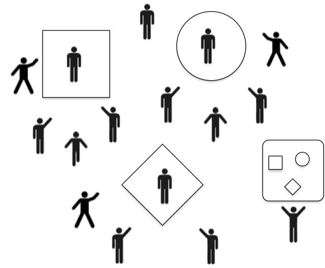

# What to Read? How Archivists, Professors, and Educators Cultivate Knowledge Terrains {#int}

#### Abstract {-}

(ref:abs-int)

#### Keywords {-}

(ref:key-int)

***

The question of what to read is simple to be sure, but in fields of scholarly consumption and production it is nonetheless fundamental. Scholarship is a creative profession where a stock of cultural knowledge forms a greater part of the infrastructure of production than in other fields. This is not to say that other occupations, especially manual ones, lack creativity. It is to say that in such fields knowledge has a limited infrastructure. Whereas the know-how of the brick layer is black boxed in her tools and technology and in the human capital she develops by experience and tacit social learning, for the scholar as bricoleur there exists in addition the distinctively overdeveloped feature of cultural archiving as a universal memory. Except perhaps in outstanding feats of primary research, contributions to scholarship are legitimate to the extent that they have used the archive correctly. This problem of using the archive, by which I mean all libraries and other organizations that help scholars find published work, is easily expressed by the question, "what to read?" Paradoxically, the over-development of the archive induces a functional imperative: to the extent that more and more of scholarship is memorable, mechanisms must develop to forget large swaths of intellectual history. A person who studied a random draw from the archive, even a monumental one, would no doubt qualify as an educated person. Professionally, however, they would have answered the question in a tragically wrong way. From the perspective of other scholars, there are right and wrong choices about what to read. Because it is so easy to access scholarly memory, the operative question really becomes "what not to read?"

Most occupations are not saddled with a heavy burden of memory, remembering in the fashion of a Markov chain only the most recent chapter in their history. Rather than in archives, memory is codified in tools and technology. Though Internet search and self-publishing services, especially video and image based ones, are creating archive-like infrastructure for even manual occupations, the functions are different. Contemporary Internet repositories provide knowledge as factors of production to anyone who queries them, but many do not purport to be archives in the sense that a historical record of cultural products is preserved for posterity. They are much more concerned with access to contemporaneous than to historical material, and indeed the particular configuration of the contemporary that sells the most advertisements ahead of search results. True historical archives of the Internet, such as the Internet Archive or Common Crawl, are not used by the public. Indeed why would they be; they expose the dizzying complexity of the history of the Internet, which, even in only its contemporaneous facet is already overwhelming. The Internet searcher tends to be satisficing, and the search companies have refined their ranking of results to meet their users' search budgets efficiently.

Searching and finding are different procedures; to search is to turn over every rock, whereas to find is to turn over only the correct rock. The searcher encounters many tricks before alighting on a treat, and must make an effort to reject the false positives. The finder exploits indexing technology that allows her to bypass the wrong material altogether. Without a normative compulsion to make history accessible, Internet search engines, which are actually find engines, avoid the scholarly paradox of memory, which is that in the university system great pains are made to remember everything just so that the correct material may be forgotten. Scholars do not yet have find engines that protect them from encountering irrelevant material, and it is a professional competency to be able to quickly separate wheat from chaff.

Whether the growth of the Internet will bring the wider world into the kinds of relationships with knowledge that have been developing for centuries in universities, or whether the Internet will be something entirely new, is not the task of this paper. Instead I speculate about how the fundamental problem of approaching an archive of ever-growing complexity is solved in ways that have surprising results for those whose careers depend on accessing it. I explore three different roles within institutions of higher education oriented to the archive and to each other: the archivist, the professor, and the educator. Along the way I will explore how the knowledge in the archive is used for purposes other than scholarship and education.

### Knowledge roles

I begin by outlining three roles within universities in an abstract way, that is, by drawing out their motivations and orientations toward knowledge as well as how those orientations condition the way that each relates to the others. While I will attempt to describe each role's myopic attitude to knowledge, which informs their daily work, I will also discuss the ways that their behavior sorts knowledge into patterns that then have effects on the knowledge environment of each other role.

The first of three knowledge roles is that of the archivist. The archivist is a knowledge distributor and orients to knowledge in an indexing capacity. Their role is to understand a lot of knowledge quickly and help match clients with knowledge problems to cultural objects in the archive that may provide knowledge solutions. The archivist’s interest in knowledge at scale creates a cognitive need for knowledge classification systems that work for a variety of clients, namely scholars, educators, students, and the public. The archivist is formally in a support role that is universalistic and bureaucratized, hence she operates as staff for other roles so long as they are following the rules. Informally, the archivist is wedded to the archive itself and may wish to educate people about its contents. After all, the archivist has especially broad knowledge to share beyond merely responding to client requests. She therefore may attempt to influence how other roles orient to knowledge from her own vantage point.

The second role is that of the professor. To profess is to "declare publicly". Because knowledge is a part of the status and the authority of the professor, they have an interest in maintaining its relative value against the people to which they profess, to their audience. The professor does not want to be supplanted by her interlocutor. She wishes to gather resources toward her, including audiences, and to maintain the attention of benefactors [@Gould2002Origins]. These resources are felt to be necessary for the economic work of scholarly production, or they are important to personal identity. The professor faces a moral hazard toward crypticism, and may not go out of her way to let the foundations of her knowledge transfer to her clients. She has a particular knowledge format that is a lean message of information that does not give away the farm. This is usually what her clients want.

The third role is that of the educator. Compared to the professor, the educator attempts to stand in a lateral rather than in a superior social relation to others. Whereas the professor attracts people toward her, the educator attempts to move with people often in a direction of their choosing. She maximizes knowledge transfer and seeks to obviate her role with a particular person, though her role also requires fresh inputs of ignorant laity. The educator always stands in a superior knowledge position; even if followers reach the point where the leader was, the leader may always be further ahead. Yet socially she attempts to project radically egalitarian, which is to say reciprocal, authority. The moral hazard of the educator is quixotism; the professor is much more savvy about how to create security and status out of knowledge and has a conservative orientation. The educator empowers the ignorant to choose where to invest their labor, and this may lead to tilting at windmills.

By professor, or professing person, I do not necessarily mean the job title in a university. To be a professor is to have a particular way of relating to knowledge and of using knowledge in relation to other people. Anyone can be a professor if they know something valuable; it is how they mobilize that knowledge in social interaction that makes them a professor. The same can be said, mutatis mutandis, for the other roles as well. Anyone who helps others index and locate knowledge is an archivist. Anyone who helps others reproduce knowledge is an educator. Because these are functions as well as job titles, anyone in a formal role may do each of these functions in a day, and what they do about knowledge will be a consequence both of the formal responsibilities of their title as well as the personal commitments they bring to their occupation.

These three role relationships are oriented not primarily to each other role. They are each constituted out of an asymmetry of knowledge and each role is a knowledge specialist. Instead they orient to people who know less than they do. In these roles the occupant accumulates knowledge in the course of their work, and their valued contribution involves the exchange of this knowledge for status and resources. What differs between the professor and the educator is how the knowledge asymmetry is exploited to maintain either hierarchical social authority (profession) or reciprocal authority (education) [@Parsons1970Age;@Gould1999Race].

In general, authority is the ability to transfer one's own goals to other people, that is, to induce them to act in a way that achieves your own priorities. In hierarchical authority such goal transfer usually goes from the superior to the inferior position. In reciprocal authority each party may at times lead and at times follow. Professorial authority serves to maintain a knowledge asymmetry because goals oriented to knowledge production are firmly in control of the expert. Rather than exchange factors of knowledge production, professors, professionals in general, wish to exchange a knowledge product for a reward, even if that reward is the mere maintenance of former status. In reciprocal authority an educator transacts factors of knowledge production across the boundary of their knowledge asymmetry, serving to erode the boundary over time.

It is again helpful to be reminded that a person with the title of professor may shift between hierarchical and reciprocal relationships. Because the causal axis relates to asymmetries of knowledge, professors may find themselves engaging in reciprocal relationships especially among peers with whom knowledge asymmetries are less pronounced. Regardless of the personal relationships professors seek out, they in fact possess knowledge in such relative abundance that any randomly chosen potential relationship will be asymmetrical, and were they to engage the relationship would be hierarchical.

(\#fig:profess)Professors maintain knowledge boundaries while archivists index them.

## Knowledge as password

My objective in describing the above value orientations to knowledge is not to make a moral argument; educational relationships are not more fair or just than professional ones. My concern is to elaborate the consequences for the cultivation of the knowledge environment given the knowledge transfer predilections of the different roles. Knowledge is not organized into one universal system of relevance. If it were, one would merely need to count how much someone knows and observe their value orientation to what they know to predict what kinds of relationships they would form with others. There would be one universal hierarchy with the most learned member sitting at the top.

In fact qualitative distinctions between knowledges make the picture much more complicated. Knowledges are like currencies in local economies; wealth in one market does not guarantee wealth in another market. The multiple centers of knowledge create the complicated system that ensures demand for the role of the archivist, not just to safeguard the historical record, but to transmit and communicate knowledge indices that help all members of the knowledge environment locate themselves. The topology of this multiply epicentric knowledge space is the world within which all knowledge workers live.

What I wish to argue is that it is the behavior of professors in particular that maintains the shape of the knowledge space, that is, that makes it more multiply epicentric and fractured than it might otherwise be if education were historically dominant. Of course professors are not trying to landscape a global knowledge space; they are trying to do their work of knowledge production and of securing the resources necessary to keep doing that work. But in doing this work they are continuing in a long tradition of other professors who have had a systematic interest in maintaining knowledge asymmetry, since this worked to their advantage most of the time. Professors whether they are reflective about it or not occupy knowledge settlements that are adapted to maintaining the boundaries of knowledge that are constitutive of scholarly subfields. By way of example, I will concentrate on one mechanism, the password system, that maintains and exploits these knowledge boundaries. I will then provide an illustration of the global knowledge terrain that passwords and similar mechanisms create.

Though cultural abundance may be cultivated on the universal egalitarian grounds that knowledge be made accessible to all, the complexity of the archive creates an opportunity for the establishment of social hierarchy. Because the archive's size so wildly outstrips individual and organizational capacities to know its contents, methods of selection become paramount. Indeed the power to control what counts as a legitimate selection becomes a basis for authority and the conferral of status. Status reflects a person's generalized ability or inability to accrue resources to herself over the claims of others. Social institutions define the conditions of status attainment, and different institutions validate statuses according to different norms, truths, and values. Knowledge as a valued resource mediates social relationships and stabilizes status hierarchies differently in professions than in education. The stability of status hierarchies depends on a qualified segregation of these institutions, as the norms of one can be corrosive to the norms of the other.

In the cynical view of professions, scholarship is the encryption of memory by secret sets. If each field of professional scholarship is a club, their passwords are particular lists of items from the archive. Comers arriving with off-list items or without enough of the correct items may be held at the door, or if they are given entry, will be marked with a scarlet letter. To say that the password items are the only ones relevant to knowledge in the field is incredible; the depth of the archive always impresses even the most experienced divers. The importance of the list is not only in its knowledge potential but also in its exclusionary function. Knowledge of the list is a qualification, ignorance a disqualification for club membership.

Why check qualifications at all? The archive, in rendering knowledge accessible and transparent, obviates a conventional function of professions which is to restrict their ranks by controlling access to secret knowledge. If the knowledge is not secret, a field must find other mechanisms of exclusion to establish itself as a profession. To make matters worse, the university contexts in which scholars work tend to confront them with a public and to impose on them a duty of education or service. Professionals who are embedded in markets trade the products of their capacities, goods and services, for money. Their clients have no serious interest in acquiring the professional's capacity to produce, and this inscrutable cognitive base [@DiMaggio1983Iron\:152] constitutes the client's experience of the professional's expertise.

Scholarship is based in the university and not in the market, and here the value orientation to knowledge is very different. Professionals default to entering into client, rather than peer, relationships. The scholar's "clients"--students, the public, and other scholars--may be as interested in the production as they are in the product. From an intellectual property perspective, "ideas are strongly nonrival (they are not used up) and only weakly excludable (they are difficult to protect from use by others)" [@Thompson1995Conceptions\:278]. Because educational commitments promote the free flow of ideas, knowledge qua knowledge cannot be the basis of professional exclusion within an institution designed to diffuse it.

The use of knowledge for the effect of exclusion should not be overstated. If a scholarly field is considered to be a profession within itself, it has an interest in controlling who it lets in and who it keeps out. Thus an exclusion mechanism is always also an inclusion mechanism. To emphasize exclusion is to recognize that this is the more important function given the asymmetries of scale scholarly fields face in the university environment. The scarce resources they have acquired, both in terms of a core of symbolic knowledge and in real employment opportunities, compared to the sheer size of social and cultural solicitors, means that most of the work is to keep people and ideas outside of the boundaries of the field. If they do not, they risk losing control and invite revolutions. Exclusion is thus not meant in a pejorative way; indeed incumbents in professions who find the notion of exclusion distasteful may be surprised to nonetheless discover that their fundamental orientations toward knowledge have exclusionary effects whether they are intended or not.

How then does the password system work as a membrane around scholarly subfields? First, knowledge qua password is arbitrary with respect to content, because club knowledge is not necessarily better quality than other resources made accessible by the archive. Whereas in unarchived fields knowing is enough to gain club membership, archived fields require a substitute exclusion mechanism to safeguard hierarchy. This explains the prominence of priority in the attribution of discovery over the mere fact of possessing knowledge; yet priority defines hierarchy internal to professions and would be overkill in defining the external relations of the profession. Simply, members of a scholarly field need not have invented knowledge to use it to assert their membership status against nonmembers. But the question of knowledge quality, why club knowledge is not substitutable for other available knowledge, is a constant erosive force against the club's foundation. For the more status insecure in the profession, pride in ignorance of foreign content becomes a weak value to paper over the contradiction, whereas the status secure, who have enjoyed better employment contracts and more time to explore the archive, understand that forbidden fruit are in fact interesting and no real threat to them.

Second, this constant need to build redoubts against deteriorating club walls exists only because scholarship has, in the United States at least, been embedded in educational networks whose value orientation to knowledge opposes that of professions. One modification of professional esotericism is that the passwords are a group secret, which means that anyone who knows they exist can find them out, master them, and gain club membership (if not club rewards). This satisfies the openness required by universalist educational values. To satisfy the closure required by the professions, password mastery must have nontrivial costs. In making the password mandatory clubs construct excludability in an arbitrary set of ideas whose components are not naturally excludable. This encryption cost, like the blockchain, makes the detection of fakes easy while creating trust between incumbents and the newcomers who pledge to honor the prior commitments of the field.

The password is not, however, a shibboleth. A shibboleth is chosen arbitrarily such that the people who are targeted for exclusion are incapable of meeting the criterion. The use of a password that Jews could not pronounce in ancient times, or the job qualification of a high school degree that blacks did not have in more recent times, are both examples of shibboleths used to explicitly target particular groups. The knowledge password system is not so extreme; its function is to both slow the trickle of resources across club boundaries and to compel solicitors to demonstrate a commitment to club values before gaining admission.

Still, the tolerance for exclusionary behavior is relative, and any degree of exclusion may raise the hackles of educators. The password structure perpetually faces destabilizing threats. The entropic force of the archive has already been mentioned, which by itself stresses scholarly boundaries because anyone can acquire expertise independently of professions and then use that to make claims on club goods. <!--Clubs are able to deflect these claims only when the symbolic value of the password is not deflated.--> The other destabilizer is educational values, which mandate that rewards accrue to mastery of process (learning) rather than mastery of products (knowing). Educational values are equitable and universalistic and therefore delegitimize all nonrandom exclusion mechanisms like the password system. But when compromised by professional values education merely requires scholars to reduce the costs of password mastery by forcing investments in pedagogy.

If they were ever able to dominate professions education would force open club boundaries and destroy field cohesion. Defenders of professions would label this a situation of hackery, while detractors would contend that it would still be productive to resource people with idiosyncratic knowledge bases, i.e. those who eschewed the password system. When education and profession are in balance, the password system integrates the conflict between them, forcing some egalitarian openness to replenish the ranks of professions.

### Knowledge as influence

This functioning of the password system is not how it is experienced by people. Phenomenologically knowledge templates are not viewed as arbitrary but are rather shrouded in a reputational aura. This aura is manifest as a taste for scholarship. To be professional is to trade in status, to know what are the tasteful combinations of resources. To be a successful professional is to never have wasted time tasting forbidden fruit. It is the laity who bear the brunt of the exclusion mechanism, while clergy who have long ago armed the traps spectate. A lay seeker approaches the academic archive and at great cost of attention plumbs its depths for enlightenment. The archive's complexity dooms her to check out a curriculum so hopelessly tacky that it will only certify her lay status. In her humiliation she feels a deep injustice that her knowledge is not recognized. A different seeker with guile enough to learn the password first plumbs only the relevant parts of the archive, and upon mastery enters the social compact with incumbent professionals. The two seekers stand next to each other but on either side of a gate. That they are equally educated is clear, but their paths at this point will diverge, one toward the interior of a profession and the other into the wilderness.

In this fable the archivists themselves are tragic figures, stretched as they are between people who profess (declare publicly) and people who educate (lead out). Librarians much prefer to help laity who in their tastelessness welcome guides who will lead them through the grandeur of the archive. The archivists gifted scholars with access to an immortal memory, and looking the horse in the mouth scholars made rules to protect themselves from the responsibilities of using most of it. Paradoxically, in taking the burden of memory off of the shoulders of scholars, thereby freeing them of the pain of legacy suffered by other artists [@Lang1988Recognition], librarians created a maze of knowledge in which clergy could trap laity.

These rhetorical flourishes are meant to illustrate the socioemotional attitudes that actors in competitive fields have due to the mobilization of knowledge for competitive purposes. The feeling of security in one's status is itself a social construction. The successful mobilization of knowledge as a resource for intellectual production is not quite the same process as the mobilization of knowledge for career success, though the two are linked. Often it is necessary to win a confidence game against competitors to acquire the resources necessary to do scholarship. The password system is merely one version of this game.

The password system and all other confidence games that deploy knowledge for competitive purposes are members of a theoretical class that  @Parsons1963Concept called influence. Influence is generalized knowledge-based authority. It is a symbolic medium of communication like money, which represents a value without being the value. Symbols are more easily transacted than the real resources they represent, and they allow trades to be constructed as social commitments before real resources are mobilized. The password list is a symbol of a supplicant's capacity to uphold genre conventions and safeguard the status of a field, a promise which they aim to transact for access to real resources, namely employment, in a scholarly profession. The mastery of a harder list is like possessing more money; it helps potential sellers rank who they wish to do business with.

Like money, influence is subject to inflation (requiring a candidate to know even more than the password list) and deflation (being unimpressed no matter how much a candidate knows). Importantly influence is not reputation; it is a feature of the status of the field rather than the status of an individual. All knowledge holders transacting with a club will be similarly affected by inflation or deflation of the field's influence.

There are many more varieties of influence operative in scholarship beside the password system. One of the features of symbolic media is the displacement in time between acquisition and possession. A coffee paid for is socially acquired while one waits for a barista to finish pouring it. In scholarship knowledge tends to be what is transacted, and as with consumer goods, knowledge can be socially acquired prior to its possession. The reputed meaning of texts is an example of acquisition (understanding) without possession (reading). Though above I went to great lengths to argue that the archive is an amazing institutional memory, library technology may paradoxically make it easy to forget scholarship [@Cevolini2016Forgetting]. A scholar who is confident that knowledge is safely protected in archives and who believes that it can always be accurately retrieved is relieved of the urgency of digesting it now. Punting on understanding *from* texts opens space for exogenous understandings *of* texts.

Contemporaneous cultures and societies constraining the reader prejudge the meanings of texts. While scholars genuflect to a quest for truth, the practical incentive to minimize time spent reading leads to several methods of collusion in the reduction of texts. As has been discussed, any text that can be commonly declared irrelevant need not be bothered with it all. Second, a text need not be read to be understood, as their meanings may have a common sense. Texts have reputations and reputed meanings. These reputations like those of people stand in for the real thing in scholarly discourse. These mediated versions of the truth act as promissory notes in scholarly transactions; where the reputed meaning is accurately conveyed the issuing party is given credit for knowing the underlying truth, without burdening the transaction with a test of the truth, a discussion of a text's content.

Like all symbolic currencies, the pace of commerce quickens where the symbol of the good is exchanged prior to the good itself needing to be mobilized. A utility of reputed rather than real meanings is to save scholars from the existential crisis besetting them: the pace of the publication of scholarship has long outpaced anyone's capacity to read it. Reputed meanings allow for the accumulation of a greater body of understanding than would be possible if texts were studied directly. When taken to an extreme this becomes a collective collusion, a stereotype, in which a fairly thin reputation may stand for a particular text without anyone ever demanding to see the goods. The deflation of a reputed meaning is to demand that a person wielding it perform an extra feat to demonstrate that they have command of a text's contents. Like any status challenge the target will pay the debt of their knowledge or ignorance with a credit or debit to their own reputation.

Taking another step down the collusion path, professions may violate educational norms by trading in reputed meanings rather than direct readings of texts. This is an encryption of their meaning that works exactly as the password. Only members of a subfield may understand the reputed meaning of a text, who in clerical fashion would deign to humiliate a lay person who studied a text outside of the cloister and claimed to know something about it. Parsons would call the factual reading of a text its intrinsic persuasiveness [-@Parsons1963Concept\:48], a value that is put into forbearance when it is symbolically exchanged. If a reputed meaning is elaborated for the sole purpose of esoteric exclusiveness, and the reputation diverges enough from the truth, the colluders may expect to receive status challenges asking to demonstrate the real value of the knowledge. If they fail such tests it will harm their own reputations. Such a scenario is very likely where professional arenas, which demand high volume trading of texts, intersect with educational arenas, which require closer attention to fewer texts. Textbooks, catalogs of knowledge products without their attendant knowledge factors, contain nothing but reputed meaning, and therefore represent a good example of a professional rather than an educational approach to teaching.

## Knowledge terrain

At this point I have discussed organizational and interactional processes that play out in the social arenas of higher education. At every juncture knowledge is a key element to the constitution and operation of these relationships. What I know seek to do is paint a landscape of the global consequences of such actions. The work of generations of archivists, professors, and educators has organized knowledge into a particular pattern that I call a knowledge landscape or terrain. It is a map dotted with social settlements, but the ground beneath them is a pattern of knowledge codified in the archive and then related in chains of association. The particular associations are the social value of the knowledge that is safeguarded by the creation of settlements. What this means is that the shape of the terrain is sculpted bit by bit over time. The shape is not necessarily implied by the content; rather the content has effects on the knowledge workers who integrate that content in ways that solve problems of knowledge qua knowledge but that also solve problems of knowledge qua social resource.

Figure \@ref(fig:kcc2tree) illustrates how knowledge settlement sculpts a terrain. The map is an aggregate representation of the co-citation network of several journals in anthropology and sociology as recorded by the Thompson Reuters Web of Knowledge database. I will not address the methodological challenges of constructing the map except in one respect. The elements of the map are the reference lists of individual articles each represented as a clique network among the references on the page. One may imagine that a single article's reference page is like a woven doily with each reference tightly connected to every other reference. When an article shares some references in common with another article, their reference cliques overlap. By overlapping an entire population of such reference cliques, a gigantic network may be formed.

This giant network represents the domesticated portion of the archive. These are the elements of the archive that have been selected by professors to be used as factors of production in the creation of new knowledge. It represents only a portion of everything that is available, as the items in the archive that were never cited in another person's work, and are therefore not contained on any reference page, are not a part of the giant network.

In terms of the theory outlined above, the reference lists are an individual author's statement about what knowledge is relevant in the creation of new knowledge. In isolation these lists may be merely idiosyncratic, as one person's opinion about what counts may very considerably from another's. However in combining each individual statement of importance, it is possible to see where consensus has emerged. The more particular combinations of references are used the more a social group centered at a particular knowledge location forms. We may predict that these centers are the locations where knowledge settlements, scholarly disciplines and subfields, may be developed.

What the enclosing circles in the figures represent is a mapping of potential knowledge asymmetries around which social settlements could be erected. Recall the idea above of a club of professors who use a password to control entry to their field. The password was a list of items about which all members must be able to demonstrate knowledge. Imagine that the club has a fenced yard around it. The club has a policy that to get through the gate into the yard, one must master a list that is 10 items long, but to enter the club one must master that 10 item list plus another 10 item list. Anyone who had access to the club would also have access to the yard, but not the other way around, and the yard would never have fewer people allowed in it than the club.

The enclosing circles on the map are all of the locations within the reference landscape where a password list of a particular length, call it the password strength, could be written. The largest exterior circles contain all of the references that could be combined into a password of a length of two, that is, that on someone's reference page somewhere a particular pair of references can be found. As we increase the strength of the password, the number of references that are found in a combination of that particular length is reduced. Imagine that if we took any random pair of references, there is some chance that they were cited together at least once. If we took any random triplet of references, we would expect that the chance that all three were found on a reference page would be less than a random pair. As the requirement is increased the number of references that satisfy it is reduced. We would find that if we set a requirement that a list have ten items, that of the combinatorically massive number of possible combinations of ten items taken from the whole population of cited work, that only a very small fraction of those sets would have ever actually appeared on a real reference page.

(ref:kcc2tree) Overlapping reference cliques as knowledge terrain of selected social science journals, 1900-1940. Brighter colors indicate larger numbers of contributing bibliographies, with gray indicating only a single contributor. [*Interactive pop-out.*](exh/kcc2tree.html){target="_blank"}^[Or try its well-hidden [interactive easter egg](exh/isl3d.html){target="_blank"}.]

(\#fig:kcc2tree)(ref:kcc2tree)

Some features of the map may be highlighted. The sample includes articles from journals in four disciplines, anthropology, sociology, political science, and economics, from 1900 to 1940. The convention of common referencing, and of long bibliographies generally, is more advanced at this time in sociology, giving it an outsized importance here. The top right cluster is an economics grouping, and other disconnected economics bubbles surround the main feature. In the north are a few political science groups. The majority of the structure, however, is shared between anthropology and sociology. The three mid-sized circles in the center of the largest formation represent two sociology fields and one anthropology field. One sociology field (the upper left) includes topics concerning education and psychology, while the other (upper right) is composed of general sociology. The lower bubble is the whole of anthropology. These disciplines are linked by some shorter exchanges between them, whereas there are no links whatsoever to either political science or economics.

What the map shows is that in social science history scholars developed long lists of references in common (the more interior circles) in only a few locations. These I argue are the most likely locations for social settlement of the knowledge landscape, that is, there is a "natural" knowledge asymmetry between the interior and exterior of the circle out of which a password could be formed and knowledge based exclusion enforced. Though the map is generated with real data on historical journal articles, it is meant to be illustrative of the theoretical claim, rather than an empirical test. For one, this is just a map of the knowledge itself, and there is no measurement of social settlements, the actual professional scholarly subfields and their organizations, that are predicted to exist based on the capacity for exclusion implied by the graph.

## Generic isomorphism

I have argued that the organization of knowledge into a complicated system of multiply epicentric disciplines and subfields is not only driven by the relevance of knowledge for the resolution of different intellectual problems, but that it is to a greater or lesser extent also driven by the resolution of the very social problem of maintaining group identity within scholarly fields. Professors guard these boundaries because their livelihoods are predicated on the existence of knowledge asymmetries. Educators erode them because their livelihoods depend on releasing knowledge to wider populations of learners. Archivists index them in order to serve as many interest groups as they can. The result is a relatively slowly evolving knowledge landscape that nevertheless develops stark topological features in time. None of these actors really has much of a reason to notice the wider knowledge landscape, and indeed it would be very difficult to achieve such a vantage point. Rather they are concerned with their local perspectives in the landscape. They are oriented to their knowledge work, and to the particular role relationships and the technologies, like the password list, that are used to enact and maintain those relationships.

There is one big exception to this rule of myopia, and that is the question of scholarly genre. Genres are classification systems held in common by all role incumbents. They are a form of ubiquitous knowledge that is the closest thing to a naturally occurring map of the field. In one sense the archivist is the guardian of the genre system and exploits it to develop indexing systems that actually work, that match likely requests from stakeholders to the actual content of the archive. But archivists do not invent genre labels, and neither does anyone else for that matter. They are a Wittgensteinian outcome of a long history of language games occurring among generations of role incumbents.

My theoretical ambition is to develop a perspective that does not reify the existence of genre categories, but rather seeks to explain them historically. To do this it is necessary to develop knowledge mapping techniques that are able to provide an independent basis for mapping the structures of knowledge as the are manifest in cultural archives themselves. The genres systems in existence during particular epochs cannot be taken as the truth on the ground, but are rather the outcomes of processes of social construction that are the true explicandum for sociological research. One might expect sociologists to have unique insight into the operations of a system they themselves inhabit, but on the contrary like all people who enact social structure their scientific understanding of it may collide with their successful performance of it.

I wish to conclude with a characterization of how the password and genre systems are actually experienced by people, and how little opportunity is ever given to reflect on or to imagine how their orientation to knowledge could be different. Let me begin again with the question that concerned me at the outset, how do scholars answer the question of what to read? I will show by illustration that the answer appears to depend very little on the topology of the knowledge landscape, and much more on the dynamics of the role relationships scholars must enter into. The landscape however is an ever present grounding on which the quotidian problems of scholarship play out, and often the knowledge must be present in its particular form for it to be exploited for actors' narrower interests.

Notwithstanding its knowledge-agnostic role in reifying social hierarchy, the password list is one answer to the question of what to read, and the rules for putting the list together are not entirely arbitrary. There are tacit conventions that both legitimate the password list within the profession and make it possible to recognize whether newly encountered work is relevant to the field. The password list answers the question of what to read only in a very narrow sense that guards the exterior of a scholarly field, the relationship between clergy and laity. Given password mastery, how then do professional scholars know what (not) to read as they extend the field while avoiding an internal erosion bubbling up from their own scholarly creativity? How do dislocated scholars coordinate their activity so as to produce self-similar work in the interests of the profession? There are several formal and informal structures that facilitate and compel scholars to make the same choices about what to read.

An obvious one is the supposed normative isomorphism of graduate program syllabi, which act like secret maps to navigate the archive. They are secret because they are not distributed freely by archivists but are rather cloistered within majors. These syllabi may or may not also teach the password of a field, a fact that may be difficult for students to discern. Universities tend to grant great autonomy to professors in writing syllabi, who in the course of their professional travails may not be given opportunities to read what they want. In being forced to carve out time with subordinates, faculty are caught between personal indulgence and a more or less strongly felt fiduciary responsibility to set students on the correct path. Students, having at most a weak basis for discerning whether a syllabus serves their interests or not, would have little recourse but to trust faculty even if that were not already built into the role relationship. If we have less than perfect faith in the strength of educational ethics among faculty, then we should expect that among graduate syllabi are many lists of what not to read. Students who trust too much in the formal curriculum may be lead astray, and even without trust, they may still be left ignorant of where to invest their labor.

In each graduate program there then must be a hidden curriculum, a map of the archive of higher quality than the formal syllabi. Where would such a curriculum be obtained? The provisional answer is that in the informal spaces of graduate programs knowledge of scholarly genre is learned from extracurricular engagement with professional conferences. It is in conference programs that the tacit rules of academic genre are learnable. These genres form the first parsing of the archive for neophytes. Indeed at the most generic level graduate students, if they are confident enough to locate themselves quickly, develop a taste for what not to read. Genre as the foundation for a taste for scholarship serves to restrict a student's wandering to a delineable sector of the maze. If they can develop this proto-taste early enough in their careers, they will be armed with the stereotypes necessary to stop reading the wrong and start reading the right material. While this is not enough certainly to make clergy of laity, it is the first step.

Genre is the tacit essence of the password list, the interpretive code that is the taste for scholarship. Genre rules may be difficult to describe explicitly, and it is easier to argue about whether particular cultural items (ever available in the archive) are genre conforming or not. Genres bear labels that are too easy to reference, and when it comes time to describe their content it is those particular items whose classification status is unassailable that will serve to represent genre content, paradigms in the pre-Kuhnian sense of a primitive standard against which others may be compared.

The indulgences of syllabi are pejorative only in the sense that they represents genre nonconformity. Indeed scholarly indulgence may be educationally beneficial to students even while it is, as an opportunity cost, professionally wasteful. The opposite of generic here is not specific but rather idiosyncratic; a species has a known genre classification, whereas idiosyncrasy is unclassifiable, or at least unclassified. Indulgent idiosyncrasy, for instance the reading of a great book of a bygone era, may be very interesting especially when genre conforming content is boring precisely because it is generic. Yet for all its charm idiosyncrasy, if it cannot be accurately classified by professionals, does not advance professional interests. Students who wish to be educated may enjoy it, but those who wish to be professionalized ought to avoid it. So there is indeed a correct way to approach the archive, correct in the sense that certain draws establish eligibility to access scholarly professions. The reward relevant to neophytes is access to the first job, which if it can be secured grants access to facilities and some scope for indulgences.

This is not to say that students must directly encounter conference programs to learn genres. Genres may be communicated as stereotypes within local departmental codes and discourses. Such local cultures may either proudly or unwittingly contradict national genre standards, yet they will face perennial alignment challenges when departments interview candidates for jobs. Candidates have tailored themselves for a national market and will likely resemble the national genre code (that of our professional conference). Even if a candidate prepares a version of herself to convey the right "fit" in a particular locale, her actual scholarship will likely have been prepared for the generic rather than the specific audience. Thus while it may seem that the job holder would take priority over the job seeker, both contest and contestant have conditioned their expectations to maximize their appeal to as broad a field as possible.

The maximization strategy is simple: conform to the national genre system. The power of genre is this regulation of expectations across the supply and demand sides of the market. If either the local departmental culture or the candidate abrogates the national genre system with an indulgent idiosyncrasy, an exchange that would have been mere performance will devolve into a status challenge. The ornery party will have deflated the discursive potential that genres enable and will have raised the hackles of its interlocutors by requiring additional effort to recognize the unlabeled work before them. This cognitive tax created by the defiance of genre will need to be paid with a loan taken using one's reputation as collateral.

The abrogation gambit is as risky for the contest as for the contestant, but to call it a gambit assumes a high level of sophistication. At one level genres are the most accessible form of knowledge in a cultural field. Everyone may know that classical is a genre of music without knowing much of anything about classical music. Knowing the label is the primitive form of genre knowledge; knowing how to categorize a particular unlabeled cultural object the next most primitive, and so on through gradations of knowledge that at the most advanced level reflect a performer's ability to strategically mobilize genre conventions to control an audience's experience. Nonetheless, the reputation sanction for genre abrogation will be assessed regardless of whether the performer colors wittingly or unwittingly outside of the lines.

Several fields of scholarship apply the term genre to describe or explain variations in content in other fields of cultural production, most commonly in literature and music. Though genres are commonly accepted to be classification systems in particular cultural domains, their ontology and hence validity tends to be assumed rather than demonstrated. Given fields of cultural production and consumption (or poiesis and esthesis depending on one's discipline) that are prolific and innovative, one would expect genres to be soluble. In fact they are highly durable. The disciplinary structure of higher education offers an example of one of the more durable cultural classification systems. This durability of disciplines, this gelling of genres, has a force that is as powerful as it is difficult to explain. In this essay I have attempted to locate that durability in the structure of knowledge itself as it has been cultivated over generations. What is remarkable about the structure of this knowledge is that the mechanisms of exclusion that are enforced with and around it are not required by the knowledge itself. The great promise of the archive is the ability to combine knowledge in any way a seeker sees fit. The social structures within which access to the archive is organized have the curious effect of making it seem like most of those combinations are impossible.
