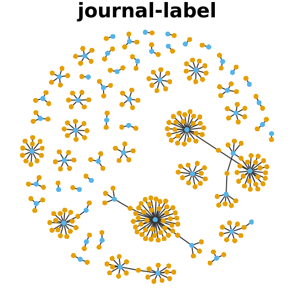
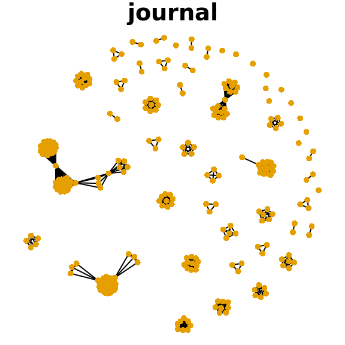

# Social Science Disciplines Today {#dis}

#### Abstract {-}

(ref:abs-dis)

#### Keywords {-}

(ref:key-dis)

***

The classification of cultural products according to genre systems has been treated both as a top-down institutional process conditioning the development of entire markets [@Lena2008Classification; @Brook1994Symphonie] and as "nothing but" an emergent, bottom-up process of individual acts of labeling and interpretive judgement [@Lamont2010How; @Hitters2010Tune]. A middle range approach requires understanding how actors distributed across the roles that constitute structure, the top down perspective, make local judgements that either do or do not have global consequences. The idea of genre as a cognitive institution that is diffused across a wide variety of actors gives the appearance of a cultural integrator, something given in the environment of all actors and not controlled by any of them. Players on fields of cultural production regardless of their role or status are, like price takers in a market, cultural name takers. Once genre labels are established they are immutable and given as terms in the language. The content to which they refer, however, is historically variable and debatable.

The explanation of how genre labels and the content to which they refer develops over time requires a mapping of the structure of genre labels at particular moments. In this study I estimate a mapping of the cognitive associations among genre categories of scholarship according to one interested role position in the scholarly field of cultural production, the archivist. Archives play a constitutional role for scholarly fields, forming a necessary infrastructure for scholars' work, but scholars are not the only interests served by archives. Students and educators as well as the public also draw on knowledge resources contained in the archive. To make this knowledge accessible archivists use genre classifications to organize content. The classifications meet the practical needs of serving both the producers and consumers of the content. The granularity of the classification system that would be useful to producers is, however, much finer than what is useful for consumers (note that the same item may either be factor of production or a product). The bias of the archive skews toward the courser grained consumer classification system in part because the needs of producers are highly idiosyncratic, shifting, and difficult to predict.

Producers tend to dismiss the consumers' ways of thinking about their field, but there is one situation in which producers are reduced to consumers; in scholarly professions the coarse version of classification is a communicative infrastructure for foreign correspondence. These coarse categories are what we call disciplines. Disciplines are nothing but a genre like classification system; they are merely integrative of global transactions among scholars at a distance and between scholarship as a whole and its macroscopic interlocutors, namely education, grant making, and university administration. Thus when scholars view content situated outside of their local epicenters of research, they necessarily shift from fine to coarse grained judgements. This switch on the tracks may be jolting, as it connotes what they feel to be a demotion of their usual status.

(\#fig:fractalp)Fractal Evaluation and Commensurated Scale. Adapted from Abbott (2011:11).

Facing inwardly, producers deploy value standards rather than classifications. In their own field, scholars grant themselves moral and aesthetic authority to judge the quality of content. In communicating outside of their field, where they have no jurisdiction, assessment of cultural items becomes value neutral, a mere matter of taste. Such internal values may even be simple dualisms compared to the more complicated disciplinary categories, but rather than creating simple genre-like schemes they create scales of gradient evaluation. @Abbott2001Chaos shows that these scales, for instance from idiographic to nomathetic, are established by the accumulation of simple judgments by separate individuals in the direct and often pairwise comparisons of discrete works or authors. This pattern of evaluation is chaotic and produces a fractal organization of content with only approximate correspondence among judges. Though Abbott [-@Abbott2001Chaos\:14] suggests that these fractals are irreducible to simple one or two-dimensional scales, it is likely that the chaotic outcomes are collapsed into a reified commensuration standard when facilities and rewards are distributed [@Espeland1998Commensuration].

Disciplines are much more like genres than the constellation of fields and subfields that scholars may be accustomed to thinking with in the course of their work. Genres function to the extent that they are globally recognizable, that is, ubiquitous. Ubiquity means that all members of a field regardless of status are able to learn enough about the genre to make accurate classifications of cultural objects. This does not mean that everyone will always necessarily be aware of all genre labels, or that their classifications will always be accurate, but it does mean that they will be able to learn the rules when it becomes necessary. Subfield categories are not ubiquitous in this way; subfield labels only become genre-like by restricting the reference group to a more esoteric level. Whereas all members of a university, for instance, may easily become aware of the discipline of sociology, written as it may be on a building, only disciples of sociology are likely to become aware of the subfield of conversation analysis. And while disciples may learn the label, it takes some real experience with the content of the discipline, if not necessarily the subfield, to understand that conversation analysis is more qualitative than population research and more quantitative than ethnography.

In this way the classification schemes are nested in a functional hierarchy that shifts according to which role relationships are activated in the field. The more fine grained distinctions among genres are derivable from the collapsed fractal patterns. The highest level of granularity one is able to discuss may be a status signal of where they belong within a disciplinary stratification system. Furthermore the interactional capacities of disciples are nested. Denizens of more interior spaces in a subdiscipline, the spaces of fractal evaluation, are always able to operate successfully in more granular interactions, but the reverse is not true.

<table style="text-align:center"><caption>(\#tab:role-schema)<strong>Classificatory Schema by Role Relationship</strong></caption>
<tr><td colspan="4" style="border-bottom: 1px solid black"></td></tr><tr><td style="text-align:left">Accessibility</td><td>Schema</td><td>Ego</td><td>Alter</td></tr>
<tr><td colspan="4" style="border-bottom: 1px solid black"></td></tr><tr><td style="text-align:left">esoteric</td><td>fractal evaluation</td><td>scholar</td><td>scholar</td></tr>
<tr><td style="text-align:left">.</td><td>genre class</td><td>scholar</td><td>student</td></tr>
<tr><td style="text-align:left">..</td><td></td><td></td><td>publisher</td></tr>
<tr><td style="text-align:left">...</td><td></td><td></td><td>archivist</td></tr>
<tr><td style="text-align:left">....</td><td></td><td></td><td>department</td></tr>
<tr><td style="text-align:left">ubiquitous</td><td>discipline class</td><td>scholar</td><td>administrator</td></tr>
<tr><td style="text-align:left"></td><td></td><td></td><td>public</td></tr>
<tr><td colspan="4" style="border-bottom: 1px solid black"></td></tr></table>

Everyone starts at the more ubiquitous level. It is only through education or professional socialization that newcomers can learn genre classifications, and most members of the public will not even be aware of the disciplinary categories of academic knowledge. The genre system sits in a more optimized relationship between descriptiveness and stability. The disciplines only change a glacial pace, while the genres are stable enough to maintain relevance for entire generations of scholars.  The fractal patterns are so granular that they may not even survive in the memory of a particular person over the years. In its constant interaction with the chaos of actual knowledge production, the genre system provides a more stable medium that is open to change but not so open as to risk dissolution. Scholars may complain that their work is not adequately represented by the genre system, and if enough make the same argument, the genre system may update to allow a wider audience to recognize the novel work. This is not to say that the work need actually be novel. As Abbott observes, each generation of scholars tends to cycle through forgetting and then reinventing the knowledge it had just cast aside [-@Abbott2001Chaos\:24].

The level of disciplines reformats the interaction of fractal evaluation and genre codification, just at a higher resolution that is oriented to the external relationships of the university. Where knowledges are separated by great cultural if not necessarily semantic distances, such as for instance the divide between biology and sociology, scholars in distant disciplines may not have much better knowledge about each other than a random member of the public. Disciplines emerge at a societal scale in a way that lets the university enter exchange relationships with government and the economy.

This definition of discipline is isomorphic with that of genre, in that disciplines are another form of categorical decision making, just at a higher level. Disciplines are supergenres that reflect the nesting of categories. In music Lena and Petersen [-@Lena2008Classification\:698] have followed Ennis [-@Ennis1992seventh] in referring to supergenres like rock-n-roll or rhythm and blues "streams", which are genres linked in time by any of a number of contiguities, e.g. sound, scene, artist, or market. What may distinguish disciplines in a more serious way is the institutional underpinning of the category. If genres are formed by the categorical thinking of disciples, disciplines are formed by the categorical thinking of patrons, the powerful actors like university administrators, state legislators, and grant makers who manage the economic foundation of scholarly careers, as well as the elite disciples who interface with these stakeholders. Where genre labels are inscribed onto cultural products, texts, discipline labels are inscribed onto cultural infrastructure like funding lines, buildings, and personnel themselves.

The uses of genre labels are themselves systematically organized by discipline, and a disciple who is adequately trained will know the correct ways to use genre labels in her local context. To use genre as a disciplinary convention means to first identify your location in the disciplinary field, and then to accept the limitations on scope by excluding knowledges and relationships that are extradisciplinary, that is, irrelevant. Disciplinary structure reduces the true cultural complexity of the entire genre system to a restricted form of local relevance, which in turn allows humble knowledge workers to engage upon a set of shared assumptions. Such simplicity begets new complexity as disciples spin out the consequences of their local use of genre.

The genres are also economic principles helping to organize supply and demand within internal scholarly markets for cultural products. There actors see genres among the borders between economic, social, and cultural uses, as a market category helping them acquire or produce content, as a card in proximate games of prestige, or as something to taste, to consume and enjoy directly. Publishers and journal editors leverage genres to help producers and consumers find them, as proclaiming a venue's genre identity is the cheapest way to advertise. Still, journals must also contend with the fractal evaluation of producers, and this may lead to creative positioning within the genre system if not usually the disciplinary system. As a way to signal that they are not merely generic, which is to say boring, a journal may position itself between rather than squarely within genres. This kind of recombinant innovation maintains the stability of both the genre and the discipline systems while at the same time opening up space for the fractal distinctions to work themselves out in creative ways [@Vedres2010Structural;@Gitlin2000Triumph].

What I seek to accomplish in the remainder of this study is to understand how the global disciplinary structure is reflected in the indexing behavior of archivists as they attempt to locate journals within a given classification scheme. Archivists have an important role is distributing the classification system and regulating it across a large population of knowledge seekers. While they do not author the discipline categories they do provide the an infrastructure that facilitates their taken-for-grantedness. In attempting to understand how a particular item of cultural content fits into a classification system, their only degree of freedom is to apply multiple labels to the item. This turns a binary distinction, is this item discipline-relevant or not, into something more nuanced, this item is partly relevant and partly not.

I use the JSTOR archive as a case of the work of archivists to index cultural material in a way that is useful to consumers. This requires making classification decisions about underlying items. In this case they make decisions about which discipline, which they call subjects, particular journals belong to. And to make every journal fit, they may apply multiple labels in an attempt to cover the content of the journal in a parsimonious way. By observing how the patterns of multiple classification are organized we can see how the disciplinary classification system is adapted to meet the requirements of more granular levels. Rather than marking boundaries of strict relevance, what we will find are regions of proximity within which partial relevance is established. This allows scholars to be innovative without losing their grounding in the discipline system. And for journals who have an interest in stable reproduction of scholarly activity, it allows publishers and editors to position themselves as having jurisdiction over particular kinds of innovation.

## JSTOR Journals {#kd-dq1}

JSTOR provides a title list of their journal coverage [@JSTOR2018Title]. The coverage of journals in the archive is very complete for those journals chosen for the database. As of this writing JSTOR contained 4,224 different journal titles and 2,738 journals from 1,147 different publishers. The different journal counts are due to some journals changing titles at least once.^[To avoid over counting, title histories are collapsed into their most recent record, meaning all subsequent counts are out of 2,738. Even though one might expect disciplinary identity to change over time, JSTOR discipline labels do not vary within title histories. One journal--Scientific American Mind--lacked any discipline labels and is excluded from tabulations.] The JSTOR coding contains 79 subject labels. These labels refer to eight superdisciplines under which may be found 71 disciplines.

Most journals are given more than one discipline label, and the superdisciplines are not marked as such in the database  creating some redundancy. For instance, a journal labeled as "Sociology" will also be labeled as "Social Sciences". Most academics will be familiar with whether a label is for a superdiscipline or a subdiscipline, yet for outsiders or for skeptical insiders, the only clue is in the frequency with which a label is applied. Counting labels, however, does not unambiguously place a journal in one discipline or another because journals may bear multiple labels, even multiple superdiscipline labels.

## Network Mode Projection

To assess the size of the disciplines and to disentangle their hierarchies it will be helpful to have a mutually exclusive labeling scheme that draws on the JSTOR curators' judgement while simplifying it. I rely on network methods to accomplish this labeling in a data driven and reproducible way. In a network representation of journal discipline labels, two journals may be said to be be related if they carry the same label. In network terms this can be represented as a bipartite or bimodal network. In a bimodal network there are two types (modes) of nodes, a journal and a label, and ties can only be recorded between, not within, these modes. So journals are not tied directly to other journals and labels are not tied directly to other labels.

Given any bimodal network, one may translate or project it into either of two unimodal forms. In a single mode or unimodal projection of a bimodal network there is only one type of node, in my case either a journal or a label, but not both. The omitted type is instead represented as a set of ties among the included type. Though the bimodal network is a more elegant representation, it is technically necessary to project it into one of its two bimodal forms to leverage network methods that are designed with unimodal data in mind.

Using the list of subjects associated with each journal in the JSTOR title list, I construct the bimodal *journal-label* network with journals in the first mode bearing ties to discipline labels in the second mode. I then project the bimodal network into two unimodal networks, one where journals are connected by ties equal to the number of discipline labels they have in common, and another where labels are tied by the number of articles carrying both labels. Call each of these unimodal networks, the (*journal-label-journal*) journal network and (*label-journal-label*) label network, a facet of the original bimodal network.

Figure \@ref(fig:mod-proj) illustrates the effects of network mode projection on a random sample of 300 edges from the full JSTOR title list network. The first panel illustrates the bimodal network where journals are yellow dots and labels are blue dots. As an artifact of sampling, most journals here are shown tied to only one label. In fact this is never the case in the full network; as each journal has at least one discipline and one superdiscipline label the minimum number of labels is two, which is the median case accounting for 53.9 percent of journals. The most labels any journal bears is 10, but these are outliers with most journals bearing only a few labels.

(\#fig:mod-proj)Mode Conversion on a 300 Edge Random Sample of the JSTOR Title List Label Network

It is worth noting a few features of the unimodal projections or facets illustrated in the second and third panels. First, unimodal projections will always be made of overlapping cliques. Take the journal facet; each journal bearing a particular label will be tied to each other journal with the same label. Together they will form a clique, a subnetwork of maximum density where all possible ties exist. Such cliques grow nearly exponentially, as each additional journal with the same label joins the clique and adds a number of ties equal to the former size of the clique. In practice this means that very common labels like "Social Sciences" can easily dominate the unimodal projection of the network. Here the weighting of edges becomes important; if two labels overlap because some nodes bear both labels, then within the intersection of the two cliques the ties may be treated as "weighing more" by adding the contribution of each label separately. The exception is if the cliques overlap by only one node, in which case they have a node but no ties in common. Nevertheless using methods that take edge weights into account is a good way to ameliorate the exponential influence of popular labels.

Second, though the unimodal facets of a bimodal network represent the same data, each may have different characteristics especially in the common case of a large population imbalance between modes. In the full network there are 35 times as many journals as labels and each journal sends multiple ties. This degree imbalance between the two modes may mean that one facet is more dense than its inverse. Density is the proportion of actual ties out of all possible ties. In Figure \@ref(fig:mod-proj) an imbalance may be observed where the journal facet has many dense free floating or overlapping cliques and where the label network appears to be mostly made of isolated labels save for the few larger components. In the sampled network the journal facet is 10 times more dense than the label facet. In the case of our full network, the potential imbalance in degree distribution between facets happens to be offset by the population imbalance itself. The densities in the full journal and label facets are comparable, 26.2 and 27.3 percent respectively, meaning that analysis will not merely hinge on which facet is analyzed.

Third, unimodal projection has the effect of pruning what are sometimes referred to as pendants, which are simply nodes with only a single tie. Each of the isolates in the label facet represents a larger or smaller number of journals, which may be observed in the different sizes of the free floating cliques of the journal facet, yet no matter their size they supply no information about interdisciplinarity. Because the journal facet captures both size (of cliques) and relatedness (clique overlap) it is a better representation of the information of the original bimodal network. Its drawback is that it is larger and more unwieldy to analyze. The label facet offers a simpler picture of interdisciplinarity.

## Network Community Detection {#ncd}

Each facet described above will help answer a different question about disciplinarity in the JSTOR archive as indicated by JSTOR's labeling policy. I aim to resolve the uncertainty about which labels count as superdisciplines and to reveal patterns of sorting not apparent in the labels themselves. The rationale for doing this is to observe not the choices of JSTOR coders, but the tacit judgement they likely used in applying labels. I expect that the 79 fine grained labels belie a simpler classification scheme of academic superdisciplines.

I will use two techniques, community detection and graph visualization, to answer these questions. Communities are really subnetworks of high density, or clusters. I operationalize disciplinarity as the presence of clusters within the journal facet network. Community detection on the journal facet will answer how many superdisciplines there are and the size of each in terms of the number of journals belonging to it. Visualization of the label facet will show how hard or soft are the boundaries between disciplines and where the strongest interdisciplinary relationships lay.

First, I use community detection to partition the JSTOR journals into mutually exclusive disciplines. Community detection is a set of network methods designed to expose clusters by grouping nodes together such that they send more ties to members of their own group than they send to members of different groups. There is a cottage industry around developing algorithms and statistical models to learn an unobserved community structure of a network [see @Fortunato2016Community for an excellent review]. The choice of the right community detection method is controversial especially for very large networks in which cross-validation is difficult. Fortunately the network at hand is small enough to validate directly which lowers the risks of choosing the wrong method.

To wit I adopt the well-known Louvain method of community detection based on hierarchical modularity maximization. [@Blondel2008Fast] Modularity is a quality metric quantifying the trade off between within-group and between-group ties. The modularity of any given partition of a network into clusters is equal to the proportion of ties that fall within clusters minus the expected proportion of within-group ties if ties were distributed randomly. A division that is as good as chance would have a modularity value of zero, a division better than chance a value between zero and one, and a division worse than chance a value between negative one and zero [@Newman2004Finding\:8]. Higher modularity scores indicate a better sorting of the network into densely tied clusters.

The Louvain method is a bottom-up agglomerative algorithm. The procedure starts by assigning each node to its own community. Then, for each node, it assigns the node to the neighbor's group that would most improve global modularity. It repeats this until no move improves modularity. This forms the first layer in the hierarchy. It then collapses groups into nodes and repeats the algorithm on the condensed network, stopping at the first level where there is no modularity improving move to make. The first layer represents the most local, the last layer the most global resolution of community structure.

Modularity-based methods are tried and true, and their drawbacks are well-known. The Louvain method is not deterministic, as the outcome may (but usually does not) depend on the ordering of the nodes in the reassignment queue. However Louvain has several features that recommend it. It is computationally fast on small to medium graphs and it is freely available in network analysis software. It also gives a hierarchical solution that provides the analyst with options to inspect community structure at a range of local and global resolutions, akin to a cartography of counties versus one of continents. Given the small size of our network, a local resolution will not be overwhelming, so Louvain is preferable to other methods that only offer the coarser global view.

Table \@ref(tab:jclu-tab-sup) summarizes the results of applying the Louvain method to the journal facet and taking the most localized layer of the community structure. Learned labels are applied to the clusters by assigning each the name of its most frequent label. Community detection sharpens the boundaries between fields by placing each journal unambiguously in one superdiscipline or another. This mutual exclusivity is apparent by the sum of the given labels exceeding 100 percent.

<table style="text-align:center"><caption>(\#tab:jclu-tab-sup)<strong>JSTOR Journal Counts</strong></caption>
<tr><td colspan="5" style="border-bottom: 1px solid black"></td></tr><tr><td style="text-align:left">Superdiscipline</td><td>Learned</td><td>Pct</td><td>Given</td><td>GPct</td></tr>
<tr><td colspan="5" style="border-bottom: 1px solid black"></td></tr><tr><td style="text-align:left">Social Sciences</td><td>790</td><td>28.9</td><td>916</td><td>33.5</td></tr>
<tr><td style="text-align:left">Humanities</td><td>664</td><td>24.3</td><td>719</td><td>26.3</td></tr>
<tr><td style="text-align:left">Area Studies</td><td>357</td><td>13</td><td>499</td><td>18.2</td></tr>
<tr><td style="text-align:left">Science 	&amp; Mathematics</td><td>307</td><td>11.2</td><td>360</td><td>13.1</td></tr>
<tr><td style="text-align:left">Business 	&amp; Economics</td><td>266</td><td>9.7</td><td>285</td><td>10.4</td></tr>
<tr><td style="text-align:left">Arts</td><td>240</td><td>8.8</td><td>293</td><td>10.7</td></tr>
<tr><td style="text-align:left">Law</td><td>84</td><td>3.1</td><td>132</td><td>4.8</td></tr>
<tr><td style="text-align:left">Medicine 	&amp; Allied Health</td><td>30</td><td>1.1</td><td>52</td><td>1.9</td></tr>
<tr><td style="text-align:left">Total</td><td>2738</td><td>100.1</td><td>3256</td><td>118.9</td></tr>
<tr><td colspan="5" style="border-bottom: 1px solid black"></td></tr></table>

The first finding is that of the 79 labels these eight form the top of a hierarchy of superdisciplines. Area Studies stands apart and is not subsumed under either Social Sciences or Humanities. Social Sciences journals predominate due to JSTOR's initial focus in that area, even without counting economics among them, and Science & Mathematics counts for a larger share than one might think. Economics stands apart from the Social Sciences, and indeed Business & Economics marks the transition from the larger academic journal space to the smaller professional space of Arts, Law, and Medicine & Allied Health.

The given labels do overlap and one can recover a picture of interdisciplinarity by clustering and visualizing the label facet. This facet presents a simplified view. Recall that each facet represents the same data, the difference being whether a journal or a label is represented as a node or an edge, and that there is a population imbalance in favor of journals over labels. The larger the population the easier it is to partition into a greater number of subpopulations. Conversely, because there are far fewer labels than journals, one would expect the clustering to be less granular for the label network than for the journal network. In fact there is only one less cluster--Law--which is subsumed under Social Sciences.

## Network Visualization

Figure \@ref(fig:jclu-lnet) visualizes the relationships among disciplines, where again the strength of ties is equal to the number of journals bearing both labels. Here the label with highest number of ties within its cluster becomes the category name of the cluster. That label is then omitted as a node and is instead visualized as a color coding of its cluster, reflecting the special status of the superdiscipline labels.

Unlike traditional graph visualizations that are designed to be pleasing to the eye, this  one is drawn according to a statistical model called a latent position or latent space  model. It starts with a simple idea that the weight of the edges (the number of journals carrying both labels) is a count that follows a Poisson distribution. This distribution may be modeled by log-linear regression where the logarithm of the mean of the distribution is a linear function of an intercept term and covariates. What is interesting about the model is that the covariate of interest is treated as the distance between the nodes in an unobserved or latent space. The distance is treated as negative such that as nodes get closer together (as the negative distance increases) the count of the edge weight between them increases (technically the logarithm of the mean of the count increases).

It is an elegant idea, but estimating the model is complicated. The distances are metaphorical, and to realize them requires positing a euclidean space in which each node has coordinates. From the coordinates the distances can be easily calculated, but knowing which are the right coordinates requires a complicated estimation routine based on optimizing goodness of fit between guesses of the coordinates and the actual count data. The estimator begins with coordinates taken from the conventional Fruchterman Reingold layout algorithm and uses Markov Chain Monte Carlo simulation to converge toward the positions that optimally fit the latent space assumption [see @Krivitsky2008Fitting for details of the model, estimation, and software]. Even if the estimator does not arrive at a perfect solution it improves upon a conventional layout in the direction of meaningful, and not just pretty, aesthetics thereby helping the viewer to avoid artifacts and perceive real information about the network.

Another great feature of the latent space model is that it allows additional terms to be fit alongside the latent distances. It is possible to control for or net out the effect of nuisance terms like any other regression. As discussed above there is a concern about the undue effect of popular labels. I have already tried to remove the superdiscipline labels from the label network, preferring to represent them as color coded categories rather than nodes. Popular labels may still remain, however, and due to the exponential growth of ties during downmode conversion even a handful of them will have a disproportionate influence on the global layout of the graph.

This degree distortion can be controlled for by what is called a sociality term, which can be thought of as a measure of a node's popularity. A sociality term is a score for every node that if positive means a node is more attractive and if negative means a node is actually repulsive of ties. When viewing the positions of a latent space model also fit with a sociality term, the space will measure relatedness without the effects of popularity.

Figure \@ref(fig:jclu-lnet) plots the results of a latent space model on the label facet omitting superdiscipline nodes. Figure \@ref(fig:layouts) plots the same in an animation comparing the latent space and traditional Fruchterman Reingold layouts. I will interpret the substance of the latent space layout below, but first I will comment briefly on some of the differences between it and the traditional layout.

<!--html_preserve-->

<script type="application/json" data-for="htmlwidget-3e84ab7e158d84969c99">{"x":{"data":[{"x":[0,0.8243274626429,null,0,0.695555385897288,null,0.0668933756058783,0.426559774718487,null,0.193192878793271,0.695555385897288,null,0.193192878793271,0.649385083080011,null,0.193192878793271,0.872340891022173,null,0.193192878793271,0.689076740730289,null,0.242731493064671,0.399357000531314,null,0.242731493064671,0.600249948449939,null,0.242731493064671,0.389277515010438,null,0.249930069718247,0.600249948449939,null,0.249930069718247,0.389277515010438,null,0.290202876927724,0.8243274626429,null,0.290202876927724,0.544856002339568,null,0.321000120320461,0.432323421171343,null,0.321000120320461,0.649385083080011,null,0.321000120320461,0.8243274626429,null,0.321000120320461,0.371013371298161,null,0.321000120320461,0.361027658360232,null,0.321000120320461,0.391126862628176,null,0.321000120320461,0.508781459676668,null,0.35839852869681,0.649385083080011,null,0.35839852869681,0.432323421171343,null,0.35839852869681,0.361027658360232,null,0.35839852869681,0.421626305592798,null,0.35839852869681,0.391126862628176,null,0.361027658360232,0.295031068873348,null,0.361406390400934,0.539913609048781,null,0.361406390400934,0.8243274626429,null,0.363765193167777,0.731961061633094,null,0.363765193167777,0.361406390400934,null,0.363765193167777,0.346522295329477,null,0.363765193167777,0.249930069718247,null,0.363765193167777,0.923376991084941,null,0.363765193167777,0.87208087065487,null,0.363765193167777,0.688936187403109,null,0.363765193167777,0.8243274626429,null,0.363811349877839,0.872340891022173,null,0.363811349877839,0.398101915422912,null,0.370250987967334,0.695555385897288,null,0.370250987967334,0.731961061633094,null,0.370250987967334,0.649385083080011,null,0.370250987967334,0.421626305592798,null,0.370250987967334,0.688936187403109,null,0.370250987967334,0.574812978890754,null,0.371013371298161,0.508781459676668,null,0.371013371298161,0.419633680341211,null,0.371013371298161,0.44914029778869,null,0.389277515010438,0.371013371298161,null,0.389277515010438,0.361027658360232,null,0.389277515010438,0.361406390400934,null,0.391126862628176,0.399357000531314,null,0.391126862628176,0.0668933756058783,null,0.391126862628176,0.600249948449939,null,0.40107499489204,0.581997720852085,null,0.40107499489204,0.923376991084941,null,0.40107499489204,0.872340891022173,null,0.40107499489204,0.695555385897288,null,0.40107499489204,0.539913609048781,null,0.40107499489204,0.510794424339633,null,0.40107499489204,0.290202876927724,null,0.40107499489204,0.321000120320461,null,0.40107499489204,0.563111509598167,null,0.40107499489204,0.295031068873348,null,0.402836366567967,0.87208087065487,null,0.407564371958045,0.193192878793271,null,0.407564371958045,0.399357000531314,null,0.412427050379001,0.193192878793271,null,0.412427050379001,0.426559774718487,null,0.412427050379001,0.689076740730289,null,0.419633680341211,0.421626305592798,null,0.421619646928886,0.539913609048781,null,0.421626305592798,0.649385083080011,null,0.426559774718487,0.872340891022173,null,0.426559774718487,0.695555385897288,null,0.426559774718487,0.87208087065487,null,0.426732304956471,0.371013371298161,null,0.426732304956471,0.494030074056313,null,0.426732304956471,0.494030067279291,null,0.426732304956471,0.398101915422912,null,0.426732304956471,0.363765193167777,null,0.426732304956471,0.496026379677364,null,0.426732304956471,0.544856002339568,null,0.426732304956471,0.389277515010438,null,0.44914029778869,0.391126862628176,null,0.45312530078248,0.371013371298161,null,0.45312530078248,0.477820026004701,null,0.45312530078248,0.242731493064671,null,0.45312530078248,0.363765193167777,null,0.45312530078248,0.402836366567967,null,0.45312530078248,0.494030074056313,null,0.45312530078248,0.361406390400934,null,0.45312530078248,0.346522295329477,null,0.45312530078248,0.421626305592798,null,0.45312530078248,0.361027658360232,null,0.45312530078248,0.363811349877839,null,0.45312530078248,0.389277515010438,null,0.477820026004701,0.363765193167777,null,0.477820026004701,0.370250987967334,null,0.480341395915517,0.516883302205848,null,0.480341395915517,0.581997720852085,null,0.480341395915517,0.87208087065487,null,0.480341395915517,0.695555385897288,null,0.480341395915517,0.295031068873348,null,0.480341395915517,0.797429140924052,null,0.480341395915517,0.731961061633094,null,0.480341395915517,0,null,0.49200491378965,0.653252767106544,null,0.49200491378965,0.388374242412625,null,0.49200491378965,0.419633680341211,null,0.49200491378965,0.53756312769135,null,0.49200491378965,0.249930069718247,null,0.49200491378965,0.604477811865889,null,0.49200491378965,0.421626305592798,null,0.49200491378965,0.688936187403109,null,0.496026379677364,0.695555385897288,null,0.496026379677364,0.419633680341211,null,0.496026379677364,0.249930069718247,null,0.496026379677364,0.44914029778869,null,0.496026379677364,0.510794424339633,null,0.496026379677364,0.604477811865889,null,0.496026379677364,0.649385083080011,null,0.496026379677364,0.371013371298161,null,0.496026379677364,0.544856002339568,null,0.508781459676668,0.44914029778869,null,0.508781459676668,0.653252767106544,null,0.508781459676668,0.510794424339633,null,0.508781459676668,0.391126862628176,null,0.508781459676668,0.695555385897288,null,0.508781459676668,0.0668933756058783,null,0.510794424339633,0.688936187403109,null,0.516883302205848,0.419633680341211,null,0.53756312769135,0.872340891022173,null,0.53756312769135,0.249930069718247,null,0.53756312769135,0.678759999843374,null,0.53756312769135,0.391126862628176,null,0.53756312769135,0.689076740730289,null,0.53756312769135,0.688936187403109,null,0.53756312769135,0.432323421171343,null,0.53756312769135,0.587148639236414,null,0.53756312769135,0.371013371298161,null,0.53756312769135,0.649385083080011,null,0.53756312769135,0.544856002339568,null,0.539913609048781,0.421626305592798,null,0.539913609048781,0.689076740730289,null,0.539913609048781,0.688936187403109,null,0.544856002339568,0.604477811865889,null,0.544856002339568,0.689076740730289,null,0.544856002339568,0.797429140924052,null,0.544856002339568,0.8243274626429,null,0.563111509598167,0.242731493064671,null,0.563111509598167,0.678759999843374,null,0.563111509598167,0.510794424339633,null,0.563111509598167,0.695555385897288,null,0.574812978890754,0.688936187403109,null,0.581997720852085,0.544856002339568,null,0.581997720852085,0.426559774718487,null,0.600249948449939,0.695555385897288,null,0.600249948449939,0.797429140924052,null,0.653252767106544,0.688936187403109,null,0.678759999843374,0.604477811865889,null,0.695555385897288,0.510794424339633,null,0.695555385897288,0.653252767106544,null,0.695555385897288,0.638730782372233,null,0.805926632941497,0.653252767106544,null,0.8243274626429,0.510794424339633,null,0.8243274626429,0.421626305592798,null,0.87208087065487,0.510794424339633,null,0.872340891022173,0.600249948449939,null,0.872340891022173,0.510794424339633,null,0.872340891022173,0.421626305592798,null,0.872340891022173,0.653252767106544,null,0.923376991084941,0.426559774718487,null,0.923376991084941,0.510794424339633,null,0.923376991084941,0.290202876927724],"y":[0.351841850537381,0.584902553504919,null,0.351841850537381,0.481340500530186,null,0.39738434555936,0.677519506749731,null,0.411752113820625,0.481340500530186,null,0.411752113820625,0.430491372617297,null,0.411752113820625,0.612490104672517,null,0.411752113820625,0.41764973435229,null,0.676360536510328,0.636301231291312,null,0.676360536510328,0.611788614528065,null,0.676360536510328,0.580985367831116,null,0.801269184185397,0.611788614528065,null,0.801269184185397,0.580985367831116,null,0.955765474282,0.584902553504919,null,0.955765474282,0.701484605837646,null,0.353882198850049,0.573158280422042,null,0.353882198850049,0.430491372617297,null,0.353882198850049,0.584902553504919,null,0.353882198850049,0.602712246159053,null,0.353882198850049,0.728729140950055,null,0.353882198850049,0.546801482807453,null,0.353882198850049,0.231606754209754,null,0.658968442335366,0.430491372617297,null,0.658968442335366,0.573158280422042,null,0.658968442335366,0.728729140950055,null,0.658968442335366,0.593760569378101,null,0.658968442335366,0.546801482807453,null,0.728729140950055,0.59483038679771,null,0.727366149058729,0.449202498719728,null,0.727366149058729,0.584902553504919,null,0.528128943516953,0.499812195096244,null,0.528128943516953,0.727366149058729,null,0.528128943516953,0.975493945394502,null,0.528128943516953,0.801269184185397,null,0.528128943516953,0.675769659507979,null,0.528128943516953,0.612193172915349,null,0.528128943516953,0.415901690040177,null,0.528128943516953,0.584902553504919,null,0.434697770445419,0.612490104672517,null,0.434697770445419,0.59458314147456,null,0.225060900228067,0.481340500530186,null,0.225060900228067,0.499812195096244,null,0.225060900228067,0.430491372617297,null,0.225060900228067,0.593760569378101,null,0.225060900228067,0.415901690040177,null,0.225060900228067,0.443738485228317,null,0.602712246159053,0.231606754209754,null,0.602712246159053,0.350010498430975,null,0.602712246159053,0.323255021513995,null,0.580985367831116,0.602712246159053,null,0.580985367831116,0.728729140950055,null,0.580985367831116,0.727366149058729,null,0.546801482807453,0.636301231291312,null,0.546801482807453,0.39738434555936,null,0.546801482807453,0.611788614528065,null,0.653238346070977,0.402141187588766,null,0.653238346070977,0.675769659507979,null,0.653238346070977,0.612490104672517,null,0.653238346070977,0.481340500530186,null,0.653238346070977,0.449202498719728,null,0.653238346070977,0.424544916346151,null,0.653238346070977,0.955765474282,null,0.653238346070977,0.353882198850049,null,0.653238346070977,1,null,0.653238346070977,0.59483038679771,null,0.673885504355313,0.612193172915349,null,0.578022545732114,0.411752113820625,null,0.578022545732114,0.636301231291312,null,0.270050328062833,0.411752113820625,null,0.270050328062833,0.677519506749731,null,0.270050328062833,0.41764973435229,null,0.350010498430975,0.593760569378101,null,0.101619084865217,0.449202498719728,null,0.593760569378101,0.430491372617297,null,0.677519506749731,0.612490104672517,null,0.677519506749731,0.481340500530186,null,0.677519506749731,0.612193172915349,null,0.932512691766823,0.602712246159053,null,0.932512691766823,0.82707587597847,null,0.932512691766823,0.827075837030307,null,0.932512691766823,0.59458314147456,null,0.932512691766823,0.528128943516953,null,0.932512691766823,0.129585875885939,null,0.932512691766823,0.701484605837646,null,0.932512691766823,0.580985367831116,null,0.323255021513995,0.546801482807453,null,0.554350529703454,0.602712246159053,null,0.554350529703454,0.702251955329945,null,0.554350529703454,0.676360536510328,null,0.554350529703454,0.528128943516953,null,0.554350529703454,0.673885504355313,null,0.554350529703454,0.82707587597847,null,0.554350529703454,0.727366149058729,null,0.554350529703454,0.975493945394502,null,0.554350529703454,0.593760569378101,null,0.554350529703454,0.728729140950055,null,0.554350529703454,0.434697770445419,null,0.554350529703454,0.580985367831116,null,0.702251955329945,0.528128943516953,null,0.702251955329945,0.225060900228067,null,0.702537561536664,0.188479308462225,null,0.702537561536664,0.402141187588766,null,0.702537561536664,0.612193172915349,null,0.702537561536664,0.481340500530186,null,0.702537561536664,0.59483038679771,null,0.702537561536664,0.728569868872077,null,0.702537561536664,0.499812195096244,null,0.702537561536664,0.351841850537381,null,0.213435921252888,0.6331284530523,null,0.213435921252888,0.667063886960666,null,0.213435921252888,0.350010498430975,null,0.213435921252888,0.474228585668596,null,0.213435921252888,0.801269184185397,null,0.213435921252888,0.526070460624388,null,0.213435921252888,0.593760569378101,null,0.213435921252888,0.415901690040177,null,0.129585875885939,0.481340500530186,null,0.129585875885939,0.350010498430975,null,0.129585875885939,0.801269184185397,null,0.129585875885939,0.323255021513995,null,0.129585875885939,0.424544916346151,null,0.129585875885939,0.526070460624388,null,0.129585875885939,0.430491372617297,null,0.129585875885939,0.602712246159053,null,0.129585875885939,0.701484605837646,null,0.231606754209754,0.323255021513995,null,0.231606754209754,0.6331284530523,null,0.231606754209754,0.424544916346151,null,0.231606754209754,0.546801482807453,null,0.231606754209754,0.481340500530186,null,0.231606754209754,0.39738434555936,null,0.424544916346151,0.415901690040177,null,0.188479308462225,0.350010498430975,null,0.474228585668596,0.612490104672517,null,0.474228585668596,0.801269184185397,null,0.474228585668596,0.494074302254399,null,0.474228585668596,0.546801482807453,null,0.474228585668596,0.41764973435229,null,0.474228585668596,0.415901690040177,null,0.474228585668596,0.573158280422042,null,0.474228585668596,0.343256367104576,null,0.474228585668596,0.602712246159053,null,0.474228585668596,0.430491372617297,null,0.474228585668596,0.701484605837646,null,0.449202498719728,0.593760569378101,null,0.449202498719728,0.41764973435229,null,0.449202498719728,0.415901690040177,null,0.701484605837646,0.526070460624388,null,0.701484605837646,0.41764973435229,null,0.701484605837646,0.728569868872077,null,0.701484605837646,0.584902553504919,null,1,0.676360536510328,null,1,0.494074302254399,null,1,0.424544916346151,null,1,0.481340500530186,null,0.443738485228317,0.415901690040177,null,0.402141187588766,0.701484605837646,null,0.402141187588766,0.677519506749731,null,0.611788614528065,0.481340500530186,null,0.611788614528065,0.728569868872077,null,0.6331284530523,0.415901690040177,null,0.494074302254399,0.526070460624388,null,0.481340500530186,0.424544916346151,null,0.481340500530186,0.6331284530523,null,0.481340500530186,0.996501612620687,null,0.518041614086456,0.6331284530523,null,0.584902553504919,0.424544916346151,null,0.584902553504919,0.593760569378101,null,0.612193172915349,0.424544916346151,null,0.612490104672517,0.611788614528065,null,0.612490104672517,0.424544916346151,null,0.612490104672517,0.593760569378101,null,0.612490104672517,0.6331284530523,null,0.675769659507979,0.677519506749731,null,0.675769659507979,0.424544916346151,null,0.675769659507979,0.955765474282],"text":["Peace & Conflict Studies","Peace & Conflict Studies",null,"Peace & Conflict Studies","Peace & Conflict Studies",null,"International Relations","International Relations",null,"Political Science","Political Science",null,"Political Science","Political Science",null,"Political Science","Political Science",null,"Political Science","Political Science",null,"Asian Studies","Asian Studies",null,"Asian Studies","Asian Studies",null,"Asian Studies","Asian Studies",null,"Middle East Studies","Middle East Studies",null,"Middle East Studies","Middle East Studies",null,"Archaeology","Archaeology",null,"Archaeology","Archaeology",null,"Law","Law",null,"Law","Law",null,"Law","Law",null,"Law","Law",null,"Law","Law",null,"Law","Law",null,"Law","Law",null,"Linguistics","Linguistics",null,"Linguistics","Linguistics",null,"Linguistics","Linguistics",null,"Linguistics","Linguistics",null,"Linguistics","Linguistics",null,"Jewish Studies","Jewish Studies",null,"Religion","Religion",null,"Religion","Religion",null,"Anthropology","Anthropology",null,"Anthropology","Anthropology",null,"Anthropology","Anthropology",null,"Anthropology","Anthropology",null,"Anthropology","Anthropology",null,"Anthropology","Anthropology",null,"Anthropology","Anthropology",null,"Anthropology","Anthropology",null,"Sociology","Sociology",null,"Sociology","Sociology",null,"Public Policy & Administration","Public Policy & Administration",null,"Public Policy & Administration","Public Policy & Administration",null,"Public Policy & Administration","Public Policy & Administration",null,"Public Policy & Administration","Public Policy & Administration",null,"Public Policy & Administration","Public Policy & Administration",null,"Public Policy & Administration","Public Policy & Administration",null,"African Studies","African Studies",null,"African Studies","African Studies",null,"African Studies","African Studies",null,"Feminist & Women's Studies","Feminist & Women's Studies",null,"Feminist & Women's Studies","Feminist & Women's Studies",null,"Feminist & Women's Studies","Feminist & Women's Studies",null,"Latin American Studies","Latin American Studies",null,"Latin American Studies","Latin American Studies",null,"Latin American Studies","Latin American Studies",null,"Language & Literature","Language & Literature",null,"Language & Literature","Language & Literature",null,"Language & Literature","Language & Literature",null,"Language & Literature","Language & Literature",null,"Language & Literature","Language & Literature",null,"Language & Literature","Language & Literature",null,"Language & Literature","Language & Literature",null,"Language & Literature","Language & Literature",null,"Language & Literature","Language & Literature",null,"Language & Literature","Language & Literature",null,"Folklore","Folklore",null,"African American Studies","African American Studies",null,"African American Studies","African American Studies",null,"Labor & Employment Relations","Labor & Employment Relations",null,"Labor & Employment Relations","Labor & Employment Relations",null,"Labor & Employment Relations","Labor & Employment Relations",null,"Health Policy","Health Policy",null,"Management & Organizational Behavior","Management & Organizational Behavior",null,"Philosophy","Philosophy",null,"Irish Studies","Irish Studies",null,"Irish Studies","Irish Studies",null,"Irish Studies","Irish Studies",null,"Art & Art History","Art & Art History",null,"Art & Art History","Art & Art History",null,"Art & Art History","Art & Art History",null,"Art & Art History","Art & Art History",null,"Art & Art History","Art & Art History",null,"Art & Art History","Art & Art History",null,"Art & Art History","Art & Art History",null,"Art & Art History","Art & Art History",null,"Population Studies","Population Studies",null,"Music","Music",null,"Music","Music",null,"Music","Music",null,"Music","Music",null,"Music","Music",null,"Music","Music",null,"Music","Music",null,"Music","Music",null,"Music","Music",null,"Music","Music",null,"Music","Music",null,"Music","Music",null,"American Studies","American Studies",null,"American Studies","American Studies",null,"History","History",null,"History","History",null,"History","History",null,"History","History",null,"History","History",null,"History","History",null,"History","History",null,"History","History",null,"Economics","Economics",null,"Economics","Economics",null,"Economics","Economics",null,"Economics","Economics",null,"Economics","Economics",null,"Economics","Economics",null,"Economics","Economics",null,"Economics","Economics",null,"Business","Business",null,"Business","Business",null,"Business","Business",null,"Business","Business",null,"Business","Business",null,"Business","Business",null,"Business","Business",null,"Business","Business",null,"Business","Business",null,"Development Studies","Development Studies",null,"Development Studies","Development Studies",null,"Development Studies","Development Studies",null,"Development Studies","Development Studies",null,"Development Studies","Development Studies",null,"Development Studies","Development Studies",null,"Environmental Studies","Environmental Studies",null,"Finance","Finance",null,"Education","Education",null,"Education","Education",null,"Education","Education",null,"Education","Education",null,"Education","Education",null,"Education","Education",null,"Education","Education",null,"Education","Education",null,"Education","Education",null,"Education","Education",null,"Education","Education",null,"Psychology","Psychology",null,"Psychology","Psychology",null,"Psychology","Psychology",null,"History of Science & Technology","History of Science & Technology",null,"History of Science & Technology","History of Science & Technology",null,"History of Science & Technology","History of Science & Technology",null,"History of Science & Technology","History of Science & Technology",null,"Architecture & Architectural History","Architecture & Architectural History",null,"Architecture & Architectural History","Architecture & Architectural History",null,"Architecture & Architectural History","Architecture & Architectural History",null,"Architecture & Architectural History","Architecture & Architectural History",null,"Social Work","Social Work",null,"Mathematics","Mathematics",null,"Mathematics","Mathematics",null,"Geography","Geography",null,"Geography","Geography",null,"Urban Studies","Urban Studies",null,"Engineering","Engineering",null,"Environmental Science","Environmental Science",null,"Environmental Science","Environmental Science",null,"Environmental Science","Environmental Science",null,"Aquatic Sciences","Aquatic Sciences",null,"Ecology & Evolutionary Biology","Ecology & Evolutionary Biology",null,"Ecology & Evolutionary Biology","Ecology & Evolutionary Biology",null,"Zoology","Zoology",null,"Biological Sciences","Biological Sciences",null,"Biological Sciences","Biological Sciences",null,"Biological Sciences","Biological Sciences",null,"Biological Sciences","Biological Sciences",null,"Botany & Plant Sciences","Botany & Plant Sciences",null,"Botany & Plant Sciences","Botany & Plant Sciences",null,"Botany & Plant Sciences","Botany & Plant Sciences"],"type":"scatter","mode":"lines","line":{"width":0.377952755905512,"color":"rgba(0,0,0,0.1)","dash":"solid"},"hoveron":"points","name":"between","legendgroup":"between","showlegend":true,"xaxis":"x","yaxis":"y","hoverinfo":"text","frame":null},{"x":[0.193192878793271,0.8243274626429,null,0.193192878793271,0.361027658360232,null,0.290202876927724,0.361027658360232,null,0.290202876927724,0.426559774718487,null,0.290202876927724,0.391126862628176,null,0.290202876927724,0.361406390400934,null,0.321000120320461,0.249930069718247,null,0.321000120320461,0.361406390400934,null,0.321000120320461,0.370250987967334,null,0.346522295329477,0.35839852869681,null,0.35839852869681,0.249930069718247,null,0.35839852869681,0.402836366567967,null,0.363765193167777,0.695555385897288,null,0.363765193167777,0.872340891022173,null,0.363765193167777,0.432323421171343,null,0.363765193167777,0.391126862628176,null,0.363811349877839,0.371013371298161,null,0.363811349877839,0.419633680341211,null,0.363811349877839,0.249930069718247,null,0.370250987967334,0.653252767106544,null,0.370250987967334,0.419633680341211,null,0.371013371298161,0.193192878793271,null,0.389277515010438,0.419633680341211,null,0.389277515010438,0.407564371958045,null,0.389277515010438,0.398101915422912,null,0.389277515010438,0.421626305592798,null,0.399357000531314,0.398101915422912,null,0.419633680341211,0.44914029778869,null,0.426559774718487,0.399357000531314,null,0.426732304956471,0.35839852869681,null,0.426732304956471,0.421626305592798,null,0.45312530078248,0.407564371958045,null,0.45312530078248,0.40107499489204,null,0.45312530078248,0.398101915422912,null,0.480341395915517,0.389277515010438,null,0.480341395915517,0.693719366234833,null,0.480341395915517,0.8243274626429,null,0.480341395915517,0.604477811865889,null,0.480341395915517,0.689076740730289,null,0.480341395915517,0.872340891022173,null,0.480341395915517,0.653252767106544,null,0.49200491378965,0.371013371298161,null,0.49200491378965,0.581997720852085,null,0.49200491378965,0.510794424339633,null,0.49200491378965,0.600249948449939,null,0.496026379677364,0.653252767106544,null,0.496026379677364,0.421626305592798,null,0.496026379677364,0.391126862628176,null,0.496026379677364,0.581997720852085,null,0.496026379677364,0.587148639236414,null,0.496026379677364,0.539913609048781,null,0.496026379677364,0.242731493064671,null,0.53756312769135,0.421619646928886,null,0.53756312769135,0.421626305592798,null,0.53756312769135,0.370250987967334,null,0.53756312769135,0.242731493064671,null,0.53756312769135,0.407564371958045,null,0.53756312769135,0.695555385897288,null,0.544856002339568,0.600249948449939,null,0.544856002339568,0.693719366234833,null,0.544856002339568,0.872340891022173,null,0.563111509598167,0.53756312769135,null,0.600249948449939,0.693719366234833,null,0.689076740730289,0.574812978890754,null,0.8243274626429,0.600249948449939],"y":[0.411752113820625,0.584902553504919,null,0.411752113820625,0.728729140950055,null,0.955765474282,0.728729140950055,null,0.955765474282,0.677519506749731,null,0.955765474282,0.546801482807453,null,0.955765474282,0.727366149058729,null,0.353882198850049,0.801269184185397,null,0.353882198850049,0.727366149058729,null,0.353882198850049,0.225060900228067,null,0.975493945394502,0.658968442335366,null,0.658968442335366,0.801269184185397,null,0.658968442335366,0.673885504355313,null,0.528128943516953,0.481340500530186,null,0.528128943516953,0.612490104672517,null,0.528128943516953,0.573158280422042,null,0.528128943516953,0.546801482807453,null,0.434697770445419,0.602712246159053,null,0.434697770445419,0.350010498430975,null,0.434697770445419,0.801269184185397,null,0.225060900228067,0.6331284530523,null,0.225060900228067,0.350010498430975,null,0.602712246159053,0.411752113820625,null,0.580985367831116,0.350010498430975,null,0.580985367831116,0.578022545732114,null,0.580985367831116,0.59458314147456,null,0.580985367831116,0.593760569378101,null,0.636301231291312,0.59458314147456,null,0.350010498430975,0.323255021513995,null,0.677519506749731,0.636301231291312,null,0.932512691766823,0.658968442335366,null,0.932512691766823,0.593760569378101,null,0.554350529703454,0.578022545732114,null,0.554350529703454,0.653238346070977,null,0.554350529703454,0.59458314147456,null,0.702537561536664,0.580985367831116,null,0.702537561536664,0.747410415525904,null,0.702537561536664,0.584902553504919,null,0.702537561536664,0.526070460624388,null,0.702537561536664,0.41764973435229,null,0.702537561536664,0.612490104672517,null,0.702537561536664,0.6331284530523,null,0.213435921252888,0.602712246159053,null,0.213435921252888,0.402141187588766,null,0.213435921252888,0.424544916346151,null,0.213435921252888,0.611788614528065,null,0.129585875885939,0.6331284530523,null,0.129585875885939,0.593760569378101,null,0.129585875885939,0.546801482807453,null,0.129585875885939,0.402141187588766,null,0.129585875885939,0.343256367104576,null,0.129585875885939,0.449202498719728,null,0.129585875885939,0.676360536510328,null,0.474228585668596,0.101619084865217,null,0.474228585668596,0.593760569378101,null,0.474228585668596,0.225060900228067,null,0.474228585668596,0.676360536510328,null,0.474228585668596,0.578022545732114,null,0.474228585668596,0.481340500530186,null,0.701484605837646,0.611788614528065,null,0.701484605837646,0.747410415525904,null,0.701484605837646,0.612490104672517,null,1,0.474228585668596,null,0.611788614528065,0.747410415525904,null,0.41764973435229,0.443738485228317,null,0.584902553504919,0.611788614528065],"text":["Political Science","Political Science",null,"Political Science","Political Science",null,"Archaeology","Archaeology",null,"Archaeology","Archaeology",null,"Archaeology","Archaeology",null,"Archaeology","Archaeology",null,"Law","Law",null,"Law","Law",null,"Law","Law",null,"Classical Studies","Classical Studies",null,"Linguistics","Linguistics",null,"Linguistics","Linguistics",null,"Anthropology","Anthropology",null,"Anthropology","Anthropology",null,"Anthropology","Anthropology",null,"Anthropology","Anthropology",null,"Sociology","Sociology",null,"Sociology","Sociology",null,"Sociology","Sociology",null,"Public Policy & Administration","Public Policy & Administration",null,"Public Policy & Administration","Public Policy & Administration",null,"African Studies","African Studies",null,"Feminist & Women's Studies","Feminist & Women's Studies",null,"Feminist & Women's Studies","Feminist & Women's Studies",null,"Feminist & Women's Studies","Feminist & Women's Studies",null,"Feminist & Women's Studies","Feminist & Women's Studies",null,"Performing Arts","Performing Arts",null,"Health Policy","Health Policy",null,"Irish Studies","Irish Studies",null,"Art & Art History","Art & Art History",null,"Art & Art History","Art & Art History",null,"Music","Music",null,"Music","Music",null,"Music","Music",null,"History","History",null,"History","History",null,"History","History",null,"History","History",null,"History","History",null,"History","History",null,"History","History",null,"Economics","Economics",null,"Economics","Economics",null,"Economics","Economics",null,"Economics","Economics",null,"Business","Business",null,"Business","Business",null,"Business","Business",null,"Business","Business",null,"Business","Business",null,"Business","Business",null,"Business","Business",null,"Education","Education",null,"Education","Education",null,"Education","Education",null,"Education","Education",null,"Education","Education",null,"Education","Education",null,"History of Science & Technology","History of Science & Technology",null,"History of Science & Technology","History of Science & Technology",null,"History of Science & Technology","History of Science & Technology",null,"Architecture & Architectural History","Architecture & Architectural History",null,"Geography","Geography",null,"Health Sciences","Health Sciences",null,"Ecology & Evolutionary Biology","Ecology & Evolutionary Biology"],"type":"scatter","mode":"lines","line":{"width":1.03624333014939,"color":"rgba(0,0,0,0.1)","dash":"solid"},"hoveron":"points","name":"between","legendgroup":"between","showlegend":false,"xaxis":"x","yaxis":"y","hoverinfo":"text","frame":null},{"x":[0.193192878793271,0.426559774718487,null,0.193192878793271,0.391126862628176,null,0.290202876927724,0.371013371298161,null,0.35839852869681,0.426559774718487,null,0.35839852869681,0.388374242412625,null,0.363765193167777,0.480341395915517,null,0.363765193167777,0.402836366567967,null,0.363811349877839,0.242731493064671,null,0.363811349877839,0.407564371958045,null,0.363811349877839,0.8243274626429,null,0.363811349877839,0.391126862628176,null,0.40107499489204,0.193192878793271,null,0.40107499489204,0.363765193167777,null,0.421619646928886,0.363811349877839,null,0.426732304956471,0.477820026004701,null,0.480341395915517,0.35839852869681,null,0.480341395915517,0.0668933756058783,null,0.49200491378965,0.44914029778869,null,0.49200491378965,0.695555385897288,null,0.53756312769135,0.516883302205848,null,0.563111509598167,0.290202876927724,null,0.563111509598167,0.480341395915517,null,0.581997720852085,0.421626305592798],"y":[0.411752113820625,0.677519506749731,null,0.411752113820625,0.546801482807453,null,0.955765474282,0.602712246159053,null,0.658968442335366,0.677519506749731,null,0.658968442335366,0.667063886960666,null,0.528128943516953,0.702537561536664,null,0.528128943516953,0.673885504355313,null,0.434697770445419,0.676360536510328,null,0.434697770445419,0.578022545732114,null,0.434697770445419,0.584902553504919,null,0.434697770445419,0.546801482807453,null,0.653238346070977,0.411752113820625,null,0.653238346070977,0.528128943516953,null,0.101619084865217,0.434697770445419,null,0.932512691766823,0.702251955329945,null,0.702537561536664,0.658968442335366,null,0.702537561536664,0.39738434555936,null,0.213435921252888,0.323255021513995,null,0.213435921252888,0.481340500530186,null,0.474228585668596,0.188479308462225,null,1,0.955765474282,null,1,0.702537561536664,null,0.402141187588766,0.593760569378101],"text":["Political Science","Political Science",null,"Political Science","Political Science",null,"Archaeology","Archaeology",null,"Linguistics","Linguistics",null,"Linguistics","Linguistics",null,"Anthropology","Anthropology",null,"Anthropology","Anthropology",null,"Sociology","Sociology",null,"Sociology","Sociology",null,"Sociology","Sociology",null,"Sociology","Sociology",null,"Language & Literature","Language & Literature",null,"Language & Literature","Language & Literature",null,"Management & Organizational Behavior","Management & Organizational Behavior",null,"Art & Art History","Art & Art History",null,"History","History",null,"History","History",null,"Economics","Economics",null,"Economics","Economics",null,"Education","Education",null,"Architecture & Architectural History","Architecture & Architectural History",null,"Architecture & Architectural History","Architecture & Architectural History",null,"Mathematics","Mathematics"],"type":"scatter","mode":"lines","line":{"width":1.30891621398358,"color":"rgba(0,0,0,0.1)","dash":"solid"},"hoveron":"points","name":"between","legendgroup":"between","showlegend":false,"xaxis":"x","yaxis":"y","hoverinfo":"text","frame":null},{"x":[0.321000120320461,0.412427050379001,null,0.321000120320461,0.496026379677364,null,0.363811349877839,0.370250987967334,null,0.363811349877839,0.421626305592798,null,0.363811349877839,0.695555385897288,null,0.40107499489204,0.363811349877839,null,0.412427050379001,0.363811349877839,null,0.412427050379001,0.480341395915517,null,0.426732304956471,0.53756312769135,null,0.477820026004701,0.193192878793271,null,0.480341395915517,0.53756312769135,null,0.49200491378965,0.391126862628176,null,0.49200491378965,0.242731493064671],"y":[0.353882198850049,0.270050328062833,null,0.353882198850049,0.129585875885939,null,0.434697770445419,0.225060900228067,null,0.434697770445419,0.593760569378101,null,0.434697770445419,0.481340500530186,null,0.653238346070977,0.434697770445419,null,0.270050328062833,0.434697770445419,null,0.270050328062833,0.702537561536664,null,0.932512691766823,0.474228585668596,null,0.702251955329945,0.411752113820625,null,0.702537561536664,0.474228585668596,null,0.213435921252888,0.546801482807453,null,0.213435921252888,0.676360536510328],"text":["Law","Law",null,"Law","Law",null,"Sociology","Sociology",null,"Sociology","Sociology",null,"Sociology","Sociology",null,"Language & Literature","Language & Literature",null,"Labor & Employment Relations","Labor & Employment Relations",null,"Labor & Employment Relations","Labor & Employment Relations",null,"Art & Art History","Art & Art History",null,"American Studies","American Studies",null,"History","History",null,"Economics","Economics",null,"Economics","Economics"],"type":"scatter","mode":"lines","line":{"width":1.51814547663961,"color":"rgba(0,0,0,0.1)","dash":"solid"},"hoveron":"points","name":"between","legendgroup":"between","showlegend":false,"xaxis":"x","yaxis":"y","hoverinfo":"text","frame":null},{"x":[0.249930069718247,0.193192878793271,null,0.321000120320461,0.480341395915517,null,0.321000120320461,0.421626305592798,null,0.363811349877839,0.361406390400934,null,0.49200491378965,0.321000120320461,null,0.49200491378965,0.587148639236414,null,0.496026379677364,0.193192878793271,null,0.53756312769135,0.496026379677364,null,0.563111509598167,0.346522295329477],"y":[0.801269184185397,0.411752113820625,null,0.353882198850049,0.702537561536664,null,0.353882198850049,0.593760569378101,null,0.434697770445419,0.727366149058729,null,0.213435921252888,0.353882198850049,null,0.213435921252888,0.343256367104576,null,0.129585875885939,0.411752113820625,null,0.474228585668596,0.129585875885939,null,1,0.975493945394502],"text":["Middle East Studies","Middle East Studies",null,"Law","Law",null,"Law","Law",null,"Sociology","Sociology",null,"Economics","Economics",null,"Economics","Economics",null,"Business","Business",null,"Education","Education",null,"Architecture & Architectural History","Architecture & Architectural History"],"type":"scatter","mode":"lines","line":{"width":1.69453390439327,"color":"rgba(0,0,0,0.1)","dash":"solid"},"hoveron":"points","name":"between","legendgroup":"between","showlegend":false,"xaxis":"x","yaxis":"y","hoverinfo":"text","frame":null},{"x":[0.242731493064671,0.0668933756058783,null,0.363765193167777,0.242731493064671,null,0.426732304956471,0.40107499489204,null,0.480341395915517,0.600249948449939,null,0.53756312769135,0.731961061633094,null,0.563111509598167,0.496026379677364],"y":[0.676360536510328,0.39738434555936,null,0.528128943516953,0.676360536510328,null,0.932512691766823,0.653238346070977,null,0.702537561536664,0.611788614528065,null,0.474228585668596,0.499812195096244,null,1,0.129585875885939],"text":["Asian Studies","Asian Studies",null,"Anthropology","Anthropology",null,"Art & Art History","Art & Art History",null,"History","History",null,"Education","Education",null,"Architecture & Architectural History","Architecture & Architectural History"],"type":"scatter","mode":"lines","line":{"width":1.8499352288622,"color":"rgba(0,0,0,0.1)","dash":"solid"},"hoveron":"points","name":"between","legendgroup":"between","showlegend":false,"xaxis":"x","yaxis":"y","hoverinfo":"text","frame":null},{"x":[0.193192878793271,0.421626305592798,null,0.242731493064671,0.290202876927724,null,0.426732304956471,0.249930069718247],"y":[0.411752113820625,0.593760569378101,null,0.676360536510328,0.955765474282,null,0.932512691766823,0.801269184185397],"text":["Political Science","Political Science",null,"Asian Studies","Asian Studies",null,"Art & Art History","Art & Art History"],"type":"scatter","mode":"lines","line":{"width":1.99042876528675,"color":"rgba(0,0,0,0.1)","dash":"solid"},"hoveron":"points","name":"between","legendgroup":"between","showlegend":false,"xaxis":"x","yaxis":"y","hoverinfo":"text","frame":null},{"x":[0.40107499489204,0.399357000531314,null,0.45312530078248,0.53756312769135,null,0.496026379677364,0.363811349877839],"y":[0.653238346070977,0.636301231291312,null,0.554350529703454,0.474228585668596,null,0.129585875885939,0.434697770445419],"text":["Language & Literature","Language & Literature",null,"Music","Music",null,"Business","Business"],"type":"scatter","mode":"lines","line":{"width":2.11962590577272,"color":"rgba(0,0,0,0.1)","dash":"solid"},"hoveron":"points","name":"between","legendgroup":"between","showlegend":false,"xaxis":"x","yaxis":"y","hoverinfo":"text","frame":null},{"x":[0.35839852869681,0.242731493064671,null,0.370250987967334,0.193192878793271,null,0.40107499489204,0.389277515010438,null,0.426732304956471,0.242731493064671,null,0.49200491378965,0.363811349877839,null,0.53756312769135,0.581997720852085],"y":[0.658968442335366,0.676360536510328,null,0.225060900228067,0.411752113820625,null,0.653238346070977,0.580985367831116,null,0.932512691766823,0.676360536510328,null,0.213435921252888,0.434697770445419,null,0.474228585668596,0.402141187588766],"text":["Linguistics","Linguistics",null,"Public Policy & Administration","Public Policy & Administration",null,"Language & Literature","Language & Literature",null,"Art & Art History","Art & Art History",null,"Economics","Economics",null,"Education","Education"],"type":"scatter","mode":"lines","line":{"width":2.23987967206165,"color":"rgba(0,0,0,0.1)","dash":"solid"},"hoveron":"points","name":"between","legendgroup":"between","showlegend":false,"xaxis":"x","yaxis":"y","hoverinfo":"text","frame":null},{"x":[0.480341395915517,0.290202876927724],"y":[0.702537561536664,0.955765474282],"text":"History","type":"scatter","mode":"lines","line":{"width":2.35282447863715,"color":"rgba(0,0,0,0.1)","dash":"solid"},"hoveron":"points","name":"between","legendgroup":"between","showlegend":false,"xaxis":"x","yaxis":"y","hoverinfo":"text","frame":null},{"x":[0.426732304956471,0.346522295329477,null,0.480341395915517,0.496026379677364],"y":[0.932512691766823,0.975493945394502,null,0.702537561536664,0.129585875885939],"text":["Art & Art History","Art & Art History",null,"History","History"],"type":"scatter","mode":"lines","line":{"width":2.45965033273635,"color":"rgba(0,0,0,0.1)","dash":"solid"},"hoveron":"points","name":"between","legendgroup":"between","showlegend":false,"xaxis":"x","yaxis":"y","hoverinfo":"text","frame":null},{"x":[0.49200491378965,0.480341395915517,null,0.49200491378965,0.193192878793271],"y":[0.213435921252888,0.702537561536664,null,0.213435921252888,0.411752113820625],"text":"Economics","type":"scatter","mode":"lines","line":{"width":2.56125559370006,"color":"rgba(0,0,0,0.1)","dash":"solid"},"hoveron":"points","name":"between","legendgroup":"between","showlegend":false,"xaxis":"x","yaxis":"y","hoverinfo":"text","frame":null},{"x":[0.480341395915517,0.193192878793271,null,0.480341395915517,0.363811349877839],"y":[0.702537561536664,0.411752113820625,null,0.702537561536664,0.434697770445419],"text":"History","type":"scatter","mode":"lines","line":{"width":2.6583381973737,"color":"rgba(0,0,0,0.1)","dash":"solid"},"hoveron":"points","name":"between","legendgroup":"between","showlegend":false,"xaxis":"x","yaxis":"y","hoverinfo":"text","frame":null},{"x":[0.426732304956471,0.480341395915517,null,0.426732304956471,0.290202876927724],"y":[0.932512691766823,0.702537561536664,null,0.932512691766823,0.955765474282],"text":"Art & Art History","type":"scatter","mode":"lines","line":{"width":2.75145317549646,"color":"rgba(0,0,0,0.1)","dash":"solid"},"hoveron":"points","name":"between","legendgroup":"between","showlegend":false,"xaxis":"x","yaxis":"y","hoverinfo":"text","frame":null},{"x":[0.249930069718247,0.290202876927724],"y":[0.801269184185397,0.955765474282],"text":"Middle East Studies","type":"scatter","mode":"lines","line":{"width":2.84105054566879,"color":"rgba(0,0,0,0.1)","dash":"solid"},"hoveron":"points","name":"between","legendgroup":"between","showlegend":false,"xaxis":"x","yaxis":"y","hoverinfo":"text","frame":null},{"x":[0.40107499489204,0.53756312769135],"y":[0.653238346070977,0.474228585668596],"text":"Language & Literature","type":"scatter","mode":"lines","line":{"width":2.92750118691738,"color":"rgba(0,0,0,0.1)","dash":"solid"},"hoveron":"points","name":"between","legendgroup":"between","showlegend":false,"xaxis":"x","yaxis":"y","hoverinfo":"text","frame":null},{"x":[0.242731493064671,0.193192878793271],"y":[0.676360536510328,0.411752113820625],"text":"Asian Studies","type":"scatter","mode":"lines","line":{"width":3.01111505288104,"color":"rgba(0,0,0,0.1)","dash":"solid"},"hoveron":"points","name":"between","legendgroup":"between","showlegend":false,"xaxis":"x","yaxis":"y","hoverinfo":"text","frame":null},{"x":[0.40107499489204,0.35839852869681],"y":[0.653238346070977,0.658968442335366],"text":"Language & Literature","type":"scatter","mode":"lines","line":{"width":3.09215432586154,"color":"rgba(0,0,0,0.1)","dash":"solid"},"hoveron":"points","name":"between","legendgroup":"between","showlegend":false,"xaxis":"x","yaxis":"y","hoverinfo":"text","frame":null},{"x":[0.346522295329477,0.290202876927724],"y":[0.975493945394502,0.955765474282],"text":"Classical Studies","type":"scatter","mode":"lines","line":{"width":3.73458923958926,"color":"rgba(0,0,0,0.1)","dash":"solid"},"hoveron":"points","name":"between","legendgroup":"between","showlegend":false,"xaxis":"x","yaxis":"y","hoverinfo":"text","frame":null},{"x":[0,0.600249948449939,null,0,0.510794424339633,null,0,0.295031068873348,null,0.0668933756058783,0.31705583449462,null,0.193192878793271,0.600249948449939,null,0.193192878793271,0.295031068873348,null,0.193192878793271,0.31705583449462,null,0.242731493064671,0.402836366567967,null,0.242731493064671,0.388374242412625,null,0.242731493064671,0.494030067279291,null,0.249930069718247,0.494030074056313,null,0.346522295329477,0.361406390400934,null,0.361027658360232,0.544856002339568,null,0.361027658360232,0.402836366567967,null,0.361406390400934,0.544856002339568,null,0.363765193167777,0.53756312769135,null,0.363765193167777,0.600249948449939,null,0.363765193167777,0.389277515010438,null,0.363765193167777,0.0668933756058783,null,0.363765193167777,0.31705583449462,null,0.363811349877839,0.44914029778869,null,0.363811349877839,0,null,0.363811349877839,0.600249948449939,null,0.363811349877839,0.295031068873348,null,0.363811349877839,0.35839852869681,null,0.363811349877839,0.574812978890754,null,0.370250987967334,0.534111673051453,null,0.371013371298161,0.391126862628176,null,0.407564371958045,0.361406390400934,null,0.412427050379001,0.508781459676668,null,0.412427050379001,0.370250987967334,null,0.421619646928886,0.516883302205848,null,0.426559774718487,0.442093243153931,null,0.426732304956471,0.638730782372233,null,0.45312530078248,0.426732304956471,null,0.477820026004701,0.494030067279291,null,0.477820026004701,0.421626305592798,null,0.477820026004701,0.426559774718487,null,0.477820026004701,0.442093243153931,null,0.477820026004701,0.402836366567967,null,0.477820026004701,0.361406390400934,null,0.49200491378965,0.534111673051453,null,0.516883302205848,0.370250987967334,null,0.53756312769135,0.510794424339633,null,0.53756312769135,0.389277515010438,null,0.53756312769135,0.31705583449462,null,0.581997720852085,0.923376991084941,null,0.581997720852085,0.872340891022173,null,0.581997720852085,0.695555385897288,null,0.678759999843374,0.649385083080011,null,0.689076740730289,0.649385083080011,null,0.689076740730289,0.695555385897288,null,0.689076740730289,0.678759999843374,null,0.695555385897288,0.688936187403109,null,0.731961061633094,0.87208087065487,null,0.805926632941497,0.87208087065487,null,0.805926632941497,0.688936187403109,null,0.8243274626429,0.797429140924052,null,0.87208087065487,0.906985537103176,null,0.872340891022173,0.693719366234833,null,0.872340891022173,0.678759999843374,null,0.923376991084941,0.731961061633094,null,0.923376991084941,0.693719366234833,null,0.923376991084941,0.797429140924052],"y":[0.351841850537381,0.611788614528065,null,0.351841850537381,0.424544916346151,null,0.351841850537381,0.59483038679771,null,0.39738434555936,0.356893139776262,null,0.411752113820625,0.611788614528065,null,0.411752113820625,0.59483038679771,null,0.411752113820625,0.356893139776262,null,0.676360536510328,0.673885504355313,null,0.676360536510328,0.667063886960666,null,0.676360536510328,0.827075837030307,null,0.801269184185397,0.82707587597847,null,0.975493945394502,0.727366149058729,null,0.728729140950055,0.701484605837646,null,0.728729140950055,0.673885504355313,null,0.727366149058729,0.701484605837646,null,0.528128943516953,0.474228585668596,null,0.528128943516953,0.611788614528065,null,0.528128943516953,0.580985367831116,null,0.528128943516953,0.39738434555936,null,0.528128943516953,0.356893139776262,null,0.434697770445419,0.323255021513995,null,0.434697770445419,0.351841850537381,null,0.434697770445419,0.611788614528065,null,0.434697770445419,0.59483038679771,null,0.434697770445419,0.658968442335366,null,0.434697770445419,0.443738485228317,null,0.225060900228067,0,null,0.602712246159053,0.546801482807453,null,0.578022545732114,0.727366149058729,null,0.270050328062833,0.231606754209754,null,0.270050328062833,0.225060900228067,null,0.101619084865217,0.188479308462225,null,0.677519506749731,0.682552112374475,null,0.932512691766823,0.996501612620687,null,0.554350529703454,0.932512691766823,null,0.702251955329945,0.827075837030307,null,0.702251955329945,0.593760569378101,null,0.702251955329945,0.677519506749731,null,0.702251955329945,0.682552112374475,null,0.702251955329945,0.673885504355313,null,0.702251955329945,0.727366149058729,null,0.213435921252888,0,null,0.188479308462225,0.225060900228067,null,0.474228585668596,0.424544916346151,null,0.474228585668596,0.580985367831116,null,0.474228585668596,0.356893139776262,null,0.402141187588766,0.675769659507979,null,0.402141187588766,0.612490104672517,null,0.402141187588766,0.481340500530186,null,0.494074302254399,0.430491372617297,null,0.41764973435229,0.430491372617297,null,0.41764973435229,0.481340500530186,null,0.41764973435229,0.494074302254399,null,0.481340500530186,0.415901690040177,null,0.499812195096244,0.612193172915349,null,0.518041614086456,0.612193172915349,null,0.518041614086456,0.415901690040177,null,0.584902553504919,0.728569868872077,null,0.612193172915349,0.528163648498396,null,0.612490104672517,0.747410415525904,null,0.612490104672517,0.494074302254399,null,0.675769659507979,0.499812195096244,null,0.675769659507979,0.747410415525904,null,0.675769659507979,0.728569868872077],"text":["Peace & Conflict Studies","Peace & Conflict Studies",null,"Peace & Conflict Studies","Peace & Conflict Studies",null,"Peace & Conflict Studies","Peace & Conflict Studies",null,"International Relations","International Relations",null,"Political Science","Political Science",null,"Political Science","Political Science",null,"Political Science","Political Science",null,"Asian Studies","Asian Studies",null,"Asian Studies","Asian Studies",null,"Asian Studies","Asian Studies",null,"Middle East Studies","Middle East Studies",null,"Classical Studies","Classical Studies",null,"Jewish Studies","Jewish Studies",null,"Jewish Studies","Jewish Studies",null,"Religion","Religion",null,"Anthropology","Anthropology",null,"Anthropology","Anthropology",null,"Anthropology","Anthropology",null,"Anthropology","Anthropology",null,"Anthropology","Anthropology",null,"Sociology","Sociology",null,"Sociology","Sociology",null,"Sociology","Sociology",null,"Sociology","Sociology",null,"Sociology","Sociology",null,"Sociology","Sociology",null,"Public Policy & Administration","Public Policy & Administration",null,"African Studies","African Studies",null,"African American Studies","African American Studies",null,"Labor & Employment Relations","Labor & Employment Relations",null,"Labor & Employment Relations","Labor & Employment Relations",null,"Management & Organizational Behavior","Management & Organizational Behavior",null,"Irish Studies","Irish Studies",null,"Art & Art History","Art & Art History",null,"Music","Music",null,"American Studies","American Studies",null,"American Studies","American Studies",null,"American Studies","American Studies",null,"American Studies","American Studies",null,"American Studies","American Studies",null,"American Studies","American Studies",null,"Economics","Economics",null,"Finance","Finance",null,"Education","Education",null,"Education","Education",null,"Education","Education",null,"Mathematics","Mathematics",null,"Mathematics","Mathematics",null,"Mathematics","Mathematics",null,"Engineering","Engineering",null,"Health Sciences","Health Sciences",null,"Health Sciences","Health Sciences",null,"Health Sciences","Health Sciences",null,"Environmental Science","Environmental Science",null,"General Science","General Science",null,"Aquatic Sciences","Aquatic Sciences",null,"Aquatic Sciences","Aquatic Sciences",null,"Ecology & Evolutionary Biology","Ecology & Evolutionary Biology",null,"Zoology","Zoology",null,"Biological Sciences","Biological Sciences",null,"Biological Sciences","Biological Sciences",null,"Botany & Plant Sciences","Botany & Plant Sciences",null,"Botany & Plant Sciences","Botany & Plant Sciences",null,"Botany & Plant Sciences","Botany & Plant Sciences"],"type":"scatter","mode":"lines","line":{"width":0.377952755905512,"color":"rgba(0,0,0,0.5)","dash":"solid"},"hoveron":"points","name":"within","legendgroup":"within","showlegend":true,"xaxis":"x","yaxis":"y","hoverinfo":"text","frame":null},{"x":[0.193192878793271,0.510794424339633,null,0.193192878793271,0.539913609048781,null,0.242731493064671,0.371013371298161,null,0.249930069718247,0.361027658360232,null,0.321000120320461,0,null,0.321000120320461,0.53756312769135,null,0.321000120320461,0.510794424339633,null,0.321000120320461,0.363765193167777,null,0.346522295329477,0.249930069718247,null,0.35839852869681,0.290202876927724,null,0.35839852869681,0.295031068873348,null,0.361027658360232,0.421626305592798,null,0.361406390400934,0.402836366567967,null,0.363811349877839,0.510794424339633,null,0.363811349877839,0.0668933756058783,null,0.40107499489204,0.494030074056313,null,0.40107499489204,0.432323421171343,null,0.412427050379001,0.421619646928886,null,0.426732304956471,0.399357000531314,null,0.45312530078248,0.399357000531314,null,0.477820026004701,0.407564371958045,null,0.480341395915517,0.494030074056313,null,0.53756312769135,0.600249948449939,null,0.600249948449939,0.510794424339633,null,0.689076740730289,0.731961061633094,null,0.693719366234833,0.797429140924052,null,0.695555385897288,0.678759999843374,null,0.695555385897288,0.649385083080011,null,0.731961061633094,0.649385083080011,null,0.8243274626429,0.731961061633094,null,0.872340891022173,0.688936187403109,null,0.872340891022173,0.689076740730289],"y":[0.411752113820625,0.424544916346151,null,0.411752113820625,0.449202498719728,null,0.676360536510328,0.602712246159053,null,0.801269184185397,0.728729140950055,null,0.353882198850049,0.351841850537381,null,0.353882198850049,0.474228585668596,null,0.353882198850049,0.424544916346151,null,0.353882198850049,0.528128943516953,null,0.975493945394502,0.801269184185397,null,0.658968442335366,0.955765474282,null,0.658968442335366,0.59483038679771,null,0.728729140950055,0.593760569378101,null,0.727366149058729,0.673885504355313,null,0.434697770445419,0.424544916346151,null,0.434697770445419,0.39738434555936,null,0.653238346070977,0.82707587597847,null,0.653238346070977,0.573158280422042,null,0.270050328062833,0.101619084865217,null,0.932512691766823,0.636301231291312,null,0.554350529703454,0.636301231291312,null,0.702251955329945,0.578022545732114,null,0.702537561536664,0.82707587597847,null,0.474228585668596,0.611788614528065,null,0.611788614528065,0.424544916346151,null,0.41764973435229,0.499812195096244,null,0.747410415525904,0.728569868872077,null,0.481340500530186,0.494074302254399,null,0.481340500530186,0.430491372617297,null,0.499812195096244,0.430491372617297,null,0.584902553504919,0.499812195096244,null,0.612490104672517,0.415901690040177,null,0.612490104672517,0.41764973435229],"text":["Political Science","Political Science",null,"Political Science","Political Science",null,"Asian Studies","Asian Studies",null,"Middle East Studies","Middle East Studies",null,"Law","Law",null,"Law","Law",null,"Law","Law",null,"Law","Law",null,"Classical Studies","Classical Studies",null,"Linguistics","Linguistics",null,"Linguistics","Linguistics",null,"Jewish Studies","Jewish Studies",null,"Religion","Religion",null,"Sociology","Sociology",null,"Sociology","Sociology",null,"Language & Literature","Language & Literature",null,"Language & Literature","Language & Literature",null,"Labor & Employment Relations","Labor & Employment Relations",null,"Art & Art History","Art & Art History",null,"Music","Music",null,"American Studies","American Studies",null,"History","History",null,"Education","Education",null,"Geography","Geography",null,"Health Sciences","Health Sciences",null,"Geology","Geology",null,"Environmental Science","Environmental Science",null,"Environmental Science","Environmental Science",null,"General Science","General Science",null,"Ecology & Evolutionary Biology","Ecology & Evolutionary Biology",null,"Biological Sciences","Biological Sciences",null,"Biological Sciences","Biological Sciences"],"type":"scatter","mode":"lines","line":{"width":1.03624333014939,"color":"rgba(0,0,0,0.5)","dash":"solid"},"hoveron":"points","name":"within","legendgroup":"within","showlegend":false,"xaxis":"x","yaxis":"y","hoverinfo":"text","frame":null},{"x":[0.242731493064671,0.421626305592798,null,0.321000120320461,0.0668933756058783,null,0.361406390400934,0.426559774718487,null,0.363765193167777,0.35839852869681,null,0.363765193167777,0.510794424339633,null,0.363765193167777,0.193192878793271,null,0.363811349877839,0.539913609048781,null,0.363811349877839,0.31705583449462,null,0.371013371298161,0.361406390400934,null,0.40107499489204,0.402836366567967,null,0.40107499489204,0.398101915422912,null,0.477820026004701,0.432323421171343,null,0.480341395915517,0.494030067279291,null,0.480341395915517,0.407564371958045,null,0.480341395915517,0.402836366567967,null,0.516883302205848,0.508781459676668,null,0.539913609048781,0.574812978890754,null,0.563111509598167,0.638730782372233,null,0.872340891022173,0.906985537103176,null,0.923376991084941,1,null,0.923376991084941,0.695555385897288],"y":[0.676360536510328,0.593760569378101,null,0.353882198850049,0.39738434555936,null,0.727366149058729,0.677519506749731,null,0.528128943516953,0.658968442335366,null,0.528128943516953,0.424544916346151,null,0.528128943516953,0.411752113820625,null,0.434697770445419,0.449202498719728,null,0.434697770445419,0.356893139776262,null,0.602712246159053,0.727366149058729,null,0.653238346070977,0.673885504355313,null,0.653238346070977,0.59458314147456,null,0.702251955329945,0.573158280422042,null,0.702537561536664,0.827075837030307,null,0.702537561536664,0.578022545732114,null,0.702537561536664,0.673885504355313,null,0.188479308462225,0.231606754209754,null,0.449202498719728,0.443738485228317,null,1,0.996501612620687,null,0.612490104672517,0.528163648498396,null,0.675769659507979,0.888153300958993,null,0.675769659507979,0.481340500530186],"text":["Asian Studies","Asian Studies",null,"Law","Law",null,"Religion","Religion",null,"Anthropology","Anthropology",null,"Anthropology","Anthropology",null,"Anthropology","Anthropology",null,"Sociology","Sociology",null,"Sociology","Sociology",null,"African Studies","African Studies",null,"Language & Literature","Language & Literature",null,"Language & Literature","Language & Literature",null,"American Studies","American Studies",null,"History","History",null,"History","History",null,"History","History",null,"Finance","Finance",null,"Psychology","Psychology",null,"Architecture & Architectural History","Architecture & Architectural History",null,"Biological Sciences","Biological Sciences",null,"Botany & Plant Sciences","Botany & Plant Sciences",null,"Botany & Plant Sciences","Botany & Plant Sciences"],"type":"scatter","mode":"lines","line":{"width":1.30891621398358,"color":"rgba(0,0,0,0.5)","dash":"solid"},"hoveron":"points","name":"within","legendgroup":"within","showlegend":false,"xaxis":"x","yaxis":"y","hoverinfo":"text","frame":null},{"x":[0.249930069718247,0.371013371298161,null,0.321000120320461,0.363811349877839,null,0.346522295329477,0.421626305592798,null,0.371013371298161,0.407564371958045,null,0.40107499489204,0.407564371958045,null,0.40107499489204,0.388374242412625,null,0.426559774718487,0.402836366567967,null,0.480341395915517,0.388374242412625,null,0.480341395915517,0.442093243153931,null,0.49200491378965,0.421619646928886,null,0.53756312769135,0.35839852869681,null,0.8243274626429,0.695555385897288,null,0.872340891022173,0.695555385897288],"y":[0.801269184185397,0.602712246159053,null,0.353882198850049,0.434697770445419,null,0.975493945394502,0.593760569378101,null,0.602712246159053,0.578022545732114,null,0.653238346070977,0.578022545732114,null,0.653238346070977,0.667063886960666,null,0.677519506749731,0.673885504355313,null,0.702537561536664,0.667063886960666,null,0.702537561536664,0.682552112374475,null,0.213435921252888,0.101619084865217,null,0.474228585668596,0.658968442335366,null,0.584902553504919,0.481340500530186,null,0.612490104672517,0.481340500530186],"text":["Middle East Studies","Middle East Studies",null,"Law","Law",null,"Classical Studies","Classical Studies",null,"African Studies","African Studies",null,"Language & Literature","Language & Literature",null,"Language & Literature","Language & Literature",null,"Irish Studies","Irish Studies",null,"History","History",null,"History","History",null,"Economics","Economics",null,"Education","Education",null,"Ecology & Evolutionary Biology","Ecology & Evolutionary Biology",null,"Biological Sciences","Biological Sciences"],"type":"scatter","mode":"lines","line":{"width":1.51814547663961,"color":"rgba(0,0,0,0.5)","dash":"solid"},"hoveron":"points","name":"within","legendgroup":"within","showlegend":false,"xaxis":"x","yaxis":"y","hoverinfo":"text","frame":null},{"x":[0.363811349877839,0.389277515010438,null,0.40107499489204,0.361027658360232,null,0.40107499489204,0.361406390400934,null,0.40107499489204,0.442093243153931,null,0.480341395915517,0.391126862628176,null,0.49200491378965,0.412427050379001,null,0.53756312769135,0.363811349877839,null,0.53756312769135,0.574812978890754,null,0.563111509598167,0.653252767106544,null,0.805926632941497,0.8243274626429,null,0.805926632941497,0.695555385897288],"y":[0.434697770445419,0.580985367831116,null,0.653238346070977,0.728729140950055,null,0.653238346070977,0.727366149058729,null,0.653238346070977,0.682552112374475,null,0.702537561536664,0.546801482807453,null,0.213435921252888,0.270050328062833,null,0.474228585668596,0.434697770445419,null,0.474228585668596,0.443738485228317,null,1,0.6331284530523,null,0.518041614086456,0.584902553504919,null,0.518041614086456,0.481340500530186],"text":["Sociology","Sociology",null,"Language & Literature","Language & Literature",null,"Language & Literature","Language & Literature",null,"Language & Literature","Language & Literature",null,"History","History",null,"Economics","Economics",null,"Education","Education",null,"Education","Education",null,"Architecture & Architectural History","Architecture & Architectural History",null,"Aquatic Sciences","Aquatic Sciences",null,"Aquatic Sciences","Aquatic Sciences"],"type":"scatter","mode":"lines","line":{"width":1.69453390439327,"color":"rgba(0,0,0,0.5)","dash":"solid"},"hoveron":"points","name":"within","legendgroup":"within","showlegend":false,"xaxis":"x","yaxis":"y","hoverinfo":"text","frame":null},{"x":[0.40107499489204,0.371013371298161,null,0.40107499489204,0.249930069718247,null,0.40107499489204,0.494030067279291,null,0.421619646928886,0.370250987967334,null,0.480341395915517,0.249930069718247,null,0.480341395915517,0.346522295329477,null,0.49200491378965,0.370250987967334,null,0.494030074056313,0.494030067279291,null,0.923376991084941,0.8243274626429,null,0.923376991084941,0.87208087065487],"y":[0.653238346070977,0.602712246159053,null,0.653238346070977,0.801269184185397,null,0.653238346070977,0.827075837030307,null,0.101619084865217,0.225060900228067,null,0.702537561536664,0.801269184185397,null,0.702537561536664,0.975493945394502,null,0.213435921252888,0.225060900228067,null,0.82707587597847,0.827075837030307,null,0.675769659507979,0.584902553504919,null,0.675769659507979,0.612193172915349],"text":["Language & Literature","Language & Literature",null,"Language & Literature","Language & Literature",null,"Language & Literature","Language & Literature",null,"Management & Organizational Behavior","Management & Organizational Behavior",null,"History","History",null,"History","History",null,"Economics","Economics",null,"Library Science","Library Science",null,"Botany & Plant Sciences","Botany & Plant Sciences",null,"Botany & Plant Sciences","Botany & Plant Sciences"],"type":"scatter","mode":"lines","line":{"width":1.8499352288622,"color":"rgba(0,0,0,0.5)","dash":"solid"},"hoveron":"points","name":"within","legendgroup":"within","showlegend":false,"xaxis":"x","yaxis":"y","hoverinfo":"text","frame":null},{"x":[0.249930069718247,0.361406390400934,null,0.363765193167777,0.290202876927724,null,0.544856002339568,0.421626305592798,null,0.581997720852085,0.587148639236414,null,0.689076740730289,0.688936187403109,null,0.872340891022173,0.731961061633094],"y":[0.801269184185397,0.727366149058729,null,0.528128943516953,0.955765474282,null,0.701484605837646,0.593760569378101,null,0.402141187588766,0.343256367104576,null,0.41764973435229,0.415901690040177,null,0.612490104672517,0.499812195096244],"text":["Middle East Studies","Middle East Studies",null,"Anthropology","Anthropology",null,"History of Science & Technology","History of Science & Technology",null,"Mathematics","Mathematics",null,"Health Sciences","Health Sciences",null,"Biological Sciences","Biological Sciences"],"type":"scatter","mode":"lines","line":{"width":1.99042876528675,"color":"rgba(0,0,0,0.5)","dash":"solid"},"hoveron":"points","name":"within","legendgroup":"within","showlegend":false,"xaxis":"x","yaxis":"y","hoverinfo":"text","frame":null},{"x":[0.40107499489204,0.421626305592798,null,0.8243274626429,0.87208087065487],"y":[0.653238346070977,0.593760569378101,null,0.584902553504919,0.612193172915349],"text":["Language & Literature","Language & Literature",null,"Ecology & Evolutionary Biology","Ecology & Evolutionary Biology"],"type":"scatter","mode":"lines","line":{"width":2.11962590577272,"color":"rgba(0,0,0,0.5)","dash":"solid"},"hoveron":"points","name":"within","legendgroup":"within","showlegend":false,"xaxis":"x","yaxis":"y","hoverinfo":"text","frame":null},{"x":[0.242731493064671,0.361406390400934,null,0.40107499489204,0.346522295329477,null,0.480341395915517,0.371013371298161,null,0.480341395915517,0.361027658360232,null,0.805926632941497,0.872340891022173],"y":[0.676360536510328,0.727366149058729,null,0.653238346070977,0.975493945394502,null,0.702537561536664,0.602712246159053,null,0.702537561536664,0.728729140950055,null,0.518041614086456,0.612490104672517],"text":["Asian Studies","Asian Studies",null,"Language & Literature","Language & Literature",null,"History","History",null,"History","History",null,"Aquatic Sciences","Aquatic Sciences"],"type":"scatter","mode":"lines","line":{"width":2.23987967206165,"color":"rgba(0,0,0,0.5)","dash":"solid"},"hoveron":"points","name":"within","legendgroup":"within","showlegend":false,"xaxis":"x","yaxis":"y","hoverinfo":"text","frame":null},{"x":[0.193192878793271,0,null,0.412427050379001,0.496026379677364,null,0.496026379677364,0.508781459676668,null,0.53756312769135,0.539913609048781,null,0.872340891022173,0.797429140924052],"y":[0.411752113820625,0.351841850537381,null,0.270050328062833,0.129585875885939,null,0.129585875885939,0.231606754209754,null,0.474228585668596,0.449202498719728,null,0.612490104672517,0.728569868872077],"text":["Political Science","Political Science",null,"Labor & Employment Relations","Labor & Employment Relations",null,"Business","Business",null,"Education","Education",null,"Biological Sciences","Biological Sciences"],"type":"scatter","mode":"lines","line":{"width":2.35282447863715,"color":"rgba(0,0,0,0.5)","dash":"solid"},"hoveron":"points","name":"within","legendgroup":"within","showlegend":false,"xaxis":"x","yaxis":"y","hoverinfo":"text","frame":null},{"x":[0.321000120320461,0.31705583449462,null,0.361406390400934,0.421626305592798,null,0.496026379677364,0.370250987967334],"y":[0.353882198850049,0.356893139776262,null,0.727366149058729,0.593760569378101,null,0.129585875885939,0.225060900228067],"text":["Law","Law",null,"Religion","Religion",null,"Business","Business"],"type":"scatter","mode":"lines","line":{"width":2.45965033273635,"color":"rgba(0,0,0,0.5)","dash":"solid"},"hoveron":"points","name":"within","legendgroup":"within","showlegend":false,"xaxis":"x","yaxis":"y","hoverinfo":"text","frame":null},{"x":[0.321000120320461,0.193192878793271,null,0.40107499489204,0.242731493064671,null,0.480341395915517,0.421626305592798,null,0.496026379677364,0.534111673051453],"y":[0.353882198850049,0.411752113820625,null,0.653238346070977,0.676360536510328,null,0.702537561536664,0.593760569378101,null,0.129585875885939,0],"text":["Law","Law",null,"Language & Literature","Language & Literature",null,"History","History",null,"Business","Business"],"type":"scatter","mode":"lines","line":{"width":2.56125559370006,"color":"rgba(0,0,0,0.5)","dash":"solid"},"hoveron":"points","name":"within","legendgroup":"within","showlegend":false,"xaxis":"x","yaxis":"y","hoverinfo":"text","frame":null},{"x":[0.242731493064671,0.249930069718247,null,0.363765193167777,0.363811349877839,null,0.40107499489204,0.426559774718487,null,0.426732304956471,0.563111509598167,null,0.480341395915517,0.242731493064671],"y":[0.676360536510328,0.801269184185397,null,0.528128943516953,0.434697770445419,null,0.653238346070977,0.677519506749731,null,0.932512691766823,1,null,0.702537561536664,0.676360536510328],"text":["Asian Studies","Asian Studies",null,"Anthropology","Anthropology",null,"Language & Literature","Language & Literature",null,"Art & Art History","Art & Art History",null,"History","History"],"type":"scatter","mode":"lines","line":{"width":2.6583381973737,"color":"rgba(0,0,0,0.5)","dash":"solid"},"hoveron":"points","name":"within","legendgroup":"within","showlegend":false,"xaxis":"x","yaxis":"y","hoverinfo":"text","frame":null},{"x":[0.49200491378965,0.508781459676668],"y":[0.213435921252888,0.231606754209754],"text":"Economics","type":"scatter","mode":"lines","line":{"width":2.75145317549646,"color":"rgba(0,0,0,0.5)","dash":"solid"},"hoveron":"points","name":"within","legendgroup":"within","showlegend":false,"xaxis":"x","yaxis":"y","hoverinfo":"text","frame":null},{"x":[0.40107499489204,0.391126862628176],"y":[0.653238346070977,0.546801482807453],"text":"Language & Literature","type":"scatter","mode":"lines","line":{"width":2.84105054566879,"color":"rgba(0,0,0,0.5)","dash":"solid"},"hoveron":"points","name":"within","legendgroup":"within","showlegend":false,"xaxis":"x","yaxis":"y","hoverinfo":"text","frame":null},{"x":[0.49200491378965,0.516883302205848],"y":[0.213435921252888,0.188479308462225],"text":"Economics","type":"scatter","mode":"lines","line":{"width":2.92750118691738,"color":"rgba(0,0,0,0.5)","dash":"solid"},"hoveron":"points","name":"within","legendgroup":"within","showlegend":false,"xaxis":"x","yaxis":"y","hoverinfo":"text","frame":null},{"x":[0.477820026004701,0.40107499489204],"y":[0.702251955329945,0.653238346070977],"text":"American Studies","type":"scatter","mode":"lines","line":{"width":3.01111505288104,"color":"rgba(0,0,0,0.5)","dash":"solid"},"hoveron":"points","name":"within","legendgroup":"within","showlegend":false,"xaxis":"x","yaxis":"y","hoverinfo":"text","frame":null},{"x":[0.480341395915517,0.426559774718487],"y":[0.702537561536664,0.677519506749731],"text":"History","type":"scatter","mode":"lines","line":{"width":3.09215432586154,"color":"rgba(0,0,0,0.5)","dash":"solid"},"hoveron":"points","name":"within","legendgroup":"within","showlegend":false,"xaxis":"x","yaxis":"y","hoverinfo":"text","frame":null},{"x":[0.496026379677364,0.516883302205848],"y":[0.129585875885939,0.188479308462225],"text":"Business","type":"scatter","mode":"lines","line":{"width":3.39461914165404,"color":"rgba(0,0,0,0.5)","dash":"solid"},"hoveron":"points","name":"within","legendgroup":"within","showlegend":false,"xaxis":"x","yaxis":"y","hoverinfo":"text","frame":null},{"x":[0.361027658360232,0.361406390400934,null,0.480341395915517,0.361406390400934],"y":[0.728729140950055,0.727366149058729,null,0.702537561536664,0.727366149058729],"text":["Jewish Studies","Jewish Studies",null,"History","History"],"type":"scatter","mode":"lines","line":{"width":3.66940562712492,"color":"rgba(0,0,0,0.5)","dash":"solid"},"hoveron":"points","name":"within","legendgroup":"within","showlegend":false,"xaxis":"x","yaxis":"y","hoverinfo":"text","frame":null},{"x":[0.0668933756058783,0],"y":[0.39738434555936,0.351841850537381],"text":"International Relations","type":"scatter","mode":"lines","line":{"width":3.73458923958926,"color":"rgba(0,0,0,0.5)","dash":"solid"},"hoveron":"points","name":"within","legendgroup":"within","showlegend":false,"xaxis":"x","yaxis":"y","hoverinfo":"text","frame":null},{"x":[0.496026379677364,0.421619646928886],"y":[0.129585875885939,0.101619084865217],"text":"Business","type":"scatter","mode":"lines","line":{"width":3.79853091810779,"color":"rgba(0,0,0,0.5)","dash":"solid"},"hoveron":"points","name":"within","legendgroup":"within","showlegend":false,"xaxis":"x","yaxis":"y","hoverinfo":"text","frame":null},{"x":[0.363811349877839,0.193192878793271],"y":[0.434697770445419,0.411752113820625],"text":"Sociology","type":"scatter","mode":"lines","line":{"width":3.92295598919202,"color":"rgba(0,0,0,0.5)","dash":"solid"},"hoveron":"points","name":"within","legendgroup":"within","showlegend":false,"xaxis":"x","yaxis":"y","hoverinfo":"text","frame":null},{"x":[0.40107499489204,0.480341395915517],"y":[0.653238346070977,0.702537561536664],"text":"Language & Literature","type":"scatter","mode":"lines","line":{"width":4.10180658821779,"color":"rgba(0,0,0,0.5)","dash":"solid"},"hoveron":"points","name":"within","legendgroup":"within","showlegend":false,"xaxis":"x","yaxis":"y","hoverinfo":"text","frame":null},{"x":[0.480341395915517,0.544856002339568],"y":[0.702537561536664,0.701484605837646],"text":"History","type":"scatter","mode":"lines","line":{"width":4.15954419927498,"color":"rgba(0,0,0,0.5)","dash":"solid"},"hoveron":"points","name":"within","legendgroup":"within","showlegend":false,"xaxis":"x","yaxis":"y","hoverinfo":"text","frame":null},{"x":[0.872340891022173,0.87208087065487],"y":[0.612490104672517,0.612193172915349],"text":"Biological Sciences","type":"scatter","mode":"lines","line":{"width":4.48897607442308,"color":"rgba(0,0,0,0.5)","dash":"solid"},"hoveron":"points","name":"within","legendgroup":"within","showlegend":false,"xaxis":"x","yaxis":"y","hoverinfo":"text","frame":null},{"x":[0.923376991084941,0.872340891022173],"y":[0.675769659507979,0.612490104672517],"text":"Botany & Plant Sciences","type":"scatter","mode":"lines","line":{"width":4.59306908712009,"color":"rgba(0,0,0,0.5)","dash":"solid"},"hoveron":"points","name":"within","legendgroup":"within","showlegend":false,"xaxis":"x","yaxis":"y","hoverinfo":"text","frame":null},{"x":[0.193192878793271,0.0668933756058783],"y":[0.411752113820625,0.39738434555936],"text":"Political Science","type":"scatter","mode":"lines","line":{"width":5.07908777705256,"color":"rgba(0,0,0,0.5)","dash":"solid"},"hoveron":"points","name":"within","legendgroup":"within","showlegend":false,"xaxis":"x","yaxis":"y","hoverinfo":"text","frame":null},{"x":[0.872340891022173,0.8243274626429],"y":[0.612490104672517,0.584902553504919],"text":"Biological Sciences","type":"scatter","mode":"lines","line":{"width":5.1249535950874,"color":"rgba(0,0,0,0.5)","dash":"solid"},"hoveron":"points","name":"within","legendgroup":"within","showlegend":false,"xaxis":"x","yaxis":"y","hoverinfo":"text","frame":null},{"x":[0.477820026004701,0.480341395915517],"y":[0.702251955329945,0.702537561536664],"text":"American Studies","type":"scatter","mode":"lines","line":{"width":5.25996631668232,"color":"rgba(0,0,0,0.5)","dash":"solid"},"hoveron":"points","name":"within","legendgroup":"within","showlegend":false,"xaxis":"x","yaxis":"y","hoverinfo":"text","frame":null},{"x":[0.49200491378965,0.496026379677364],"y":[0.213435921252888,0.129585875885939],"text":"Economics","type":"scatter","mode":"lines","line":{"width":7.55905511811024,"color":"rgba(0,0,0,0.5)","dash":"solid"},"hoveron":"points","name":"within","legendgroup":"within","showlegend":false,"xaxis":"x","yaxis":"y","hoverinfo":"text","frame":null},{"x":[0.321000120320461,0.363765193167777,0.53756312769135,0.363811349877839,0.35839852869681,0.389277515010438,0.290202876927724,0.193192878793271,0.44914029778869,0.0668933756058783,0,0.539913609048781,0.600249948449939,0.510794424339633,0.31705583449462,0.574812978890754,0.295031068873348,0.604477811865889],"y":[0.353882198850049,0.528128943516953,0.474228585668596,0.434697770445419,0.658968442335366,0.580985367831116,0.955765474282,0.411752113820625,0.323255021513995,0.39738434555936,0.351841850537381,0.449202498719728,0.611788614528065,0.424544916346151,0.356893139776262,0.443738485228317,0.59483038679771,0.526070460624388],"text":["Law","Anthropology","Education","Sociology","Linguistics","Feminist & Women's Studies","Archaeology","Political Science","Population Studies","International Relations","Peace & Conflict Studies","Psychology","Geography","Environmental Studies","Criminology & Criminal Justice","Social Work","Communication Studies","Transportation Studies"],"type":"scatter","mode":"markers","marker":{"autocolorscale":false,"color":"rgba(255,255,255,1)","opacity":1,"size":7.55905511811024,"symbol":"circle","line":{"width":[7.06817396181894,6.07418677248112,8.76650679517216,10.1769155904838,5.547985860946,4.70480108880446,11.9479434982819,20.0232198773327,4.20375037428553,12.3836708303931,8.85418688561086,4.79419458471981,5.08511299694093,4.77485319622454,4.51020399493782,4.35640471768082,4.10890160685288,4.0945143168368],"color":"rgba(27,158,119,1)"}},"hoveron":"points","name":"Social Sciences","legendgroup":"Social Sciences","showlegend":true,"xaxis":"x","yaxis":"y","hoverinfo":"text","frame":null},{"x":[0.581997720852085,0.923376991084941,0.587148639236414,1,0.805926632941497,0.872340891022173,0.8243274626429,0.731961061633094,0.695555385897288,0.678759999843374,0.87208087065487,0.649385083080011,0.693719366234833,0.906985537103176,0.797429140924052,0.618115825758629],"y":[0.402141187588766,0.675769659507979,0.343256367104576,0.888153300958993,0.518041614086456,0.612490104672517,0.584902553504919,0.499812195096244,0.481340500530186,0.494074302254399,0.612193172915349,0.430491372617297,0.747410415525904,0.528163648498396,0.728569868872077,0.55285644922438],"text":["Mathematics","Botany & Plant Sciences","Statistics","Horticulture","Aquatic Sciences","Biological Sciences","Ecology & Evolutionary Biology","General Science","Environmental Science","Engineering","Zoology","Technology","Geology","Developmental & Cell Biology","Paleontology","Astronomy"],"type":"scatter","mode":"markers","marker":{"autocolorscale":false,"color":"rgba(255,255,255,1)","opacity":1,"size":7.55905511811024,"symbol":"circle","line":{"width":[5.17081316008232,8.66947949135669,4.54936360940331,4.91778141817632,5.00489282405863,18.1673630387379,8.63757848928218,5.14156586773589,6.47790734982951,4.22341934119476,6.0402550052218,4.47696058289152,4.56465309312456,4.07611456086012,5.00068713426097,3.84884455575577],"color":"rgba(217,95,2,1)"}},"hoveron":"points","name":"Science & Mathematics","legendgroup":"Science & Mathematics","showlegend":true,"xaxis":"x","yaxis":"y","hoverinfo":"text","frame":null},{"x":[0.477820026004701,0.480341395915517,0.242731493064671,0.249930069718247,0.371013371298161,0.407564371958045,0.391126862628176,0.361027658360232,0.544856002339568,0.426559774718487,0.432323421171343,0.388374242412625,0.442093243153931],"y":[0.702251955329945,0.702537561536664,0.676360536510328,0.801269184185397,0.602712246159053,0.578022545732114,0.546801482807453,0.728729140950055,0.701484605837646,0.677519506749731,0.573158280422042,0.667063886960666,0.682552112374475],"text":["American Studies","History","Asian Studies","Middle East Studies","African Studies","African American Studies","Latin American Studies","Jewish Studies","History of Science & Technology","Irish Studies","American Indian Studies","Slavic Studies","British Studies"],"type":"scatter","mode":"markers","marker":{"autocolorscale":false,"color":"rgba(255,255,255,1)","opacity":1,"size":7.55905511811024,"symbol":"circle","line":{"width":[6.15278396875418,18.6581061902102,10.6727135928319,8.46634670665938,5.11644917804488,4.48577676374664,5.14182877252276,5.47498038475539,5.9689230872876,5.25846900996618,4.09130393813499,4.13077102584924,4.08134245038891],"color":"rgba(117,112,179,1)"}},"hoveron":"points","name":"Area Studies","legendgroup":"Area Studies","showlegend":true,"xaxis":"x","yaxis":"y","hoverinfo":"text","frame":null},{"x":[0.40107499489204,0.346522295329477,0.361406390400934,0.494030074056313,0.421626305592798,0.494030067279291,0.402836366567967,0.398101915422912],"y":[0.653238346070977,0.975493945394502,0.727366149058729,0.82707587597847,0.593760569378101,0.827075837030307,0.673885504355313,0.59458314147456],"text":["Language & Literature","Classical Studies","Religion","Library Science","Philosophy","Bibliography","Folklore","Film Studies"],"type":"scatter","mode":"markers","marker":{"autocolorscale":false,"color":"rgba(255,255,255,1)","opacity":1,"size":7.55905511811024,"symbol":"circle","line":{"width":[10.8423895309676,8.09183447590541,7.35167250504235,4.36180489824072,6.15894937403755,4.5727540003014,4.35242983541598,4.10398348239932],"color":"rgba(231,41,138,1)"}},"hoveron":"points","name":"Humanities","legendgroup":"Humanities","showlegend":true,"xaxis":"x","yaxis":"y","hoverinfo":"text","frame":null},{"x":[0.49200491378965,0.412427050379001,0.496026379677364,0.421619646928886,0.516883302205848,0.370250987967334,0.508781459676668,0.534111673051453],"y":[0.213435921252888,0.270050328062833,0.129585875885939,0.101619084865217,0.188479308462225,0.225060900228067,0.231606754209754,0],"text":["Economics","Labor & Employment Relations","Business","Management & Organizational Behavior","Finance","Public Policy & Administration","Development Studies","Marketing & Advertising"],"type":"scatter","mode":"markers","marker":{"autocolorscale":false,"color":"rgba(255,255,255,1)","opacity":1,"size":7.55905511811024,"symbol":"circle","line":{"width":[14.0146785734674,5.13748361819937,22.6771653543307,6.08071934229207,5.34517103372547,6.4330599122546,4.98001875565215,4.92040575986506],"color":"rgba(102,166,30,1)"}},"hoveron":"points","name":"Business & Economics","legendgroup":"Business & Economics","showlegend":true,"xaxis":"x","yaxis":"y","hoverinfo":"text","frame":null},{"x":[0.45312530078248,0.426732304956471,0.563111509598167,0.399357000531314,0.653252767106544,0.638730782372233],"y":[0.554350529703454,0.932512691766823,1,0.636301231291312,0.6331284530523,0.996501612620687],"text":["Music","Art & Art History","Architecture & Architectural History","Performing Arts","Urban Studies","Garden & Landscape"],"type":"scatter","mode":"markers","marker":{"autocolorscale":false,"color":"rgba(255,255,255,1)","opacity":1,"size":7.55905511811024,"symbol":"circle","line":{"width":[4.69759910398552,9.96248434228469,9.30086558437885,4.27756829631595,4.72516473364378,4.44233935665271],"color":"rgba(230,171,2,1)"}},"hoveron":"points","name":"Arts","legendgroup":"Arts","showlegend":true,"xaxis":"x","yaxis":"y","hoverinfo":"text","frame":null},{"x":[0.419633680341211,0.689076740730289,0.688936187403109],"y":[0.350010498430975,0.41764973435229,0.415901690040177],"text":["Health Policy","Health Sciences","Public Health"],"type":"scatter","mode":"markers","marker":{"autocolorscale":false,"color":"rgba(255,255,255,1)","opacity":1,"size":7.55905511811024,"symbol":"circle","line":{"width":[4.31728146106545,5.14296898498979,4.8870968219044],"color":"rgba(166,118,29,1)"}},"hoveron":"points","name":"Medicine & Allied Health","legendgroup":"Medicine & Allied Health","showlegend":true,"xaxis":"x","yaxis":"y","hoverinfo":"text","frame":null}],"layout":{"margin":{"t":27.1581569115816,"r":7.97011207970112,"b":15.1432129514321,"l":11.9551681195517},"plot_bgcolor":"rgba(255,255,255,1)","paper_bgcolor":"rgba(255,255,255,1)","font":{"color":"rgba(0,0,0,1)","family":"","size":15.9402241594022},"xaxis":{"domain":[0,1],"automargin":true,"type":"linear","autorange":"reversed","range":[-0.05,1.05],"tickmode":"array","ticktext":["0.00","0.25","0.50","0.75","1.00"],"tickvals":[0,0.25,0.5,0.75,1],"categoryorder":"array","categoryarray":["0.00","0.25","0.50","0.75","1.00"],"nticks":null,"ticks":"","tickcolor":null,"ticklen":3.98505603985056,"tickwidth":0,"showticklabels":false,"tickfont":{"color":null,"family":null,"size":0},"tickangle":-0,"showline":false,"linecolor":null,"linewidth":0,"showgrid":false,"gridcolor":null,"gridwidth":0,"zeroline":false,"anchor":"y","title":"","titlefont":{"color":null,"family":null,"size":0},"hoverformat":".2f"},"yaxis":{"domain":[0,1],"automargin":true,"type":"linear","autorange":"reversed","range":[-0.05,1.05],"tickmode":"array","ticktext":["0.00","0.25","0.50","0.75","1.00"],"tickvals":[0,0.25,0.5,0.75,1],"categoryorder":"array","categoryarray":["0.00","0.25","0.50","0.75","1.00"],"nticks":null,"ticks":"","tickcolor":null,"ticklen":3.98505603985056,"tickwidth":0,"showticklabels":false,"tickfont":{"color":null,"family":null,"size":0},"tickangle":-0,"showline":false,"linecolor":null,"linewidth":0,"showgrid":false,"gridcolor":null,"gridwidth":0,"zeroline":false,"anchor":"x","title":"","titlefont":{"color":null,"family":null,"size":0},"hoverformat":".2f"},"shapes":[{"type":"rect","fillcolor":null,"line":{"color":null,"width":0,"linetype":[]},"yref":"paper","xref":"paper","x0":0,"x1":1,"y0":0,"y1":1}],"showlegend":true,"legend":{"bgcolor":"rgba(255,255,255,1)","bordercolor":"transparent","borderwidth":2.06156048675734,"font":{"color":"rgba(0,0,0,1)","family":"","size":12.7521793275218},"y":1},"hovermode":"closest","barmode":"relative"},"config":{"doubleClick":"reset","modeBarButtonsToAdd":[{"name":"Collaborate","icon":{"width":1000,"ascent":500,"descent":-50,"path":"M487 375c7-10 9-23 5-36l-79-259c-3-12-11-23-22-31-11-8-22-12-35-12l-263 0c-15 0-29 5-43 15-13 10-23 23-28 37-5 13-5 25-1 37 0 0 0 3 1 7 1 5 1 8 1 11 0 2 0 4-1 6 0 3-1 5-1 6 1 2 2 4 3 6 1 2 2 4 4 6 2 3 4 5 5 7 5 7 9 16 13 26 4 10 7 19 9 26 0 2 0 5 0 9-1 4-1 6 0 8 0 2 2 5 4 8 3 3 5 5 5 7 4 6 8 15 12 26 4 11 7 19 7 26 1 1 0 4 0 9-1 4-1 7 0 8 1 2 3 5 6 8 4 4 6 6 6 7 4 5 8 13 13 24 4 11 7 20 7 28 1 1 0 4 0 7-1 3-1 6-1 7 0 2 1 4 3 6 1 1 3 4 5 6 2 3 3 5 5 6 1 2 3 5 4 9 2 3 3 7 5 10 1 3 2 6 4 10 2 4 4 7 6 9 2 3 4 5 7 7 3 2 7 3 11 3 3 0 8 0 13-1l0-1c7 2 12 2 14 2l218 0c14 0 25-5 32-16 8-10 10-23 6-37l-79-259c-7-22-13-37-20-43-7-7-19-10-37-10l-248 0c-5 0-9-2-11-5-2-3-2-7 0-12 4-13 18-20 41-20l264 0c5 0 10 2 16 5 5 3 8 6 10 11l85 282c2 5 2 10 2 17 7-3 13-7 17-13z m-304 0c-1-3-1-5 0-7 1-1 3-2 6-2l174 0c2 0 4 1 7 2 2 2 4 4 5 7l6 18c0 3 0 5-1 7-1 1-3 2-6 2l-173 0c-3 0-5-1-8-2-2-2-4-4-4-7z m-24-73c-1-3-1-5 0-7 2-2 3-2 6-2l174 0c2 0 5 0 7 2 3 2 4 4 5 7l6 18c1 2 0 5-1 6-1 2-3 3-5 3l-174 0c-3 0-5-1-7-3-3-1-4-4-5-6z"},"click":"function(gd) { \n        // is this being viewed in RStudio?\n        if (location.search == '?viewer_pane=1') {\n          alert('To learn about plotly for collaboration, visit:\\n https://cpsievert.github.io/plotly_book/plot-ly-for-collaboration.html');\n        } else {\n          window.open('https://cpsievert.github.io/plotly_book/plot-ly-for-collaboration.html', '_blank');\n        }\n      }"}],"cloud":false},"source":"A","attrs":{"17e22cc877d8":{"alpha":{},"size":{},"x":{},"y":{},"xend":{},"yend":{},"text":{},"type":"scatter"},"17e25d17a453":{"colour":{},"stroke":{},"x":{},"y":{},"xend":{},"yend":{},"text":{}}},"cur_data":"17e22cc877d8","visdat":{"17e22cc877d8":["function (y) ","x"],"17e25d17a453":["function (y) ","x"]},"highlight":{"on":"plotly_click","persistent":false,"dynamic":false,"selectize":false,"opacityDim":0.2,"selected":{"opacity":1},"debounce":0},"base_url":"https://plot.ly"},"evals":["config.modeBarButtonsToAdd.0.click"],"jsHooks":[]}</script><!--/html_preserve-->

(\#fig:jclu-lnet)Discipline Network in Latent Space.

(ref:layouts) Fruchterman Reingold and latent space layouts compared. [*Interactive pop-out.*](exh/layouts.html){target="_blank"}

<!--html_preserve-->

<!--/html_preserve-->

(\#fig:layouts)(ref:layouts)

In the animation nodes are hollow shapes to make their overlaps more obvious. The size and shape of the nodes relates to their fitted sociality: circles indicate attractive and diamonds repulsive nodes, and the the larger the shape the more attractive and the smaller the more repulsive. The layouts differ in two important respects. First the global patterns are dissimilar. The latent graph has four discernible arms. The traditional graph is a cloud that at first glance seems evenly dispersed, however there is a prominent core periphery pattern, with circles concentrated in the center and diamonds displaced in a ring around them. Second, patterns of node proximity are distinct. In the latent graph, nodes may share or almost share a center, indicating structural equivalence. In the traditional layout concentric node positions are algorithmically prohibited by a repulsion radius, with apparent overlaps due only to the scaling of node size. The traditional core periphery pattern is the consequence of the imbalance between low and high degree nodes; by netting it out with the sociality term the latent model makes it possible for minor disciplines to cluster around the major ones to which they are anchored.

Table \@ref(tab:jclum) reports the disciplines by their superdiscipline as well as their sociality, which is reported as the exponentiated regression coefficient. The sociality term is a multiplier, which means that to predict the number of journals bearing the label of each of two disciplines you multiply the average or expected number of ties by the sociality term of the first discipline and again by the term of the second discipline. When the multiplier is greater than zero we expect more ties, when less than zero fewer ties. Does this mean we should expect the most ties to occur between the nodes with the two largest sociality terms, here business and political science? Not necessarily, because these effects are also combined with a term that is the inverse of the probability of a tie independent of sociality, which is given by the distance between their positions in the latent space. Because business and political science are not very close together, the big effect of their combined sociality is offset by the longer distance between them.

<table style="text-align:center"><caption>(\#tab:jclum)<strong>Disciplines by sociality multiplier</strong></caption>
<tr><td colspan="5" style="border-bottom: 1px solid black"></td></tr><tr><td style="text-align:left">Superdiscipline</td><td>Major Discipline</td><td>Soc.</td><td>Minor Discipline</td><td>Soc.</td></tr>
<tr><td colspan="5" style="border-bottom: 1px solid black"></td></tr><tr><td style="text-align:left">Area Studies</td><td>History</td><td>9.4</td><td>Irish Studies</td><td>0.93</td></tr>
<tr><td style="text-align:left"></td><td>Asian Studies</td><td>4.35</td><td>Latin American Studies</td><td>0.86</td></tr>
<tr><td style="text-align:left"></td><td>Middle East Studies</td><td>2.96</td><td>African Studies</td><td>0.84</td></tr>
<tr><td style="text-align:left"></td><td>American Studies</td><td>1.5</td><td>African American Studies</td><td>0.45</td></tr>
<tr><td style="text-align:left"></td><td>History of Science 	&amp; Technology</td><td>1.38</td><td>Slavic Studies</td><td>0.22</td></tr>
<tr><td style="text-align:left"></td><td>Jewish Studies</td><td>1.07</td><td>American Indian Studies</td><td>0.2</td></tr>
<tr><td style="text-align:left"></td><td></td><td></td><td>British Studies</td><td>0.19</td></tr>
<tr><td style="text-align:left"></td><td></td><td></td><td></td><td></td></tr>
<tr><td style="text-align:left">Arts</td><td>Art 	&amp; Art History</td><td>3.91</td><td>Urban Studies</td><td>0.6</td></tr>
<tr><td style="text-align:left"></td><td>Architecture 	&amp; Arch. History</td><td>3.49</td><td>Music</td><td>0.58</td></tr>
<tr><td style="text-align:left"></td><td></td><td></td><td>Garden 	&amp; Landscape</td><td>0.42</td></tr>
<tr><td style="text-align:left"></td><td></td><td></td><td>Performing Arts</td><td>0.31</td></tr>
<tr><td style="text-align:left"></td><td></td><td></td><td></td><td></td></tr>
<tr><td style="text-align:left">Business 	&amp; Economics</td><td>Business</td><td>11.94</td><td>Finance</td><td>0.99</td></tr>
<tr><td style="text-align:left"></td><td>Economics</td><td>6.46</td><td>Labor 	&amp; Employment Relations</td><td>0.86</td></tr>
<tr><td style="text-align:left"></td><td>Public Policy 	&amp; Administration</td><td>1.68</td><td>Development Studies</td><td>0.76</td></tr>
<tr><td style="text-align:left"></td><td>Management 	&amp; Org. Behavior</td><td>1.45</td><td>Marketing 	&amp; Advertising</td><td>0.72</td></tr>
<tr><td style="text-align:left"></td><td></td><td></td><td></td><td></td></tr>
<tr><td style="text-align:left">Humanities</td><td>Language 	&amp; Literature</td><td>4.46</td><td>Bibliography</td><td>0.5</td></tr>
<tr><td style="text-align:left"></td><td>Classical Studies</td><td>2.72</td><td>Library Science</td><td>0.37</td></tr>
<tr><td style="text-align:left"></td><td>Religion</td><td>2.26</td><td>Folklore</td><td>0.36</td></tr>
<tr><td style="text-align:left"></td><td>Philosophy</td><td>1.5</td><td>Film Studies</td><td>0.2</td></tr>
<tr><td style="text-align:left"></td><td></td><td></td><td></td><td></td></tr>
<tr><td style="text-align:left">Science 	&amp; Mathematics</td><td>Biological Sciences</td><td>9.09</td><td>Mathematics</td><td>0.88</td></tr>
<tr><td style="text-align:left"></td><td>Botany 	&amp; Plant Sciences</td><td>3.09</td><td>General Science</td><td>0.86</td></tr>
<tr><td style="text-align:left"></td><td>Ecology 	&amp; Evolutionary Biology</td><td>3.07</td><td>Aquatic Sciences</td><td>0.77</td></tr>
<tr><td style="text-align:left"></td><td>Environmental Science</td><td>1.7</td><td>Paleontology</td><td></td></tr>
<tr><td style="text-align:left"></td><td>Zoology</td><td>1.43</td><td>Horticulture</td><td>0.72</td></tr>
<tr><td style="text-align:left"></td><td></td><td></td><td>Geology</td><td>0.5</td></tr>
<tr><td style="text-align:left"></td><td></td><td></td><td>Statistics</td><td>0.49</td></tr>
<tr><td style="text-align:left"></td><td></td><td></td><td>Technology</td><td>0.44</td></tr>
<tr><td style="text-align:left"></td><td></td><td></td><td>Engineering</td><td>0.28</td></tr>
<tr><td style="text-align:left"></td><td></td><td></td><td>Developmental 	&amp; Cell Biology</td><td>0.19</td></tr>
<tr><td style="text-align:left"></td><td></td><td></td><td>Astronomy</td><td>0.04</td></tr>
<tr><td style="text-align:left"></td><td></td><td></td><td></td><td></td></tr>
<tr><td style="text-align:left">Social Sciences</td><td>Political Science</td><td>10.26</td><td>Geography</td><td>0.82</td></tr>
<tr><td style="text-align:left"></td><td>International Relations</td><td>5.43</td><td>Psychology</td><td>0.64</td></tr>
<tr><td style="text-align:left"></td><td>Archaeology</td><td>5.16</td><td>Environmental Studies</td><td>0.63</td></tr>
<tr><td style="text-align:left"></td><td>Sociology</td><td>4.04</td><td>Feminist 	&amp; Women's Studies</td><td>0.58</td></tr>
<tr><td style="text-align:left"></td><td>Peace 	&amp; Conflict Studies</td><td>3.21</td><td>Criminology 	&amp; Criminal Justice</td><td>0.46</td></tr>
<tr><td style="text-align:left"></td><td>Education</td><td>3.15</td><td>Social Work</td><td>0.36</td></tr>
<tr><td style="text-align:left"></td><td>Law</td><td>2.08</td><td>Population Studies</td><td>0.27</td></tr>
<tr><td style="text-align:left"></td><td>Anthropology</td><td>1.45</td><td>Communication Studies</td><td>0.21</td></tr>
<tr><td style="text-align:left"></td><td>Linguistics</td><td>1.12</td><td>Transportation Studies</td><td>0.2</td></tr>
<tr><td colspan="5" style="border-bottom: 1px solid black"></td></tr></table>

## Discussion

Recall that the superdiscipline classifications are functions of their underlying subgraph densities, hence we should expect them to be clustered together in a layout that represents relatedness. For convenience we will refer to the cardinal directions to locate ourselves on the plot. The most prominent feature of the global patterns is the appearance of two axes. From west to east is an axis dividing Science & Mathematics and the Social Sciences. From north to south is a more diffuse axis dividing Business & Economics from the Arts and Humanities. Though it is tempting to interpret the south to north axis as artistic opposition to profit, it is more plausible that they are each facing a different side of the Social Sciences, which neatly bifurcates them.
While superdiscipline members are usually near each other, they do not all bunch together in the same way. In the north Business & Economics is the most spherical cluster with its members much more strongly connected inside than outside the group. By comparison Science & Mathematics is extended between two internal poles, with life sciences pulled far to the west and statistics and mathematics interfacing with other central disciplines. The Social Sciences are similarly extended but with three poles: politics in the east, archaeology in the south, and geography in the west. Area Studies, which subsumes history, tends to closely overlap the Humanities with the exceptions of asian and middle east studies to the east, which are situated between political science and archaeology, American studies in the west, and the history of science and technology, which is closer to its subject matter in the west. Most of the Humanities is highly concentrated with the exceptions of bibliometry and library science on one hand and classical studies, which is close to archaeology, on the other. The arts is the most diffuse superdiscipline; several of its fields are on the margins with the exceptions of urban studies at the confluence of Science & Mathematics and the Social Sciences and music as well as performing arts sharing the interdisciplinary center with the Humanities and Area Studies. Finally, the three disciplines in Medicine & Allied Health are split between a Science (public health, health sciences) and Social Science (health policy) orientation.

There are several interesting cases of total or near structural equivalence. Total overlap for major fields suggests extra superdiscipline candidates, with biological sciences covering zoology and history covering American studies. Considering only minor discipline overlaps, the public health and health sciences labels overlap to the point of redundancy, as do library science and bibliography. Near overlaps between minor and major fields may indicate a theoretical (major) applied (minor) relationship. This is expectation is confirmed by the major law and minor criminology & criminal justice overlap, and contradicted by the major education and minor psychology overlap, where the minor psychology field would be considered the more theoretical. Interestingly, structural equivalence of fields in two different superdisciplines occurs only once, with religion (Humanities) and Jewish studies (Area Studies) tightly coupled.

A last topological feature of interest may strain the accuracy of the model, but I lodge it as a problem for further consideration. Within Area Studies there appears to be two differentiated fronts, a more southerly line of "white studies"--history, American studies, British studies, Irish studies, and Slavic studies--and a more northerly line of "brown studies"--American Indian studies, African American studies, Latin American studies, and African studies, which also includes a spot for feminist and women's studies from the Social Sciences. The distances in question are very close, and model variability may reveal them to be statistically insignificant. Even if they are significant their overinterpretation risks a narcissism of small differences.

## Cartography of Classification

There are many stories to tell about a map that we trust to be an accurate metaphor for closeness or relatedness in a cultural field. Recall that statistically, the closer two nodes are the greater the number of journals listing each as a subject category. The decision of how the subject labels were applied was a policy decision at JSTOR using an unknown procedure. Our interpretation of the map is affected by how credible we think the archivists' decisions were. Without knowing about their process, it becomes a matter of trust. What the present study does is provide a framework in which the cognitive act of labeling can be represented. Representation in turn opens up opportunities to compare multiple representations, and to ask questions about how competing systems may influence each other.

The real value of the methods outlined above is that it helps to represent the global patterns of local decisions. Researchers often treat genre classifications as given features of language and the culture of their time. The assumption here is that there is a classification system held in common by all actors in a culture. Yet this does not necessarily comport with claims that genre systems are also fluid and contested. Are they contested out of a deliberate attempt to subvert the status quo, or are they contested out of error or ignorance of the same? Do disagreements simply reflect preferences for an alternative classification?

A question for further research is whether the archivist's cognitive map is the same one that one of their role partners, for instance a scholar or a student, would share. We might expect that because this map given by JSTOR is at a medium level of granularity--compared for instance to the thousands of possible subclassifications within each superdiscipline, or the even coarser distinction between art and science--that it may have a big influence on neophytes who may have little experience with scholarship, but that it may be resisted by experts who have a more complicated view of their own domain.  The ability to bridge these very different levels of expertise may itself explain how archivists would arrive at this particular resolution of categories.

The next phase of this research then requires the acquisition of more labeling systems, and the generation of more maps. This will no doubt open up new methodological problems and opportunities, such as whether the morphology of a particular map can be matched to another even if the underlying labels are different. I hope that this first step opens the door to new problems whose study will bring us closer to understanding what genre systems really are and the effect they have on our understanding and use of knowledge.
