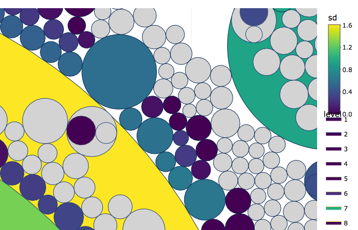

# `r tcit` {#cit}

#### Abstract {-}

(ref:abs-cit)

#### Keywords {-}

(ref:key-cit)

## Introduction

If knowledge is power then scholar must be a powerful class. But what kind of power is knowledge and in what way do scholars wield it? Is knowledge powerful a utility, like water or electricity, to drive a tool and accomplish a task? Is it an asymmetry of information, like a stock tip or the combination to a safe, that gives one a leg up on her competition? Is knowledge like the power of an authority, like a governor, a military commander, or clergyman, to compel the loyalty and obedience of another person? 

How we conceive of knowledge affects how we view the nature and importance of the people and institutions that produce it. Scholars certainly do not have a monopoly on the utilization of production of knowledge in society, but their occupational roles are conditioned by the stuff of knowledge at the same time that knowledge is itself conditioned by the technology and social arrangements that constitute scholarly occupations. 

### Scholarly Communication vs Knowledge Terrain

If the production of culture perspective were to argue against Marx's German Ideology, it might say, "Not all mental laborers have soft hands." Marx drew a course distinction between mental and material labor to demonstrate that the former is not possible without the latter, even when at the time mental labor had already been commidified with the advent of print media. The production of culture perspective simply effaces the distinction altogether; mental labor, or cultural products, are like any other industrialized commodity.

The production of culture perspective is at odds with public sector economics that argues that non market mechanisms create value where markets fail to do so. [@Hayes2000Assessing]

Remuneration 

Are culturally interior products <!-- artifacts --> referenced by socially superior <!-- artificers --> producers?

### Mapping Knowledge Terrain {#wok}

#### knowledge stuff

There are two reasons to map knowledge spaces. First, we may want to know how knowledge develops as a resource unto itself. Second, we may want to exploit such a map for a productive purpose. Here we will attempt the second as prologue to the first. We will tackle the technical problems of constructing a map. We will show how a map can be put to use. Finally, we will investigate how the particular map we make may tend to predictably get us lost.

All knowledge mapping requires first an ontological and then an analytical action. Ontological actions delineate the things that matter. They arbitrarily construct from perception the items that we then think about. While onotological decisions tend to define the scope of everything that may be learned from an investigation, they are often assumed rather than demonstrated. Actor Network Theory (ANT) provides a unique example of a method of research that, because it is ethnographic and thus marinating in an abundance of perception, allows the cast of ontic characters to grow. Literally anything can be deigned significant for inclusion in a web of knoweldge. In an ANT study of science, if the feel of a reading chair modifies a reader's oreintation to a text they are reading, the chair counts.

The lion's share of knowledge mapping studies are not so ontologically radical as ANT. Take the field of bibliometrics. The ontological decision here is to take documents as the primary ontic. Documents are nothing but collections of glyphs, so the first task of bibliometricians tends to be to map glyphs to terms and analyze them. Here we have already used the ontic triad underlying bibliometrics. In the sentence

> "Go, dog, go!"

there are twelve discrete glyphs and two terms. A grammatical cutting rule renders the glyph sequences as 

> "Go, " "dog, " "go!"

and a tokenization rule maps the cuts to two terms

> "go" "dog" "go"

 which may in turn be analyzed, for instance by counting the tokens. The documents form the bins within and across which the terms will be analyzed. The token, as a mere operational step, is used and then dispensed with unless questions of measurement surface. Clearly the *glyph-term-document* (GTD) ontic does not care about the armchair of a reader of a document, and indeed does not even care about the reader herself. <!-- An ANTy idea that is more directly adjecent to GTD is inquiry into the materiality of texts, a topic with a long history in the humanities and a much more recent history in digital analysis.  -->

So the reader is invisible because she is not inscribed in the document. What about the writer? Bibliometricians may backfill GTD by entity recognition or grounding. Once terms are recognized, we may further recognize that we know more about them. A simple example of this is pulling out "metadata", for instance, the author of a document. The author's name is not just any term, but a conceptually very important one. Grounding is how bibliometrics may be linked to theories and programs of greater importance.

Bibliometrics has indeed been based more on the reference of a text as a particular grounded entity rather than on the use of the full text of a document. If a text is a building, the reference is its address. More precise than a name, an address is a codification of different hierarchically ordered elements that describe the location of an entity. The consistent tokenization of a reference is not an easy task, as it depends on entity recognition of several different kinds of things, including year of publication, author, title, and source.

The citation became the basis of the concept of a web of knowledge as coined in the work of Eugene Garfield and institutionalized in the Institute for Scientific Information (ISI). 

Citations solved the problem that ideas do not have signatures or addresses that we can trace reliably. Jargon is an attempt to give an idea a unique address as an idiosyncratic term, and etymology seeks to hierarchically order words according to their origins, but an idea per se will always elude precise identification. Unlike a document, an idea is not mechanically reproducible; it always requires interpretation and understanding in a mind, and a mental event as subtle as an idea cannot be observed.

[@Lederberg2000How] Garfield conflates citations with several roles in the network around ideas. Compares value of citations to value of subject coders, coding meaning of paragraphs intractable. ISI became a commercial pursuit because Garfield failed to get scientific institutions, especially the NSF, to fund it. The goal was primarily practical, to give researches access to current or historical references relevant to articles, perhaps especially their own, they knew they were already interested in.

Unlike ideas, documents are physical artifacts and can be traced empirically. They are fungible, reproducible, and locatable with addresses.

The reproduction and location of ideas cannot be reliably observed, and documents only contain ideas in a metaphorical sense, as a Leyden jar was once thought to contain electricity.

Documents are the tangible and fungible currency with which scholars communicate about ideas, yet how knowledge is actually communicated via documents is not amenable to direct observation at scale. In bibliometrics they have served as a proxy for ideas.

There have been two main orientations to mapping the web of knowledge, description and conscription. Description has either scientific aims, to underatand and explain the facts of knoweldge development, or practical aims, to locate and retrieve knowledge required for a particular purpose. Conscription on the other hand aims to mobilize bibliometric patterns of knowledge as measures of value in competitive markets, namely hiring, promotion, and awards within scholarly professions.

There are several ways to digitally represent texts as knowledge.

From an empirical perspective, texts are nothing but collections or bins of glyphs.  The current paradigm is to render glyphs and recognize them as terms. Such terms may then be analyzed, for instance, by counting diction. Alternative paradigms are cropping up

Second is entity recognition or grounding, where recognized terms are mapped to an existing database of structured knowledge.  

[@Pilkington2009evolution]

### Disciplines as a Large World Co-reference Network

A large world network is not amenable to traditional visual representations due to its extreme density. Scholars often use edge filtering to reduce this density down to a manageable size for vizualization. Unfortunately this convenience function renders a large world as a small world and grossly misrepresents the true structure of the network. In the KCC representation, the network is partitioned into subnetworks of differential density. Nodes are included in a subnetwork if they are involved in ties at a given floor of density, for instance, they need to be tied to at least five other nodes. At a level of five, then, nodes involved in only four ties would be excluded. As this standard is raised, more nodes are excluded. This results in a nested set of subnetworks, where nodes included in a community at a lower threshold are excluded at a higher threshold. Subnetworks of lower density thresholds are always as big or larger than those at higher threshholds. Moreover, higher density subnetworks are always subsets of lower density communities, as their density meets and exceeds the standard for inclusion at the lower level. As one can imagine, inclusive levels are larger. As the threshold is raised subgroupings are sluffed off until reaching points of maximal density. In a world where almost everything is connected, there are no structural holes to reveal differences between subnetworks. Instead, we can view the structure as gradations in density within a very densely connected world.

Nodes meeting the highest standards can be thought of as omnivorous; their ties draw them to the masses, but the masses are not sufficiently tied to the higher standard community. Where the gentry may be as comfortable at the movies as at the symphony, the layity lacks access to the more erudite circles.

What is the credential that would allow a node to climb the hierarchy? One's list of aqcuaintances must overlap by a certain amount (defined by the threshold) with the membership of the higher tier. Indeed their inclusion would change the credentials of everyone they are tied with, as anyone who was just under the standard would be tipped in based on their friend's promotion.

In the KCC model the references are the members of the hierarchy. Their association with each other is determined by how they are used by published authors. Authors who include two references on their bibliography tie those references together in the network. Indeed each citing article lays down a dense clique of references, and the impact of an article grows quadratically with the length of its reference list.


## Methods

## Data


```{r wok2dbl}
f<-'d/p/wok2dbl.RData'
if(file.exists(f)){
  load(f)
} else {
  wok2dbl<-wok2dbl.f(dir='d/d/wok0041','d/p')
}
rm(f)
```

```{r dbl2bel}
f<-'d/p/dbl2bel.RData'
if(file.exists(f)){
  load(f)
} else {
  load('d/d/wok/fuzzy-sets.RData')
  dbl2bel<-dbl2bel.f(wok2dbl,out = 'd/p',saved_recode = fuzzy.sets)
}
rm(f,fuzzy.sets)
```

```{r bel2mel}
f<-'d/p/bel2mel.RData'
if(file.exists(f)){
  load(f)
} else {
  bel2mel<-bel2mel.f(dbl2bel[!((pend)|(zpend)|(zdup)|(loop)|(zloop)),.(ut,cr=zcr)],out='d/p')
}
rm(f)
```

```{r mel2hcs}
f<-'d/p/mel2hcs.RData'
if(file.exists(f)){
  load(f)
} else {
  mel2hcs<-mel2hcs.f(bel2mel,wok2dbl)
  save(mel2hcs,file=f)
}
rm(f)
```

```{r mel2comps}
f<-'d/p/mel2comps.RData'
if(file.exists(f)){
  load(f)
} else {
  if(dir.exists('d/p/mel2comps')) system('rm -rf d/p/mel2comps')
  mel2comps<-mel2comps.f(bel2mel,out='d/p',min.ew = 1,min.size = 3)
  save(mel2comps,file=f)
}
rm(f)
```

```{r comps2cos}
f<-'d/p/comps2cos.RData'
if(file.exists(f)){
  load(f)
} else {
  comps2cos<-comps2cos.f('d/p/mel2comps')
  save(comps2cos,file=f)
}
rm(f)
```

```{r cos2kcc}
f<-'d/p/cos2kcc.RData'
if(file.exists(f)){
  load(f)
} else {
  cos2kcc<-cos2kcc.f('d/p/mel2comps',out = 'd/p',type='crel') 
  save(cos2kcc,file=f)
}
rm(f)
```

## Results

The structure of a large world as revealed by KCC can be explored in a bottom-up and top-down fashion. Bottom-up observes 3-clique communities first. In the social science co-reference network.

```{r kcc2tree, fig.cap='K-clique Community Structure ([popout](tree.html))',eval=T,include=T, message=FALSE, warning=FALSE}
f<-'d/b/kcc2tree.RData'
if(file.exists(f)){
  load(f)
} else {
  #{load('d/p/cos2kcc.RData');load('d/p/bel2mel.RData');load('d/p/wok2dbl.RData')}
  system.time(kcc2tree<-kcc2tree.f(cos2kcc,bel2mel,wok2dbl,sides = 100,transform=T))
  save(kcc2tree,file=f)
htmlwidgets::saveWidget(kcc2tree$int,file = getwd() %>% paste('tree.html',sep=.Platform$file.sep),background='gray')
}
rm(f)
kcc2tree$int
```

Figure \ref(fig:kcc2tree) shows a KCC model of the social sciences in the first half of the twentieth century.

Disciplinarity and interdisciplinarity are revealed in a novel fashion in the KCC model. Disciplinarity is shown as a level of exclusion.

### Continents

The global map is made of many separate regions ranging in scale from large continents to small isles. These regions are either shawlowly connected or entirely separated from each other. The vast majority of these regions are "flat isles" with little to no internal structure of their own. Most flat isles are supported by only a single article, some by a couple of articles penned by the same author, and only a few represent real activity among a small group of different authors.

```{r flat-isle,fig.cap='Flat Isles, where Reviewers tend their Flock',include=T}

```


The most substantial flat isle <!-- k50c1-5 -->, the largest unenclosed and unenclosing circle in Figure \ref(fig:flat-isle), comes from four authors publishing in the same 1930 [issue](https://www.jstor.org/stable/i40084238) of *`r j9so('Z NATIONALOKON')`*. It includes 50 references the most prominent of which are Angell's 1926 *The Theory of International Prices* and Tugwell's 1924 *The Trends of Economics*. The structure of the group is provided entirely by an article by Robert Reisch <!-- https://www.jstor.org/stable/41792307 -->; the other three shared no references in common and Reisch's article, titled "The 'Deposit'-Myth In Banking Theory" and containing 108 references, is likely to have been written as an introduction to the journal on the basis of what had already been accepted for publication. 

Another flat isle of four articles has the exact same pattern, also from *`r j9so('Z NATIONALOKON')`* but from an [issue](https://www.jstor.org/stable/i40084262) in 1937, the article on the first page of the issue, titled "Theory Of Capital, Introduction" <!-- k16c1-47 --> by von Hayek and containing 25 references, includes subsections of the bibliographies of three other articles that do not themselves overlap. Normally the longer a bibliography the more likely it is that an article functions as a review linking other disparate bibliographies. That von Hayek's article has such a short bibliography and yet still links three otherwise separate articles confirms its derivative character.

The following features then suggest when a flat isle represents an issue introduction. All articles are published in the same issue. The removal of the longest bibliography in the community yields a network of disconnected components each uniquely representing the remaining bibs. This longest bib is also either the first article in the issue or precedes the others in pagination. These characteristics suggest authorship internal to the editorial process itself. Later we will explore how the removal of such articles helps to reveal "bottom-up" structure by removing the editorial advantage of certain authors to bestow an ad hoc intellectual coherence on scholarship.

Table \ref(tab:iss-int) enumerates issue introductions and shows how many are the structuring article in their community.

```{r iss-int}
# kcc level
# number issues repped
# if one, longest bib is first

wok2dbl[CJ(unlist(id) %>% unique,ec('PY,J9,AU,TI,VL,IS,SN,BP,EP,PG'),sorted = F)] %>% dcast(id~field,value.var='val',fun.aggregate=list,fill=NA)
#need to merge CR to KCC

# issue level
# number kccs repped
# if any 
```

```{r hill-isle,fig.cap='Hill Isles, where the Wild Things Are',include=T}
include_graphics('img/hill-isle.png')
```

Reviews, whether they are self described as such, borrow directly from the bibliographies of one or more seed articles, and in this way they contribute a disproportionate amount of the global structure of the co-reference network. This kind of review, rather than looking again at an existing intellectual trend, creates the cohesion it purports to describe. Flat isles, especially if they are large, are flat due to the retrospection of a usually solitary reviewer. Compare this to "hill isles" with more internal structure growing out of the related but uncoordinated reference activity of authors. 

```{r k3c1-22,fig.cap='Hill Isle in Graph Layout',include=T}
tree2igr.f(kcc2tree,mel2hcs,vpal='E',light=1,dark=100,transform=T,root=T,print=F,plot=T,ew=1,3,1,22)
#include_graphics('img/k3c1-22.png')
```

<!-- k3.k3c1-22 top cluster in screen grab--> 


### Peaks

The KCC model reveals 

### Valleys

### Do reference lists describe author knowledge?

The peer review process can now be thought of as a process of auditing credentials. An author makes an opening bid with the submission of a particular reference list. What this reference list implies about what the author knows is unclear. One may omit a knowledge signal because it is truthfully irrelevent or in a deceptive sin of ommission oriented to what they expect to be the expectations of editors and reviewers. One may also include what they do not know out of error, bragadoccio, carelessness, or fraud. Part of the work of reviewers will be to validate those claims to knowledge.


```{r kcc2isl,fig.cap='K-clique Community Island Plot',include=F,eval=F}
f<-'d/b/kcc2isl.RData'
if(file.exists(f)){
  load(f)
  kcc2isl<-kcc2isl.f(bel2mel,cos2kcc,wok2dbl,dbl2bel,co=kcc2isl,ordinal=F,minew=1)
} else {
  seed<-.Random.seed %>% sample(1)
  cat('Seed: ',seed,'\n',sep='')
  set.seed(seed)
  kcc2isl<-kcc2isl.f(bel2mel,cos2kcc,wok2dbl,dbl2bel,ordinal=F,rad=1.8,area=1.6,nit=1e4,minew=1,res=200,hex = .01)
  save(kcc2isl,file=f)
}
rm(f)
```

```{r isl3d, fig.cap='Time to Explore! [Pop-out]("isl3d.html")', message=FALSE, warning=FALSE, include=F,eval=F}
f<-'d/b/isl3d.RData'
if(file.exists(f)){
  load(f)
} else {
  isl3d<-isl2isl3d.f(kcc2isl,rad=1,res=200,ln=T,floor=T,close = T,tight = F,cont=F,zasp=.15,zoom=.75,pins=T,medcen = F,raise=1)
  save(isl3d,file=f)
}
rm(f)
htmlwidgets::saveWidget(isl3d,file.path(getwd(), '_book', paste0(opts_current$get('label'),'.html')),selfcontained = T,title = opts_current$get('fig.cap'))
isl3d
```

