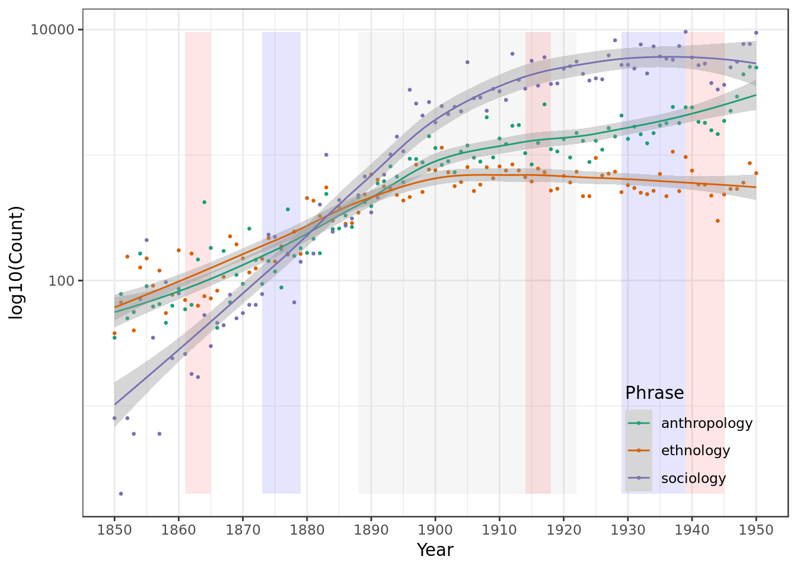
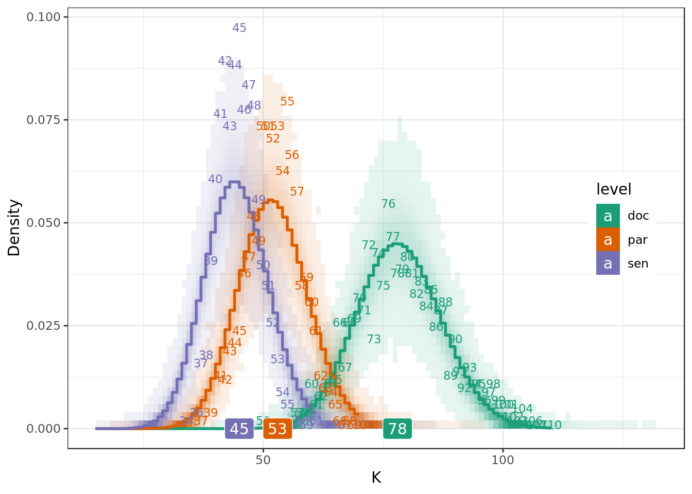
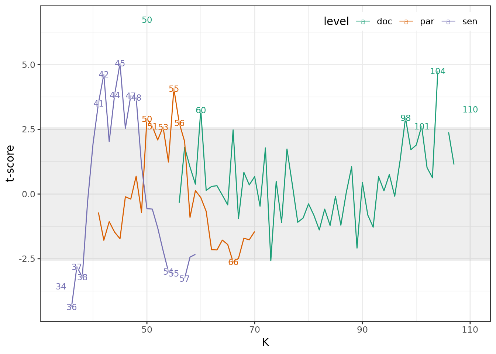
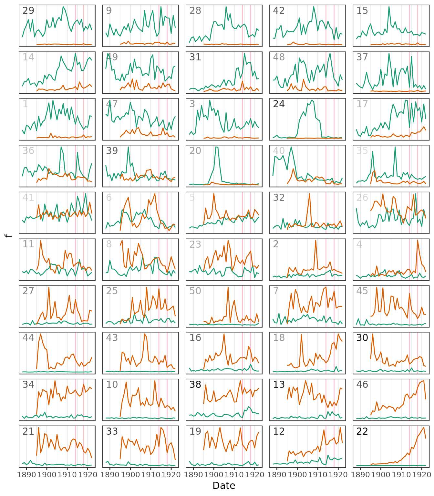
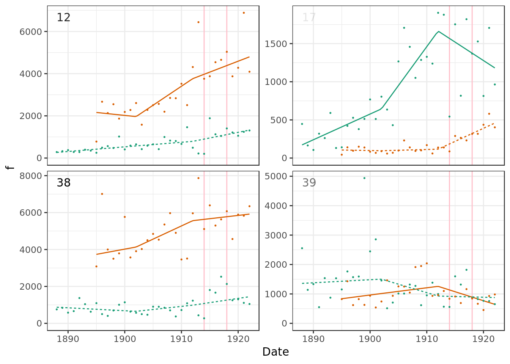
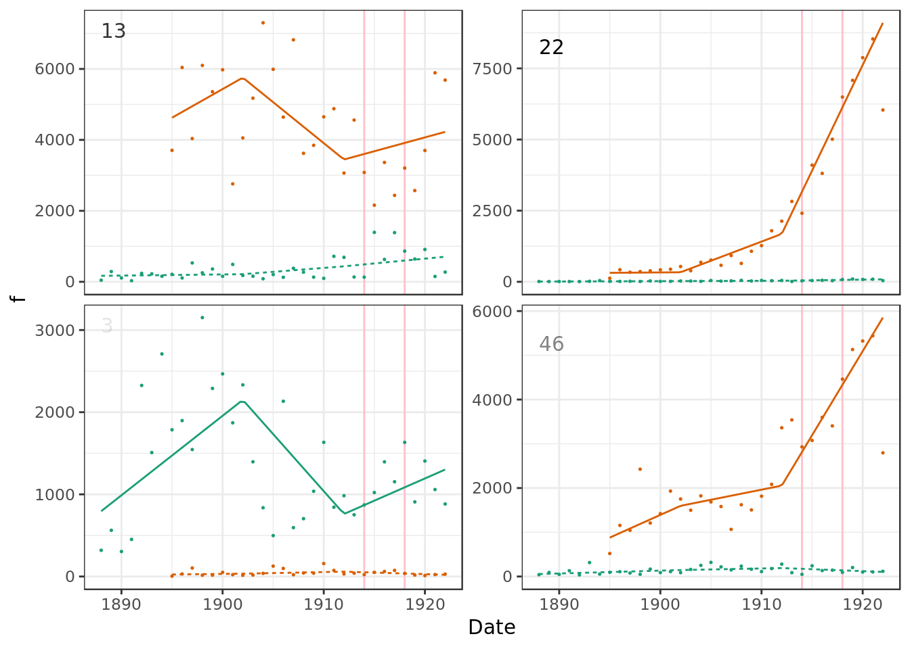
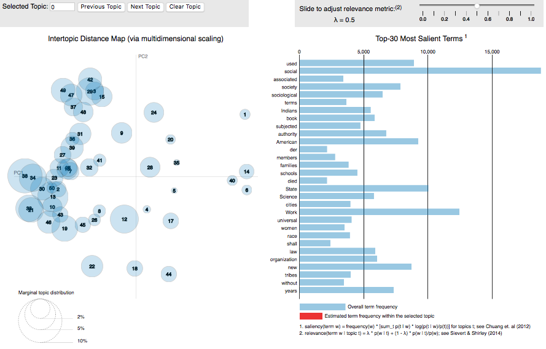

# Economy, Society, and Vocabulary: The Origins of U.S. Anthropology and Sociology, 1888-1922 {#voc}

*Brooks Ambrose and Lynne Zucker*

#### Abstract {-}

(ref:abs-voc)

#### Keywords {-}

(ref:key-voc)

***

What were the dominant ideas in the social sciences at their formation as professions in the postbellum United States? What was the course of their development over a generation of scholarship?  In this study we answer these questions <!--inductively--> through a distant reading of the original journals of two disciplinary cases, anthropology and sociology. Though the goal is substantive, the methodological challenges of consuming a large quantity of text will feature prominently in the story that unfolds. Along the way, we will demonstrate the usefulness of the computational text analysis that is being explored in the humanities and how it can be combined with <!--traditional textual analysis--> quantitative series of economic and demographic data to address two theoretical concerns of organizational and institutional theory, as well as cultural sociology: what are the preconditions that allow cultural industries to emerge and become lasting institutions; and, what scope of cultural change can such institutions sustain? 

U.S. higher education has been simultaneously a field of tamed tradition and wild innovation. While institutional theory has classically focused on predicting the stability of norms [see especially @DiMaggio1983Iron], the more intriguing side of the theory focuses on the processes that cause change. These two sides of institutions are connected in surprising ways [see @Zucker2019Institutional]. Calcified institutional structures, where formal relationships are hierarchical and knowledge is heavily codified, are particularly susceptible to sudden redefinition, especially if the elements are interlinked so that one change can easily spread. Some institutions that experience such redefinitions are strengthened for it, while others may be hobbled and brought closer to their end.

Scholarly institutions have an unusually high degree of adaptation to their own sources of cultural instability. Academic disciplines have excelled at gaining ground both in the longue durée (secular trend) and in histoire événementielle (momentous event). Where periods of social upheaval disrupted scholarly business as usual, scholarly fields reorganized on new footings. However the adaptability of scholarship as a whole did not entail the endurance of all of its parts. Coequal to theories of paradigm shift describing the endogenous reasons for scholarly decline [@Kuhn1970Structure;@Lodahl1972Structure;@Rzhetsky2006Microparadigms], we apply the population ecology and resource dependency perspectives to elucidate the embedding of scholarship in wider resource networks [@Tolbert1985Institutional;@Tolbert1983Institutional;@Morphew2002Using] that are particularly vulnerable to exogenous shocks .

These classic concerns about the social and economic structure of organizations have typically been explored empirically by counting the financial resources available to organizations as well as indicators of their internal growth and differentiation. To these resource-level measures we develop new data series that draw directly on the cultural activity of scholars, joining social inputs to cultural outputs that have evaded accurate counting due to the complexity of cultural data sources, in our case scholarly texts. While there has been tremendous growth in quantitative approaches to counting and classifying text for the purposes of longitudinal analyses of scholarship [e.g. @Hall2008Studying;@Roose2018Trends], these have rarely been conducted with careful consideration of historical and institutional context [see for an exception @DiMaggio2013Exploiting].

We address the interplay between stability and change in two different ways. We begin by outlining key changes in the U.S. economy that we associate with concomitant developments in U.S. higher education. Such developments affected the quotidian activities of scholars by developing the resources and opportunities necessary for them to "make culture" in their organizational roles. Meanwhile, we periodize these micro-level trends by bracketing them between exogenous and often cataclysmic upheavals in U.S. society due to war and economic depression. Finally, we look at the actual "culture made" in an attempt to reveal the linkages between the day's work, or the publication of articles, and the year's news, or the social problems that both create a broader interest in social science and that disrupt the lives of social scientists as they did every person during periods of crisis.

## <!--B--> Social science history in context

Below we will attempt a distant reading of journals in the disciplines of sociology and anthropology. First, however, it will be helpful to put the development of these professions into some historical context. We take a coarse view of national history as the history of wars because of their downstream effects on government activity and institutional investments. The first period is between the end of the American Revolution (1783) and the end of the American Civil War (1865) and is the national context for the origin of U.S. anthropology. The second period is after the Civil War until the end of World War I (1918) and is the context for the origin of U.S. sociology and of modern U.S. higher education generally. Wars of territorial expansion are waged regularly during both periods against native peoples and rival colonial empires, and social research was recruited to solve attendant problems of population and to provide rationales for the relationships with and understandings of conquered or would-be conquered people.

In the interwar periods the leading structural changes tended to be economic. Where wars were ruptual moments that stalled development across many sectors of society, the attendant growth of military capacity also tended to lead to expansions of government, infrastructure, and even education via the training remaining with veterans. The tremendous strain on civilian life in terms of labor shortages during the Civil War thrust women into labor roles outside of the home, expanding the scope of their integration into the economy and public life even after returning to domestic roles as traditional family life was reconstituted. As the organizational form diffused, the old bases of trust in kinship networks were supplanted by mechanisms of communication and control oriented toward formal procedures rather than personal commitments [@Zucker1986Production]. This new kind of trust was based in the perceived fairness of rules, procedures, and contracts as well as in the new intermediary role of managers.

Drawing on economic historians and institutional theory Zucker [-@Zucker1983Organizations] has shown a secular trend in the late 1800s through the 1950s of a transition of American labor from self and often family-based employment to wage or salaried employment by a firm. This great transformation stirred a number of related elements that had been taken for granted. The population shifted from rural toward urban, primarily by leaving agriculture and taking up salaried employment. While before work was organized around individuals, it now became organized around corporate entities [-@Zucker1983Organizations\:Figure 3]. This shift started during WWI, with wives going to work for munitions and aircraft factories in the cities. After the war ended, politicians expected a reverse flow back to the rural areas and waited 20 years to count this new urban population to determine representation in the U.S. House of Representatives. This reverse flow never happened. 

(ref:zuck1) Shift from self-employment to wage-labor in United States. Source: Table 4, Zucker [-@Zucker1983Organizations\:15]. Illiteracy Source: Table 6, Snyder [-@Snyder1993120\:21]

<!--html_preserve-->

<!--/html_preserve-->

(\#fig:zuck1)(ref:zuck1)

The development of procedural trust to organize production also heightened the penalty to illiteracy; whereas orientations to personal loyalty and family obligations were based in tradition and enduring social ties, procedural trust required learning new relationships quickly in novel on-the-job contexts. Contracts, manuals, bookkeeping, and even posters and signage on factory floors presumed what is now referred to as functional literacy but was then still an emerging feature of occupations. More quickly than in any other nation the literacy rate in the United States rose due to public investments in education, fueled by and fueling a growing demand for literate labor. Though data for earlier periods are unavailable, in aggregate personal consumer spending on private education grew from 416 million dollars in 1909 to 1,170 million dollars in 1929, staying strong during WWI only to enter a decline during the Great Depression. Consumer literate spending would recover during WWII giving seeming unlimited opportunity for cultural industries like publishing and education to turn the public's ability to read into consumer demand and an engine for their own growth.

(ref:per-con) Personal Consumption Current Dollar Expenditures on Literate Products ("G456 Books, maps, magazines, newspapers, sheet music", "G457 Private education and research", and "G492 Education (private)"). Source: US Census Bureau [-@Bureau1975Historical\:316-319]

<!--html_preserve-->

<!--/html_preserve-->

(\#fig:per-con)(ref:per-con)

Meanwhile on the supply side U.S. higher education was growing steadily. After the Civil War two federal laws called the Morrill Acts of 1862 and 1890 allowed states to sell land and raise funds for the building of colleges and universities. As institutions of higher education were founded, scholars who may have been located in other organizations like museums and learned societies were able to join much larger communities of peers. This was a precondition for graduate training, and it was primarily through graduate programs that the disciplines constituted themselves as professions. Graduate students and new Ph.D.s fueled the growth of the internal audience necessary for the establishment of new journals. Figure \@ref(fig:t196) makes apparent the different phases of investment in founding universities. From 1870 about ten new institutions were founded every year until net change stopped at about 1,000 in 1890. For the next 30 years the number of institutions stayed very stable, even declining slightly. At no other time in American history did an initial organizational investment remain so constant.

(ref:t196) Decennial change in the number of U.S. colleges and universities. Source: [@NCES2010Table]

<!--html_preserve-->

<!--/html_preserve-->

(\#fig:t196)(ref:t196)

Figure \@ref(fig:nces2phd) shows the aggregate number of doctorate degrees awarded by any university. While in absolute terms the Ph.D. output in the period before 1960 appears minimal compared to the explosive growth during the 1960s and 1970s, for its time it actually grew faster in percentage terms. By observing the logarithm of the count in the bottom panel it is clear that the system tended to grow by a constant multiple decade to decade. From 1870 to 1900 growth was as rapid as it ever was, an indication that the genesis of the university system was a special time of rapid expansion as a surplus of facilities was justified by the recruitment of personnel as was the intention behind the Morrill Acts. Once on this firm footing growth remained at very comparable rates until the present, save for two exogenous upward shifts of the curve. The second shift, as we have already mentioned, occurs between 1960 and 1970 when the baby boom generation begins to fill the ranks of academia. But a lesser known but equally profound earlier shift occurred for the WWI generation, after the Great War and before the beginning of the Great Depression. This interwar period was one of national investment in higher education that served the United States well for responding to the challenges posed by the Great Depression and eventually by WWII.

(ref:nces2phd) Decennial growth in the number of Ph.D. degrees conferred in the U.S. Source: [@NCES2010Table]

(\#fig:nces2phd)(ref:nces2phd)

The view from within academia can be described as a field of published research housed largely within the ecology of journals. Consistent with the rapid growth in Ph.D.s before the turn of the century, the number of new journals appearing every year more than doubled between 1880 and 1890, as evidenced by the journals included in the JSTOR archive (see Figure \@ref(fig:jbdp)). This rapid period of growth was fueled by the wave of college and university foundings in the wake of the Civil War. The tempo of this surge, which we will call the sowing period, abated in the period starting in 1895 for unclear reasons. The most likely scenario is that the demand for publishing space created by the first generation of American Ph.D.s was met. Economically, the so called Panic of 1896 was an economic recession that may have chilled the financial prospects for journals though Americans had already been experiencing similar events almost every other year since the end of the American Civil War. The Spanish American War of 1898, while a major political event of the time, was not so large as to impact the daily lives of most Americans, though more than 100,000 men volunteered for military service in the week after the detonation of the USS Maine in Havana Harbor. The ability for an event to be disruptive is a function of foresight rather than hindsight, and it is possible that propaganda and yellow journalism exaggerating the threat caused panic enough to delay investments for a time. 

<!--html_preserve-->

<!--/html_preserve-->

(\#fig:jbdp)Birth and death rates for JSTOR journals, 5 year intervals. Dotted line is linear prediction of logarithm of N from 1885 to 1970.

Here as well the more granular data make apparent the effects of the World Wars. Though births stalled only moderately during WWI (1914-1918) an unprecedented number of journals came to an end. The end of the Great War also coincides with the Spanish Flu that was even more devastating in terms of loss of life. In the interwar period the trend in births recovers rapidly, until a stall at the beginning of the Great Depression followed again by a recovery. While depressions put financial strain on investment capital that also affects journals, the attendant rise in social problems also raises demand for creative solutions from scholarship. Thus during both the Long (1873-1879) and Great (1929-1939) depressions the rate of new journals actually accelerated by the end of the downturn. Some of this effect may have been due to journal starts being postponed rather than outright canceled. The consequences of WWII (1939-1945) are visible not in a die off of existing journals but in a precipitous fall in new journals. WWII was especially famous for draft and volunteer enlistment that cut across social classes. Thus scholars, who have always come disproportionately from the wealthy class, served as soldiers alongside poor and middle class Americans. The direct service of scholars, however, was not the only cause of disruption; in a profession where concentration counts, attention itself was siphoned off to following the war news.

Immediately after WWII the journal field returned rapidly to business as usual, recouping all of its losses and returning to an exponential growth trajectory. Indeed if one inspects the logarithm of the count of births (not shown) the trend is very linear with no exogenous shifts as were visible in the Ph.D. series. In each of 85 years between 1885 and 1970 the rate of journal births grew by 1.157 percentage points on average, as illustrated by the dotted line in Figure \@ref(fig:jbdp).^[Calculated by a robust linear regression, which penalizes the effect of the outliers, of the logarithm of the annual count. Regression table available upon request.] The only substantial exceptions to the exponential growth occurred in the crest before the turn of the century and in the trough caused by WWII. 

### The social sciences

We will begin to hone in on the cases of anthropology and sociology by observing the social sciences in particular as represented by the JSTOR archive. Figure \@ref(fig:jstorm2fig) shows the net growth of social science journals over a 200 year period. The curve is broken into periods of roughly similar slope. To choose the breakpoints we apply change point analysis, which detects significant differences in time series data [@Matteson2013Nonparametric; @James2019ecp], to the first difference of the curve. We find turning points in the expected locations. 1885 marks the start of the sowing period and the end of the long prehistory of modern scholarship, while 1919 and 1944 mark the post war recoveries. Repeating the analysis on the second difference of the trend reveals that 1939, the end of the Great Depression and the beginning of WWII, marks a singular turning point where the acceleration of journal growth shifted into a higher gear.

<!--html_preserve-->

<!--/html_preserve-->

(\#fig:jstorm2fig)Periods in the Growth of the Number of Social Science Journals in the JSTOR Archive.

<!--

-->

The ratio of new Ph.D.s to extant journals gives a good indication of the range of opportunities or the degree of competition facing individual scholars. While not strictly comparable, the aggregate number of Ph.D.s conferred divided by the number of social science journals gives a glimpse of the evolving opportunity structure in the social sciences. Figure \@ref(fig:nces/jstorm) shows that this ratio remained very constant for the 50 years between 1870 and 1920 indicating that the field of professional opportunities grew about as quickly as the number of newcomers playing on it. This began to change as the upward shifts in Ph.D. output outpaced the growth of new journals. While the increase in the ratio may have been partially offset by technical improvements allowing journals to fit more scholars into the same issues, there is no mistaking the tectonic shift between 1960 and 1970 where the number of new Ph.D.s competing over each journal quadrupled from 42 to 166.

<!--html_preserve-->

<!--/html_preserve-->

(\#fig:nces/jstorm)Number of PhDs conferred in the United States per Social Science Journal

We take the relatively flat trend visible in the sowing period to represent one of stable growth and what Swidler [-@Swidler1986Culture] has called settled lives. Between 1888 and 1922 there tended to be about eight new Ph.D.'s in the U.S. for every social science journal even as each population grew year over year. These growth patterns begin to diverge around 1919 as a decades long acceleration of personnel begins, relatively slowly between 1920 and 1960 at an average acceleration rate of 28 PhDs per journal per year, and then quite precipitously in the 1960s at an average acceleration rate of 147. This makes the period between the sowing years and the onset of WWI a good choice for studying the development of scholarly publication at a time where internal trends take precedence over external shocks, and to observe how these tendencies are ultimately affected by an historical crisis. 

<!--TODO: I use intellectual histories of anthropology to characterize the antebellum period, and the same for the postbellum period including sociology.-->

Anthropology is a rare example of a discipline that has a long prehistory prior to the U.S. university system, whereas sociology's birth very much coincided with the university as a new organizational context of the kind described by Zucker [-@Zucker1983Organizations]. Tables \@ref(tab:jclu-tab-sub) and \@ref(tab:jclu-tab-sub-econ) show a classification of social science journals, given by the JSTOR archive, and their ranking in terms of size as it stands today. These disciplinary labels are more valid today than than they were in the 1880s at the start of the sowing period for scholarly journals, as it was not always obvious that these took priority over other fields whose names have receded from the scholarly imagination. The differentiation of business and economics away from the other disciplines had yet to occur.

As can be seen in Figure \@ref(fig:subdisc), which plots the net journal counts over time, archaeology is the oldest discipline and has always had more journals. Of the more theoretical social sciences that appeared after 1880 the oldest to receive a second journal in the field, a marker of growth, was economics (1884), followed in order of emergence by education (1887), anthropology (1869), geography (1893), political science (1899), and sociology (1910). After WWI two clear trajectories emerge. On one hand, the bundle of larger disciplines grows steadily before receiving the baby boomer generation that super charged their growth after 1960. On the other hand, a handful of fields, among them the most recent with the exception of the older anthropology, continue on the older, slower acceleration curve. Two fields, sociology and business, cross from the slower to faster track at later points.

<table style="text-align:center"><caption>(\#tab:jclu-tab-sub)<strong>JSTOR Social Sciences Journal Counts</strong></caption>
<tr><td colspan="3" style="border-bottom: 1px solid black"></td></tr><tr><td style="text-align:left">Subdiscipline</td><td>N</td><td>Pct</td></tr>
<tr><td colspan="3" style="border-bottom: 1px solid black"></td></tr><tr><td style="text-align:left">Archaeology</td><td>256</td><td>27.9</td></tr>
<tr><td style="text-align:left">Political Science</td><td>219</td><td>23.9</td></tr>
<tr><td style="text-align:left">Education</td><td>192</td><td>21</td></tr>
<tr><td style="text-align:left">Sociology</td><td>160</td><td>17.5</td></tr>
<tr><td style="text-align:left">Anthropology</td><td>46</td><td>5</td></tr>
<tr><td style="text-align:left">Population Studies</td><td>22</td><td>2.4</td></tr>
<tr><td style="text-align:left">Geography</td><td>18</td><td>2</td></tr>
<tr><td style="text-align:left">Transportation Studies</td><td>3</td><td>0.3</td></tr>
<tr><td style="text-align:left">Total</td><td>916</td><td>100</td></tr>
<tr><td colspan="3" style="border-bottom: 1px solid black"></td></tr></table>

<table style="text-align:center"><caption>(\#tab:jclu-tab-sub-econ)<strong>JSTOR Business & Economics Journal Counts</strong></caption>
<tr><td colspan="3" style="border-bottom: 1px solid black"></td></tr><tr><td style="text-align:left">Subdiscipline</td><td>N</td><td>Pct</td></tr>
<tr><td colspan="3" style="border-bottom: 1px solid black"></td></tr><tr><td style="text-align:left">Economics</td><td>171</td><td>60</td></tr>
<tr><td style="text-align:left">Business</td><td>83</td><td>29.1</td></tr>
<tr><td style="text-align:left">Labor 	&amp; Employment Relations</td><td>31</td><td>10.9</td></tr>
<tr><td style="text-align:left">Total</td><td>285</td><td>100</td></tr>
<tr><td colspan="3" style="border-bottom: 1px solid black"></td></tr></table>

<!--html_preserve-->

<script type="application/json" data-for="htmlwidget-224d9cc1dbcf9ebbbb84">{"x":{"data":[{"x":[1864,1865,1866,1867,1868,1869,1870,1871,1872,1873,1874,1875,1876,1877,1878,1879,1880,1881,1882,1883,1884,1885,1886,1887,1888,1889,1890,1891,1892,1893,1894,1895,1896,1897,1898,1899,1900,1901,1902,1903,1904,1905,1906,1907,1908,1909,1910,1911,1912,1913,1914,1915,1916,1917,1918,1919,1920,1921,1922,1923,1924,1925,1926,1927,1928,1929,1930,1931,1932,1933,1934,1935,1936,1937,1938,1939,1940,1941,1942,1943,1944,1945,1946,1947,1948,1949,1950,1951,1952,1953,1954,1955,1956,1957,1958,1959,1960,1961,1962,1963,1964,1965,1966,1967,1968,1969,1970,1971,1972,1973,1974,1975,1976,1977,1978,1979,1980,1981,1982,1983,1984,1985,1986,1987,1988,1989,1990,1991,1992,1993,1994,1995,1996,1997,1998,1999,2000],"y":[1,1,1,1,1,2,2,1,1,1,1,1,1,1,1,1,1,1,1,1,1,1,1,1,2,2,2,2,2,2,2,3,3,3,3,3,3,3,3,3,3,3,3,3,3,3,3,3,3,3,3,3,3,3,3,3,3,3,3,4,6,7,7,7,7,7,7,7,6,6,5,5,5,5,6,6,6,5,5,5,5,6,6,6,7,8,8,8,8,10,11,12,12,12,12,13,12,13,16,16,16,17,17,17,17,17,17,18,20,23,23,24,25,25,26,26,28,28,28,29,29,31,32,33,34,34,34,35,35,35,35,36,36,36,36,36,36],"text":["y: 1864 N:   1 s: Anthropology","y: 1865 N:   1 s: Anthropology","y: 1866 N:   1 s: Anthropology","y: 1867 N:   1 s: Anthropology","y: 1868 N:   1 s: Anthropology","y: 1869 N:   2 s: Anthropology","y: 1870 N:   2 s: Anthropology","y: 1871 N:   1 s: Anthropology","y: 1872 N:   1 s: Anthropology","y: 1873 N:   1 s: Anthropology","y: 1874 N:   1 s: Anthropology","y: 1875 N:   1 s: Anthropology","y: 1876 N:   1 s: Anthropology","y: 1877 N:   1 s: Anthropology","y: 1878 N:   1 s: Anthropology","y: 1879 N:   1 s: Anthropology","y: 1880 N:   1 s: Anthropology","y: 1881 N:   1 s: Anthropology","y: 1882 N:   1 s: Anthropology","y: 1883 N:   1 s: Anthropology","y: 1884 N:   1 s: Anthropology","y: 1885 N:   1 s: Anthropology","y: 1886 N:   1 s: Anthropology","y: 1887 N:   1 s: Anthropology","y: 1888 N:   2 s: Anthropology","y: 1889 N:   2 s: Anthropology","y: 1890 N:   2 s: Anthropology","y: 1891 N:   2 s: Anthropology","y: 1892 N:   2 s: Anthropology","y: 1893 N:   2 s: Anthropology","y: 1894 N:   2 s: Anthropology","y: 1895 N:   3 s: Anthropology","y: 1896 N:   3 s: Anthropology","y: 1897 N:   3 s: Anthropology","y: 1898 N:   3 s: Anthropology","y: 1899 N:   3 s: Anthropology","y: 1900 N:   3 s: Anthropology","y: 1901 N:   3 s: Anthropology","y: 1902 N:   3 s: Anthropology","y: 1903 N:   3 s: Anthropology","y: 1904 N:   3 s: Anthropology","y: 1905 N:   3 s: Anthropology","y: 1906 N:   3 s: Anthropology","y: 1907 N:   3 s: Anthropology","y: 1908 N:   3 s: Anthropology","y: 1909 N:   3 s: Anthropology","y: 1910 N:   3 s: Anthropology","y: 1911 N:   3 s: Anthropology","y: 1912 N:   3 s: Anthropology","y: 1913 N:   3 s: Anthropology","y: 1914 N:   3 s: Anthropology","y: 1915 N:   3 s: Anthropology","y: 1916 N:   3 s: Anthropology","y: 1917 N:   3 s: Anthropology","y: 1918 N:   3 s: Anthropology","y: 1919 N:   3 s: Anthropology","y: 1920 N:   3 s: Anthropology","y: 1921 N:   3 s: Anthropology","y: 1922 N:   3 s: Anthropology","y: 1923 N:   4 s: Anthropology","y: 1924 N:   6 s: Anthropology","y: 1925 N:   7 s: Anthropology","y: 1926 N:   7 s: Anthropology","y: 1927 N:   7 s: Anthropology","y: 1928 N:   7 s: Anthropology","y: 1929 N:   7 s: Anthropology","y: 1930 N:   7 s: Anthropology","y: 1931 N:   7 s: Anthropology","y: 1932 N:   6 s: Anthropology","y: 1933 N:   6 s: Anthropology","y: 1934 N:   5 s: Anthropology","y: 1935 N:   5 s: Anthropology","y: 1936 N:   5 s: Anthropology","y: 1937 N:   5 s: Anthropology","y: 1938 N:   6 s: Anthropology","y: 1939 N:   6 s: Anthropology","y: 1940 N:   6 s: Anthropology","y: 1941 N:   5 s: Anthropology","y: 1942 N:   5 s: Anthropology","y: 1943 N:   5 s: Anthropology","y: 1944 N:   5 s: Anthropology","y: 1945 N:   6 s: Anthropology","y: 1946 N:   6 s: Anthropology","y: 1947 N:   6 s: Anthropology","y: 1948 N:   7 s: Anthropology","y: 1949 N:   8 s: Anthropology","y: 1950 N:   8 s: Anthropology","y: 1951 N:   8 s: Anthropology","y: 1952 N:   8 s: Anthropology","y: 1953 N:  10 s: Anthropology","y: 1954 N:  11 s: Anthropology","y: 1955 N:  12 s: Anthropology","y: 1956 N:  12 s: Anthropology","y: 1957 N:  12 s: Anthropology","y: 1958 N:  12 s: Anthropology","y: 1959 N:  13 s: Anthropology","y: 1960 N:  12 s: Anthropology","y: 1961 N:  13 s: Anthropology","y: 1962 N:  16 s: Anthropology","y: 1963 N:  16 s: Anthropology","y: 1964 N:  16 s: Anthropology","y: 1965 N:  17 s: Anthropology","y: 1966 N:  17 s: Anthropology","y: 1967 N:  17 s: Anthropology","y: 1968 N:  17 s: Anthropology","y: 1969 N:  17 s: Anthropology","y: 1970 N:  17 s: Anthropology","y: 1971 N:  18 s: Anthropology","y: 1972 N:  20 s: Anthropology","y: 1973 N:  23 s: Anthropology","y: 1974 N:  23 s: Anthropology","y: 1975 N:  24 s: Anthropology","y: 1976 N:  25 s: Anthropology","y: 1977 N:  25 s: Anthropology","y: 1978 N:  26 s: Anthropology","y: 1979 N:  26 s: Anthropology","y: 1980 N:  28 s: Anthropology","y: 1981 N:  28 s: Anthropology","y: 1982 N:  28 s: Anthropology","y: 1983 N:  29 s: Anthropology","y: 1984 N:  29 s: Anthropology","y: 1985 N:  31 s: Anthropology","y: 1986 N:  32 s: Anthropology","y: 1987 N:  33 s: Anthropology","y: 1988 N:  34 s: Anthropology","y: 1989 N:  34 s: Anthropology","y: 1990 N:  34 s: Anthropology","y: 1991 N:  35 s: Anthropology","y: 1992 N:  35 s: Anthropology","y: 1993 N:  35 s: Anthropology","y: 1994 N:  35 s: Anthropology","y: 1995 N:  36 s: Anthropology","y: 1996 N:  36 s: Anthropology","y: 1997 N:  36 s: Anthropology","y: 1998 N:  36 s: Anthropology","y: 1999 N:  36 s: Anthropology","y: 2000 N:  36 s: Anthropology"],"type":"scatter","mode":"lines","line":{"width":1.88976377952756,"color":"rgba(166,206,227,1)","dash":"solid"},"hoveron":"points","name":"Anthropology","legendgroup":"Anthropology","showlegend":true,"xaxis":"x","yaxis":"y","hoverinfo":"text","frame":null},{"x":[1851,1852,1853,1854,1855,1856,1857,1858,1859,1860,1861,1862,1863,1864,1865,1866,1867,1868,1869,1870,1871,1872,1873,1874,1875,1876,1877,1878,1879,1880,1881,1882,1883,1884,1885,1886,1887,1888,1889,1890,1891,1892,1893,1894,1895,1896,1897,1898,1899,1900,1901,1902,1903,1904,1905,1906,1907,1908,1909,1910,1911,1912,1913,1914,1915,1916,1917,1918,1919,1920,1921,1922,1923,1924,1925,1926,1927,1928,1929,1930,1931,1932,1933,1934,1935,1936,1937,1938,1939,1940,1941,1942,1943,1944,1945,1946,1947,1948,1949,1950,1951,1952,1953,1954,1955,1956,1957,1958,1959,1960,1961,1962,1963,1964,1965,1966,1967,1968,1969,1970,1971,1972,1973,1974,1975,1976,1977,1978,1979,1980,1981,1982,1983,1984,1985,1986,1987,1988,1989,1990,1991,1992,1993,1994,1995,1996,1997,1998,1999,2000],"y":[1,1,2,2,2,2,2,2,2,2,2,2,2,2,2,3,3,3,3,3,3,3,3,3,3,3,3,3,3,5,5,5,5,6,6,6,6,8,9,10,10,12,13,15,15,15,16,15,16,17,17,18,18,19,19,20,21,22,22,22,24,25,25,26,26,26,27,27,26,29,31,32,32,33,35,35,36,37,39,40,42,43,43,44,47,47,50,51,51,51,53,55,57,58,60,60,60,61,62,63,67,67,70,74,76,76,77,78,79,80,82,85,88,89,91,95,98,98,100,108,112,117,122,127,133,136,140,143,147,150,154,159,164,166,168,170,176,180,182,190,191,196,200,201,206,207,209,210,215,215],"text":["y: 1851 N:   1 s: Archaeology","y: 1852 N:   1 s: Archaeology","y: 1853 N:   2 s: Archaeology","y: 1854 N:   2 s: Archaeology","y: 1855 N:   2 s: Archaeology","y: 1856 N:   2 s: Archaeology","y: 1857 N:   2 s: Archaeology","y: 1858 N:   2 s: Archaeology","y: 1859 N:   2 s: Archaeology","y: 1860 N:   2 s: Archaeology","y: 1861 N:   2 s: Archaeology","y: 1862 N:   2 s: Archaeology","y: 1863 N:   2 s: Archaeology","y: 1864 N:   2 s: Archaeology","y: 1865 N:   2 s: Archaeology","y: 1866 N:   3 s: Archaeology","y: 1867 N:   3 s: Archaeology","y: 1868 N:   3 s: Archaeology","y: 1869 N:   3 s: Archaeology","y: 1870 N:   3 s: Archaeology","y: 1871 N:   3 s: Archaeology","y: 1872 N:   3 s: Archaeology","y: 1873 N:   3 s: Archaeology","y: 1874 N:   3 s: Archaeology","y: 1875 N:   3 s: Archaeology","y: 1876 N:   3 s: Archaeology","y: 1877 N:   3 s: Archaeology","y: 1878 N:   3 s: Archaeology","y: 1879 N:   3 s: Archaeology","y: 1880 N:   5 s: Archaeology","y: 1881 N:   5 s: Archaeology","y: 1882 N:   5 s: Archaeology","y: 1883 N:   5 s: Archaeology","y: 1884 N:   6 s: Archaeology","y: 1885 N:   6 s: Archaeology","y: 1886 N:   6 s: Archaeology","y: 1887 N:   6 s: Archaeology","y: 1888 N:   8 s: Archaeology","y: 1889 N:   9 s: Archaeology","y: 1890 N:  10 s: Archaeology","y: 1891 N:  10 s: Archaeology","y: 1892 N:  12 s: Archaeology","y: 1893 N:  13 s: Archaeology","y: 1894 N:  15 s: Archaeology","y: 1895 N:  15 s: Archaeology","y: 1896 N:  15 s: Archaeology","y: 1897 N:  16 s: Archaeology","y: 1898 N:  15 s: Archaeology","y: 1899 N:  16 s: Archaeology","y: 1900 N:  17 s: Archaeology","y: 1901 N:  17 s: Archaeology","y: 1902 N:  18 s: Archaeology","y: 1903 N:  18 s: Archaeology","y: 1904 N:  19 s: Archaeology","y: 1905 N:  19 s: Archaeology","y: 1906 N:  20 s: Archaeology","y: 1907 N:  21 s: Archaeology","y: 1908 N:  22 s: Archaeology","y: 1909 N:  22 s: Archaeology","y: 1910 N:  22 s: Archaeology","y: 1911 N:  24 s: Archaeology","y: 1912 N:  25 s: Archaeology","y: 1913 N:  25 s: Archaeology","y: 1914 N:  26 s: Archaeology","y: 1915 N:  26 s: Archaeology","y: 1916 N:  26 s: Archaeology","y: 1917 N:  27 s: Archaeology","y: 1918 N:  27 s: Archaeology","y: 1919 N:  26 s: Archaeology","y: 1920 N:  29 s: Archaeology","y: 1921 N:  31 s: Archaeology","y: 1922 N:  32 s: Archaeology","y: 1923 N:  32 s: Archaeology","y: 1924 N:  33 s: Archaeology","y: 1925 N:  35 s: Archaeology","y: 1926 N:  35 s: Archaeology","y: 1927 N:  36 s: Archaeology","y: 1928 N:  37 s: Archaeology","y: 1929 N:  39 s: Archaeology","y: 1930 N:  40 s: Archaeology","y: 1931 N:  42 s: Archaeology","y: 1932 N:  43 s: Archaeology","y: 1933 N:  43 s: Archaeology","y: 1934 N:  44 s: Archaeology","y: 1935 N:  47 s: Archaeology","y: 1936 N:  47 s: Archaeology","y: 1937 N:  50 s: Archaeology","y: 1938 N:  51 s: Archaeology","y: 1939 N:  51 s: Archaeology","y: 1940 N:  51 s: Archaeology","y: 1941 N:  53 s: Archaeology","y: 1942 N:  55 s: Archaeology","y: 1943 N:  57 s: Archaeology","y: 1944 N:  58 s: Archaeology","y: 1945 N:  60 s: Archaeology","y: 1946 N:  60 s: Archaeology","y: 1947 N:  60 s: Archaeology","y: 1948 N:  61 s: Archaeology","y: 1949 N:  62 s: Archaeology","y: 1950 N:  63 s: Archaeology","y: 1951 N:  67 s: Archaeology","y: 1952 N:  67 s: Archaeology","y: 1953 N:  70 s: Archaeology","y: 1954 N:  74 s: Archaeology","y: 1955 N:  76 s: Archaeology","y: 1956 N:  76 s: Archaeology","y: 1957 N:  77 s: Archaeology","y: 1958 N:  78 s: Archaeology","y: 1959 N:  79 s: Archaeology","y: 1960 N:  80 s: Archaeology","y: 1961 N:  82 s: Archaeology","y: 1962 N:  85 s: Archaeology","y: 1963 N:  88 s: Archaeology","y: 1964 N:  89 s: Archaeology","y: 1965 N:  91 s: Archaeology","y: 1966 N:  95 s: Archaeology","y: 1967 N:  98 s: Archaeology","y: 1968 N:  98 s: Archaeology","y: 1969 N: 100 s: Archaeology","y: 1970 N: 108 s: Archaeology","y: 1971 N: 112 s: Archaeology","y: 1972 N: 117 s: Archaeology","y: 1973 N: 122 s: Archaeology","y: 1974 N: 127 s: Archaeology","y: 1975 N: 133 s: Archaeology","y: 1976 N: 136 s: Archaeology","y: 1977 N: 140 s: Archaeology","y: 1978 N: 143 s: Archaeology","y: 1979 N: 147 s: Archaeology","y: 1980 N: 150 s: Archaeology","y: 1981 N: 154 s: Archaeology","y: 1982 N: 159 s: Archaeology","y: 1983 N: 164 s: Archaeology","y: 1984 N: 166 s: Archaeology","y: 1985 N: 168 s: Archaeology","y: 1986 N: 170 s: Archaeology","y: 1987 N: 176 s: Archaeology","y: 1988 N: 180 s: Archaeology","y: 1989 N: 182 s: Archaeology","y: 1990 N: 190 s: Archaeology","y: 1991 N: 191 s: Archaeology","y: 1992 N: 196 s: Archaeology","y: 1993 N: 200 s: Archaeology","y: 1994 N: 201 s: Archaeology","y: 1995 N: 206 s: Archaeology","y: 1996 N: 207 s: Archaeology","y: 1997 N: 209 s: Archaeology","y: 1998 N: 210 s: Archaeology","y: 1999 N: 215 s: Archaeology","y: 2000 N: 215 s: Archaeology"],"type":"scatter","mode":"lines","line":{"width":1.88976377952756,"color":"rgba(31,120,180,1)","dash":"solid"},"hoveron":"points","name":"Archaeology","legendgroup":"Archaeology","showlegend":true,"xaxis":"x","yaxis":"y","hoverinfo":"text","frame":null,"visible":"legendonly"},{"x":[1926,1927,1928,1929,1930,1931,1932,1933,1934,1935,1936,1937,1938,1939,1940,1941,1942,1943,1944,1945,1946,1947,1948,1949,1950,1951,1952,1953,1954,1955,1956,1957,1958,1959,1960,1961,1962,1963,1964,1965,1966,1967,1968,1969,1970,1971,1972,1973,1974,1975,1976,1977,1978,1979,1980,1981,1982,1983,1984,1985,1986,1987,1988,1989,1990,1991,1992,1993,1994,1995,1996,1997,1998,1999,2000],"y":[1,1,1,1,1,1,1,1,1,1,2,2,2,2,3,3,3,3,3,3,4,5,6,6,6,6,6,6,7,7,9,9,10,10,12,12,12,13,14,14,15,15,15,15,16,18,20,21,22,23,25,27,29,30,32,34,36,38,40,40,43,44,48,51,56,57,57,62,62,64,66,68,70,73,75],"text":["y: 1926 N:   1 s: Business","y: 1927 N:   1 s: Business","y: 1928 N:   1 s: Business","y: 1929 N:   1 s: Business","y: 1930 N:   1 s: Business","y: 1931 N:   1 s: Business","y: 1932 N:   1 s: Business","y: 1933 N:   1 s: Business","y: 1934 N:   1 s: Business","y: 1935 N:   1 s: Business","y: 1936 N:   2 s: Business","y: 1937 N:   2 s: Business","y: 1938 N:   2 s: Business","y: 1939 N:   2 s: Business","y: 1940 N:   3 s: Business","y: 1941 N:   3 s: Business","y: 1942 N:   3 s: Business","y: 1943 N:   3 s: Business","y: 1944 N:   3 s: Business","y: 1945 N:   3 s: Business","y: 1946 N:   4 s: Business","y: 1947 N:   5 s: Business","y: 1948 N:   6 s: Business","y: 1949 N:   6 s: Business","y: 1950 N:   6 s: Business","y: 1951 N:   6 s: Business","y: 1952 N:   6 s: Business","y: 1953 N:   6 s: Business","y: 1954 N:   7 s: Business","y: 1955 N:   7 s: Business","y: 1956 N:   9 s: Business","y: 1957 N:   9 s: Business","y: 1958 N:  10 s: Business","y: 1959 N:  10 s: Business","y: 1960 N:  12 s: Business","y: 1961 N:  12 s: Business","y: 1962 N:  12 s: Business","y: 1963 N:  13 s: Business","y: 1964 N:  14 s: Business","y: 1965 N:  14 s: Business","y: 1966 N:  15 s: Business","y: 1967 N:  15 s: Business","y: 1968 N:  15 s: Business","y: 1969 N:  15 s: Business","y: 1970 N:  16 s: Business","y: 1971 N:  18 s: Business","y: 1972 N:  20 s: Business","y: 1973 N:  21 s: Business","y: 1974 N:  22 s: Business","y: 1975 N:  23 s: Business","y: 1976 N:  25 s: Business","y: 1977 N:  27 s: Business","y: 1978 N:  29 s: Business","y: 1979 N:  30 s: Business","y: 1980 N:  32 s: Business","y: 1981 N:  34 s: Business","y: 1982 N:  36 s: Business","y: 1983 N:  38 s: Business","y: 1984 N:  40 s: Business","y: 1985 N:  40 s: Business","y: 1986 N:  43 s: Business","y: 1987 N:  44 s: Business","y: 1988 N:  48 s: Business","y: 1989 N:  51 s: Business","y: 1990 N:  56 s: Business","y: 1991 N:  57 s: Business","y: 1992 N:  57 s: Business","y: 1993 N:  62 s: Business","y: 1994 N:  62 s: Business","y: 1995 N:  64 s: Business","y: 1996 N:  66 s: Business","y: 1997 N:  68 s: Business","y: 1998 N:  70 s: Business","y: 1999 N:  73 s: Business","y: 2000 N:  75 s: Business"],"type":"scatter","mode":"lines","line":{"width":1.88976377952756,"color":"rgba(178,223,138,1)","dash":"solid"},"hoveron":"points","name":"Business","legendgroup":"Business","showlegend":true,"xaxis":"x","yaxis":"y","hoverinfo":"text","frame":null,"visible":"legendonly"},{"x":[1863,1864,1865,1866,1867,1868,1869,1870,1871,1872,1873,1874,1875,1876,1877,1878,1879,1880,1881,1882,1883,1884,1885,1886,1887,1888,1889,1890,1891,1892,1893,1894,1895,1896,1897,1898,1899,1900,1901,1902,1903,1904,1905,1906,1907,1908,1909,1910,1911,1912,1913,1914,1915,1916,1917,1918,1919,1920,1921,1922,1923,1924,1925,1926,1927,1928,1929,1930,1931,1932,1933,1934,1935,1936,1937,1938,1939,1940,1941,1942,1943,1944,1945,1946,1947,1948,1949,1950,1951,1952,1953,1954,1955,1956,1957,1958,1959,1960,1961,1962,1963,1964,1965,1966,1967,1968,1969,1970,1971,1972,1973,1974,1975,1976,1977,1978,1979,1980,1981,1982,1983,1984,1985,1986,1987,1988,1989,1990,1991,1992,1993,1994,1995,1996,1997,1998,1999,2000],"y":[1,1,1,1,1,1,1,1,1,1,1,1,1,1,1,1,1,1,1,1,1,2,2,3,4,4,4,5,6,7,7,7,7,7,7,8,8,8,8,8,8,8,8,8,8,8,8,8,9,9,9,9,9,9,9,9,10,10,11,11,11,11,12,12,12,12,12,12,12,12,15,17,17,18,19,20,21,21,24,25,25,25,25,25,25,27,27,28,28,31,32,34,34,34,35,36,37,40,44,45,45,46,47,50,52,55,59,60,62,65,65,72,74,76,80,81,82,84,85,88,89,92,97,106,111,112,115,116,118,120,121,124,126,129,132,133,133,136],"text":["y: 1863 N:   1 s: Economics","y: 1864 N:   1 s: Economics","y: 1865 N:   1 s: Economics","y: 1866 N:   1 s: Economics","y: 1867 N:   1 s: Economics","y: 1868 N:   1 s: Economics","y: 1869 N:   1 s: Economics","y: 1870 N:   1 s: Economics","y: 1871 N:   1 s: Economics","y: 1872 N:   1 s: Economics","y: 1873 N:   1 s: Economics","y: 1874 N:   1 s: Economics","y: 1875 N:   1 s: Economics","y: 1876 N:   1 s: Economics","y: 1877 N:   1 s: Economics","y: 1878 N:   1 s: Economics","y: 1879 N:   1 s: Economics","y: 1880 N:   1 s: Economics","y: 1881 N:   1 s: Economics","y: 1882 N:   1 s: Economics","y: 1883 N:   1 s: Economics","y: 1884 N:   2 s: Economics","y: 1885 N:   2 s: Economics","y: 1886 N:   3 s: Economics","y: 1887 N:   4 s: Economics","y: 1888 N:   4 s: Economics","y: 1889 N:   4 s: Economics","y: 1890 N:   5 s: Economics","y: 1891 N:   6 s: Economics","y: 1892 N:   7 s: Economics","y: 1893 N:   7 s: Economics","y: 1894 N:   7 s: Economics","y: 1895 N:   7 s: Economics","y: 1896 N:   7 s: Economics","y: 1897 N:   7 s: Economics","y: 1898 N:   8 s: Economics","y: 1899 N:   8 s: Economics","y: 1900 N:   8 s: Economics","y: 1901 N:   8 s: Economics","y: 1902 N:   8 s: Economics","y: 1903 N:   8 s: Economics","y: 1904 N:   8 s: Economics","y: 1905 N:   8 s: Economics","y: 1906 N:   8 s: Economics","y: 1907 N:   8 s: Economics","y: 1908 N:   8 s: Economics","y: 1909 N:   8 s: Economics","y: 1910 N:   8 s: Economics","y: 1911 N:   9 s: Economics","y: 1912 N:   9 s: Economics","y: 1913 N:   9 s: Economics","y: 1914 N:   9 s: Economics","y: 1915 N:   9 s: Economics","y: 1916 N:   9 s: Economics","y: 1917 N:   9 s: Economics","y: 1918 N:   9 s: Economics","y: 1919 N:  10 s: Economics","y: 1920 N:  10 s: Economics","y: 1921 N:  11 s: Economics","y: 1922 N:  11 s: Economics","y: 1923 N:  11 s: Economics","y: 1924 N:  11 s: Economics","y: 1925 N:  12 s: Economics","y: 1926 N:  12 s: Economics","y: 1927 N:  12 s: Economics","y: 1928 N:  12 s: Economics","y: 1929 N:  12 s: Economics","y: 1930 N:  12 s: Economics","y: 1931 N:  12 s: Economics","y: 1932 N:  12 s: Economics","y: 1933 N:  15 s: Economics","y: 1934 N:  17 s: Economics","y: 1935 N:  17 s: Economics","y: 1936 N:  18 s: Economics","y: 1937 N:  19 s: Economics","y: 1938 N:  20 s: Economics","y: 1939 N:  21 s: Economics","y: 1940 N:  21 s: Economics","y: 1941 N:  24 s: Economics","y: 1942 N:  25 s: Economics","y: 1943 N:  25 s: Economics","y: 1944 N:  25 s: Economics","y: 1945 N:  25 s: Economics","y: 1946 N:  25 s: Economics","y: 1947 N:  25 s: Economics","y: 1948 N:  27 s: Economics","y: 1949 N:  27 s: Economics","y: 1950 N:  28 s: Economics","y: 1951 N:  28 s: Economics","y: 1952 N:  31 s: Economics","y: 1953 N:  32 s: Economics","y: 1954 N:  34 s: Economics","y: 1955 N:  34 s: Economics","y: 1956 N:  34 s: Economics","y: 1957 N:  35 s: Economics","y: 1958 N:  36 s: Economics","y: 1959 N:  37 s: Economics","y: 1960 N:  40 s: Economics","y: 1961 N:  44 s: Economics","y: 1962 N:  45 s: Economics","y: 1963 N:  45 s: Economics","y: 1964 N:  46 s: Economics","y: 1965 N:  47 s: Economics","y: 1966 N:  50 s: Economics","y: 1967 N:  52 s: Economics","y: 1968 N:  55 s: Economics","y: 1969 N:  59 s: Economics","y: 1970 N:  60 s: Economics","y: 1971 N:  62 s: Economics","y: 1972 N:  65 s: Economics","y: 1973 N:  65 s: Economics","y: 1974 N:  72 s: Economics","y: 1975 N:  74 s: Economics","y: 1976 N:  76 s: Economics","y: 1977 N:  80 s: Economics","y: 1978 N:  81 s: Economics","y: 1979 N:  82 s: Economics","y: 1980 N:  84 s: Economics","y: 1981 N:  85 s: Economics","y: 1982 N:  88 s: Economics","y: 1983 N:  89 s: Economics","y: 1984 N:  92 s: Economics","y: 1985 N:  97 s: Economics","y: 1986 N: 106 s: Economics","y: 1987 N: 111 s: Economics","y: 1988 N: 112 s: Economics","y: 1989 N: 115 s: Economics","y: 1990 N: 116 s: Economics","y: 1991 N: 118 s: Economics","y: 1992 N: 120 s: Economics","y: 1993 N: 121 s: Economics","y: 1994 N: 124 s: Economics","y: 1995 N: 126 s: Economics","y: 1996 N: 129 s: Economics","y: 1997 N: 132 s: Economics","y: 1998 N: 133 s: Economics","y: 1999 N: 133 s: Economics","y: 2000 N: 136 s: Economics"],"type":"scatter","mode":"lines","line":{"width":1.88976377952756,"color":"rgba(51,160,44,1)","dash":"solid"},"hoveron":"points","name":"Economics","legendgroup":"Economics","showlegend":true,"xaxis":"x","yaxis":"y","hoverinfo":"text","frame":null},{"x":[1886,1887,1888,1889,1890,1891,1892,1893,1894,1895,1896,1897,1898,1899,1900,1901,1902,1903,1904,1905,1906,1907,1908,1909,1910,1911,1912,1913,1914,1915,1916,1917,1918,1919,1920,1921,1922,1923,1924,1925,1926,1927,1928,1929,1930,1931,1932,1933,1934,1935,1936,1937,1938,1939,1940,1941,1942,1943,1944,1945,1946,1947,1948,1949,1950,1951,1952,1953,1954,1955,1956,1957,1958,1959,1960,1961,1962,1963,1964,1965,1966,1967,1968,1969,1970,1971,1972,1973,1974,1975,1976,1977,1978,1979,1980,1981,1982,1983,1984,1985,1986,1987,1988,1989,1990,1991,1992,1993,1994,1995,1996,1997,1998,1999,2000],"y":[1,2,2,2,2,2,3,3,3,3,3,3,3,3,3,3,3,3,3,3,3,3,4,4,4,4,5,5,6,6,8,10,10,10,11,11,11,12,12,12,13,15,16,16,18,19,21,22,23,23,25,25,26,28,29,29,29,30,30,30,31,31,33,33,34,36,37,39,39,40,41,42,43,44,44,47,49,53,55,56,60,66,68,70,76,79,82,86,88,96,100,102,104,108,112,112,115,117,122,128,129,129,129,132,136,142,145,148,154,157,158,160,163,165,166],"text":["y: 1886 N:   1 s: Education","y: 1887 N:   2 s: Education","y: 1888 N:   2 s: Education","y: 1889 N:   2 s: Education","y: 1890 N:   2 s: Education","y: 1891 N:   2 s: Education","y: 1892 N:   3 s: Education","y: 1893 N:   3 s: Education","y: 1894 N:   3 s: Education","y: 1895 N:   3 s: Education","y: 1896 N:   3 s: Education","y: 1897 N:   3 s: Education","y: 1898 N:   3 s: Education","y: 1899 N:   3 s: Education","y: 1900 N:   3 s: Education","y: 1901 N:   3 s: Education","y: 1902 N:   3 s: Education","y: 1903 N:   3 s: Education","y: 1904 N:   3 s: Education","y: 1905 N:   3 s: Education","y: 1906 N:   3 s: Education","y: 1907 N:   3 s: Education","y: 1908 N:   4 s: Education","y: 1909 N:   4 s: Education","y: 1910 N:   4 s: Education","y: 1911 N:   4 s: Education","y: 1912 N:   5 s: Education","y: 1913 N:   5 s: Education","y: 1914 N:   6 s: Education","y: 1915 N:   6 s: Education","y: 1916 N:   8 s: Education","y: 1917 N:  10 s: Education","y: 1918 N:  10 s: Education","y: 1919 N:  10 s: Education","y: 1920 N:  11 s: Education","y: 1921 N:  11 s: Education","y: 1922 N:  11 s: Education","y: 1923 N:  12 s: Education","y: 1924 N:  12 s: Education","y: 1925 N:  12 s: Education","y: 1926 N:  13 s: Education","y: 1927 N:  15 s: Education","y: 1928 N:  16 s: Education","y: 1929 N:  16 s: Education","y: 1930 N:  18 s: Education","y: 1931 N:  19 s: Education","y: 1932 N:  21 s: Education","y: 1933 N:  22 s: Education","y: 1934 N:  23 s: Education","y: 1935 N:  23 s: Education","y: 1936 N:  25 s: Education","y: 1937 N:  25 s: Education","y: 1938 N:  26 s: Education","y: 1939 N:  28 s: Education","y: 1940 N:  29 s: Education","y: 1941 N:  29 s: Education","y: 1942 N:  29 s: Education","y: 1943 N:  30 s: Education","y: 1944 N:  30 s: Education","y: 1945 N:  30 s: Education","y: 1946 N:  31 s: Education","y: 1947 N:  31 s: Education","y: 1948 N:  33 s: Education","y: 1949 N:  33 s: Education","y: 1950 N:  34 s: Education","y: 1951 N:  36 s: Education","y: 1952 N:  37 s: Education","y: 1953 N:  39 s: Education","y: 1954 N:  39 s: Education","y: 1955 N:  40 s: Education","y: 1956 N:  41 s: Education","y: 1957 N:  42 s: Education","y: 1958 N:  43 s: Education","y: 1959 N:  44 s: Education","y: 1960 N:  44 s: Education","y: 1961 N:  47 s: Education","y: 1962 N:  49 s: Education","y: 1963 N:  53 s: Education","y: 1964 N:  55 s: Education","y: 1965 N:  56 s: Education","y: 1966 N:  60 s: Education","y: 1967 N:  66 s: Education","y: 1968 N:  68 s: Education","y: 1969 N:  70 s: Education","y: 1970 N:  76 s: Education","y: 1971 N:  79 s: Education","y: 1972 N:  82 s: Education","y: 1973 N:  86 s: Education","y: 1974 N:  88 s: Education","y: 1975 N:  96 s: Education","y: 1976 N: 100 s: Education","y: 1977 N: 102 s: Education","y: 1978 N: 104 s: Education","y: 1979 N: 108 s: Education","y: 1980 N: 112 s: Education","y: 1981 N: 112 s: Education","y: 1982 N: 115 s: Education","y: 1983 N: 117 s: Education","y: 1984 N: 122 s: Education","y: 1985 N: 128 s: Education","y: 1986 N: 129 s: Education","y: 1987 N: 129 s: Education","y: 1988 N: 129 s: Education","y: 1989 N: 132 s: Education","y: 1990 N: 136 s: Education","y: 1991 N: 142 s: Education","y: 1992 N: 145 s: Education","y: 1993 N: 148 s: Education","y: 1994 N: 154 s: Education","y: 1995 N: 157 s: Education","y: 1996 N: 158 s: Education","y: 1997 N: 160 s: Education","y: 1998 N: 163 s: Education","y: 1999 N: 165 s: Education","y: 2000 N: 166 s: Education"],"type":"scatter","mode":"lines","line":{"width":1.88976377952756,"color":"rgba(251,154,153,1)","dash":"solid"},"hoveron":"points","name":"Education","legendgroup":"Education","showlegend":true,"xaxis":"x","yaxis":"y","hoverinfo":"text","frame":null,"visible":"legendonly"},{"x":[1891,1892,1893,1894,1895,1896,1897,1898,1899,1900,1901,1902,1903,1904,1905,1906,1907,1908,1909,1910,1911,1912,1913,1914,1915,1916,1917,1918,1919,1920,1921,1922,1923,1924,1925,1926,1927,1928,1929,1930,1931,1932,1933,1934,1935,1936,1937,1938,1939,1940,1941,1942,1943,1944,1945,1946,1947,1948,1949,1950,1951,1952,1953,1954,1955,1956,1957,1958,1959,1960,1961,1962,1963,1964,1965,1966,1967,1968,1969,1970,1971,1972,1973,1974,1975,1976,1977,1978,1979,1980,1981,1982,1983,1984,1985,1986,1987,1988,1989,1990,1991,1992,1993,1994,1995,1996,1997,1998,1999,2000],"y":[1,1,2,2,3,3,3,3,3,3,3,3,3,3,3,3,3,3,3,3,3,3,3,3,3,4,4,4,4,4,4,4,4,4,4,4,4,4,4,4,4,4,4,4,5,5,5,5,5,5,6,6,6,6,6,6,7,8,8,8,9,10,10,10,10,10,10,10,10,10,11,11,11,11,13,13,13,13,14,14,14,15,15,15,15,15,16,16,16,16,15,15,15,15,15,15,15,15,15,15,15,15,15,15,15,15,15,15,15,15],"text":["y: 1891 N:   1 s: Geography","y: 1892 N:   1 s: Geography","y: 1893 N:   2 s: Geography","y: 1894 N:   2 s: Geography","y: 1895 N:   3 s: Geography","y: 1896 N:   3 s: Geography","y: 1897 N:   3 s: Geography","y: 1898 N:   3 s: Geography","y: 1899 N:   3 s: Geography","y: 1900 N:   3 s: Geography","y: 1901 N:   3 s: Geography","y: 1902 N:   3 s: Geography","y: 1903 N:   3 s: Geography","y: 1904 N:   3 s: Geography","y: 1905 N:   3 s: Geography","y: 1906 N:   3 s: Geography","y: 1907 N:   3 s: Geography","y: 1908 N:   3 s: Geography","y: 1909 N:   3 s: Geography","y: 1910 N:   3 s: Geography","y: 1911 N:   3 s: Geography","y: 1912 N:   3 s: Geography","y: 1913 N:   3 s: Geography","y: 1914 N:   3 s: Geography","y: 1915 N:   3 s: Geography","y: 1916 N:   4 s: Geography","y: 1917 N:   4 s: Geography","y: 1918 N:   4 s: Geography","y: 1919 N:   4 s: Geography","y: 1920 N:   4 s: Geography","y: 1921 N:   4 s: Geography","y: 1922 N:   4 s: Geography","y: 1923 N:   4 s: Geography","y: 1924 N:   4 s: Geography","y: 1925 N:   4 s: Geography","y: 1926 N:   4 s: Geography","y: 1927 N:   4 s: Geography","y: 1928 N:   4 s: Geography","y: 1929 N:   4 s: Geography","y: 1930 N:   4 s: Geography","y: 1931 N:   4 s: Geography","y: 1932 N:   4 s: Geography","y: 1933 N:   4 s: Geography","y: 1934 N:   4 s: Geography","y: 1935 N:   5 s: Geography","y: 1936 N:   5 s: Geography","y: 1937 N:   5 s: Geography","y: 1938 N:   5 s: Geography","y: 1939 N:   5 s: Geography","y: 1940 N:   5 s: Geography","y: 1941 N:   6 s: Geography","y: 1942 N:   6 s: Geography","y: 1943 N:   6 s: Geography","y: 1944 N:   6 s: Geography","y: 1945 N:   6 s: Geography","y: 1946 N:   6 s: Geography","y: 1947 N:   7 s: Geography","y: 1948 N:   8 s: Geography","y: 1949 N:   8 s: Geography","y: 1950 N:   8 s: Geography","y: 1951 N:   9 s: Geography","y: 1952 N:  10 s: Geography","y: 1953 N:  10 s: Geography","y: 1954 N:  10 s: Geography","y: 1955 N:  10 s: Geography","y: 1956 N:  10 s: Geography","y: 1957 N:  10 s: Geography","y: 1958 N:  10 s: Geography","y: 1959 N:  10 s: Geography","y: 1960 N:  10 s: Geography","y: 1961 N:  11 s: Geography","y: 1962 N:  11 s: Geography","y: 1963 N:  11 s: Geography","y: 1964 N:  11 s: Geography","y: 1965 N:  13 s: Geography","y: 1966 N:  13 s: Geography","y: 1967 N:  13 s: Geography","y: 1968 N:  13 s: Geography","y: 1969 N:  14 s: Geography","y: 1970 N:  14 s: Geography","y: 1971 N:  14 s: Geography","y: 1972 N:  15 s: Geography","y: 1973 N:  15 s: Geography","y: 1974 N:  15 s: Geography","y: 1975 N:  15 s: Geography","y: 1976 N:  15 s: Geography","y: 1977 N:  16 s: Geography","y: 1978 N:  16 s: Geography","y: 1979 N:  16 s: Geography","y: 1980 N:  16 s: Geography","y: 1981 N:  15 s: Geography","y: 1982 N:  15 s: Geography","y: 1983 N:  15 s: Geography","y: 1984 N:  15 s: Geography","y: 1985 N:  15 s: Geography","y: 1986 N:  15 s: Geography","y: 1987 N:  15 s: Geography","y: 1988 N:  15 s: Geography","y: 1989 N:  15 s: Geography","y: 1990 N:  15 s: Geography","y: 1991 N:  15 s: Geography","y: 1992 N:  15 s: Geography","y: 1993 N:  15 s: Geography","y: 1994 N:  15 s: Geography","y: 1995 N:  15 s: Geography","y: 1996 N:  15 s: Geography","y: 1997 N:  15 s: Geography","y: 1998 N:  15 s: Geography","y: 1999 N:  15 s: Geography","y: 2000 N:  15 s: Geography"],"type":"scatter","mode":"lines","line":{"width":1.88976377952756,"color":"rgba(227,26,28,1)","dash":"solid"},"hoveron":"points","name":"Geography","legendgroup":"Geography","showlegend":true,"xaxis":"x","yaxis":"y","hoverinfo":"text","frame":null,"visible":"legendonly"},{"x":[1918,1919,1920,1921,1922,1923,1924,1925,1926,1927,1928,1929,1930,1931,1932,1933,1934,1935,1936,1937,1938,1939,1940,1941,1942,1943,1944,1945,1946,1947,1948,1949,1950,1951,1952,1953,1954,1955,1956,1957,1958,1959,1960,1961,1962,1963,1964,1965,1966,1967,1968,1969,1970,1971,1972,1973,1974,1975,1976,1977,1978,1979,1980,1981,1982,1983,1984,1985,1986,1987,1988,1989,1990,1991,1992,1993,1994,1995,1996,1997,1998,1999,2000],"y":[1,1,1,1,1,1,1,1,1,1,1,1,1,1,1,1,1,1,1,1,1,1,1,1,1,1,1,1,1,2,2,2,3,3,3,4,4,4,4,5,5,5,6,6,6,7,7,8,9,9,10,10,10,10,10,10,10,12,15,15,15,16,16,17,17,18,18,18,18,20,20,20,20,20,22,23,24,24,24,26,26,26,26],"text":["y: 1918 N:   1 s: Labor & Employment Relations","y: 1919 N:   1 s: Labor & Employment Relations","y: 1920 N:   1 s: Labor & Employment Relations","y: 1921 N:   1 s: Labor & Employment Relations","y: 1922 N:   1 s: Labor & Employment Relations","y: 1923 N:   1 s: Labor & Employment Relations","y: 1924 N:   1 s: Labor & Employment Relations","y: 1925 N:   1 s: Labor & Employment Relations","y: 1926 N:   1 s: Labor & Employment Relations","y: 1927 N:   1 s: Labor & Employment Relations","y: 1928 N:   1 s: Labor & Employment Relations","y: 1929 N:   1 s: Labor & Employment Relations","y: 1930 N:   1 s: Labor & Employment Relations","y: 1931 N:   1 s: Labor & Employment Relations","y: 1932 N:   1 s: Labor & Employment Relations","y: 1933 N:   1 s: Labor & Employment Relations","y: 1934 N:   1 s: Labor & Employment Relations","y: 1935 N:   1 s: Labor & Employment Relations","y: 1936 N:   1 s: Labor & Employment Relations","y: 1937 N:   1 s: Labor & Employment Relations","y: 1938 N:   1 s: Labor & Employment Relations","y: 1939 N:   1 s: Labor & Employment Relations","y: 1940 N:   1 s: Labor & Employment Relations","y: 1941 N:   1 s: Labor & Employment Relations","y: 1942 N:   1 s: Labor & Employment Relations","y: 1943 N:   1 s: Labor & Employment Relations","y: 1944 N:   1 s: Labor & Employment Relations","y: 1945 N:   1 s: Labor & Employment Relations","y: 1946 N:   1 s: Labor & Employment Relations","y: 1947 N:   2 s: Labor & Employment Relations","y: 1948 N:   2 s: Labor & Employment Relations","y: 1949 N:   2 s: Labor & Employment Relations","y: 1950 N:   3 s: Labor & Employment Relations","y: 1951 N:   3 s: Labor & Employment Relations","y: 1952 N:   3 s: Labor & Employment Relations","y: 1953 N:   4 s: Labor & Employment Relations","y: 1954 N:   4 s: Labor & Employment Relations","y: 1955 N:   4 s: Labor & Employment Relations","y: 1956 N:   4 s: Labor & Employment Relations","y: 1957 N:   5 s: Labor & Employment Relations","y: 1958 N:   5 s: Labor & Employment Relations","y: 1959 N:   5 s: Labor & Employment Relations","y: 1960 N:   6 s: Labor & Employment Relations","y: 1961 N:   6 s: Labor & Employment Relations","y: 1962 N:   6 s: Labor & Employment Relations","y: 1963 N:   7 s: Labor & Employment Relations","y: 1964 N:   7 s: Labor & Employment Relations","y: 1965 N:   8 s: Labor & Employment Relations","y: 1966 N:   9 s: Labor & Employment Relations","y: 1967 N:   9 s: Labor & Employment Relations","y: 1968 N:  10 s: Labor & Employment Relations","y: 1969 N:  10 s: Labor & Employment Relations","y: 1970 N:  10 s: Labor & Employment Relations","y: 1971 N:  10 s: Labor & Employment Relations","y: 1972 N:  10 s: Labor & Employment Relations","y: 1973 N:  10 s: Labor & Employment Relations","y: 1974 N:  10 s: Labor & Employment Relations","y: 1975 N:  12 s: Labor & Employment Relations","y: 1976 N:  15 s: Labor & Employment Relations","y: 1977 N:  15 s: Labor & Employment Relations","y: 1978 N:  15 s: Labor & Employment Relations","y: 1979 N:  16 s: Labor & Employment Relations","y: 1980 N:  16 s: Labor & Employment Relations","y: 1981 N:  17 s: Labor & Employment Relations","y: 1982 N:  17 s: Labor & Employment Relations","y: 1983 N:  18 s: Labor & Employment Relations","y: 1984 N:  18 s: Labor & Employment Relations","y: 1985 N:  18 s: Labor & Employment Relations","y: 1986 N:  18 s: Labor & Employment Relations","y: 1987 N:  20 s: Labor & Employment Relations","y: 1988 N:  20 s: Labor & Employment Relations","y: 1989 N:  20 s: Labor & Employment Relations","y: 1990 N:  20 s: Labor & Employment Relations","y: 1991 N:  20 s: Labor & Employment Relations","y: 1992 N:  22 s: Labor & Employment Relations","y: 1993 N:  23 s: Labor & Employment Relations","y: 1994 N:  24 s: Labor & Employment Relations","y: 1995 N:  24 s: Labor & Employment Relations","y: 1996 N:  24 s: Labor & Employment Relations","y: 1997 N:  26 s: Labor & Employment Relations","y: 1998 N:  26 s: Labor & Employment Relations","y: 1999 N:  26 s: Labor & Employment Relations","y: 2000 N:  26 s: Labor & Employment Relations"],"type":"scatter","mode":"lines","line":{"width":1.88976377952756,"color":"rgba(253,191,111,1)","dash":"solid"},"hoveron":"points","name":"Labor & Employment Relations","legendgroup":"Labor & Employment Relations","showlegend":true,"xaxis":"x","yaxis":"y","hoverinfo":"text","frame":null,"visible":"legendonly"},{"x":[1886,1887,1888,1889,1890,1891,1892,1893,1894,1895,1896,1897,1898,1899,1900,1901,1902,1903,1904,1905,1906,1907,1908,1909,1910,1911,1912,1913,1914,1915,1916,1917,1918,1919,1920,1921,1922,1923,1924,1925,1926,1927,1928,1929,1930,1931,1932,1933,1934,1935,1936,1937,1938,1939,1940,1941,1942,1943,1944,1945,1946,1947,1948,1949,1950,1951,1952,1953,1954,1955,1956,1957,1958,1959,1960,1961,1962,1963,1964,1965,1966,1967,1968,1969,1970,1971,1972,1973,1974,1975,1976,1977,1978,1979,1980,1981,1982,1983,1984,1985,1986,1987,1988,1989,1990,1991,1992,1993,1994,1995,1996,1997,1998,1999,2000],"y":[1,1,1,1,1,1,1,1,1,1,1,1,1,2,2,2,2,2,2,2,3,4,5,5,5,5,5,5,5,5,5,5,5,5,5,6,7,7,7,7,7,7,8,8,8,8,9,9,10,10,11,13,13,16,17,17,17,17,18,19,21,24,27,27,27,29,32,33,33,33,33,34,34,34,36,37,39,39,40,41,43,46,50,52,57,60,61,65,69,69,74,78,81,88,91,93,95,97,98,99,101,105,110,113,114,117,124,127,132,140,144,147,151,154,157],"text":["y: 1886 N:   1 s: Political Science","y: 1887 N:   1 s: Political Science","y: 1888 N:   1 s: Political Science","y: 1889 N:   1 s: Political Science","y: 1890 N:   1 s: Political Science","y: 1891 N:   1 s: Political Science","y: 1892 N:   1 s: Political Science","y: 1893 N:   1 s: Political Science","y: 1894 N:   1 s: Political Science","y: 1895 N:   1 s: Political Science","y: 1896 N:   1 s: Political Science","y: 1897 N:   1 s: Political Science","y: 1898 N:   1 s: Political Science","y: 1899 N:   2 s: Political Science","y: 1900 N:   2 s: Political Science","y: 1901 N:   2 s: Political Science","y: 1902 N:   2 s: Political Science","y: 1903 N:   2 s: Political Science","y: 1904 N:   2 s: Political Science","y: 1905 N:   2 s: Political Science","y: 1906 N:   3 s: Political Science","y: 1907 N:   4 s: Political Science","y: 1908 N:   5 s: Political Science","y: 1909 N:   5 s: Political Science","y: 1910 N:   5 s: Political Science","y: 1911 N:   5 s: Political Science","y: 1912 N:   5 s: Political Science","y: 1913 N:   5 s: Political Science","y: 1914 N:   5 s: Political Science","y: 1915 N:   5 s: Political Science","y: 1916 N:   5 s: Political Science","y: 1917 N:   5 s: Political Science","y: 1918 N:   5 s: Political Science","y: 1919 N:   5 s: Political Science","y: 1920 N:   5 s: Political Science","y: 1921 N:   6 s: Political Science","y: 1922 N:   7 s: Political Science","y: 1923 N:   7 s: Political Science","y: 1924 N:   7 s: Political Science","y: 1925 N:   7 s: Political Science","y: 1926 N:   7 s: Political Science","y: 1927 N:   7 s: Political Science","y: 1928 N:   8 s: Political Science","y: 1929 N:   8 s: Political Science","y: 1930 N:   8 s: Political Science","y: 1931 N:   8 s: Political Science","y: 1932 N:   9 s: Political Science","y: 1933 N:   9 s: Political Science","y: 1934 N:  10 s: Political Science","y: 1935 N:  10 s: Political Science","y: 1936 N:  11 s: Political Science","y: 1937 N:  13 s: Political Science","y: 1938 N:  13 s: Political Science","y: 1939 N:  16 s: Political Science","y: 1940 N:  17 s: Political Science","y: 1941 N:  17 s: Political Science","y: 1942 N:  17 s: Political Science","y: 1943 N:  17 s: Political Science","y: 1944 N:  18 s: Political Science","y: 1945 N:  19 s: Political Science","y: 1946 N:  21 s: Political Science","y: 1947 N:  24 s: Political Science","y: 1948 N:  27 s: Political Science","y: 1949 N:  27 s: Political Science","y: 1950 N:  27 s: Political Science","y: 1951 N:  29 s: Political Science","y: 1952 N:  32 s: Political Science","y: 1953 N:  33 s: Political Science","y: 1954 N:  33 s: Political Science","y: 1955 N:  33 s: Political Science","y: 1956 N:  33 s: Political Science","y: 1957 N:  34 s: Political Science","y: 1958 N:  34 s: Political Science","y: 1959 N:  34 s: Political Science","y: 1960 N:  36 s: Political Science","y: 1961 N:  37 s: Political Science","y: 1962 N:  39 s: Political Science","y: 1963 N:  39 s: Political Science","y: 1964 N:  40 s: Political Science","y: 1965 N:  41 s: Political Science","y: 1966 N:  43 s: Political Science","y: 1967 N:  46 s: Political Science","y: 1968 N:  50 s: Political Science","y: 1969 N:  52 s: Political Science","y: 1970 N:  57 s: Political Science","y: 1971 N:  60 s: Political Science","y: 1972 N:  61 s: Political Science","y: 1973 N:  65 s: Political Science","y: 1974 N:  69 s: Political Science","y: 1975 N:  69 s: Political Science","y: 1976 N:  74 s: Political Science","y: 1977 N:  78 s: Political Science","y: 1978 N:  81 s: Political Science","y: 1979 N:  88 s: Political Science","y: 1980 N:  91 s: Political Science","y: 1981 N:  93 s: Political Science","y: 1982 N:  95 s: Political Science","y: 1983 N:  97 s: Political Science","y: 1984 N:  98 s: Political Science","y: 1985 N:  99 s: Political Science","y: 1986 N: 101 s: Political Science","y: 1987 N: 105 s: Political Science","y: 1988 N: 110 s: Political Science","y: 1989 N: 113 s: Political Science","y: 1990 N: 114 s: Political Science","y: 1991 N: 117 s: Political Science","y: 1992 N: 124 s: Political Science","y: 1993 N: 127 s: Political Science","y: 1994 N: 132 s: Political Science","y: 1995 N: 140 s: Political Science","y: 1996 N: 144 s: Political Science","y: 1997 N: 147 s: Political Science","y: 1998 N: 151 s: Political Science","y: 1999 N: 154 s: Political Science","y: 2000 N: 157 s: Political Science"],"type":"scatter","mode":"lines","line":{"width":1.88976377952756,"color":"rgba(255,127,0,1)","dash":"solid"},"hoveron":"points","name":"Political Science","legendgroup":"Political Science","showlegend":true,"xaxis":"x","yaxis":"y","hoverinfo":"text","frame":null},{"x":[1934,1935,1936,1937,1938,1939,1940,1941,1942,1943,1944,1945,1946,1947,1948,1949,1950,1951,1952,1953,1954,1955,1956,1957,1958,1959,1960,1961,1962,1963,1964,1965,1966,1967,1968,1969,1970,1971,1972,1973,1974,1975,1976,1977,1978,1979,1980,1981,1982,1983,1984,1985,1986,1987,1988,1989,1990,1991,1992,1993,1994,1995,1996,1997,1998,1999,2000],"y":[1,1,1,2,2,2,2,2,2,2,2,2,3,4,4,4,4,4,4,4,4,4,4,4,4,4,4,4,4,5,6,7,8,8,8,8,8,8,8,8,8,9,9,9,10,10,11,11,12,12,12,13,13,13,13,13,13,14,14,15,15,15,15,16,15,16,16],"text":["y: 1934 N:   1 s: Population Studies","y: 1935 N:   1 s: Population Studies","y: 1936 N:   1 s: Population Studies","y: 1937 N:   2 s: Population Studies","y: 1938 N:   2 s: Population Studies","y: 1939 N:   2 s: Population Studies","y: 1940 N:   2 s: Population Studies","y: 1941 N:   2 s: Population Studies","y: 1942 N:   2 s: Population Studies","y: 1943 N:   2 s: Population Studies","y: 1944 N:   2 s: Population Studies","y: 1945 N:   2 s: Population Studies","y: 1946 N:   3 s: Population Studies","y: 1947 N:   4 s: Population Studies","y: 1948 N:   4 s: Population Studies","y: 1949 N:   4 s: Population Studies","y: 1950 N:   4 s: Population Studies","y: 1951 N:   4 s: Population Studies","y: 1952 N:   4 s: Population Studies","y: 1953 N:   4 s: Population Studies","y: 1954 N:   4 s: Population Studies","y: 1955 N:   4 s: Population Studies","y: 1956 N:   4 s: Population Studies","y: 1957 N:   4 s: Population Studies","y: 1958 N:   4 s: Population Studies","y: 1959 N:   4 s: Population Studies","y: 1960 N:   4 s: Population Studies","y: 1961 N:   4 s: Population Studies","y: 1962 N:   4 s: Population Studies","y: 1963 N:   5 s: Population Studies","y: 1964 N:   6 s: Population Studies","y: 1965 N:   7 s: Population Studies","y: 1966 N:   8 s: Population Studies","y: 1967 N:   8 s: Population Studies","y: 1968 N:   8 s: Population Studies","y: 1969 N:   8 s: Population Studies","y: 1970 N:   8 s: Population Studies","y: 1971 N:   8 s: Population Studies","y: 1972 N:   8 s: Population Studies","y: 1973 N:   8 s: Population Studies","y: 1974 N:   8 s: Population Studies","y: 1975 N:   9 s: Population Studies","y: 1976 N:   9 s: Population Studies","y: 1977 N:   9 s: Population Studies","y: 1978 N:  10 s: Population Studies","y: 1979 N:  10 s: Population Studies","y: 1980 N:  11 s: Population Studies","y: 1981 N:  11 s: Population Studies","y: 1982 N:  12 s: Population Studies","y: 1983 N:  12 s: Population Studies","y: 1984 N:  12 s: Population Studies","y: 1985 N:  13 s: Population Studies","y: 1986 N:  13 s: Population Studies","y: 1987 N:  13 s: Population Studies","y: 1988 N:  13 s: Population Studies","y: 1989 N:  13 s: Population Studies","y: 1990 N:  13 s: Population Studies","y: 1991 N:  14 s: Population Studies","y: 1992 N:  14 s: Population Studies","y: 1993 N:  15 s: Population Studies","y: 1994 N:  15 s: Population Studies","y: 1995 N:  15 s: Population Studies","y: 1996 N:  15 s: Population Studies","y: 1997 N:  16 s: Population Studies","y: 1998 N:  15 s: Population Studies","y: 1999 N:  16 s: Population Studies","y: 2000 N:  16 s: Population Studies"],"type":"scatter","mode":"lines","line":{"width":1.88976377952756,"color":"rgba(202,178,214,1)","dash":"solid"},"hoveron":"points","name":"Population Studies","legendgroup":"Population Studies","showlegend":true,"xaxis":"x","yaxis":"y","hoverinfo":"text","frame":null,"visible":"legendonly"},{"x":[1895,1896,1897,1898,1899,1900,1901,1902,1903,1904,1905,1906,1907,1908,1909,1910,1911,1912,1913,1914,1915,1916,1917,1918,1919,1920,1921,1922,1923,1924,1925,1926,1927,1928,1929,1930,1931,1932,1933,1934,1935,1936,1937,1938,1939,1940,1941,1942,1943,1944,1945,1946,1947,1948,1949,1950,1951,1952,1953,1954,1955,1956,1957,1958,1959,1960,1961,1962,1963,1964,1965,1966,1967,1968,1969,1970,1971,1972,1973,1974,1975,1976,1977,1978,1979,1980,1981,1982,1983,1984,1985,1986,1987,1988,1989,1990,1991,1992,1993,1994,1995,1996,1997,1998,1999,2000],"y":[1,1,1,1,1,1,1,1,1,1,1,1,1,1,1,2,2,2,2,3,3,3,3,3,3,3,3,3,3,3,4,4,5,5,5,5,5,5,5,5,5,6,6,6,7,8,8,8,8,8,8,10,10,10,11,12,12,13,15,15,16,16,16,17,19,23,25,25,29,32,34,35,38,38,39,40,42,50,52,55,60,60,62,63,68,68,69,71,75,77,78,80,83,84,88,91,92,94,98,99,100,100,102,105,106,107],"text":["y: 1895 N:   1 s: Sociology","y: 1896 N:   1 s: Sociology","y: 1897 N:   1 s: Sociology","y: 1898 N:   1 s: Sociology","y: 1899 N:   1 s: Sociology","y: 1900 N:   1 s: Sociology","y: 1901 N:   1 s: Sociology","y: 1902 N:   1 s: Sociology","y: 1903 N:   1 s: Sociology","y: 1904 N:   1 s: Sociology","y: 1905 N:   1 s: Sociology","y: 1906 N:   1 s: Sociology","y: 1907 N:   1 s: Sociology","y: 1908 N:   1 s: Sociology","y: 1909 N:   1 s: Sociology","y: 1910 N:   2 s: Sociology","y: 1911 N:   2 s: Sociology","y: 1912 N:   2 s: Sociology","y: 1913 N:   2 s: Sociology","y: 1914 N:   3 s: Sociology","y: 1915 N:   3 s: Sociology","y: 1916 N:   3 s: Sociology","y: 1917 N:   3 s: Sociology","y: 1918 N:   3 s: Sociology","y: 1919 N:   3 s: Sociology","y: 1920 N:   3 s: Sociology","y: 1921 N:   3 s: Sociology","y: 1922 N:   3 s: Sociology","y: 1923 N:   3 s: Sociology","y: 1924 N:   3 s: Sociology","y: 1925 N:   4 s: Sociology","y: 1926 N:   4 s: Sociology","y: 1927 N:   5 s: Sociology","y: 1928 N:   5 s: Sociology","y: 1929 N:   5 s: Sociology","y: 1930 N:   5 s: Sociology","y: 1931 N:   5 s: Sociology","y: 1932 N:   5 s: Sociology","y: 1933 N:   5 s: Sociology","y: 1934 N:   5 s: Sociology","y: 1935 N:   5 s: Sociology","y: 1936 N:   6 s: Sociology","y: 1937 N:   6 s: Sociology","y: 1938 N:   6 s: Sociology","y: 1939 N:   7 s: Sociology","y: 1940 N:   8 s: Sociology","y: 1941 N:   8 s: Sociology","y: 1942 N:   8 s: Sociology","y: 1943 N:   8 s: Sociology","y: 1944 N:   8 s: Sociology","y: 1945 N:   8 s: Sociology","y: 1946 N:  10 s: Sociology","y: 1947 N:  10 s: Sociology","y: 1948 N:  10 s: Sociology","y: 1949 N:  11 s: Sociology","y: 1950 N:  12 s: Sociology","y: 1951 N:  12 s: Sociology","y: 1952 N:  13 s: Sociology","y: 1953 N:  15 s: Sociology","y: 1954 N:  15 s: Sociology","y: 1955 N:  16 s: Sociology","y: 1956 N:  16 s: Sociology","y: 1957 N:  16 s: Sociology","y: 1958 N:  17 s: Sociology","y: 1959 N:  19 s: Sociology","y: 1960 N:  23 s: Sociology","y: 1961 N:  25 s: Sociology","y: 1962 N:  25 s: Sociology","y: 1963 N:  29 s: Sociology","y: 1964 N:  32 s: Sociology","y: 1965 N:  34 s: Sociology","y: 1966 N:  35 s: Sociology","y: 1967 N:  38 s: Sociology","y: 1968 N:  38 s: Sociology","y: 1969 N:  39 s: Sociology","y: 1970 N:  40 s: Sociology","y: 1971 N:  42 s: Sociology","y: 1972 N:  50 s: Sociology","y: 1973 N:  52 s: Sociology","y: 1974 N:  55 s: Sociology","y: 1975 N:  60 s: Sociology","y: 1976 N:  60 s: Sociology","y: 1977 N:  62 s: Sociology","y: 1978 N:  63 s: Sociology","y: 1979 N:  68 s: Sociology","y: 1980 N:  68 s: Sociology","y: 1981 N:  69 s: Sociology","y: 1982 N:  71 s: Sociology","y: 1983 N:  75 s: Sociology","y: 1984 N:  77 s: Sociology","y: 1985 N:  78 s: Sociology","y: 1986 N:  80 s: Sociology","y: 1987 N:  83 s: Sociology","y: 1988 N:  84 s: Sociology","y: 1989 N:  88 s: Sociology","y: 1990 N:  91 s: Sociology","y: 1991 N:  92 s: Sociology","y: 1992 N:  94 s: Sociology","y: 1993 N:  98 s: Sociology","y: 1994 N:  99 s: Sociology","y: 1995 N: 100 s: Sociology","y: 1996 N: 100 s: Sociology","y: 1997 N: 102 s: Sociology","y: 1998 N: 105 s: Sociology","y: 1999 N: 106 s: Sociology","y: 2000 N: 107 s: Sociology"],"type":"scatter","mode":"lines","line":{"width":1.88976377952756,"color":"rgba(106,61,154,1)","dash":"solid"},"hoveron":"points","name":"Sociology","legendgroup":"Sociology","showlegend":true,"xaxis":"x","yaxis":"y","hoverinfo":"text","frame":null},{"x":[1961,1962,1963,1964,1965,1966,1967,1968,1969,1970,1971,1972,1973,1974,1975,1976,1977,1978,1979,1980,1981,1982,1983,1984,1985,1986,1987,1988,1989,1990,1991,1992,1993,1994,1995,1996,1997,1998,1999,2000],"y":[1,1,1,1,1,1,2,2,2,2,2,2,2,2,2,2,2,2,2,2,2,2,2,2,2,2,2,2,2,2,2,2,2,2,2,2,2,2,2,2],"text":["y: 1961 N:   1 s: Transportation Studies","y: 1962 N:   1 s: Transportation Studies","y: 1963 N:   1 s: Transportation Studies","y: 1964 N:   1 s: Transportation Studies","y: 1965 N:   1 s: Transportation Studies","y: 1966 N:   1 s: Transportation Studies","y: 1967 N:   2 s: Transportation Studies","y: 1968 N:   2 s: Transportation Studies","y: 1969 N:   2 s: Transportation Studies","y: 1970 N:   2 s: Transportation Studies","y: 1971 N:   2 s: Transportation Studies","y: 1972 N:   2 s: Transportation Studies","y: 1973 N:   2 s: Transportation Studies","y: 1974 N:   2 s: Transportation Studies","y: 1975 N:   2 s: Transportation Studies","y: 1976 N:   2 s: Transportation Studies","y: 1977 N:   2 s: Transportation Studies","y: 1978 N:   2 s: Transportation Studies","y: 1979 N:   2 s: Transportation Studies","y: 1980 N:   2 s: Transportation Studies","y: 1981 N:   2 s: Transportation Studies","y: 1982 N:   2 s: Transportation Studies","y: 1983 N:   2 s: Transportation Studies","y: 1984 N:   2 s: Transportation Studies","y: 1985 N:   2 s: Transportation Studies","y: 1986 N:   2 s: Transportation Studies","y: 1987 N:   2 s: Transportation Studies","y: 1988 N:   2 s: Transportation Studies","y: 1989 N:   2 s: Transportation Studies","y: 1990 N:   2 s: Transportation Studies","y: 1991 N:   2 s: Transportation Studies","y: 1992 N:   2 s: Transportation Studies","y: 1993 N:   2 s: Transportation Studies","y: 1994 N:   2 s: Transportation Studies","y: 1995 N:   2 s: Transportation Studies","y: 1996 N:   2 s: Transportation Studies","y: 1997 N:   2 s: Transportation Studies","y: 1998 N:   2 s: Transportation Studies","y: 1999 N:   2 s: Transportation Studies","y: 2000 N:   2 s: Transportation Studies"],"type":"scatter","mode":"lines","line":{"width":1.88976377952756,"color":"rgba(255,255,153,1)","dash":"solid"},"hoveron":"points","name":"Transportation Studies","legendgroup":"Transportation Studies","showlegend":true,"xaxis":"x","yaxis":"y","hoverinfo":"text","frame":null,"visible":"legendonly"},{"x":[1873,1873,1879,1879,1873,null,1929,1929,1939,1939,1929],"y":[1,215,215,1,1,null,1,215,215,1,1],"text":"","type":"scatter","mode":"lines","line":{"width":1.88976377952756,"color":"transparent","dash":"solid"},"fill":"toself","fillcolor":"rgba(0,0,255,0.1)","hoveron":"fills","showlegend":false,"xaxis":"x","yaxis":"y","hoverinfo":"skip","frame":null,"name":[],"legendgroup":[]},{"x":[1888,1888,1922,1922,1888],"y":[1,215,215,1,1],"text":"","type":"scatter","mode":"lines","line":{"width":1.88976377952756,"color":"transparent","dash":"solid"},"fill":"toself","fillcolor":"rgba(169,169,169,0.1)","hoveron":"fills","showlegend":false,"xaxis":"x","yaxis":"y","hoverinfo":"skip","frame":null,"name":[],"legendgroup":[]},{"x":[1861,1861,1865,1865,1861,null,1914,1914,1918,1918,1914,null,1939,1939,1945,1945,1939],"y":[1,215,215,1,1,null,1,215,215,1,1,null,1,215,215,1,1],"text":"","type":"scatter","mode":"lines","line":{"width":1.88976377952756,"color":"transparent","dash":"solid"},"fill":"toself","fillcolor":"rgba(255,0,0,0.1)","hoveron":"fills","showlegend":false,"xaxis":"x","yaxis":"y","hoverinfo":"skip","frame":null,"name":[],"legendgroup":[]},{"x":[1876,1934],"y":[202.1,202.1],"text":["Long Depr.","Great Depr."],"textfont":{"size":14.6645669291339,"color":"rgba(0,0,255,1)"},"type":"scatter","mode":"text","hoveron":"points","showlegend":false,"xaxis":"x","yaxis":"y","hoverinfo":"skip","frame":null,"name":[],"legendgroup":[]},{"x":[1905],"y":[107.5],"text":"Sample","textfont":{"size":14.6645669291339,"color":"rgba(169,169,169,1)"},"type":"scatter","mode":"text","hoveron":"points","showlegend":false,"xaxis":"x","yaxis":"y","hoverinfo":"skip","frame":null,"name":[],"legendgroup":[]},{"x":[1863,1916,1942],"y":[212.85,212.85,212.85],"text":["Civil War","WWI","WWII"],"textfont":{"size":14.6645669291339,"color":"rgba(255,0,0,1)"},"type":"scatter","mode":"text","hoveron":"points","showlegend":false,"xaxis":"x","yaxis":"y","hoverinfo":"skip","frame":null,"name":[],"legendgroup":[]}],"layout":{"margin":{"t":26.2283105022831,"r":7.30593607305936,"b":40.1826484018265,"l":43.1050228310502},"plot_bgcolor":"rgba(255,255,255,1)","paper_bgcolor":"rgba(255,255,255,1)","font":{"color":"rgba(0,0,0,1)","family":"","size":14.6118721461187},"xaxis":{"domain":[0,1],"automargin":true,"type":"linear","autorange":false,"range":[1843.55,2007.45],"tickmode":"array","ticktext":["1860","1880","1900","1920","1940","1960","1980","2000"],"tickvals":[1860,1880,1900,1920,1940,1960,1980,2000],"categoryorder":"array","categoryarray":["1860","1880","1900","1920","1940","1960","1980","2000"],"nticks":null,"ticks":"outside","tickcolor":"rgba(51,51,51,1)","ticklen":3.65296803652968,"tickwidth":0.66417600664176,"showticklabels":true,"tickfont":{"color":"rgba(77,77,77,1)","family":"","size":11.689497716895},"tickangle":-0,"showline":false,"linecolor":null,"linewidth":0,"showgrid":true,"gridcolor":"rgba(235,235,235,1)","gridwidth":0.66417600664176,"zeroline":false,"anchor":"y","title":"y","titlefont":{"color":"rgba(0,0,0,1)","family":"","size":14.6118721461187},"hoverformat":".2f"},"yaxis":{"domain":[0,1],"automargin":true,"type":"linear","autorange":false,"range":[-9.7,225.7],"tickmode":"array","ticktext":["0","50","100","150","200"],"tickvals":[0,50,100,150,200],"categoryorder":"array","categoryarray":["0","50","100","150","200"],"nticks":null,"ticks":"outside","tickcolor":"rgba(51,51,51,1)","ticklen":3.65296803652968,"tickwidth":0.66417600664176,"showticklabels":true,"tickfont":{"color":"rgba(77,77,77,1)","family":"","size":11.689497716895},"tickangle":-0,"showline":false,"linecolor":null,"linewidth":0,"showgrid":true,"gridcolor":"rgba(235,235,235,1)","gridwidth":0.66417600664176,"zeroline":false,"anchor":"x","title":"N","titlefont":{"color":"rgba(0,0,0,1)","family":"","size":14.6118721461187},"hoverformat":".2f"},"shapes":[{"type":"rect","fillcolor":"transparent","line":{"color":"rgba(51,51,51,1)","width":0.66417600664176,"linetype":"solid"},"yref":"paper","xref":"paper","x0":0,"x1":1,"y0":0,"y1":1}],"showlegend":true,"legend":{"bgcolor":"transparent","bordercolor":"transparent","borderwidth":1.88976377952756,"font":{"color":"rgba(0,0,0,1)","family":"","size":11.689497716895},"y":1},"hovermode":"closest","barmode":"relative"},"config":{"doubleClick":"reset","modeBarButtonsToAdd":[{"name":"Collaborate","icon":{"width":1000,"ascent":500,"descent":-50,"path":"M487 375c7-10 9-23 5-36l-79-259c-3-12-11-23-22-31-11-8-22-12-35-12l-263 0c-15 0-29 5-43 15-13 10-23 23-28 37-5 13-5 25-1 37 0 0 0 3 1 7 1 5 1 8 1 11 0 2 0 4-1 6 0 3-1 5-1 6 1 2 2 4 3 6 1 2 2 4 4 6 2 3 4 5 5 7 5 7 9 16 13 26 4 10 7 19 9 26 0 2 0 5 0 9-1 4-1 6 0 8 0 2 2 5 4 8 3 3 5 5 5 7 4 6 8 15 12 26 4 11 7 19 7 26 1 1 0 4 0 9-1 4-1 7 0 8 1 2 3 5 6 8 4 4 6 6 6 7 4 5 8 13 13 24 4 11 7 20 7 28 1 1 0 4 0 7-1 3-1 6-1 7 0 2 1 4 3 6 1 1 3 4 5 6 2 3 3 5 5 6 1 2 3 5 4 9 2 3 3 7 5 10 1 3 2 6 4 10 2 4 4 7 6 9 2 3 4 5 7 7 3 2 7 3 11 3 3 0 8 0 13-1l0-1c7 2 12 2 14 2l218 0c14 0 25-5 32-16 8-10 10-23 6-37l-79-259c-7-22-13-37-20-43-7-7-19-10-37-10l-248 0c-5 0-9-2-11-5-2-3-2-7 0-12 4-13 18-20 41-20l264 0c5 0 10 2 16 5 5 3 8 6 10 11l85 282c2 5 2 10 2 17 7-3 13-7 17-13z m-304 0c-1-3-1-5 0-7 1-1 3-2 6-2l174 0c2 0 4 1 7 2 2 2 4 4 5 7l6 18c0 3 0 5-1 7-1 1-3 2-6 2l-173 0c-3 0-5-1-8-2-2-2-4-4-4-7z m-24-73c-1-3-1-5 0-7 2-2 3-2 6-2l174 0c2 0 5 0 7 2 3 2 4 4 5 7l6 18c1 2 0 5-1 6-1 2-3 3-5 3l-174 0c-3 0-5-1-7-3-3-1-4-4-5-6z"},"click":"function(gd) { \n        // is this being viewed in RStudio?\n        if (location.search == '?viewer_pane=1') {\n          alert('To learn about plotly for collaboration, visit:\\n https://cpsievert.github.io/plotly_book/plot-ly-for-collaboration.html');\n        } else {\n          window.open('https://cpsievert.github.io/plotly_book/plot-ly-for-collaboration.html', '_blank');\n        }\n      }"}],"cloud":false},"source":"A","attrs":{"187a48469869":{"x":{},"y":{},"colour":{},"type":"scatter"},"187a4504138b":{"xmin":{},"xmax":{},"ymin":{},"ymax":{}},"187a5c1df7a9":{"x":{},"y":{},"label":{}}},"cur_data":"187a48469869","visdat":{"187a48469869":["function (y) ","x"],"187a4504138b":["function (y) ","x"],"187a5c1df7a9":["function (y) ","x"]},"highlight":{"on":"plotly_click","persistent":false,"dynamic":false,"selectize":false,"opacityDim":0.2,"selected":{"opacity":1},"debounce":0},"base_url":"https://plot.ly"},"evals":["config.modeBarButtonsToAdd.0.click"],"jsHooks":[]}</script><!--/html_preserve-->

(\#fig:subdisc)JSTOR journal counts by subdisciplines in Social Sciences and Business and Economics

Anthropology is thus revealed to be a discipline whose fate was very different than the rest. For most fields an early head start gave an advantage in size that was seldom surpassed by newcomers. Stranger still is that anthropology did not receive the same boost that others did during the Great Depression, where it was unique in experiencing a net decline, and after WWII where most disciplines succeeded in siphoning off at least some Cold War investments in science and technology. It seems that anthropology did not court the new National Science Foundation and its equivalents as vigorously as did sociology [@Abbott2007Hot].

Anthropology's turning away from government investment was a reversal of its historical relationship with power. U.S. nation building after the American Revolution had enrolled researchers in the projects of westward expansion against native peoples, the consolidation of slave economies against Africans, and the legitimation of the American experiment against European detractors. These were pressing problems to the intellectuals among government leaders at different levels, and they worked to make investments in new knowledge to resolve them. Such new knowledge was initially an extension of older "theories of man" in theology and enlightenment natural philosophy. These had a foothold in the private education of the American so-called natural aristocracy as well as in urban colonial institutions like the American Philosophical Society, which served as meeting places for intellectual elites and scholars. After the British burned the Library of Congress in 1814 Thomas Jefferson famously sold his personal library to Congress to restore it, an illustration that secular arts and sciences were produced and maintained by and under the patronage of private elites.

In the antebellum United States anthropology, the study of man, was synonymous with what was also called ethnology, the study of the races of man. Analogously to how interwoven economics became with the federal government during the Great Depression, prior to the Civil War ethnology was bankrolled by elites who were themselves implicated in the projects of nation building, which at this time meant westward expansion and the domination of indigenous peoples. Jefferson paid prizes to amateur ethnologists to collect lists of words from the languages of the eastern tribes in an attempt to recognize their potential to be civilized, taking what was then the radical position that native people could be eventually integrated into American society. Inspired by Jefferson's thinking, for a brief time in the 1840s the Virginia legislature used tax incentives and educational programs to promote intermarriage between male settlers and native women with the goal of their assimilation [@Patterson2001Social\:9]. This policy experiment, avowedly racist by today's standards, was considered by colleagues of Jefferson to be a civilized alternative to war with native people, and it illustrates a kind of intellectual product that was in demand by the polity.

The professionalization of scholarship attending the origins of the university system put an end to these patronage relationships while at the same time government attention shifted from problems of pacifying native peoples to those of managing an industrializing and globalizing society. Figure \@ref(fig:ttseas) shows that prior to the sowing period anthropology and ethnology, as terms appearing in published books, were joined in an almost identical trend, but that at the onset of the university system the trends diverged favoring anthropology. Meanwhile, sociology rose from relative obscurity to overtake anthropology as if riding the wave of university founding. It is possible that in the new organizational environment of the university the younger generations were empowered to sweep away some of the work of earlier generations. Sociology, wedded more forcefully to a scientific epistemology, carried the aura of a modern discipline oriented to the problems of a modern society, while anthropology was treated as mired in the problems of a dwindling age. Anthropology may very well have attempted to redefine itself precisely by shedding the terminology of ethnology in order to improve its footing on the new institutional terrain.

(ref:ttseas) Anthropology and ethnology diverge during the sowing time, while each is overtaken by sociology. Source: [@2012Google]

(\#fig:ttseas)(ref:ttseas)

The most important journals in anthropology and sociology date from the postbellum period, and the appearance of each is implicated in the project of professionalization for each discipline. The 1920s marked the end of war with the last of the militating American Indian tribes, and a reckoning with the darkest sides of industrialization laid bare by WWI. Social research had by this time completed a shift from colonial to industrial problems and enjoyed a golden decade of development as a profession, punctuated by the next great historical crisis in the Great Depression. With the 1920s begins the adolescence of social research, which is beyond the present scope. In the next section we will study the childhood of a new profession of social science, which ends with the Great War. We however draw the study out until 1922 to observe some of the transition into the next phase of development. As we will discuss presently, the journal data that form the basis of the cultural analysis of scholarship are endogenous to the sowing period. The journals literally did not exist, at least for very long, before the profession established itself in universities. 1922 also happens to be the end of the public domain in U.S. copyright, which will aid in the reproducibility of the analysis and will allow all readers to recover the texts in question without difficulty.

## <!--M1--> A census of words

<!--Topics ≟ Ideas-->

> "To master the whole meaning of the discovered truths and to understand all that is summarised in them, one must have looked closely at scientific life whilst it is still in a free state, that is, before it has been crystallised in the form of definite propositions" [@Durkheim1893division\:299].

Given a relatively stable epoch in American society, one free of the most extreme exogenous shocks of war and economic depression, how is it possible to trace the development of the discursive structures of American social science scholarship? We will use the digitized texts of articles taken from the earliest journal in anthropology and in sociology in the JSTOR archive to represent a time series of discourse. The methodological challenge is how to count such an empirical source as text, which is seldom considered to be data at all. It is now unavoidable to delve into methodological considerations that will distract momentarily from the historical portrait painted above. Once we have results we will be able to rejoin the historical discussion with new evidence of scholarly development.

Texts are after all for reading rather than counting. Above we have shown how counting is possible within certain categories that are given historically, namely the journal sources of texts and the institutional resources that were their context. Theoretically, however, there is a concern that discursive formations appear as a conversation among texts that may not be visible in the exterior labels given by discipline boundaries, or at least that such social or institutional labels are lagged behind their cultural origins, if indeed they ever break through from the cultural to the social. A genre category is the example par excellence of a socialized culture, one whose relevance to a society at large, however narrowly society may be conceived, is at least debatable because it is visible in the language as a category. The conjecture here is that direct analysis of texts may reveal the cultural currents, as Durkheim referred to them, before the crystallize into firmer social formations.

To do that kind of counting at scale does require a humble approach to text. Text is the bearer of meaning when read by humans. When read by machines text are impoverished. Rather than claim to have access to the meanings of texts, we instead make the more conservative claim to have access to the vocabularies with which those meanings are communicated. Thus the strategy of the study occurs in four steps.

1. Sort text into categories of similar vocabulary.
2. Describe the vocabularies that define category membership.
3. Describe vocabulary prevalence across time and discipline.
4. Validate category contents by a traditional qualitative reading of texts.

We will spend considerable effort on solving the problem presented by step 1, as here everything depends on the computational methods employed. Steps 2 and 3 are straightforward given a successful mathematical model of texts. Step 4 is seldom attempted, and may be the hardest of all, because it is here that machine and human learning must be integrated. If through these steps we may operationalize the notion of disciplines and fields of scholarship as conformity to vocabularies, then we believe a new horizon of intellectual history is possible. If on the other hand we find that machine-learned vocabularies do not correspond to human-learned understandings of the texts drawing on those vocabularies, then the discovery will be negative, that distant reading is not a scientific, historical, or hermeneutic method.

The statistical tool we will rely on in step 1 is called topic modeling, which refers to a variety of computational approaches to text data that blur the distinction between qualitative and quantitative analysis. The topic model paints a lexicographic picture of texts, analogous to the demographic picture gained by a census survey of cities and towns. To a topic model, texts are merely collections of terms (usually words) that are counted to create the so-called "bag of words" description of a text. In the same way that a census reduces communities to counts of the names of people who live in them, topic modeling reduces texts to the frequency of word choices in texts, to their diction or vocabulary. Just as a census of people fails to capture the nuanced interactivity of human settlements found in their culture, politics, and economic activity, the topic model washes away the meanings and intentions behind the words that are enumerated.

A population census would not be very helpful were it only a count of the names of respondents, and of course the really helpful data derive from the demographic and economic survey attached to the name. Text data do not usually come with such a collection of rich covariates, nevertheless topic models promise to discern helpful patterns from counts alone. The trick behind the estimation of a topic model is that it attempts to learn the demographic information (topics) without asking, by merely looking at how the names alone (terms) are distributed across geographies of interest (texts). If it can keep its promise, a topic model applied to census data might recover the cultural patterns latent in the distribution of names. It might, for instance, learn different groupings of names that in turn correspond to markers like age, race, national origin, or gender, so long as membership in those categories was related to geography. It might, for instance, successfully separate a category of Hmong names out from among the names of all people living in St. Paul because the non-Hmong names appeared in other regions where no Hmong names appeared.

To call the category of names "Hmong" requires an interpretation of the model, which by itself is just lists of names. This is the work of step 2, and requires a little bit of shoe leather by trying to make sense of what a list of names refers to.  Here reading texts is like a census taker knocking on a door, and a topic model's latent analysis saves on this effort. Sometimes bringing domain knowledge to bear on the list itself will suggest a category label, but often choosing a small sample of texts as exemplars of the category. Still this requires much less shoe leather than a traditional qualitative analysis in which each text is studied directly. Of course the census is much more informative because it asks about demographic categories directly thereby avoiding the need for a latent analysis. In domains where rich covariates are not yet available or are prohibitively expensive to acquire, latent analysis provides promising clues of patterns that already exist. What is even more interesting, and something that might surprise even census analysts, is when latent categories do not correspond to known survey items. In either event the power of topic modeling for inductive analysis is to reveal structure in how names hang together that was hidden.

Even without conducting the second labeling step, in step 3 it will already be possible from the output of the model to inspect the distribution of topics across available covariates, especially time. These are the patterns that will help validate the topic models against what is already known about intellectual history. For instance, the power of institutional and generational change may well be apparent in the historical distribution of topics. This step leads naturally into step 4 by suggesting anomalies that can only be explained by a closer look at the texts, the chore that the entire preceding analysis punts on. In step 4 we learn either that our understanding of history was wrong, or that our topic model was wrong, and there may be no method other than one's judgement to decide.

## Digital full-text archives

In order to develop time series from a census of words, we rely on computational text analysis (CTA) or "distant reading" as it it known in the humanities. It will be helpful to consider the epistemological opportunities and challenges presented by the distant reading approach. While controversial in humanistic circles that emphasize the primacy of the reader’s novel interpretive work when consuming text, distant reading fits comfortably within a social science epistemology that aims to achieve an objective description of intellectual history. Indeed, computational methods offer a useful backstop to the subjectivity of a particular person’s reading of history. Topic modeling, one method of CTA, promises to automate a particular slice of what hermeneutic methods accomplish. Hermeneutics claims that through historical methods it is possible to reconstruct the interpretive context of texts such that they can be understood in the same way that contemporary historical actors understood them. Establishing such context is a laudable yet arduous feat of historical research to uncover the social and intellectual milieu of a particular text. This is the gold standard approach, but one that restricts the field to specialists with the training and resources necessary for the undertaking.

Computers cannot study history in this way. What they can do, however, is mine source material for limited kinds of contexts. The kind we are concerned with below are the historical vocabularies that writers used to construct texts in the past. Vocabularies are glyphs without grammar; they do not mean anything, but nothing meaningful can be said without them in the present or in the past. They are the mediated form of language, and in communicating with each other historical actors leave traces that survive perfectly in time so long as texts themselves survive. 

While computers cannot read meaning in texts, and can barely recognize it, they are almost as good as humans at recognizing the glyphs of texts, and vocabularies are nothing but glyphs. What computers lack in smarts, they make up in speed and memory. The quantitative scale of their recognition makes for a qualitative shift because vocabularies can be enumerated across immense corpora of texts. Immense, at least, by human standards as there are limits to even computer memory and speed. Yet such enumeration of texts into objective historical categories is a profound resource for the intellectual historian. That one could begin a reading with such context would be a transformative research tool. Vocabulary enumeration, by which we mean simply the counting and classifying of texts according to the vocabularies they contain, invites a population studies approach to intellectual history. Where sense-making is driven by comparisons, a reader’s arbitrary combination of texts is guaranteed to lead to anachronism. But if we can know that texts are relevant to each other without knowing why, we have done some small amount of hermeneutic work by supplying texts as historically correct context to each other.

And even going so far as abandoning the project of reading texts in a historically correct way, vocabulary enumeration can still lend objectivity to a novel construction, a productive anachronism, of textual meaning. Because vocabularies, the problems solved by computers, are mathematically, algorithmically, or stochastically determined, they may provide an immutable description of corpora that, like a map, enables individual and collective exploration within a common framework. Such maps may become the parameters of interpretive methods, which we may use to surface and control some of our subjectivity.

### Quality of evidence 

Computational text analysis requires that text corpora be transformed from a human to a machine readable format. Several efforts to digitize paper archives have made historical research designs possible, notably the Google Books project, HathiTrust, and the ITHAKA JSTOR archive. Digital storage devices like the portable document format (PDF) have also enabled texts to be represented in both a digital version and as a reasonable facsimile of paper originals. Reasonable, we should say, for most sociological purposes, but not for other historical questions where materiality of culture is important [@Schreibman2014NonConsumptive\:149].

Digital archives make research into the production of culture difficult, precisely because they misrepresent several aspects of the means of production. Researchers should be mindful that digitization of texts abstracts some qualities of texts and renders many others invisible. The importance of physical space and material qualities of libraries is illegible when working with digital archives, while the verbal content of texts is highlighted. We must keep in mind that we are not viewing what historical actors saw. Digital texts are almost perfectly fungible, while, variability in the format and material condition of historical texts may have been common. We are liable, for instance, to underestimate the search costs to locate texts, and the fungibility of texts themselves.

Simply put, if the texts we analyze are not the ones that historical actors read, can we be said to really be doing something historical? There are reasons to believe that digital text archives provide not just a useful but an historically valid abstraction from the material texts. If we want to understand how an individual scholar understood a particular text, better to have her personal copy, margin notes and all. Yet how would that scholar have treated the text as a cultural item? She would abstract her own copy to a format credibly held in common, the more antiseptically clean version that we see in digital archives. These are the ghosts of the texts, so to speak, but they are what would be left when all idiosyncrasies were removed, the version that one would assume colleagues thought of when declaring that text publicly.

<!-- This comment on evidentiary foundations introduces the theme of this paper, which is the difference between personal and social meanings of texts, and more generally how tendencies toward idiosyncracy attenuate those toward conformity, and vice versa. -->

This is by way of saying that the texts we compile below are not the same that were read by the historical actors under consideration. They are the texts that historical actors would assume their contemporaries were reading, that is, the sanitized, fungible, original published form of the text. By getting at these texts, we are getting at the real historical infrastructure for scholarly communication.

### Data

The optical character recognition that computers require in order to store text digitally depends critically on the hard work of creating quality scans of journal archives. JSTOR has done a commendable job of this. The entire record for two journals, American Anthropologist and the American Journal of Sociology, was downloaded manually in PDF format, including front and back matter, articles, and book reviews.^[The PDFs were downloaded one at a time over several weeks during July of 2018 in full compliance with the JSTOR terms of use which prohibit automation or web scraping.] Though JSTOR offers an automated service for downloading texts in the bag-of-words format, a frequency table of the terms within it, we opted to use the PDF version which preserves word order. This full text format may be converted into a bag-of-words, but it will also give us the option to choose a unit of analysis smaller than the document by letting us divide the texts at points of our choosing.

<!--## Sampling {#kd-dp1}-->

Table \@ref(tab:filt) summarizes the data preparation process. The sample included 5,444 documents containing on average nine pages and 43 paragraphs each. Upon initial importing of PDFs it was apparent that some of the digitization given by JSTOR was partial or corrupted. This was detectable as PDF documents with many pages but few characters. Such texts were re-digitized prior to analysis, and failure to do so would have left considerable data gaps that would have influenced the results.

The cleaning of these raw units is a nontrivial task, first because there are many more items of text in a document than are actually relevant body text, and second because some body text was for one reason or another not successfully digitized during optical character recognition. Rather than writing ad hoc rules to filter out particular lines of text, we take a supervised machine learning approach. We drew a random sample of 1,250 "paragraphs", which included both real syntactic paragraphs and any other elements delineated by a return, from the original PDF import, and we removed 250 for a holdout set for later model testing. We then hand coded all 1,250 training and test paragraphs according to a simple binary of "keep" or "drop". Examples of dropped paragraphs include anything from bibliography entries or partial text from numerical tables to optical character recognition (OCR) false positives, like stray marks on a page or character recognition of a photograph. Items to keep reflected any substantial body text even if it contained some OCR errors.

Given the training set, we measured a dozen features to describe the contents of the paragraph. For instance, the number of vowels, consonants, numbers, and special characters were recorded. These features, both as raw counts and as proportions of the total number of characters per paragraph, were merged with the hand coded labels. The training portion was then fed to a super learner [@Polley2019SuperLearner], which is an ensemble of several different kinds of linear and nonlinear prediction models. @vanderLaan2007Super have shown that a linear combination of the predictions of a diverse set of underlying learning models yields results that are more accurate than any model alone. Once the model was trained, it was validated on the 250 paragraphs in the test set. The model yields a probability that a particular paragraph should be dropped, and a probability threshold must be chosen to decide whether unlabeled paragraphs should be given the keep or drop label. We use a common measure of learner quality called area under the curve (AUC), which measures the performance of a learner as a ratio of the true positive to false positive rate across all classification thresholds. AUC has a possible range of 0.5 (perfect misclassification) to 1 (perfect classification). The model scored a value of 0.9871.

The high AUC of our cleaning model gives us confidence that we will have a favorable rate of misclassification even when applying a very lax threshold value. We chose a low probability score of 0.32 as the threshold, which favors more false positives (keeping a drop) and fewer false negatives (dropping a keep). This permissive threshold is warranted because some of the false positives, which may be mixtures of good and bad text, are likely to be filtered out during subsequent data preparation steps. Roughly one third of paragraphs were dropped by this procedure, which is also an indication of how important this step is to get right. Indeed we may have more confidence in our ability to clean given access to the original full text than being supplied a bag-of-words format which offers little context for deciding what to filter out.

Once data are clean they may be tokenized, which is to split at word and punctuation boundaries. We invented a reversible bag-of-words (BOW) data format to store tokenization such that the document, page, line, and paragraph locations of each token are preserved. Conventionally this information is thrown out, but keeping it allows great flexibility to the analyst and also makes it possible to trace even a BOW style technique like topic modeling back to the originating text. It also allows the researcher to easily bin tokens differently than at the document level, providing an opportunity for multilevel analysis. To wit, by revealing punctuation, the reversible BOW format lets us count sentences as well.

The final step is called pre-processing, and involves making decisions about which tokens to keep and which to discard. In the reversible BOW format nothing is actually dropped, rather tokens are flagged by different drop criterion. For instance true/false value of whether a token is a stop-word or a number is recorded.  The researcher may then query the database differently for different research decisions. We dropped punctuation, stop-words, terms smaller than three characters, and we kept numbers especially out of a concern to preserve dates. Finally all tokens are lemmatized, which reduced words in several parts of speech to a root. For instance, the lemma for "run", "ran", and "running" may simply be "run". Lemma are often abstract or non words themselves, so to aid in later interpretation we calculated the lemma common term, which is the token of highest frequency within a lemma category.

<table style="text-align:center"><caption>(\#tab:filt)<strong>Term filtering due to data management</strong></caption>
<tr><td colspan="8" style="border-bottom: 1px solid black"></td></tr><tr><td style="text-align:left">Step</td><td>Document</td><td>Page</td><td>Paragraph</td><td>Sentence</td><td>Token</td><td>Term</td><td>Lemma</td></tr>
<tr><td colspan="8" style="border-bottom: 1px solid black"></td></tr><tr><td style="text-align:left">imported</td><td>100</td><td>100</td><td>100</td><td></td><td></td><td></td><td></td></tr>
<tr><td style="text-align:left">cleaned</td><td>99.27</td><td>98.21</td><td>67.51</td><td></td><td></td><td></td><td></td></tr>
<tr><td style="text-align:left">tokenized</td><td>99.27</td><td>98.21</td><td>67.51</td><td>100</td><td>100</td><td>100</td><td></td></tr>
<tr><td style="text-align:left">preprocessed</td><td>99.27</td><td>98.01</td><td>67.35</td><td>91.38</td><td>42.21</td><td>35.74</td><td>100</td></tr>
<tr><td style="text-align:left">100 Percent</td><td>5,444</td><td>47,596</td><td>232,085</td><td>818,183</td><td>19,983,852</td><td>326,889</td><td>31,963</td></tr>
<tr><td colspan="8" style="border-bottom: 1px solid black"></td></tr></table>

### An historical interlude

<!--html_preserve-->

<!--/html_preserve-->

(\#fig:jdpf-desc)Annual count of journal issue contents, 1888-1922. Mean line with 95 percent confidence interval is fit using a robust regression with a quadratic term for year.

With some data in hand we may now describe anthropology and sociology in terms of the content of their two leading journals, American Anthropologist (AA) and the American Journal of Sociology (AJS). Figure \@ref(fig:jdpf-desc) plots the total number of items contained in the journal each year, including, in addition to research articles, front and back matter, book reviews, advertisements, errata, and other miscellaneous items. First it can be noticed that AA has almost a decade's lead before the start of AJS, but that AJS starts as a larger publication in these terms. It is sensible to expect that because anthropology was an empirical discipline that the rate of completion of research projects, which often required substantial field work, would be less than sociology, which had a greater role for social theory which was simply easier to produce. The trend for AA rose steadily but approached a plateau by 1910, after which it declined rapidly until the start of WWI. Two scenarios suggest themselves, first that these were delays in publishing received material as there was a steep correction in 1915, or second that this was an actual shift in focus precipitated by unsettled lives at the dawn of war. Sociology did not appear to experience a decline at all, but rather an acceleration of activity perhaps in anticipation of the war and continuing after.

Figure \@ref(fig:pre2ntok) paints a more granular picture and shows a sharper contrast between the two journals. Here we see the count of the total number of words appearing in the journal each year, which allows us to control for variation in the physical format of the volumes. In the decade before the turn of the century AA plodded along very steadily in the neighborhood of 125,000 words a year. Perhaps noticing that it was being eclipsed in scale by peers in the social sciences, or perhaps because of the pressure of the newly arriving Ph.D.s, AA nearly doubles its output in a single year. It could not however sustain the injection and steadily falls back to its original level in a trend that all but ignores the war, save for a flurry of activity in 1915. These trends suggest that anthropology struggled to maintain its footing at it adapted to the new university context and the growth of its peers.

<!--html_preserve-->

<!--/html_preserve-->

(\#fig:pre2ntok)Total word counts of all issues of all journal contents annually, 1888-1922.  Mean line with 95 percent confidence interval is fit using a robust regression with a quadratic term for year.

We may now drill down further into these words. The goal of the following analysis will be to organize the text within each journal into subcategories of common vocabulary. We hesitate to call these subfields without qualitative cross validation, which is beyond the scope of the present study. What we will be able to accomplish is a prima facie argument for the scale and diversity of vocabularies at play within each journal. As we have discussed, vocabularies are not ideas, but they are good indications of who is speaking and about what.

### How many topics?

The biggest challenge for a study of historical vocabularies is discerning the scale of diversity. To borrow from Wuthnow [-@Wuthnow1989Communities] and at the risk of impoverishing the term, how many different communities of discourse were at play within the journal space and in the relatively settled time following the sowing period? In this section we leverage the rich text data at our disposal to take a data modeling approach to answering this question. Doing so will require passing a technical hurdle in the application of the particular method of topic modeling that we have discussed.

In using topic models to address historical questions researchers have found it very useful to assume an arbitrary number of topics, because the results of the model may still provide insights even when the true diversity of vocabularies is unknown. Some lines of research consider the gold standard for whether the analyst has chosen the right number to be the ease with which human readers can interpret topics [@Chang2009Reading]. In our case our goal is to capture a real phenomenon that is independent of our likely anachronistic readings of texts. We want to know the number of vocabularies that were actually at play in the historical situation, the expectation being that the number is far greater than an analyst might choose for either interpretive or computational convenience.

Researchers conventionally feed entire documents into the construction of term frequencies. This method treats any term in a document as being related to any other term by the same degree. The goal of any topic mixture model algorithm is to sift these terms into different topic categories by looking for clues across documents; a topic can be "seen" in a particular document to the extent that other documents include that topic as well as other topics not present in the focal article, such that the intersection of terms reveals the topic. But a much simpler assumption to reduce the attendant noise within a document is to merely feed lower level syntactic structures--paragraphs and sentences--to the algorithm. We will see that doing so greatly improves the usefulness of discovered topics.

To infer the correct number of topics we use the method described by @Mimno2014Lowdimensional and implemented in the R package `stm` [@Roberts2018stm]. The concept is to represent words as coordinates in a vector space defined by every other term in the corpus, operationally as a square matrix with height and width equal to the length of the number of unique words in the global corpus, which in this case is 6,668. The elements of this matrix, called $Q$, are counts of the number of texts in which both words appear. Leveraging the anchor words technique of @Arora2018Learning, which posits that for every topic there exists a term present for that topic and no others, it is possible to identify these anchor words as points on a convex hull encompassing every other term in the corpus. The calculation of the convex hull of $Q$ is nontrivial in its original high dimensional space but can be approximated. Mimno and Lee argue rather than approximate the convex hull in high dimensions the hull may be calculated exactly in an approximation of the original space in a low number of dimensions.

The value of this approach is that the exact calculation of the convex hull of an approximation of $Q$ solves two important problems for the resolution of a topic model; it makes an inference about the number of topics $K$ and identifies the anchor words that can be used to exactly calculate the topic by term matrix. Mimno and Lee recommend a combination of computationally fast algorithms--random principal component analysis [rPCA, @Rokhlin2009Randomized] and t-distributed stochastic neighbor embeddings [t-SNE, @Maaten2008Visualizing]--to achieve the low dimensional approximation of $Q$.

Though this is a clever solution to the choice of the number and contents of topics, in practice there is a lot of measurement error due to the randomization aspects of the $Q$ approximation. Looking at just the estimate of the number of topics, repeating the algorithm multiple times creates a count distribution of possible Ks. On our corpus the median count of the number of topics running the approximation 1,000 times was 78, with a 95 percent confidence interval between 60 and 100. While this is very helpful in getting the researcher into the ballpark for choosing the correct $K$, models fit with these varying assumptions for the number of topics will yield very different results.

While it may be sensible to simply choose the median outcome of 78 for $K$, it is not obvious that a notion of central tendency is appropriate given the highly nonlinear structure of $Q$. To get a sense of how the empirical distribution of $K$ compares to a plausible parametric distribution we model the error in the inference of $K$ as a Poisson, using a maximum likelihood estimate of 78.894 for lambda. We then simulate from this distribution to obtain a range for each $K$. By and large the observed counts of $K$ fall within the ranges for each possible $K$ suggested by this distribution very well, which lends credence to choice of lambda as the correct $K$.

There are however a few notable exceptions at the extremes of the distribution that diverge considerably from the Poisson. On the low side, a $K$ of 50 occurs much more often, appearing more than six standard deviations higher than the expectation. On the high side a $K$ of 104 appears more than four standard deviations more often.

It may be that the task of coming up with the one true number of topics is not itself valid, that instead there may be several valid choices for $K$ that differ by an assumption about the resolution of the underlying topic structure of the documents. It may not be a coincidence that the mean of 50 and 104, 77, is almost exactly the same as the median value 78 of repeated runs of the low dimensional embedding method of Mimno and Lee. If we assume for the sake of argument that these three levels of $K$ are each valid, it implies that there may be a topic resolution assumption that helps explain the estimation variability.

We theorize that the three $K$ tiers discovered here reflect a real pattern of topic classifications. We posit that the low level of 50 describes the true seed topics out of which further combinations are routinely developed. The mid level of 78 we posit as a nonrandom pattern of combinations of the original 50 that is much lower than the thousands of combinatoric possibilities given 50 seed topics. Finally the high level of 104 we predict represents a transition from common to idiosyncratic discourses, the point at which the topic model begins to identify features of language and style that are sometimes considered junk but that are more appropriately conceptualized as personal rather than public features of discourse.

To explore the conjecture that the low tier represents elemental topics, we conducted the following test. Documents are expected to be mixtures of topics, but we may surmise that these mixtures are a result of combining many lower level syntactic units that are themselves unmixed or at least less mixed, that is, that only express one or two topics. Sentences and paragraphs are easily identifiable low level syntactic units given access to the original full text of documents. It is credible to expect sentences or paragraphs to yield a clarified topic structure. Splitting up documents introduces an assumption that proximity matters even if word order is not strictly preserved. The bag-of-words format leads to the same association between words no matter how far apart they actually appear in the original text, though we may believe that words on the same page are more relevant to each other than words several pages apart. Organizing the large bag, documents, into smaller bags effectively prunes the associations of terms that are far apart by completely ignoring them unless they are very close together.

Figures \@ref(fig:sim-fig) and \@ref(fig:sim-fig2) illustrate the results of repeating the procedure of Mimno and Lee at these different syntactic levels. In Figure \@ref(fig:sim-fig) the density of observed counts are represented as points labeled with their corresponding $K$ value. The curves represent the fitted Poisson distributions for each level, while the shaded areas represent the simulated confidence intervals for each possible value of $K$. As mentioned, most labels fall within the confidence interval, which suggests the the medians are a good operationalization of the real $K$. This however appears to be more true of the document than the sentence or paragraph levels, which seem to be systematically above the curve in the center of the distribution and below it on the tails.

(\#fig:sim-fig)Distribution of K by syntactic unit calculated by repeated solution of convex hull on low-dimensional embedding of word space.

This feature of a more pointed shape is called leptokurtosis and corresponds to a kurtosis score greater than zero. If the empirical distributions of $K$ are more leptokurtotic than the assumed Poisson error distribution it would suggest there is a tendency for the random search to be pulled more strongly to the median of these distributions, in a sense "pointing to" the true $K$ value, lending weight to the median as the correct value of $K$. To test whether this appearance is significant we calculate the kurtosis of all simulated distributions from each Poisson and then calculate the probability that the observed kurtosis is less than the simulation. The results are reported in Table \@ref(tab:mlk2k). First, the appearance of leptokurtotic "pointedness" is not supported by a calculation of each distribution's actual kurtosis in the case of documents or of paragraphs, and only very weakly in the case of sentences. None of the observed distributions are significantly more leptokurtotic than their associated Poisson, though it is more probable that the sentence level is more pointed than the other two.

<table style="text-align:center"><caption>(\#tab:mlk2k)<strong>Kurtosis permutation test</strong></caption>
<tr><td colspan="6" style="border-bottom: 1px solid black"></td></tr><tr><td style="text-align:left">level</td><td>observed</td><td>expected</td><td>l99</td><td>h99</td><td>P(o ≤ e)</td></tr>
<tr><td colspan="6" style="border-bottom: 1px solid black"></td></tr><tr><td style="text-align:left">document</td><td>-0.0901</td><td>-0.0014</td><td>-0.3251</td><td>0.4274</td><td>0.6932</td></tr>
<tr><td style="text-align:left">paragraph</td><td>-0.1088</td><td>0.0041</td><td>-0.3176</td><td>0.4459</td><td>0.7526</td></tr>
<tr><td style="text-align:left">sentence</td><td>0.0226</td><td>0.0082</td><td>-0.32</td><td>0.4747</td><td>0.4332</td></tr>
<tr><td colspan="6" style="border-bottom: 1px solid black"></td></tr></table>

Though the kurtosis test amounts to only very weak evidence that sentences represent a more stable topic structure than paragraphs or documents, when viewing the outcomes at the three levels together a more confident conclusion is apparent. Figure \@ref(fig:sim-fig2) plots only the labels that are significantly different than their Poisson errors. What is notable about the highly significant $K$ of 50 at the document level is that it is located at the center of the combined sentence and paragraph structure. This suggests that 50 is a very good choice for the documents but one that a random search is very unlikely to find. That there is correspondence between the solution at different syntactic structures makes sense since documents are nothing but their sentences and paragraphs. By using the comparison to lower level units we conclude that 50 is the best choice for $K$ for a document level topic model.

(\#fig:sim-fig2)Significant Counts of K.

## <!--M2--> Topic interpretation

We fit a structural topic model with $K$ equal to 50 and with one document covariate term, whether the document was from anthropology or sociology. While not strictly necessary, the discipline term provides a convenient method of ranking the topics according to the discipline in which they are most prevalent. Figure \@ref(fig:kts) shows all 50 topics as a time series by discipline, ranked from the most prevalent in anthropology to the most prevalent in sociology. Toward the middle of the grid are topics that are more equally divided between the disciplines. We will first characterize the most anthropological and most sociological topics and then discuss a few that are mixed, and in the next section we will analyze whether there are turning points that correspond to the exogenous events we have described above.

Mathematically, a topic is a pair of probability vectors, one describing the topic as a composition of terms, and the other describing documents as a composition of topics. Researchers conventionally use these probabilities to create ranked word and document lists that then stand in for the qualitative content modeled by the topics. An inspection of the underlying documents is beyond the present scope, but it would entail dividing the corpus into clusters based on the main topic classifications of each document and possibly by different patterns of topic mixing. Instead we understand documents in their disaggregated forms, with the portion they contribute to a topic being added to that of every other document participating in the same vocabulary.

Although vocabulary is an abstract concept it nonetheless represents an independent dimension of scholarship. Vocabularies are ways that scholars can connect to common conversations. They exist above and between particular documents, and in many ways vocabularies are a signal of relevance. The mass of a vocabulary can be thought of as the aggregate number of words drawn from it across the entire professional field. We assume perfect information and access to all scholarship, which at this point in history is not an unrealistic standard given that we have limited the study to the single most important journal in each discipline. This means that the average scholar was aware of most of the different conversations occurring within their own field of study, an assumption that in the present day would be untenable given the subsequent growth of the social sciences. By measuring the number of words drawn from each vocabulary we have a macroscopic view of how the attention of the entirety of each discipline was allocated and when.

Below we will characterize selected topics both by the pattern of their time series and by the words most important within each topic. There are two approaches to measuring a term's importance within a topic. The first is its raw frequency, which is its local topic probability multiplied by its global corpus frequency. These are the words that appear the most often within a topic. Second is a topic's relative share of a term's frequency, which means that a term is important to the extent that it is exclusively concentrated within a topic. In the tables that follow we provide a term list of each type, as well as a third list which is an equal weighting of both criteria. The formula we use to construct these lists is called relevancy, and it is controlled by a weighting parameter lambda that sets the ratio of frequency to exclusivity [@Sievert2014LDAvis]. When lambda is close to 0 the ranking reflects exclusivity, when it is close to 1 it reflects frequency, and when it is 0.5 it is an equal weighting. It is possible for a word to be both frequent and exclusive, and this may appropriately be considered evidence of even greater importance to a topic. Indeed as a single label to refer to topics that is more memorable than a number, we will use the most highly ranked term when frequency and exclusivity are ranked equally.

(\#fig:kts)Topic time series of sociology (orange) and anthropology (green). Darker topic labels indicate higher corpus frequencies. Pink lines mark beginning and end of WWI.

From this population of time series we select several illustrative cases. First we compare topics that align strongly with one discipline or the other to those that are mixed. Then we compare topics according to their trajectories ahead of and during WWI.

### Anthropology

Topic 29, *feet*, is the largest for anthropology and encompasses the archaeology of native American civilizations. It includes research into the famous mound builders of the Adena cultures, but covers all discourse surrounding excavation. It may rightly be called the archaeological discourse within anthropology. The topic trend is consistently high over the sample period with a peak around 1907. 

(ref:t29-a) Topic 29, *feet*

<table style="text-align:center"><caption>(\#tab:t29-a)<strong>(ref:t29-a)</strong></caption>
<tr><td colspan="2" style="border-bottom: 1px solid black"></td></tr><tr><td style="text-align:left">lambda</td><td>Terms</td></tr>
<tr><td colspan="2" style="border-bottom: 1px solid black"></td></tr><tr><td style="text-align:left"></td><td>model anchor: fractured</td></tr>
<tr><td style="text-align:left">0.01</td><td>fractured, bowlder, limestone, flakes, potsherds, sandstone, debris, layers, quartz, trenches</td></tr>
<tr><td style="text-align:left">0.5</td><td>feet, mounds, site, stones, ruins, found, wall, implements, caves, bones</td></tr>
<tr><td style="text-align:left">1</td><td>found, stones, feet, one, mounds, site, two, nearly, ruins, form</td></tr>
<tr><td colspan="2" style="border-bottom: 1px solid black"></td></tr></table>

Topic 28, *Museum*, shows a more variable pattern. It is relatively week until just before the turn of the century where it experiences a surge. Also relevant to archaeology, and even more explicitly so, the topic covers the names of important figures like Smithsonian. *Museum* may be the archival facet of the same endeavor that *feet* represents in the field. The rise in the trend is mirrored by a similar decline in the second half of the period, which is consistent with expected decline of the term ethnology which is very frequent.

(ref:t28-a) Topic 28, *Museum*

<table style="text-align:center"><caption>(\#tab:t28-a)<strong>(ref:t28-a)</strong></caption>
<tr><td colspan="2" style="border-bottom: 1px solid black"></td></tr><tr><td style="text-align:left">lambda</td><td>Terms</td></tr>
<tr><td colspan="2" style="border-bottom: 1px solid black"></td></tr><tr><td style="text-align:left"></td><td>model anchor: threehundrednine</td></tr>
<tr><td style="text-align:left">0.01</td><td>threehundrednine, curative, Archeology, medals, Museum, Cushing, seum, trip, Smithsonian, Evans</td></tr>
<tr><td style="text-align:left">0.5</td><td>Museum, Archeology, collective, Anthropological, ETHNOLOGY, curative, Expedition, explored, prehistoric, researches</td></tr>
<tr><td style="text-align:left">1</td><td>Museum, collective, Anthropological, Work, years, Archeology, ETHNOLOGY, will, American, study</td></tr>
<tr><td colspan="2" style="border-bottom: 1px solid black"></td></tr></table>

Topic 31, *Totemism*, shows a different pattern, rising only slowly at first then gaining speed toward the end of the period and through the war. It represents a concern with the culture and politics of lineage in tribal social structure. The model anchor phratry is a technical term for kinship groups, and exogamy refers to marriage between groups.

(ref:t31-a) Topic 31, *Totemism*

<table style="text-align:center"><caption>(\#tab:t31-a)<strong>(ref:t31-a)</strong></caption>
<tr><td colspan="2" style="border-bottom: 1px solid black"></td></tr><tr><td style="text-align:left">lambda</td><td>Terms</td></tr>
<tr><td colspan="2" style="border-bottom: 1px solid black"></td></tr><tr><td style="text-align:left"></td><td>model anchor: phratries</td></tr>
<tr><td style="text-align:left">0.01</td><td>phratries, exogamous, Exogamy, Totemism, Kwakiutl, descent, kinship, clans, uncle, Goldenweiser</td></tr>
<tr><td style="text-align:left">0.5</td><td>Totemism, clans, tribes, culture, phratries, descent, exogamous, kinship, Exogamy, groups</td></tr>
<tr><td style="text-align:left">1</td><td>tribes, clans, culture, groups, Totemism, Among, may, one, difference, origin</td></tr>
<tr><td colspan="2" style="border-bottom: 1px solid black"></td></tr></table>

### Sociology

Topic 34, *instincts*, is an example of a trend continuously on the rise in this period. It is also exemplary for sociology's preference for abstract theorizing, which stood in stark contrast to anthropology's deep embedding in empirical field studies. The terms are relevant to psycho-social discourse around human drives and experiences of sociality and selfhood.

(ref:t34-s) Topic 34, *instincts*

<table style="text-align:center"><caption>(\#tab:t34-s)<strong>(ref:t34-s)</strong></caption>
<tr><td colspan="2" style="border-bottom: 1px solid black"></td></tr><tr><td style="text-align:left">lambda</td><td>Terms</td></tr>
<tr><td colspan="2" style="border-bottom: 1px solid black"></td></tr><tr><td style="text-align:left"></td><td>model anchor: fecundity</td></tr>
<tr><td style="text-align:left">0.01</td><td>fecundity, inhibition, gregarious, instincts, stimuli, emotions, innate, rivalry, intimacy, stimulus</td></tr>
<tr><td style="text-align:left">0.5</td><td>instincts, groups, individual, emotions, impulse, feeling, consciousness, self, persons, conflict</td></tr>
<tr><td style="text-align:left">1</td><td>groups, individual, may, social, instincts, persons, form, one, organization, life</td></tr>
<tr><td colspan="2" style="border-bottom: 1px solid black"></td></tr></table>

Topic 19, *social*, refers again to more abstract terms in social theory and jurisprudence as well as some terms like evolutionary and equilibrium suggesting models informed by the sciences. It's trend represents one of constant attention across the period.

(ref:t19-s) Topic 19, *social*

<table style="text-align:center"><caption>(\#tab:t19-s)<strong>(ref:t19-s)</strong></caption>
<tr><td colspan="2" style="border-bottom: 1px solid black"></td></tr><tr><td style="text-align:left">lambda</td><td>Terms</td></tr>
<tr><td colspan="2" style="border-bottom: 1px solid black"></td></tr><tr><td style="text-align:left"></td><td>model anchor: twohundredseventynine</td></tr>
<tr><td style="text-align:left">0.01</td><td>twohundredseventynine, coercive, juridical, sovereignty, Spencer, coercion, Marxs, statical, evolutionary, equilibrium</td></tr>
<tr><td style="text-align:left">0.5</td><td>social, society, theory, progression, evolution, organization, political, Spencer, nature, development</td></tr>
<tr><td style="text-align:left">1</td><td>social, society, organization, nature, political, development, theory, law, progression, individual</td></tr>
<tr><td colspan="2" style="border-bottom: 1px solid black"></td></tr></table>

Few series from sociology exhibit a decreasing trend, but topic 30, *church*, is chief among them. It is a very important topic at the beginning of the period then declines rapidly to a low point around 1905 after which it meanders along never recovering its former significance. The concern with religion appears to be narrowly Christian, and it is unclear whether the discourse is about religion or is itself a *religious discourse*. If the latter then its decline may make more sense as sociology was founded on secular principals.

(ref:t30-s) Topic 30, *church*

<table style="text-align:center"><caption>(\#tab:t30-s)<strong>(ref:t30-s)</strong></caption>
<tr><td colspan="2" style="border-bottom: 1px solid black"></td></tr><tr><td style="text-align:left">lambda</td><td>Terms</td></tr>
<tr><td colspan="2" style="border-bottom: 1px solid black"></td></tr><tr><td style="text-align:left"></td><td>model anchor: situa</td></tr>
<tr><td style="text-align:left">0.01</td><td>situa, Jesus, Gospel, Christ, church, apostle, preacher, Christian, sect, sectarians</td></tr>
<tr><td style="text-align:left">0.5</td><td>church, Christian, religion, religiously, Jesus, Gods, Christ, theology, love, ideal</td></tr>
<tr><td style="text-align:left">1</td><td>church, social, religion, Christian, religiously, men, life, Gods, will, man</td></tr>
<tr><td colspan="2" style="border-bottom: 1px solid black"></td></tr></table>

### Interdisciplinarity

Most of the topics that contain a mixture of sociology and anthropology are small in frequency, though there are few exceptions that are larger. A significant one is topic 32, *literary*, which reflects professional engagement with humanistic fields like English or it may be conversations on the journalism of the day. Apart from a spike in sociology around 1905 the two disciplines participate evenly in this discourse.

(ref:t32-m) Topic 32, *literary*

<table style="text-align:center"><caption>(\#tab:t32-m)<strong>(ref:t32-m)</strong></caption>
<tr><td colspan="2" style="border-bottom: 1px solid black"></td></tr><tr><td style="text-align:left">lambda</td><td>Terms</td></tr>
<tr><td colspan="2" style="border-bottom: 1px solid black"></td></tr><tr><td style="text-align:left"></td><td>model anchor: pool</td></tr>
<tr><td style="text-align:left">0.01</td><td>pool, literary, Magazine, poems, copy, carded, printed, advertising, bibliographical, editor</td></tr>
<tr><td style="text-align:left">0.5</td><td>literary, Magazine, published, printed, copy, Chicago, pool, writing, editor, story</td></tr>
<tr><td style="text-align:left">1</td><td>book, published, one, years, new, periodicity, Chicago, first, interests, literary</td></tr>
<tr><td colspan="2" style="border-bottom: 1px solid black"></td></tr></table>

Another smaller mixture is topic 26, *regular*, which likely refers to professional communications and news around conferences. It is interesting that there is rarely a substantive overlap between disciplines, but that they mirror each other in their metadiscourse around the profession itself. It may be the case that the disciplines looked to each other to replicate patterns of professional association.

(ref:t26-m) Topic 26, *regular*

<table style="text-align:center"><caption>(\#tab:t26-m)<strong>(ref:t26-m)</strong></caption>
<tr><td colspan="2" style="border-bottom: 1px solid black"></td></tr><tr><td style="text-align:left">lambda</td><td>Terms</td></tr>
<tr><td colspan="2" style="border-bottom: 1px solid black"></td></tr><tr><td style="text-align:left"></td><td>model anchor: regular</td></tr>
<tr><td style="text-align:left">0.01</td><td>regular, sec, Owen, members, membership, shall, mem, cosixperating, executive, society</td></tr>
<tr><td style="text-align:left">0.5</td><td>regular, members, shall, society, membership, sec, persons, sections, meet, councils</td></tr>
<tr><td style="text-align:left">1</td><td>society, members, shall, regular, persons, may, organization, one, meet, sections</td></tr>
<tr><td colspan="2" style="border-bottom: 1px solid black"></td></tr></table>

### Better, worse, or stayed the same

While the examples above provide some cursory insights into a few of the notable topics, our goals here are not primarily qualitative. We aim to observe how fields waxed and waned in response to larger events in American society, namely the onset and duration of WWI. When inspecting individual time series it is easy to see associations with particular events that may in fact be coincidences, chance occurrences, or trends that are better explained by different happenings. If, however, multiple times series appear to shift at similar times, it is stronger evidence that the momentous event is the one that matters most.

In this section we take an inductive approach to answering this question. The change point analysis already applied above is well suited to this task. Whereas before we looked for turning points in singular times series, now we may look at all 100 trends simultaneously, one each for sociology and anthropology in each topic. The change point algorithm iteratively explores each annual transition to see whether the mean of the trend is statistically different on either side, and it returns change points only if they pass a threshold of statistical significance.

Here we set the threshold to a significance level of .99 and feed each topic time series to the change point algorithm, truncating the period of AA that predates the start of AJS to make the disciplines comparable, for a final range of 1895 to 1922. Additionally we may specify the minimum distance between detected points, the smallest interval being two years. We choose this interval to allow the solution to be as granular as the data suggest. Nevertheless this procedure yielded only two significant change points, one in 1902 and one in 1912. The earlier of these is plausibly close to the end of the sowing period of rapid institutional growth, while the second falls only two years before the onset of war.

We take these findings of two change points as some support or our central argument that the historical context matters. What remains to be seen is how the history mattered. To address this question for the onset of war we classify the trends into categories of the direction of change before and after the change point. The possibilities were that a trend could slow down, speed up, or stay the same. To model these effects we apply a robust regression using a spline term with knots set to our change points. This model produces a linear effect in the periods between the change points that is also constrained to intersect at the knots such that the predicted trend is continuous.

Table \@ref(tab:chnsum) reports the distribution of the two disciplines according to these three possibilities. In the right margin it can be observed that the majority times series exhibited no change in trend. Some of this effect is owed to the large number of series that are essentially off for one or the other discipline, hence a flat trend near zero for the entire period. The negative and positive numbers are more revealing. In the aggregate there are more than twice as many negative changes as there are positive changes. This is consistent with the expectation that war would have a depressive effect on organizational output especially where that organization, social science scholarship, is not understood to be immediately relevant to the war effort. Simply, attention shifted elsewhere.

Within disciplines there are considerable differences. The AA series were more likely to stay on an even trajectory, whereas the AJS series were more likely to experience especially negative change. It should be noted here that what we are measuring is the change in the slope of the line before and after 1912. A series that is already sloping downward will be classed as a positive change if the decline abates to a shallower trend, even if the trend is still down. Any trend that stays on its former path, whether increasing or decreasing, will be classed as not changing.

(ref:chnsum) Proportion of topic time series by discipline and change in slope in 1912 ahead of WWI

<table style="text-align:center"><caption>(\#tab:chnsum)<strong>(ref:chnsum)</strong></caption>
<tr><td colspan="4" style="border-bottom: 1px solid black"></td></tr><tr><td style="text-align:left">Δ Slope</td><td>Anthropology</td><td>Sociology</td><td>Total</td></tr>
<tr><td colspan="4" style="border-bottom: 1px solid black"></td></tr><tr><td style="text-align:left">Negative</td><td>0.08</td><td>0.13</td><td>0.21</td></tr>
<tr><td style="text-align:left">No change</td><td>0.41</td><td>0.3</td><td>0.71</td></tr>
<tr><td style="text-align:left">Positive</td><td>0.01</td><td>0.07</td><td>0.08</td></tr>
<tr><td style="text-align:left">Total</td><td>0.5</td><td>0.5</td><td>1</td></tr>
<tr><td colspan="4" style="border-bottom: 1px solid black"></td></tr></table>

Figure \@ref(fig:slwdwn) illustrates the four trends with the biggest downward shifts in absolute terms. This means that the larger a series, the less it need decline to register a change, and the smaller the more significantly it needs to change to appear.

(\#fig:slwdwn)Cases that slow down before WWI

A large trend that experiences a measurable decline for AJS is topic 12, *book*. It appears to be the contextual words that describe book reviews. If this topic represents a measure of the count of book reviews, a decline may reflect a momentary drop in book publishing or a shift in attention away from books. AA, which also contains book reviews, does not experience a slow down and in fact remains on an upward trend, even seeing a boost during the war.

(ref:t12-h) Topic 12, *book*

<table style="text-align:center"><caption>(\#tab:t12-h)<strong>(ref:t12-h)</strong></caption>
<tr><td colspan="2" style="border-bottom: 1px solid black"></td></tr><tr><td style="text-align:left">lambda</td><td>Terms</td></tr>
<tr><td colspan="2" style="border-bottom: 1px solid black"></td></tr><tr><td style="text-align:left"></td><td>model anchor: aboutjstororg</td></tr>
<tr><td style="text-align:left">0.01</td><td>aboutjstororg, chapter, preface, book, readers, volume, Treatise, review, beginners, authority</td></tr>
<tr><td style="text-align:left">0.5</td><td>book, authority, chapter, volume, review, discussion, readers, aboutjstororg, criticism, Journal</td></tr>
<tr><td style="text-align:left">1</td><td>book, authority, chapter, Work, volume, discussion, review, present, study, American</td></tr>
<tr><td colspan="2" style="border-bottom: 1px solid black"></td></tr></table>

Topic 17, *meet*, is a smaller AA series that experiences a nose dive during the war. It seems to refer to terms around conferences and meetings. If this is an indication of real conference activity rather than merely its advertisement, it is surprising to think that there would be a decline in professional association for anthropologists during this time. Sociology turns the other way, increasing its mentions of meetings.

(ref:t17-h) Topic 17, *meet*

<table style="text-align:center"><caption>(\#tab:t17-h)<strong>(ref:t17-h)</strong></caption>
<tr><td colspan="2" style="border-bottom: 1px solid black"></td></tr><tr><td style="text-align:left">lambda</td><td>Terms</td></tr>
<tr><td colspan="2" style="border-bottom: 1px solid black"></td></tr><tr><td style="text-align:left"></td><td>model anchor: subscription</td></tr>
<tr><td style="text-align:left">0.01</td><td>subscription, MACCURDY, FLETCHER, Chairman, GODDARD, chair, Secretary, President, Hodges, Franz</td></tr>
<tr><td style="text-align:left">0.5</td><td>meet, Anthropological, President, Committee, Secretary, paper, American, Boas, MACCURDY, chair</td></tr>
<tr><td style="text-align:left">1</td><td>American, meet, Anthropological, President, paper, society, Committee, Secretary, professor, ANTHROPOLOGIST</td></tr>
<tr><td colspan="2" style="border-bottom: 1px solid black"></td></tr></table>

Topic 38, *things*, is a sociology series that is more difficult to interpret but may be a social theory topic including American pragmatism. Its upward trend was arrested to the point of nearly flattening out, as if theoretical concerns were less satisfying given the practical demands of the war years.

(ref:t38-h) Topic 38, *things*

<table style="text-align:center"><caption>(\#tab:t38-h)<strong>(ref:t38-h)</strong></caption>
<tr><td colspan="2" style="border-bottom: 1px solid black"></td></tr><tr><td style="text-align:left">lambda</td><td>Terms</td></tr>
<tr><td colspan="2" style="border-bottom: 1px solid black"></td></tr><tr><td style="text-align:left"></td><td>model anchor: pragmatic</td></tr>
<tr><td style="text-align:left">0.01</td><td>pragmatic, somehow, creative, context, commonplace, truth, moralist, Paradoxes, satisfaction, absurdities</td></tr>
<tr><td style="text-align:left">0.5</td><td>things, can, human, must, think, will, life, mind, may, world</td></tr>
<tr><td style="text-align:left">1</td><td>will, one, may, can, must, human, life, man, things, nature</td></tr>
<tr><td colspan="2" style="border-bottom: 1px solid black"></td></tr></table>

Topic 39, *primitive*, represents a bigger topic that is actually mixed, and that exhibits a big downturn for sociology during the war but an upturn for anthropology. The concerns with magic likely dovetail with Durkheim's *The Elementary Forms of Religious Life* [@Durkheim1915Elementary] which was current at the time and a rare bridge between the two disciplines.

(ref:t39-h) Topic 39, *primitive*

<table style="text-align:center"><caption>(\#tab:t39-h)<strong>(ref:t39-h)</strong></caption>
<tr><td colspan="2" style="border-bottom: 1px solid black"></td></tr><tr><td style="text-align:left">lambda</td><td>Terms</td></tr>
<tr><td colspan="2" style="border-bottom: 1px solid black"></td></tr><tr><td style="text-align:left"></td><td>model anchor: twohundredninetyeight</td></tr>
<tr><td style="text-align:left">0.01</td><td>twohundredninetyeight, Israel, savagery, Homer, primeval, biblical, potency, magical, barbarism, ghosts</td></tr>
<tr><td style="text-align:left">0.5</td><td>primitive, Israel, savage, magical, stage, culture, man, savagery, body, worship</td></tr>
<tr><td style="text-align:left">1</td><td>man, primitive, may, human, culture, nature, time, development, world, body</td></tr>
<tr><td colspan="2" style="border-bottom: 1px solid black"></td></tr></table>

***

(\#fig:spdup)Cases that speed up before WWI

Figure \@ref(fig:spdup) highlights four topics that experience a positive change, and indeed the differences before and after 1912 seem to be more dramatic than in the cases of slowing down. The sociology topic 13, *Science*, relates to theories of psychology and consciousness and may be a precursor to phenomenology.

(ref:t13-h) Topic 13, *Science*

<table style="text-align:center"><caption>(\#tab:t13-h)<strong>(ref:t13-h)</strong></caption>
<tr><td colspan="2" style="border-bottom: 1px solid black"></td></tr><tr><td style="text-align:left">lambda</td><td>Terms</td></tr>
<tr><td colspan="2" style="border-bottom: 1px solid black"></td></tr><tr><td style="text-align:left"></td><td>model anchor: antithesis</td></tr>
<tr><td style="text-align:left">0.01</td><td>antithesis, Simmel, nomena, phenomena, phe, Wundt, methodology, Durkheim, psychic, causal</td></tr>
<tr><td style="text-align:left">0.5</td><td>Science, sociological, phenomena, social, Psychology, sociologists, process, psychic, consciousness, conception</td></tr>
<tr><td style="text-align:left">1</td><td>social, Science, sociological, fact, process, Psychology, may, phenomena, individual, human</td></tr>
<tr><td colspan="2" style="border-bottom: 1px solid black"></td></tr></table>

Topic 22, *wars*, is the largest topic in sociology and seems to coincide closely with WWI, though terms suggesting a concern with civil unrest may predate the concern with militarism. It may reflect a broader interest in social problems relevant to political democracy, including the problems of industrialization and nation building. Its trend was insignificant until 1910 at which point it started a precipitous rise that continued unabated through WWI.

(ref:t22-h) Topic 22, *wars*

<table style="text-align:center"><caption>(\#tab:t22-h)<strong>(ref:t22-h)</strong></caption>
<tr><td colspan="2" style="border-bottom: 1px solid black"></td></tr><tr><td style="text-align:left">lambda</td><td>Terms</td></tr>
<tr><td colspan="2" style="border-bottom: 1px solid black"></td></tr><tr><td style="text-align:left"></td><td>model anchor: Ininehundredtwenty</td></tr>
<tr><td style="text-align:left">0.01</td><td>Ininehundredtwenty, InineIfour, Inineisix, democracy, unrest, crippled, democ, program, Militarism, Pittsburgh</td></tr>
<tr><td style="text-align:left">0.5</td><td>wars, democracy, nations, York, new, program, problem, health, social, industry</td></tr>
<tr><td style="text-align:left">1</td><td>social, wars, new, nations, American, problem, York, State, industry, democracy</td></tr>
<tr><td colspan="2" style="border-bottom: 1px solid black"></td></tr></table>

Topic 3, *ceremony*, is an anthropology trend with an interesting pattern. Though it swings upward during WWI, this is due in part to the decline of an earlier ascent in the sowing period. The topic relates to the ceremony and ritual of Hopi civilization of the American southwest, of which Tusayan and Zufii were two important sites. It is possible that this series represents two generations of scholarship into this work, as its popularity waned soon enough to wax again a decade after its original prominence.

(ref:t3-h) Topic 3, *ceremony*

<table style="text-align:center"><caption>(\#tab:t3-h)<strong>(ref:t3-h)</strong></caption>
<tr><td colspan="2" style="border-bottom: 1px solid black"></td></tr><tr><td style="text-align:left">lambda</td><td>Terms</td></tr>
<tr><td colspan="2" style="border-bottom: 1px solid black"></td></tr><tr><td style="text-align:left"></td><td>model anchor: Tusayan</td></tr>
<tr><td style="text-align:left">0.01</td><td>Tusayan, Hopi, shrines, Zufii, altar, flute, PLUME, paraphernalia, snake, pictographic</td></tr>
<tr><td style="text-align:left">0.5</td><td>ceremony, Hopi, Zufii, pueblo, symbol, snake, altar, Tusayan, shrines, dances</td></tr>
<tr><td style="text-align:left">1</td><td>ceremony, symbol, pueblo, Hopi, one, dances, Gods, clans, calls, two</td></tr>
<tr><td colspan="2" style="border-bottom: 1px solid black"></td></tr></table>

Topic 46, *schools*, is large and resembles *wars* in its rapid growth before and during the war. Not merely limited to education, the topic appears to refer to rural sociology, which was organized as a semi-autonomous profession specializing in the social and economic challenges of small towns, and which was often a counterpoint to the emphasis on the study of cities represented by the epicenter of sociology at the University of Chicago, where AJS itself was published.

(ref:t46-h) Topic 46, *schools*

<table style="text-align:center"><caption>(\#tab:t46-h)<strong>(ref:t46-h)</strong></caption>
<tr><td colspan="2" style="border-bottom: 1px solid black"></td></tr><tr><td style="text-align:left">lambda</td><td>Terms</td></tr>
<tr><td colspan="2" style="border-bottom: 1px solid black"></td></tr><tr><td style="text-align:left"></td><td>model anchor: kindergarten</td></tr>
<tr><td style="text-align:left">0.01</td><td>kindergarten, pupils, teacher, curriculum, rural, schools, vocations, recreated, classroom, train</td></tr>
<tr><td style="text-align:left">0.5</td><td>schools, education, teacher, train, rural, community, pupils, vocations, Work, farms</td></tr>
<tr><td style="text-align:left">1</td><td>schools, education, Work, social, train, teacher, community, rural, study, need</td></tr>
<tr><td colspan="2" style="border-bottom: 1px solid black"></td></tr></table>

<!--

-->

The above descriptions of topics as vocabularies, as cursory as they may be, represent only a slice of the total diversity of topics predicted by the topic model. The reader is invited to explore the rest on her own by following the link to the interactive exhibit. The term explorer allows you to vary the lambda ratio between frequency and exclusivity to see how the status of particular words changes. It also shows how the topics relate to each other in a two dimensions space of term similarity, which succeeds at reproducing an axis between sociology and anthropology, albeit with other unexplored differences. Perhaps its most useful feature is the ability to easily observe how the frequency of individual words varies across topics, helping to highlight interesting cases of polysemy.

(ref:soc-mod-viz) Topic Term Explorer, $K$ = 50. [*Interactive pop-out.*](exh/viz/index.html){target="_blank"} 

(\#fig:soc-mod-viz)(ref:soc-mod-viz)

<!--
One final case to explore inolves the polysemy, or multiple meanings, of the word ethnology. As we have discussed ethnology was a synonym for anthropology in an earlier era, and anthropologies entrance into the modern university setting coincided in part with a casting away of the ethnology label.
-->
<!--
git the damn tables from chapter 3

#A
29 the most anthroy: mounds, mound builders, Adena culture, though perhaps archeology in general
9 minor; language linguistics Vienna inscriptions vocabulary lots of different languages but not native american
28 museums curation institutional stuff
42 art material culture
15 spanish colonial
14 small but increasing trend, north american Indian tribes place names, accounts for half ot he word "indian"
49 lodges rituals medicine witches; some correspondence with soc
31 fascinating, large, emerges at dawn of WWI; Totemism clans father brother (patriarchy?) kinship descent phratries exogamy
48 yikes phrenology or just physical anthropology? skulls, negrito!, brains frontal pigment jaws stature blonde apes homo 
37 language grammar dialects verbs nouns (other parts of speech)...stops during WWI? Money for interpreters?
1 minor; mexico copper iron bronze stone metal Aztec
47 plants animals water seeds plants boats oil seals food eat berries; secular decline, mostly anthro some mix with sociology
3 Hopi indians, smaller topic, big at turn of century then decline
24 fascinating huge rush then complete stop: etc, treats noting ibid year words Lond Globus, stuff around dates...? centennial celebrations or reflections on turn of the century? peaks just after 1905
17 interesting because professional communication, presidents, subscriptions, Franz Boas chair speakers
36 minor; chief sent war confederacy summon belt messenger friendship (diplomacy and war?)
39 
20
40
35

#M
41
6
5
32
26
11
8
23
2

#S
4
27
25
50
7
45
44
43
16
18
30
34
10
38
13
46
21
33
19
12
22

-->

## <!--E--> Discussion

The evidence of change points toward the beginning and end of our sample period, as well as the wild diversity of different topic trajectories, illustrate that the settled times in between were not boring in the least. The cultural currents running in, and to a much lesser extent between, anthropology and sociology shifted constantly in terms of the attention of the professions as measured by words on the published page. If we think of the dynamics of each discipline in a competitive frame of mind, then it was often the case that sociology was the stronger contestant. It more frequently exhibited strong secular growth in its own disciplinary vocabulary, whereas the best trends in anthropology were often those that succeeded in remaining stable over the decades.

An area for further exploration concerns the topics that were flashes in the pan, that were so short lived as to not warrant an analysis of trend. An interesting case of this is topic 24, which is packed with date terms, the names of the years themselves, and the terms surrounding them. It is located directly over the turn of the century and likely indicates a collective fascination with the transition into the new era, which we have associated with the founding of the American university system. Further research is required to understand what the historical significance, if any, of such fads and fashions may be [@Berger2009How; @Bikhchandani1992Theory; @Hirsch1972Processing].

## A census of social science scholarship

In this study we have constructed a new way of looking at intellectual history that makes a place for the study of culture beside the traditional work horses of economic and demographic time series data [@Bail2014cultural]. In an eminently sociological fashion we have rendered the domain of the humanist, text and the ideas enshrined in it, more legible to the quantitative historian. It is worth reflecting on the limits of this approach. While it is tempting to refer to a measurement derived from the topic model as a time series of ideas, in fact it is much less than this. Topics are vocabularies, not ideas. They may be the material with which ideas are codified and communicated, but they do not and can not discover the messages sent. Only the humanist's close reading of texts can get at ideas, and the hermeneutic historian remains the leader among scholars who can claim to know now what historical actors once knew.

What we have provided is nonetheless relevant to the hermeneutic historian. While vocabularies may not measure ideas, they are in fact very good indicators of the boundaries of what Wuthnow [-@Wuthnow1989Communities] has called communities of discourse. Because scholarly disciplines are the institutional foundations for the emergence, growth, and decline of communities of discourse within the professions they encapsulate, the ability to identify them historically and at scale is a powerful tool both for establishing hermeneutic context and for analyzing the fates of scholars. A time series of topics set alongside economic and political indicators helps to acknowledge the complicated linkages in which scholars think.
